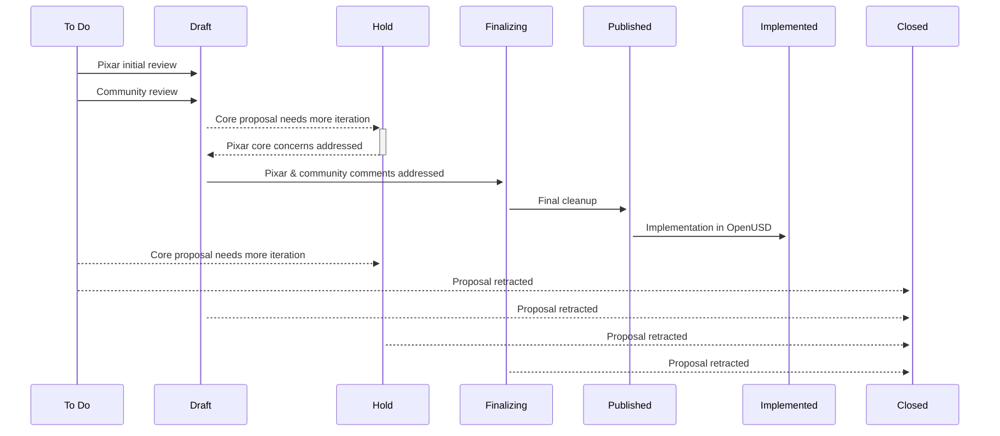

# OpenUSD-proposals

Welcome to OpenUSD-proposals, a forum for sharing and collaborating on proposals 
for the advancement of USD.

Before getting started, please familiarize yourself with the contents of the 
[Supplemental Terms](https://openusd.org/release/contributing_supplemental.html) 
page.

If you are interested in browsing existing proposals, please proceed right to 
[the current list of proposals, with status information](https://github.com/orgs/PixarAnimationStudios/projects/1/views/1).

## What is a proposal?

- A new schema, such as "Level of Detail for Games"
- An outline for a technical action, such as "Removing the usage of boost preprocessor macros"
- A new development, such as "Evaluation of Hermite Patches"
- A discussion of scope tightening, such as "Standardizing Alembic without HDF5"

For inspiration, here are 
[several proposals](https://github.com/orgs/PixarAnimationStudios/projects/1/views/7) 
that have been recently published and implemented, and some 
[Pixar proposals](https://openusd.org/release/wp.html) that have previously been 
worked through.

## Process for a new Proposal

### High-level workflow

1. Submit a PR with your proposal
    1. [How to a create PR ](#create-a-pull-request-for-the-proposal)
    2. [Guidance for Writing Proposals](#guidance-for-writing-proposals)
    3. [Guidance for Large Proposals](#large-proposals)
2. Engage the community in discussion
    1. [Discuss the proposal](#discuss-the-proposal)
3. Understand and address community comments
4. Shepherd proposal through to publication 
    1. [Detailed Workflow](#detailed-workflow)
    2. [Pull Request status](#pull-request-status)
    3. [Proposal status](#proposal-status)
5. (If applicable) [Submit a proposed implementation to OpenUSD](#implement-the-proposal) 

### Detailed Workflow

The diagram below offers a visual representation of the proposal process. The 
proposal's [PR status](#pull-request-status) provides a general sense of where a 
proposal sits in the approval workflow while more specific 
[proposal statuses](#proposal-status) add detail. You can monitor your proposal 
status using the [OpenUSD Proposals Status page](https://github.com/orgs/PixarAnimationStudios/projects/1/views/2).

### Pull Request Status

#### Open PR

Open PRs indicate that a proposal is still **open for comments and changes**.
- New PRs are automatically given the _To do_ status. This indicates the 
  proposal is still in triage and has not yet been reviewed.
- When the proposal is changed to the _Draft_ status, this indicates the 
  proposal has gone through an initial review and is ready to be discussed with 
  the broader community.
- A proposal may be moved to _Hold_ status if the proposal needs more iteration 
  and/or broader consensus from the community.
- Proposals move to the _Finalizing_ status when the proposal is nearing
  publication and the commentary period is closing soon.

#### Merged PR

Merged PRs indicate that a **proposal has been accepted**. Any changes to 
proposals that have already been merged will need to be filed as new PRs that 
reference back to the relevant proposal.
- Once a proposal is considered complete and fully reviewed, it will be merged 
  and moved to _Published_ status. This indicates the proposal can be used as a 
  starting point for implementation. 
- Once implementation work has been completed, the proposal will be moved to 
  _Implemented_ status, with indication of which version of USD the proposal was 
  implemented in.   

**Exception**: Proposals in the _notPublished folder are still open for 
comments and changes.  These are proposals that were merged into the repo as 
part of a legacy process. The subfolders (draft vs hold) indicate the proposal's
actual status. 

#### Closed PR

Closed PRs indicate that a proposal **has been retracted** and is not continuing 
through to publication/implementation. These proposals will automatically get a 
_Closed_ status and a new pull request will have to be submitted if there's 
renewed interest in the proposal idea later.

### Proposal Status

| Status       | Meaning                                                                 |
|--------------|-------------------------------------------------------------------------|
| **To do**     | Proposal needs to be triaged |
| **Draft**    | Proposal is work-in-progress, open for feedback and reviews   |
| **Finalizing**    | Proposal has been discussed and is close to finalized   |
| **Published**| Proposal is approved as a starting point for implementation    |
| **Implemented** | Proposal has been implemented      |
| **Hold**     | Proposal needs further iteration and/or broader community consensus    |
| **Closed**   | Proposal has been retracted    |

### Create a Pull Request for the proposal

1. Fork this repo.
2. Create a directory within `proposals/` for the proposal and its materials, 
   and a README.md.
    1. The README.md document may contain the proposal, or at a minimum, it 
       should announce the contents of the proposal and how to understand the 
       materials within the proposal. 
    2. The README.md should also contain notes the author considers important 
       for anyone looking at the proposal, which could include notes that a 
       proposal has been superseded by another, that the proposal resulted in a 
       change to another project, and so on.
3. Submit a PR and fill out the provided sections in the pull request body.
    1. The PR may include links to supporting materials that could not be 
       included with the proposal files, such as white papers. Add links to the 
       "Supporting Materials" section of the PR body.
    2. Please mention and link any issues and PRs in 
       [OpenUSD](https://github.com/PixarAnimationStudios/OpenUSD) or 
       [OpenUSD-proposals](https://github.com/PixarAnimationStudios/OpenUSD-proposals) 
       that are related to the new proposal. A label will be created to link 
       relevant discussions together. 

#### Guidance for Writing Proposals

When writing and submitting a proposal, we make the following suggestions for 
receiving the best feedback.

1. Include a link to the rendered proposal in your PR description. This can be 
   as simple as linking to the markdown file in your source branch. This makes 
   it significantly easier for someone to read the document in a well formatted 
   way.
2. Your PR and proposal should include, and ideally start with, a short summary 
   of what your change would achieve. The 
   [pull request template](https://github.com/PixarAnimationStudios/OpenUSD-proposals/blob/main/.github/pull_request_template.md) 
   offers a possible structure for reference.
3. It is highly recommended that any submitted proposal include text examples of 
   what your proposal would look like in `.usda` syntax.
4. It's recommended that long sentences be split over multiple lines in your 
   Markdown file. This allows more granular feedback, and easier viewing of the 
   files.

#### Large Proposals

Some proposals are inherently of significant size. In those case it is 
recommended to do one or both of the following:

1. Split your proposal into multiple smaller proposals.
   1. Create a sub-proposal PR per major feature. 
   2. Create an umbrella proposal that links to each sub-proposal, ordered by 
      their priority and dependency on each other.
2. Divide your proposal into smaller sections. These can be sections within the 
   same document or separate documents.

This helps make each section easier to digest and provide feedback on.

### Discuss the proposal

A typical workflow for the proposal PR will have some initial discussion on the 
PR itself. It’s recommended to bring up the proposal in an 
[ASWF USD Working Group meeting](https://www.aswf.io/get-involved/) or in the 
[AOUSD Forum](https://forum.aousd.org/) to give greater visibility to the 
proposal and engage the community in discussion.

Note that at any point, proposal text may be used in other contexts. For 
example, a proposal may be referenced when writing new schemas or code for USD. 
Referencing a proposal in this way does not guarantee that the proposal will 
advance beyond a discussion stage.

### Implement the proposal

When a proposal has been approved as a starting point for implementation, that 
will be noted here with a “Published” [proposal status](#proposal-status). 

Subsequent development should occur in the appropriate forums. For example, if a 
proposal has been developed into code and concrete schemas, that might become a 
pull request against the main OpenUSD repo (see 
[contributing guidelines](https://github.com/PixarAnimationStudios/OpenUSD/blob/dev/CONTRIBUTING.md)). 
Such a development should be noted in the proposal's README.md file and linked 
to the pull request in the main OpenUSD repo.

## Code of Conduct

The success of the forum is predicated on involvement and communication, so 
consider this an appeal to everyone's creativity and thoughtful consideration.

Civility, inclusiveness, friendship, and constructive collaboration shall be the 
hallmarks of this forum.

Thank you for your participation!
