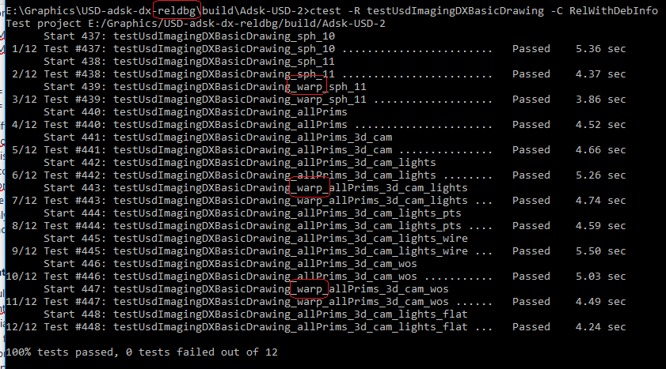
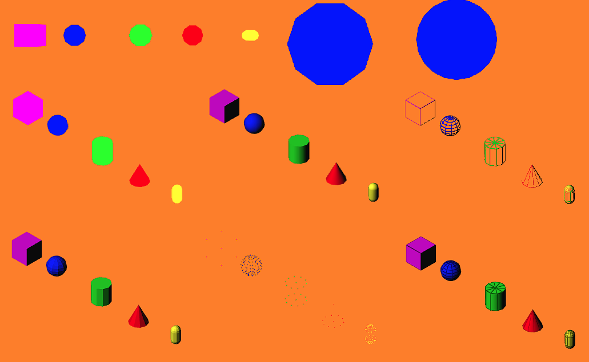

# Purpose and scope:
  USD currently already supports several Hgis based on: OpenGL, Metal, Vulkan.
  We are proposing to introduce one more, based on DirectX 12.
  One of the most important benefits we are looking for with the implementation of DirectX HGI is a trusted and fully functional software rendering solution, so we can test non-graphics-intensive parts of our applications on cheap farm machines without graphics hardware. So far the available software emulators for OpenGL and Vulkan proved little more than prototypes, breaking down in the simplest scenarios when used with HdStorm.

# Overall design and concerns:
  At a very high level, implementing the DirectX Hgi was a simple matter of implementing the already existing Hgi interfaces.
  There are a number of incompatibilities between OpenGL and DirectX and we had to employ a significant amount of tricks and shader code post-processing before we managed to get the shaders to compile and run.
  In the first implementation we duplicated the glslfx files (-> hlslfx) and manually modified the code inside to fit DirectX requirements. In phase 2, which is what you are seeing now, due to concerns about maintainability of such a solution we implemented a semi-automatic way of generating the hlslfx files at "install" time (I call this semi-automatic because the code that does the "translation" is not a professional fail-proof translator, but rather a quick & hacky temporary solution that aims to reduce the manual work required for keeping up with shaders changes). Going forward, it would be beneficial if we could agree to make some general changes in the glslfx files as well, in order to make the "translation" process easier and less error-prone. Examples of some of the most interesting differences in glslfx & hlslfx files are provided (see files [basisCurves.glslfx](basisCurves.glslfx) vs [basisCurves.hlslfx](basisCurves.hlslfx), or [mesh.glslfx](mesh.glslfx) vs [mesh.hlslfx](mesh.hlslfx)).
  
  For example, one of the most complicated adjustment is to replace the multiplication operator with the "mul" function in some cases, e.g.:

    shadowMat.eyeToShadowMatrix = HdGet_shadow_worldToShadowMatrix(shadowIndex) * GetWorldToViewInverseMatrix(); →
    shadowMat.eyeToShadowMatrix = mul(HdGet_shadow_worldToShadowMatrix(shadowIndex), GetWorldToViewInverseMatrix());

  or

    normal = vec4(transpose(transformInv * GetWorldToViewInverseMatrix()) *  vec4(normal,0)).xyz; →
    normal = mul(vec4(transpose(mul(transformInv, GetWorldToViewInverseMatrix())), vec4(normal,0))).xyz;

  Some of the differences between OpenGL and DirectX, we considered to be best addressed by a few new abstractions:
    - HgiMemoryHelper
        This was needed because the GPU memory data alignment for DirectX differs from OpenGL and unless the code in HdStInterleavedMemoryManager::_StripedInterleavedBuffer::_StripedInterleavedBuffer is given correct information about memory alignment & padding, the buffers will be read incorrectly by DirectX when the shader code is ran.
    - HgiCustomInterop::TransferToApp
        We believe it would be better for the HgiInterop to delegate the "TransferToApp" part to the individual Hgis. This way both Vulkan and DirectX could setup their swapchains when drawing on the screen is needed, copy the image to the proper swapchain image, and the host application would only need to pass them a hWnd.
        Another benefit would be when offscreen rendering is needed. Once again the host application can simply tell the Hgi what it wants, and the handover can be executed and optimized by each Hgi (see hgiDX / presentation proposal)

# Workflow considerations:
  Ideally, we would really like to build USD once and be able to choose or switch at runtime between: OpenGL, Vulkan, Metal, DirectX Hgi depending on what makes sense on the target platform.
    See hgiInterop / hgiInterop.h + cpp proposed changes
    A potentially better / cleaner solution might be to replace inside HdxPresentTask::Execute, _interop.TransferToApp(Hgi*, ...) with pHgi->GetInterop()->TransferToApp(...)
  In some cases, for DirectX, some shader stages variables have a "complex" behavior, and better context would be ideal when building the shaders code, we would like to propose (as a future improvement) that shaders code is generated for all stages, put together in one or more descriptors and passed as a whole to a "program" responsible to build each shader function and the shader program, while giving the "builder" access to the "whole picture".
    An example of why we need this is the DirectX system variable "SV_PrimitiveID", which needs to no longer be treated / declared as a system variable when it is set by the geometry stage. However, since when we build the "pixel stage" code we do not know whether a geometry stage exists in that program, let alone if it sets the SV_PrimitiveID, we have a hard time declaring this variable properly.

# Testing:
  In order to unit test The DirectX Hgi implementation, we chose to follow the example of the usdImaging tests "testUSDImagingGL...".
    Because of small differences related to drawing output in this first implementation we chose to duplicate the "unitTestGLDrawing" class and "testUsdImagingGLBasicDrawing.cpp" file
    Ideally we could refactor things a bit and unify both the bootstrap and the testing code so that it works for both GL and DirectX (and hopefully for others also). There would be a lot of benefits knowing some (or most) tests will yield the same result on multiple Hgi
  Due to DirectX Hgi not fully implementing & supporting all possible shaders stages and combinations, at this time, we cannot yet run all the same tests OpenGL does, so for now we implemented a set of simpler tests just to prove DirectX works as intended:
    - we draw a sphere with complexity 1.0, 1.1 with hardware rendering and forced software rendering.
    - we introduced a simple scene that has all the out-of-the box USD primitives: cube, sphere, cylinder, code, capsule, and draw it with various settings: geometry only, with lights, smooth shaded, flat shaded, points, wireframe, wireframe on surface, some of the tests repeated with forced software rendering.
    - all these simple tests pass on both debug and release builds with both hardware and forced software rendering , 
