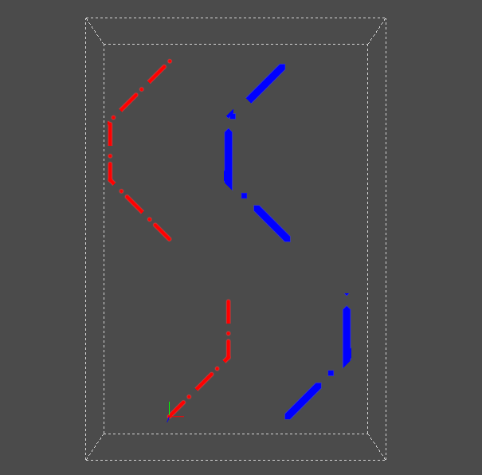

# Introduction
USD already has primitives to render 3D curve-like geometries, such as hair or grass. In practice, we also need curves in sketch or CAD document. The curve has uniform width, and its width will not change when we rotate or zoom the sketch. The curve may also have dash-dot patterns. We will provide a schema which is for patterned lines or polylines. The primitive will have uniform screen-width, and can have dash-dot patterns.

Here is a picture of common dash dot patterns.


# Requirements

### Line Width
The line width is a screen-space width. It will not change when we zoom in or zoom out. The line width is uniform across the whole line.

### Line Caps
The line cap is the shape at the start or end of a line or dash. There are different types of line cap. The value can be different for the start and the end. But all the start caps in a line should be the same, and all the end caps should be the same.
The line cap will also impact the shape of the dot in a dash-dot pattern. The start cap is the shape of the left half of the dot, and the end cap is the shape of the right half of the dot.

| cap type |   round   |  square  |  triangle  |
|:--------:|:---------:|:-----------:|:----------:|
|  figure  ||||

### Line Joint
The line joint is the shape at the joint of two lines, or at the joint of a polyline. The value is constant for the whole primitive.


### Dash-dot Pattern
A dash-dot pattern is a composite of dashes and dots and the composition is periodic. 

You can also define other type of patterns.

# The implementation of DashDot line style
Our implementation will introduce a new type of primitive, the DashDotLines. It inherits from Curves. The primitive is a list of line segments or polylines. The width of the line will be uniform, and it will not change when camera changes. There can be no pattern in the line. Or there can be dash-dot pattern.

The detail of the pattern will be put in the DashDotPatternAPI.

We also add a new rprim for the DashDotLines. We add a new shader file, the dashDotLines.glslfx, which includes both vertex and fragment shader. 

In the implementation, we also create special geometry for the primitive. Each line segment is converted to a rectangle which is composed from two triangles. 

### The DashDotLines schema
A new primitive DashDotLines is added, which inherits from Curves. It inherits properties from Curves.
The shape of this primitive on the screen is a uniform-width line or polyline. Its width will not change when camera changes. It has either no pattern or dash-dot pattern.

By default, the DashDotLines primitive doesn't have a pattern. If you would like to have a pattern, you need to create a "Pattern" primitive which will apply the DashDotPatternAPI schema, and you can configure the pattern properties. Then the DashDotLines primitive should inherit from the "Pattern" primitive. Different DashDotLines primitive could inherits from the same "Pattern" primitive.

These are properties which inherited from Curves:
- curveVertexCounts
- widths. Widths are now interpreted as the widths in screen space.

The DashDotLines has the following new properties:
- startCapType. A token uniform. It is the shape of the line cap at the start of the line. It can be "round", "triangle" or "square". The default value is "round".
- endCapType. A token uniform. It is the shape of the line cap at the end of the line. It can be "round", "triangle" or "square". The default value is "round".
- patternScale. A float uniform. It is valid when the primitive inherits from a "Pattern" primitive. The default value is 1. You can lengthen or compress the line pattern by setting this property. For example, if patternScale is set to 2, the length of each dash and each gap will be enlarged by 2 times. This value will not impact on the line width.
- screenspacePattern. A bool uniform. It is valid when the primitive inherits from a "Pattern" primitive. By default it is true, which means the dash-dot pattern will be based on screen unit. If we zoom in, the pattern on the line will change in the world space, so that the dash size and the dash gap size in the screen space will not change. If it is false, the pattern will be based on world unit. If we zoom in, the pattern on the line will not change in world space. The dash size and the dash gap size in the screen space will be larger. 


### Extents of the DashDotLines
Different from the other Curves, the extents of the DashDotLines is only the bound box of the control points. The width of the line will not be considered, because it is screen spaced, that it is implemented via the shader.

### The DashDotPatternAPI schema
The DashDotPatternAPI schema inherits from APISchemaBase. It saves the detail of a dash-dot pattern. A dash-dot pattern is an array of symbols. Each symbol is either a dash, which is a line, or a dot, which is a point. 

The DashDotPatternAPI has the following new properties:
- patternPeriod. A float uniform. It is the length of a pattern. By default it is zero. If there is no pattern, it should be zero.
- pattern. An array of float2. It saves the dash-dot pattern. For each float2, the x value and the y value must be zero or positive. The x value saves the offset of the start of current symbol, from the end of the previous symbol. If the current symbol is the first symbol, the offset is from the start of the pattern to the start of current symbol. The y value saves the length of the current symbol. If it is zero, the current symbol is a dot. If it is larger than zero, the current symbol is a dash. As a result, the total sum of all the x value and y value will be the length from the start of the pattern to the end of the last symbol. This sum must be smaller than patternPeriod.
        
For example, assume the pattern is [(0, 10), (1, 4), (3, 0)]. It means the first symbol is a dash which is from 0 to 10. The second symbol is a dash which is from 11 to 15, and the third symbol is a dot which is at position 18. There are gaps between 10 and 11, and between 15 and 18. If the patternPeriod is 20, there is also a gap between 18 and 20.

### The DashDotLines rprim and shader
In HdStorm, we will add the HdDashDotLines rprim for the DashDotLines primitive. The topology of the DashDotLines requires the curveVertexCounts, curveIndices and whether the pattern is screenspaced. In dashDotLines.glslfx, we add two sections of shader code: "DashDot.Vertex" and "DashDot.Fragment".

### Other inputs for the shader and screen space pattern implementation
For a polyline, the shader need to know the sum of line lengths before each vertex. This value can be pre-calculated in CPU. To implement screen space dash-dot pattern, the sum must be based on line lengths on the screen. So to calculate the sum, we need to do matrix transformation for the lines in CPU, and this calculation must be done when camera is changed. (Maybe we can use the compute shader to do the calculation before the rendering process in each frame)

# Examples
### 2 DashDotLines primitives with dash-dot patterns
```
def DashDotLines "StyledPolyline1" (
    inherits = [</Pattern>]
){
    uniform bool screenspacePattern = true
    uniform token startCapType = "round"
    uniform token endCapType = "round"
    float patternScale = 5
    int[] curveVertexCounts = [3, 4]
    point3f[] points = [(0, 0, 0), (10, 10, 0), (10, 20, 0), (0, 30, 0), (-10, 40, 0), (-10, 50, 0), (0, 60, 0)]
    float[] widths = [5] (interpolation = "constant")
    color3f[] primvars:displayColor = [(1, 0, 0)]
}
def DashDotLines "StyledPolyline2" (
    inherits = [</Pattern>]
){
    uniform bool screenspacePattern = true
    uniform token startCapType = "triangle"
    uniform token endCapType = "triangle"
    uniform float patternScale = 11
    int[] curveVertexCounts = [3, 4]
    point3f[] points = [(0, 0, 0), (10, 10, 0), (10, 20, 0), (0, 30, 0), (-10, 40, 0), (-10, 50, 0), (0, 60, 0)]
    float[] widths = [10] (interpolation = "constant")
    color3f[] primvars:displayColor = [(0, 0, 1)]
}

def "Pattern" (
    prepend apiSchemas = ["DashDotPatternAPI"]
)
{
    uniform float patternPeriod = 10
    uniform float2[] pattern    = [(0, 5), (2.5, 0)]
}
```
In this example, there are two DashDotLines primitives. They all inherits from the same dash-dot pattern, and the pattern is defined in "Pattern". The period of the pattern is 10. There are two symbols in the pattern. The first symbol starts at 0, and it is a dash with length 5. The second symbol starts at 7.5, and it is a dot.

The first primitive has two polylines. One polyline has 3 vertices and another has 4 vertices. The line width on screen is 5. The startCapType and endCapType are both round. The patternScale is 5 which means the dashes and gaps will be lengthened by 5 times. 

The second primitive has two polylines. One polyline has 3 vertices and another has 4 vertices. The line width on screen is 10. The startCapType and endCapType are both triangle. The patternScale is 11 which means the dashes and gaps will be lengthened by 11 times.

The image for the 2 DashDotLines primitives.



### A polyline with no pattern
```
def DashDotLines "StyledPolyline" (
){
    uniform token startCapType = "round"
    uniform token endCapType = "round"
    int[] curveVertexCounts = [3]
    point3f[] points = [(0, 0, 0), (10, 10, 0), (10, 20, 0)]
    float[] widths = [5] (interpolation = "constant")
    color3f[] primvars:displayColor = [(1, 0, 0)]
}
```
In this example, there is one polyline. It has 3 vertices. The line width on screen is 5. The polyline doesn't have pattern. The startCapType and endCapType are both round.

The image for the DashDotLines primitive.

