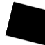

# Introduction
USD already has a primitive BasisCurves which is for rendering 3D curve-like geometries, such as hair or grass. In practice, we also need curves in sketch or design document. The curve may keep its width when we rotate or zoom the sketch, and it may have dash-dot patterns. We will extend the BasisCurves schema to implement this kind of curves.

Here is a picture of common line patterns.

# Requirements

### Line Width
The line width is a screen-space width. It will not change when we zoom in or zoom out. The line width is not needed to be uniform across the whole line. It can be different in different point.

### Line Caps
The line cap is the shape at the start or end of a line, or a dash in line pattern. There are different type of line caps. The value can be different for the start and the end. But all the start caps in a curve should be the same, and all the end caps should be the same.
The line cap will also impact the shape of the dot in a line pattern. The start cap is the shape of the left half of the dot, and the end cap is the shape of the right half of the dot.

| cap type |   round   |  square  |  triangle  |
|:--------:|:---------:|:-----------:|:----------:|
|  figure  ||||

### Line Joint
The line joint is the shape at the joint of a polyline. It is only valid for polyline. The value is constant for the whole curve primitive.

### Line Pattern
The line pattern is a dash-dot pattern which is periodic in the curve. 

# Modification to BasisCurves schema
We will extend the schema of BasisCurves, and add the support for line styles,

We will add these properties:
### style
A string uniform, which determines if the curve is an original basis curve, a curve for sketch or a patterned curve for sketch. Its value can be "none", "sketch", and "patterned". The default value is "none".
A curve for sketch is a curve whose width will not change when camera changes. This type of curve is commonly seen in a sketch file. It can have caps and joint. It doesn't have patterns.
A patterned curve for sketch is a curve for sketch with line pattern. 

(NOTE: currently our implementation only supports the sketch curve or patterned curve when the curve type is "linear")

### startCapType
### endCapType
A token uniform. Valid only if the style is "sketch" and "patterned". It can be "round", "triangle" or "square". The default value is "round".

(NOTE: currently our implementation only supports the start cap or end cap when the curve type is "linear")

### jointType
A token uniform. Valid only if the style is "sketch" and "patterned" and the curve type is "linear". Currently it can only be "round". 

### patternScale
A float value. Valid only if the style is "patterned". The default value is 1.

You can lengthen or compress the line pattern by setting this property. For example, if patternScale is set to 2, the length of each dash and each gap will be enlarged by 2 times. This value will not impact on the line width.

### screenSpacePattern
A bool uniform. Valid only if the style is "patterned" and the curve type is "linear". The default value is false. 
If this value is false, the pattern will be based on world unit. So if we zoom in, the pattern on the line will not change, the dash size and the dash gap size in the screen will also be larger. If the value is true, the pattern will be based on screen unit. If we zoom in, the pattern on the line will change so that the dash size and the dash gap size in the screen will not change.

### The inherent properties 
BasisCurves has the widths property. If the style is "sketch" or "patterned", the widths will be interpreted as screen-spaced width. That is, the value will be in pixels of the screen, and it will not change when we zoom or rotate.

(NOTE: currently our implementation only support a uniform width across the curve. In the future, we may add implementation so that the width can be varied in the curve.)

BasisCurves also has the screenspacewidths primvar. If the style is "sketch" or "patterned", the screenspacewidths will be interpreted as screen-spaced width, and the widths property will be ignored.
The minScreenSpaceWidths primvar will not work if the style is "sketch" or "patterned".

# Material surface to support the line style
If the curve style is "sketch" or "patterned", the curve can not bind to a normal material. Instead, we provide specific surface shader for the curve.

### LineSketchSurface
If the curve style is "sketch", it must bind to a material whose shader is "LineSketchSurface". The shader will decide the opacity of pixels around caps and joint. The materialTag for this material is translucent.

### LinePatternSurface
If the curve style is "patterned", it must bind to a material whose shader is "LinePatternSurface". The shader will decide whether the pixel is within a dash or a gap, so that we can decide its opacity. It will also handle the caps and joint. The materialTag for this material is translucent.

The LinePatternSurface must has a color input, which connects to another shader whose shader is "LinePatternTexture". The "LinePatternTexture" shader links to a texture which saves the information of the line pattern.

### The line pattern texture
The line pattern texture is a texture that saves a type of line pattern. It has four channels for each pixel. The first channel saves the period of the pattern. The second channel saves the type of the current pixel. The third channel saves the start point of the dash which the current pixel is on. The last channel saves the end point of the dash which the current pixel is on. 

The type of the current pixel can be:

0, the pixel is within the body of a dash.

1, the pixel is between the middle of a gap and the start of a dash (or dot).

2, the pixel is between the end of a dash (or dot) and the middle of a gap.
