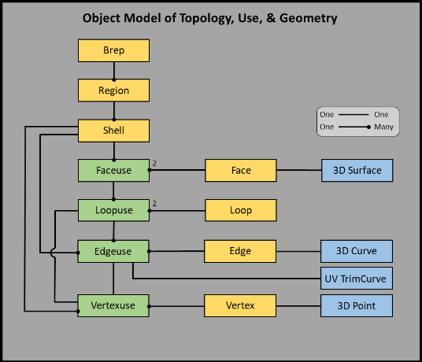
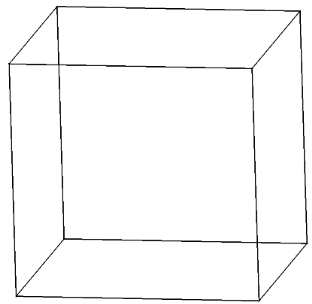
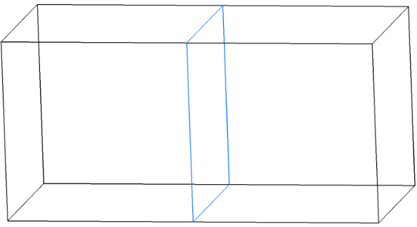
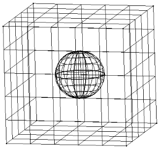
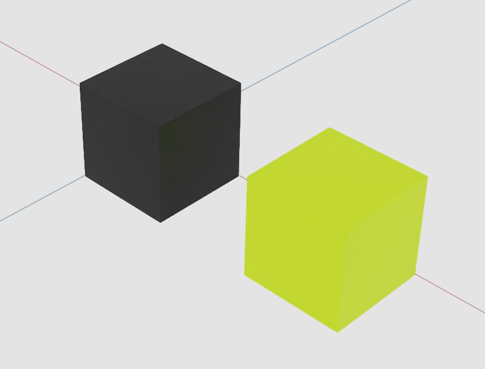
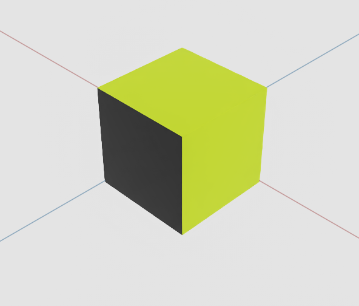

# **Solid Models in USD Proposal**

# **0. Preamble**

Boundary Representations (Breps) are a fundamental tool for CAD/CAE workflows.
With this proposal, the Geometry WG has designed a robust and flexible Brep design for use in OpenUSD. 
We feel this design will complement and enhance other tools in the marketplace, enabling an aggregation and simulation of data unique to the capabilities of OpenUSD.

This preliminary schema has been reviewed by AOUSD Geom WG and will continue to be iterated upon in a public draft proposal.
We are publishing the schema in this preliminary form to share our current findings and take the next step in addressing uses of the design.
By making the schema public we hope to engage the broader CAD/CAE community, kicking off efforts to produce datasets using this schema to further unlock exploratory work for downstream integration.
Potential use cases are recorded [here](https://docs.google.com/document/d/1kXiZPhkUh6JfohE2Q7qVA4hSuJD3UyiBdYW_nEsEIJU/edit?tab=t.0)


Adding Breps to OpenUSD creates questions with answers outside the scope of the Geometry WG. 
For example, we hope to address the ways in which data can be connected in USD.
Breps and Meshes are a source and derived data pair that don't have a natural connectivity in OpenUSD.
A Brep prim should know if it has a Mesh on the stage, so it doesn't have to be tessellated.
A Mesh prim should know if there is an associated Brep on the stage when picked.
Further, a Brep could have multiple meshes in the stage (e.g., LoDs).
These relationships all have to be managed.


# **1. Purpose and scope**

The industrial metaverse is here and with it comes requirements for digital content that are not met by the current USD standard.  
Surface models and meshes are not sufficient to describe the solid models common to CAD/CAM/CAE, so we propose the adoption of a solid model boundary representation (Brep) schema to USD.  
The proposed schema is an implementation of the Radial Edge Data Model, as first published by Kevin Weiler in 1986.  
In the last 35+ years, this model has proven itself to be flexible and robust, supporting myriad industries via commercial geometry kernels.  
Kevin Weiler’s thesis is available here:    [https://www.scorec.rpi.edu/REPORTS/1986-1.pdf](https://www.scorec.rpi.edu/REPORTS/1986-1.pdf)

With this proposal, we aim to add a Brep model to USD. In support of this model we propose to also add many new curve, surface, and volume geometry types. 
The set of shapes was derived from the Product Representation Compact (PRC) format, a well known ISO standard used in, e.g, 3d models in PDFs.

Section 2.1 contains a catalog of curve and surface primitives that we propose _UsdSolid_ supports to match the capabilities of PRC.  
The current document does not yet include detailed designs of all geometry types, but we intend to add them soon. 

# **2. Overall design concerns**

Solid models rigorously partition space into regions by connecting sets of surfaces into region boundaries.  
Regions are the set of points that can be connected by curves of any shape that don't cross boundaries.  
The boundaries between regions must be watertight to prevent the points of each region from being connectable to one another.  
Manifold solid objects partition space into one solid and one or more void regions, classifying every point in space as either inside or outside the solid.
A solid is manifold if for all points on the boundary there exists a neighborhood that is homeomorphic to a two-dimensional disk.
A Brep that isn't manifold is called "non-manifold."
Non-manifold objects can partition space from one to any number of regions, where every point in space classifies to one of the model's regions. 

In the world of geometric modeling, where mathematical approximations of shape are rife, gaps between adjacent surfaces are common. 
In the Radial Edge Data Model, the connections of adjacent surfaces are explicit objects that can fill the gaps and create the necessary partition of space.

Several Brep models were considered as options to serve as the base of the _UsdSolid_ schema. 
The radial edge data model was chosen because in addition to standard manifold modeling, it offers a robust representation of non-manifold modeling.
In fact, Weiler's model was the first complete non-manifold Brep to explicitly represent topological adjacencies (Lee, 1999).
The topology models in PRC, STEP, Parasolid, et al map into the proposed radial edge data model. 
Concepts from both PRC and STEP are used in this proposal, including all of the Brep geometry types in PRC and the volumes concept from STEP. 
As in PRC and STEP, this design supports wire frame models.

The proposed model is composed of 3 parts: shapes, topology objects, and special connectivity objects called "uses."
Because limiting _UsdPrim_ count is a good practice in general and a must in large scale scenes, the _UsdSolid_ design utilizes a _UsdSolidBrepAPI_ multiple-apply schema that can be applied to a _UsdSolidBrepArray_ IsA schema. 
Each instance of the _UsdSolidBrepAPI_ contains all the shape, topology, and connectivity data of a single Brep, plus metadata such as material bindings and a local transform.

## **2.1 Shape**

In practice, Breps are a large class of shape functions built on parametric mappings. 
Today, this includes NURBs curves and surfaces, analytics, and is extendable to helices, offsets and more. 
USD currently supports the standard NURBS curves, _UsdGeomNurbsCurves_, and NURBS surfaces, _UsdGeomNurbsPatch_. 
Further, USD has analytic surfaces _UsdGeomCone, UsdGeomCylinder, UsdGeomPlane, UsdGeomSphere_.

The existing USD surface primitives have some issues relative to their use with Breps. 
First, the NURBS curves and surfaces do not support double precision control vertices.
This is necessary for USD to be accepted as a reference CAD format, so the proposed schema includes double precision geometry. 
Second, the _UsdGeomCylinder_ surface includes its end caps. 
Also the _UsdGeomCone_ surface often includes an end cap in practice, but does not address caps in the documentation.
For full flexibility, solid models require that the analytics do not include end caps.
Third, the parameterization of the sphere, cone, cylinder, plane and volume are currently unspecified.
In order to trim them properly for solid modeling the analytics will need parameterizations and double precision.
Last, the CAD community uses a larger set of analytic surfaces that currently present in USD.

In this proposal each geometry type is defined by a set of attributes that reside within the _UsdSolidBrepAPI_ schema.
The geometry is packed within like types, as in the _UsdGeomNurbsCurves_ class.
Where necessary, the geometry will have double precision attributes, e.g., NURBS curves have double precision control vertices, weights, and knots.
Analytic geometry data will include both the analytic definition and the parameterization, e.g., a sphere will have a radius and also a frame of reference that defines the parameterized surface origin, orientation, beginning, and end.
We recommend using the PRC parameterizations for analytic geometries.
Trimming curves are also a part of the _UsdSolidBrepAPI_ schema, packed as the 3D curves are.

For a complete set of geometry, we recommend meeting the PRC standard, certified by the International Organization for Standardization (ISO 14739-1:2014). 
To achieve this will require an extensive list of attributes for the _UsdSolidBrepAPI_.
To match the PRC specification it will be necessary to add the following curves and surfaces. 
We also suggest adding _Volume_, _CurveInVolume_, and _SurfInVolume_ types for anticipated future uses.
New geometry will be added to the _UsdSolidBrepAPI_ schema.


<table>
  <tr>
   <td><strong>Curves</strong>
   </td>
   <td><strong>Surfaces</strong>
   </td>
   <td><strong>Volumes</strong>
   </td>
  </tr>
  <tr>
   <td>Blend02Boundary
   </td>
   <td>Blend01
   </td>
   <td>Volume
   </td>
  </tr>
  <tr>
   <td>Circle
   </td>
   <td>Blend02
   </td>
   <td>
   </td>
  </tr>
  <tr>
   <td>Composite
   </td>
   <td>Blend03
   </td>
   <td>
   </td>
  </tr>
  <tr>
   <td>OnSurf
   </td>
   <td>Cylindrical
   </td>
   <td>
   </td>
  </tr>
  <tr>
   <td>Ellipse
   </td>
   <td>Offset
   </td>
   <td>
   </td>
  </tr>
  <tr>
   <td>Equation
   </td>
   <td>Ruled
   </td>
   <td>
   </td>
  </tr>
  <tr>
   <td>Helix01
   </td>
   <td>Revolution
   </td>
   <td>
   </td>
  </tr>
  <tr>
   <td>Hyperbola
   </td>
   <td>Extrusion
   </td>
   <td>
   </td>
  </tr>
  <tr>
   <td>Intersection
   </td>
   <td>FromCurves
   </td>
   <td>
   </td>
  </tr>
  <tr>
   <td>Line
   </td>
   <td>Torus
   </td>
   <td>
   </td>
  </tr>
  <tr>
   <td>Offset
   </td>
   <td>Transform
   </td>
   <td>
   </td>
  </tr>
  <tr>
   <td>Parabola
   </td>
   <td>SurfInVolume
   </td>
   <td>
   </td>
  </tr>
  <tr>
   <td>PolyLine
   </td>
   <td>
   </td>
   <td>
   </td>
  </tr>
  <tr>
   <td>Transform
   </td>
   <td>
   </td>
   <td>
   </td>
  </tr>
  <tr>
   <td>ProjectedCurve
   </td>
   <td>
   </td>
   <td>
   </td>
  </tr>
  <tr>
   <td>CurveInVolume
   </td>
   <td>
   </td>
   <td>
   </td>
  </tr>
</table>


## **2.2 Topology and "use"**


When a closed set of curves lay on a surface, it can be used to trim the surface to that set of boundary curves and this results in a trimmed surface. 
If two surfaces share the same segment of a boundary, this is called an edge and the two surfaces are neighbors. 
If one has a way to keep track of which surfaces share an edge, then they have added a topology to our modeling system.


A trimmed surface, together with the information about its neighbors is referred to as a face. 
A face must have an outer boundary and it may have many inner boundaries or “holes.” 
A shell is a collection of connected faces.


If a shell is closed then you have a solid. 
A solid has an outer closed shell and possibly many inner shells that define cavities in the solid. 
A “region” encloses space from a closed outer shell or between two closed shells (one inside the other) and has volume. 
The outer region is the infinite region, so a closed box is represented by two regions – the outer infinite region, and the region within the box. 
If there is a box within the box ( a ‘thick’ box) then there are 3 regions. 
The inner box may ‘float in space’ without being attached to the outer box; it may not be physically possible, but it is topologically acceptable.


In a closed solid each boundary edge is shared by two neighboring faces (or connected to one face twice, called a seam edge), so this is referred to as a boundary representation or “Brep”. 
The first implementations of a Brep model were manifold, that is they allowed for only two faces to share an edge, hence the name “twin-edge boundary representation” or Brep. 
If more than two faces can share an Edge, the topology is non-manifold.


It turns out that the manifold restriction that an edge may have only two neighbors is very limiting. 
Any time you intersect two surfaces, if you look in the neighborhood of a point on the intersection curve, there appear to be four neighboring surfaces at that point. 
That’s what is meant by being “non-manifold”. 
A manifold edge is restricted to having two neighboring surfaces and a non-manifold edge may have more than two surfaces that share that edge.


Each boundary of a face consists of a closed loop of edges. 
In the topology structure each loop has a list of edges, and the same edge may be used by two or more faces and that’s what “EdgeUse” refers to. 
The term edgeuse has real importance since there could be many uses of an edge.


If one constructs a box (it defines a region) and then adds another box right next to it, then they have another region. 
Since they share the same face, you can see why “FaceUses” are necessary. 
The face is used on one region, and the face is also used in the other region.


## **2.3 Brep**

The key idea of Brep modeling is that simple trimmed-shapes connect together through their boundaries to form complex geometry models just as a set of small glass pieces welded together along their edges form a stain glass window.


Shapes are points, curves, and surfaces each of which is a simply connected point set within a 3D space. 
Shapes can be infinite (planes, cylinders, lines and such) or finite (Bspline curves and surfaces) but have no sense of boundaries. 
For every shape there is a simple topology object that adds trimming to the shape so that it can be connected into a Brep model. 
The simple topology objects are vertices, edges, faces, and regions. 
Important combinations of simple topology objects forming key boundaries within a geometry model are also represented explicitly; a loop is any closed sequence of connected edges used to bound a face and a shell is any set of faces connected edge-to-edge to bound a region.


A topology object is “used” each time it connects to the geometry model to form a boundary. 
In general, all of the simple topology objects participate in a hierarchy of boundaries: regions are bounded by faces (gathered into connected shells), faces are bounded by edges (gathered into connected loops), and edges are bounded by vertices.


Boundaries are used to establish neighbor relations. 
Topology objects don’t connect directly to their neighbors; rather neighbor relationships are created when two topology objects both use a common boundary.


A geometry model represented as a hierarchy of boundary connections is referred to as a boundary representation or “Brep” model.


Each use of a topology object (that can be used more than one time in one model) is represented by a specialized use object. 
Each use of a face to bound a region is represented by a Faceuse. 
Each use of a loop to bound a face is represented by a Loopuse. 
Each use of an edge to bound a face is represented by an Edgeuse, and each use of a vertex to bound an edge is represented by a Vertexuse. 
There are no Shelluse objects because shells are used just once per model to bound one region and the shell object can act as its own Shelluse object.


A connection between an object and a boundary is represented as a connection between their use objects.


The following diagram shows the Brep object model.




## **2.4 USD Implementation**

To make the USD implementation as lightweight as possible, yet fully featured, we propose using a single concrete IsA schema as an array of Breps and single apply APIs to add geometry to the array.
The _UsdSolidBrepArray_ is a flattened format that describes all the necessary connectivity to build the Brep directed graph, with topology and "use" objects; and standardizes the application of select metadata.
Each geometry type, e.g. _NURBS_ curves or surfaces, are singly apply API schemas. 
Since each type of geometry is optional (a given Brep may have only _NURBS_ and no analytics), this will minimize the number of default valued attributes.

In solid modeling a Brep is not a monolithic object; each object within the Brep has its own instance and may have unique properties.
For example, material properties may be assigned to Faces, ID tags for any or all objects, etc.
A minimal set of metadata for the components within a Brep are included in the schema.

Any Brep model must be modified to optimize its performance in OpenUSD.
The set of modifications neccessary are
1. Flattened representation
    1. The schema must represent all topology with arrays of indices
    1. Entities smaller than a Brep (Face, Edge, etc.) don't exist as `Prims`
1. Geometries are applied schemas
1. Design that allows compacted Breps (multiple Breps in one `Prim`)

This set of modifications could be applied to other Brep models.
The Radial Edge Data Model was chosen because of it's neutral position in the CAD industry and its natural representation of general bodies as well as the usual manifold bodies, wire frames, etc.

### **2.4.1 _UsdSolidBrepArray_**

The _UsdSolidBrepArray_ derives from _UsdGeomGprim_ with attributes to define the Brep topology, "uses", and count of each per Brep.
_UsdSolidBrepArray_ derives from _UsdGeomGprim_ so that it can have the properties _Extent_ and _Visibility_, and have _XformOps_ applied.
It follows the rules of all geometric primitives, such as no nested _Gprims_.

The flat format of Brep connectivity is a concise representation of the Brep that creates only a small perturbation of the USD format, a single schema to represent an entire Brep model.
With this model, creating one or more Breps in USD requires one _BrepArray_ to define the connectivity and metadata, with curves and surfaces applied.
In some usecases we expect that a collections of Breps will have one Brep per _BrepArray_.

### **2.4.2 Instancing of Brep Models**

In this proposal, whole _UsdSolidBrepArray_ can be referenced to create multiple instances of a set of Breps.

### **2.4.3 Brep Geometry in USD**

There are 4 types of geometry stored along with the _UsdSolidBrepArray_.
The simplest is the vertex location, which is stored as a point3d.
An edge needs a curve and a face needs a surface to have shape, so curves and surfaces are applied APIs, where owning Edges and Faces indicate which geometry gives them shape.
UVTrimCurves are the fourth geometry object, also an applied API. 
They are the projection of the edge curves onto the face surfaces.

### **2.4.4 Geometry type extensions**

Not yet included at this stage of the proposal is the _USD_ implementation of the new geometry types.
The definitions of the PRC geometry types listed above can be found in the[ PRC specification.](https://docs.techsoft3d.com/exchange/latest/SC2N570-PRC-WD.pdf)
Having reviewed the definitions, we see no issues with the potential implementation.
Care will be taken to ensure proper architecture.
Each geometry type definition will be another applied API.
The attributes will be compact definitions of the parameterized shape, allowing multiple geometries of one type to be defined within the finite set of attributes.

### **2.4.5 Modeling Breps on a UsdStage**

Efficient modeling or editing a Brep directly on a UsdStage is not a feature of the current schema, but there are clear steps to take to support this.
Creating schemas for the 11 topology and use objects in the Brep model will allow the entire directed graph structure of the Brep to be represented in USD, which will be well-suited for live editing.

### **2.4.6 Trimming Curves** 

Optional trim curves can be included similarly to curve and surface geometry.
The edgeuse defines the connection between a given edge and face; the edgeuse stores an index for the associated trimming curve applied API.
Trim curves are optional in this Brep model because the edge curve defines the model truth, but trim curves are useful for, e.g., speeding up tessellation algorithms.  


## **2.5 Flexible design possiblities**

The _UsdSolidBrepArray_ enables many possible design paradigms. 
We enumarate some of the choices here.

### **2.5.1 One Brep per BrepArray**

The first design we present draws an equivalency between a Brep and a _UsdPrim_.
Standard _USD_ hierarchies can be built to represent a CAD model.

This design is well suited to building a _USD_ representation of a CAD model similar to how it would be structured in the native design software.
A _USD_ model in this style of a large assembly containing a vast number of constraints would be challenging to simulate.
A single model can have multiple assembly representations depending on the designers use case.
An animator creating marketing material will rig a model differently than an engineer writing manufacturing documentation.
When constraints are applied throughout this model, the hierarchy is not as useful.

### **2.5.2 One Assembly per BrepArray**

Next, one might consider a design where each _UsdSolidBrepArray_ contains a set of Breps forming a rigidly connected CAD assembly.
Consider a car model represented in this way, where an entire door is packed into one _UsdSolidBrepArray_. 
Adding constraints to the door hinge enables simulation or modeling of the door opening and closing.

This simplified model reduces the number of constraints that need to be simulated.

### **2.5.3 One Model per BrepArray**

Last, a user could pack an entire model into a single _UsdSolidBrepArray_ _UsdPrim_.  
This design is well suited to content delivery due to it's highly packed nature.
The single _UsdPrim_ design minizes the cost of stage traversal. 

## **2.6 Other implementations considered**

Several designs were implemented prior to the one presented.
We discuss them below.

### **2.6.1 One _UsdPrim_ per geometry object**

The first design attempted created individual prims for each brep and its curves an surfaces.
This design followed the _UsdGeom_ schema design where _UsdGeomNurbsPatch_ exists for individual surfaces.
It was also thought that being able to interact with individual curves and surfaces may be useful.

Practice found that this was an untenable design.
A surface model of a car was used to test the design.
Surfaces with geometric proximity and like materials were stitched into Breps, then imported to _USD_.
A typical model would have 500 Breps, each with 100 geometry _UsdPrim_.
Representing each model with 50,000 _UsdPrim_ is not practical, so a new design that packed geometry into the Brep was created.

### **2.6.2 One _UsdPrim_ per Brep**

The second design eliminated the surface and curve prims. 
Instead, all of the geometry information was moved into the _Usd_ Brep schema, packing geometry based on type.
This design improved performance and shrunk file size by 1/3. 

The proposed design is capable of everything the one-_UsdPrim_-per-Brep design is, but adds the capability of packing multiple Breps into a single _UsdPrim_.

### **2.6.3 Breps as an Applied API**

In this design the _BrepArray_ was a strongly typed container derived from _Gprim_.
Each Brep was added to the _BrepArray_ through an application of a multiple apply API.
This design had an advantage over the proposed design in instancing of individual Breps.
Utilizing _Connections_, a single Brep in this _BrepArray_ could be referenced in another _BrepArray_.

What this design lacked was coherence with USD's style.  
Using _Connections_ to instance a Brep could be considered an abuse.
Effective instancing required unique _XformOps_ for each Brep applied to the _BrepArray_, forcing a new means to apply _XformOps_ to subsets of a _UsdPrim_.
Further, _GeomSubset_ wasn't an option for applying material properties to Breps or Faces, so a new material binding scheme was required.


This schema was shelved because it deviated too far from _USD_ norms.

### **2.6.4 Breps as a black box**

One proposed design was to treat Breps as a black box, from the OpenUSD perspective, a la Volumes.
The advantage here lies in the common use case of tessellation.
It is possible to reuse existing standards and technology, such as STEP and open geometry kernels, to reduce the OpenUSD Brep implementation to a file reference, then import to OpenUSD mesh representations of Breps ad hoc.

The AOUSD Geometry Working Group found this design too limiting.
Including the whole Brep model topology and geometry allows for more flexibility in how Breps can be utilized in OpenUSD.
For example, CAD tools and modelers can assign per Face properties, such as tolerances or material textures; or properties to regions such as material densities.
This could also enable future assembly design, where constraints are assigned between different Brep bodies.


## **2.7 Assemblies**

Most non-trivial CAD models will be assemblies of parts.
However, CAD assemblies are outside the scope of this proposal as we aim to define only the base geometric and topologic representation of a Brep.


Significant care will be necessary when defining how CAD assemblies will be represeted in OpenUSD.
First, the concept of _kind_ already exists so the name _assembly_ will be overloaded.
The existing _kind_ is used for picking; applying that label to CAD assemblies would cause confusion and conflicts in the scene.
Second, it is not clear whether CAD assemblies will require a new schema or be a best-practices guide utilizing existing instancing tools.
Last, the CAD assembly structure should work with constraints imposed by external modeling tools, further enabling world simulation.


## **2.8 Tolerance**

A valid Brep will have a single tolerance number that it conforms to.  
Any two topologically connected geometric entities will have a maximum gap size less than the given tolerance. 
This includes trim curves, which must be within tolerance to both the surface and projected curve.  
Degenerate geometry is not allowed, where degeneracy is measured against tolerance.  
All unconnected topologic entities must have a minimum  gap greater than tolerance. 
The specific rules are enumerated in section 2.9.1.


## **2.9 Validation**


Without a validation engine, there is no schema.
We record in this proposal rules that we expect authored Breps to conform to.
Given the complex nature of geometric modeling, not all of the constraints are verifiable within OpenUSD.

For the proposed model, it is straight-forward to create a topology verification tool.
One can walk the topology graph of the Brep to confirm that, e.g., every edge has a start and end vertex.
Some geometric data is verifiable as well, such as confirming that a NURBS curve has a coherent order, knot vector, weights and control vertices.

But some geometric requirements will be outside the scope of OpenUSD.
Without a complete geometric engine, testing for, e.g., self-intersecting curves is not possible.
As adoption of this schema grows, we hope to find that 3rd party geometry modeling libraries are interested in taking on the challenge of validating Usd Breps.


### **2.9.1 Rules and requirements**

Here we record the rules and requirements of a valid Usd Brep model.
These rules will be included in the schema prior to publishing.

1. Brep
    1. All self-intersections are marked with appropriate topology, including:
        1. Any face-face intersections have an edge and/or vertex
        1. Any edge-edge intersections have a vertex
1. Regions
    1. All regions are separated by closed shells
1. Shells   
    1. A shell may contain either
        1. A vertex
        1. WireEdges and vertices
        1. or Facesuses and (optional) wireEdges and vertices
1. Faceuses
    1. The "same" orientated faceuse is on the positive-normal side of the associated surface
1. Faces
    1. The face range must be a subset of the surface range 
    1. No sliver faces (a face is a sliver if it is contained in a pipe with radius = tolerance)
    1. No faces with area less than tolerance^2
    1. A face has a single outer loop (seam edges are required)
    1. The first loop listed is the outer loop.
1. Loops
    1. A loop may contain either
        1. A vertex (degenerate inner loop on a face)
        1. or one or more edgeuses
1. Edges
    1. The edge range must be a subset of the curve range
    1. No edges contained in a sphere of radius = tolerance 
    1. The orientation of the edge is the same as its curve
    1. The curve runs from the start vertex to the end vertex (possibly through either vertex)
1. Surfaces
    1. No sliver surfaces (a surface is a sliver if it is contained in a pipe with radius = tolerance)
    1. No surface with area less than tolerance^2
1. Curves
    1. No edges contained in a sphere of radius = tolerance 
    1. Curve orientation is with the parameterization
1. Trim Curves 
    1. An edge or wireedge type edgeuse must be represented with NURBS 
    1. The control points need not be constrained to lie on the surface, but the curve must
1. Range
    1. For any range _[a, b]_ it must be that _b > a_
    1. The range on periodic geometry must have length <= period


# **3 Schema**
**schema.usda**
<details>
  <summary>  Click to expand </summary>

```
#usda 1.0
(
    subLayers = [
        @usd/schema.usda@,    
        @usdGeom/schema.usda@ 
    ]
)

over "GLOBAL" (
    customData = {
        string libraryName   = "prelimUsdSolid"
        string libraryPath   = "./"
        string libraryPrefix = "PrelimUsdSolid"
        string tokensPrefix  = "PrelimUsdSolid"
        bool skipCodeGeneration = true 
    }
) {
}

#************************************************************************************
class BrepArray  "BrepArray" (
    inherits = </Gprim>
    doc = """ Solid boundary representation models (Breps) rigorously partition space into regions by connecting sets of surfaces into region boundaries.  Regions are the set of points that can be connected by curves of any shape that don't cross boundaries.  
              The boundaries between regions must be watertight to prevent the points of each region from being connectable to one another.  Manifold solid objects partition space into one solid region and one or more void regions. 
              Non-manifold objects can partition space from one to any number of regions, where every point in space classifies to one of the model's regions.  
              In the world of geometric modeling, where mathematical approximations of shape are rife, gaps between adjacent surfaces are common. 
              In this model, the connections of adjacent surfaces are explicit objects that can fill the gaps and create the necessary partition of space.

              This model is comprised of 3 parts: shapes, topology objects, and special connectivity objects called "uses." For a thorough description of this model, see the Solid Models USD Proposal.
    
              Rules and restrictions on topology and geometry are listed in the proposal. They will be migrated to this schema when the AOUSD Geometry WG is aligned on a design.
    
              For compact storage of the radial edge data model redundant elements are removed from the flattened representation.  There are no attributes for Vertexuses and Loopuses.  
              The lists of Edgeuses represents pairs, so the arrays size() are half the number of Edgeuses in the Brep model.

              Objects related to a single Brep must be consecutive in the BrepArray. For example, if Brep_1 has a total of 3 shells, the Brep_2 startShellIndx for its first region would be the number 3.  
              Another example, the Edges of Brep_i are the brep:edgeCount[ii] consecutive Edges starting at SUM(brep:edgeCount[n]), for n in [0,ii).  """ 
) {
    uniform int[]     brep:userId                ( doc = """ optional User applied ID. size() = Number of Breps. """ )
    uniform double[]  brep:intersectTol3d        ( doc = """ Max distance at which two objects intersect and min distance at which two points are distinct. size() = number of Breps. """ )
    uniform double2[] brep:xExtent               ( doc = """ {Xmin, Xmax} for brep_ii's bounding extent. size() = number of Breps. """ )
    uniform double2[] brep:yExtent               ( doc = """ {Ymin, Ymax} for brep_ii's bounding extent. size() = number of Breps. """ )
    uniform double2[] brep:zExtent               ( doc = """ {Zmin, Zmax} for brep_ii's bounding extent. size() = number of Breps. """ )
    uniform token[]   brep:type                  ( allowedTokens = ["pointSet", "wireFrame", "sheet", "manifoldSolid", "nonManifoldSolid", "empty"]
                                                   doc = """ pointSet         = set of unconnected points in a single infinite region. 
                                                             wireFrame        = set of connected wires in a single infinite region.
                                                             sheet            = set of connected sheetFaces in a single infinite region where all connections between faces are made thru manifold edges and all unconnected face boundaries are marked by lamina edges.
                                                             manifoldSolid    = a set of connected manifold faces with all connections between faces made through manifold edges dividing space into one internal solid region, an infinite region, and any number of internal void regions.
                                                             nonManifoldSolid = any set of connected faces where the connections between faces includes one or more spine edges where more than two faces connect together thru a common edge.
                                                             mixed            = any combination of the named model types above.
                                                             empty            = no geometry.
                                                             size() = Number of Breps.  """ )
    uniform uint[]    brep:regionCount           ( doc = """ Number of Regions in this Brep. size() = Number of Breps """ )
         
    uniform int[]     region:userId              ( doc = """ optional User applied ID for region_ii. size() = number of regions. """ )
    uniform uint[]    region:shellCount          ( doc = """ Region_ii's number of Shells.  1st shell = outerShell, subsequent shells = innerShells. size() = number of regions. """ )
    uniform token[]   region:type                ( allowedTokens = ["solidRegion", "voidRegion"]
                                                   doc = """ solidRegion = region_ii points are in the Brep. voidRegion = region_ii points are out of the Brep. size() = number of regions. """ )
                                                
    uniform int[]     shell:userId               ( doc = """ optional User applied ID for Shell_ii. size() = number of Shells. """ )
    uniform uint[]    shell:faceuseCount         ( doc = """Shell_ii's number of faceuses. size() = number of Shells """ )
    uniform uint[]    shell:wireEdgeCount        ( doc = """Shell_ii's number of connected wireEdges. size() = number of Shells """ )
    uniform token[]   shell:pointType            ( allowedTokens = ["BrepPointAPI", "none"]
                                                             # in the future add ["BrepMultiPointAPI"]
                                                   doc = """ Shell_ii's point type when shell:facuseCount[ii] and shell:wireEdgeCount[ii] are 0, else ignored. 
                                                             BrepPointAPI = Shell_ii's shape is a point in the ShellPoint array. 
                                                             size() = number of Shells. """ )
                                                                                                  
    uniform uint[]    faceuse:faceIndex         ( doc = """ Faceuse_ii's face index into face arrays. size() = number of faceuses = 2 x number of faces.""" )
    uniform token[]   faceuse:orientationType   ( allowedTokens = ["same", "opposite"]
                                                  doc = """ same     = the side of the face in the direction pointed to by the face's surface normal.
                                                            opposite = the opposite side of the face. size() = number of faceuses = 2 x number of faces.""" )
                                                 
    uniform int[]     face:userId               ( doc = """ optional User applied ID for face_ii. size() = number of faces. """ )  
    uniform uint[]    face:loopCount            ( doc = """ face_ii's number of Loops.  1st loop = outerLoop, subsequent loops = innerLoops. size() = number of faces. """ )
    uniform token[]   face:surfaceType          ( allowedTokens = ["BrepSurfaceNurbAPI"]
                                                  doc = """ BrepSurfaceNurbAPI = face_ii's shape is a NURB function in the associated surfaceType array. Currently only NURB surfaces allowed. In the future analytics will be added. 
                                                            size() = number of faces. """ )
    uniform token[]   face:trimType             ( allowedTokens = ["rectangular", "general"]
                                                  doc = """ rectangular = face_ii's outerLoop is a rectangle in the face's parameter space consisting of 4 isoparameter UVTrimCurves. 
                                                            general     = face_ii's outerLoop is any other shape. size() = number of faces. """ )
    uniform double2[] face:uRange               ( doc = """ {Umin, Umax} for face_ii's u domain bounding interval. size() = number of faces. """ )
    uniform double2[] face:vRange               ( doc = """ {Vmin, Vmax} for face_ii's v domain bounding interval. size() = number of faces. """ )
                                                
    uniform int[]     loop:userId               ( doc = """ optional User applied ID for vertexLoop_ii.  size() = number of vertexLoops. """ )
    uniform uint[]    loop:edgeuseCount         ( doc = """ Loop_ii's number of head-to-tail connected edgeuses. size() = number of Loops. """ )
    uniform uint[]    loop:vertexIndex          ( doc = """ Loop_ii's vertex index when loop:edgeuseCount[ii] == 0, else ignored.  
                                                            loop:vertexIndex is required because vertex can be shared with EdgeVertices and wireEdgeVertices. 
                                                            size() = number of Loops.""" )

    uniform uint[]    edgeuse:edgeIndex         ( doc = """ Edgeuse_ii's edge index into edge arrays. size() = Number of one-sided edge_to_face connections. """ )
    uniform token[]   edgeuse:orientationType   ( allowedTokens = ["same", "opposite"]
                                                  doc = """ same     = edgeuse's UVTrimCurve runs in the same direction as the edge's curve and
                                                                       represents the owning edge's binormal side connecting to a face..
                                                            opposite = edgeuse's UVTrimCurve runs in the opposite direction and
                                                                       represents the edge's other side connecting to a face.
                                                            size() = Number of one-sided edge_to_face connections. """ )
    uniform uint[]    edgeuse:nextRadialEUIndex   ( doc = """ index of the nextRadialEdgeuse in a right-hand-rule traversal around the edgeuse's edge. size() = Number of one-sided edge_to_face connections.""")
    uniform token[]   edgeuse:thisRadialEntryType ( allowedTokens = ["topEntry", "bottomEntry"]
                                                    doc = """ - Each BrepArray edgeuse represents a {TopEdgeuse BotEdgeuse} mated pair connecting one side of an edge to the top and bottom sides of a face.
                                                              - Edges bounding faces mostly connect to the face on just one side of the edge and are represented by just one BrepArray edgeuse, but
                                                                seam edges that connect closed surfaces and strut edges representing cracks in a face connect to the same face twice and have two BrepArray edgeuses.
                                                              - A right-hand-rule traversal around this edgeuse's edge, orders the edge-face connetions into a series of {face entry side, face exit side} pairs
                                                                represented as a set of {entryEdgeuse, exitEdgeuse} pairs as: 
                                                                      RadialEdgeList = { edgeuse[1st]:{entryTopOrBotEdgeuse, exitBotOrTopEdgeuse}, ..., edgeuse[nth]:{entryTopOrBotEdgeuse, exitBotOrTopEdgeuse} } 
                                                              - topEntry    = The radial edge traversal enters this edgeuse's face from the top and exits from the bottom as:{ edgeuse[this]:{entryTopEdgeuse, exitBotEdgeuse} }.
                                                                bottomEntry = The radial edge traversal enters and exits this edgeuse's face in the opposite direction as:{ edgeuse[this]:{entryBotEdgeuse, exitTopEdgeuse} }.
                                                              - size() = Number of one-sided edge_to_face connections. """)

    uniform int[]     edge:userId                ( doc = """ optional User applied ID for edge_ii. size() = number of Edges. """ )
    uniform token[]   edge:curveType             ( allowedTokens = ["BrepCurve3dNurbAPI"]
                                                         # in the future add ["BrepCircle3dAPI", "BrepLine3dAPI", and more]
                                                   doc = """ BrepEdgeCurveNurbAPI = shape for edge_ii is a NURB function in the associated curveType array. 
                                                             Currently only NURB curves are allowed. In the future analytics will be added. 
                                                             size() = Number of edges. """ )
    uniform double2[] edge:range                 ( doc = """ {min, max} for edge_ii's domain interval. size() = number of Edges. """ )
    uniform int2[]    edge:vertexIndices         ( doc = """ Edge_ii's vertexIndices = {startVertexIndex, endVertexIndex}.
                                                              where Vertex_startVertexIndex:position = Edge_ii:Curve(Edge:Range(0)).
                                                                    Vertex_endVertexIndex:position   = Edge_ii:Curve(Edge:Range(1)).
                                                              edge:vertexIndices are required because vertices can be shared with loopVertices and wireEdgeVertices.
                                                              (note: edge:vertexIndices is defined as int2 because uint2 is not defined.  These should be uint values.)
                                                              size() = number of Edges. """ )
                                                 
    uniform int[]     wireEdge:userId            ( doc = """ optional User applied ID for edge_ii. size() = number of wireEdges. """ )
    uniform token[]   wireEdge:curveType         ( allowedTokens = ["BrepCurve3dNurbAPI"]
                                                         # in the future add ["BrepCircle3dAPI", "BrepLine3dAPI", and more]
                                                   doc = """ BrepCurve3dNurbAPI = shape for wireEdge_ii is a NURB function in the associated curveType array. 
                                                             Currently only NURB curves are allowed. In the future analytics will be added. 
                                                             size() = Number of wireEdges. """ )
    uniform double2[] wireEdge:range             ( doc = """ {min, max} for wireEdge_ii's domain interval. size() = number of Edges. """ )
    uniform int2[]    wireEdge:vertexIndices     ( doc = """ WireEdge_ii's vertexIndices = {startVertexIndex, EndVertexIndex}.
                                                              where Vertex_startVertexIndex:position = Edge_ii:Curve(Edge:Range(0)).
                                                                    Vertex_EndVertexIndex:position   = Edge_ii:Curve(Edge:Range(1)).
                                                              wireEdge:vertexIndices are required because vertices can be shared with loopVertices and edgeVertices.
                                                              (note: wireEdge:vertexIndices is defined as int2 because uint2 is not defined.  These should be uint values.)
                                                              size() = number of Edges. """ )
                                                 
    uniform int[]     vertex:userId              ( doc = """ optional User applied ID for vertex_ii. size() = number of Vertices. """ )
    uniform token[]   vertex:pointType           ( allowedTokens = ["BrepPointAPI"]
                                                         # in the future add ["BrepMultiPointAPI"]
                                                   doc = """ BrepPointAPI = shape for vertex_ii is a point in the pointType array. size() = number of Vertices. """ )
} # end class BrepArray "BrepArray"              

#************************************************************************************
# purpose: point geometry apis for BrepArrays
# note   :  BrepPointAPI: multipleApply API = associated geometrty of vertices defined by 3d Points
#             Instance name = vertexPoint  => associated geometry of vertex objects defined by 3d points
#             Instance name = shellPoint   => associated geometry of vertexShell objects defined by 3d points
#           
#          To be added:
#           BrepMultiPointAPI: multipleApply API = associated geomtery of vertices defined by 3d MultiPoints
#             Instance name = vertexMultiPoint  => associated geometry of vertex objects defined by 3d multiPoints
#             Instance name = shellMultiPoint   => associated geometry of vertexShell objects defined by 3d multiPoints
#************************************************************************************
class "BrepPointAPI" (
    inherits = </APISchemaBase>
    doc = """ Associated and packed point descriptions of brep objects defined by a 3d point. """
    customData = { token apiSchemaType = "multipleApply"
                   token propertyNamespacePrefix = "brep"
                   token[] apiSchemaCanOnlyApplyTo = ["PrelimUsdSolidBrepArray"]
                   token[] apiSchemaAllowedInstanceNames = ["vertexPoint", "shellPoint"]
                 }
)
{
    uniform point3d[] point:position (
        doc = """ for instance = VertexPoint, Vertex_ii's position.      size() = number of Vertices.
                      instance = ShellPoint,  VertexShell_ii's position. size() = number of VertexShells """
        customData = {
            string apiName = "pointPosition"
        }
    )
} # end class "BrepPointAPI"

#************************************************************************************
# purpose: curve geometry apis for BrepArrays 
# note   :  BrepCurveUvNurbAPI: singleApply API = associated geometry of edgeuse objects defined by 2d BSpline curves
#           
#           BrepCurve3dNurbAPI  : multipleApply API = associated geometry of edges defined by 3d BSpline curves
#             Instance name = edgeCurve3dNurb   => associated 3d NURB curve geometry of edge objects
#             Instance name = wireEdgeCurveNurb => associated 3d NURB curve geometry of wireEdge objects
#
#          To be added:
#           BrepCurve3dLineAPI  : multipleApply API = associated geometry of edges defined by 3d line curves
#             Instance name = edgeCurve3dLine     => associated 3d line curve geometry of edge objects
#             Instance name = wireEdgeCurve3dLine => associated 3d line curve geometry of wireEdge objects
#
#           BrepCurve3dCircleAPI: multipleApply API = associated geometry of edges defined by 3d circle curves
#             Instance name = edgeCurve3dCircle     => associated 3d circle curve geometry of edge objects
#             Instance name = wireEdgeCurve3dCircle => associated 3d circle curve geometry of wireEdge objects
#           and more
#************************************************************************************
class "BrepCurve3dNurbAPI" (
    inherits = </APISchemaBase>
    doc = """ Associated and packed NURB curve descriptions of brep:edges and brep:wireEdges defined by 3d BSpline curves.

    This class varies from the UsdGeomNurbCurves primarily in having double precision control vertices. 
    
    This schema is analagous to NURB Curves in packages like Maya and Houdini, often used for interchange of rigging
    and modeling curves. We require 'numSegments + 2 * degree + 1' knots (2 more than maya does). This is to be more
    consistent with RenderMan's NURB patch specification. """
    customData = { token apiSchemaType = "multipleApply"
                   token propertyNamespacePrefix = "brep"
                   token[] apiSchemaCanOnlyApplyTo = ["PrelimUsdSolidBrepArray"]
                   token[] apiSchemaAllowedInstanceNames = ["edge3dNurb", "wireEdge3dNurb"]
                 }
)
{
    uniform point3d[] curve3d:nurb:controlVertices (
        doc = """ packed 3d control vertices for all edge or wireEdge NurbCurves.
        size() = SUM_ii(curve3dVertexCount[ii]). """
        customData = {
            string apiName = "curve3dControlVertices"
        }
    ) 
    
    uniform int[] curve3d:nurb:vertexCount (
        doc = """ Curve3d_ii's number of control vertices.
        size() = number of this instance's 3dNURB curves. """
        customData = {
            string apiName = "curve3dVertexCount"
        }
    )
    
    uniform int[] curve3d:nurb:order (
        doc = """ Curve3d_ii's order. Where, Order = Degree + 1.
        Order must be positive and is equal to the degree of the polynomial basis to be evaluated, plus 1.
        Its value for the 'ii'th curve must be less than or equal to vertexCount[ii].
        size() = number of this instance's 3dNURB curves. """
        customData = {
            string apiName = "curve3dOrder"
        }
    )
    
    uniform double[] curve3d:nurb:knots (
        doc = """ Curve3d_ii's knot vector providing curve parameterization.
        The length of the slice of the array for the iith curve must be ( vertexCount[ii] + order[ii] ), and its entries
        must take on non-decreasing values. Knots are listed in multiplicity, e.g. [0, 0, 1, 1]."""
        customData = {
            string apiName = "curve3dKnots"
        }
    )
    
    uniform double[] curve3d:nurb:weights (
        doc = """ Curve3d_ii's "w" weight components for each control vertex. 
        Must be the same length as the curveControlVertices attribute. Weights must be positive, w>0. 
        \\note Some DCC's pre-weight the \\em points, but in this schema, \\em points are not pre-weighted.        
        size() = curve3dControlVertices.size() """
        customData = {
            string apiName = "Curve3dWeights"
        }
    )
} # end class "BrepCurve3dNurbAPI"

#************************************************************************************
class "BrepCurveUvNurbAPI" (
    inherits = </APISchemaBase>
    doc = """ Associated and packed 2d NURB UV curve descriptions of brep:edgeuses defined by 2d BSpline curves. """
    customData = { token apiSchemaType = "singleApply"
                   token[] apiSchemaCanOnlyApplyTo = ["PrelimUsdSolidBrepArray"]
                 }
)
{
    uniform double2[] brep:curveUv:nurb:controlVertices (
        doc = """ packed 2d control vertices for all edgeuse UV NurbCurves.
        size() = SUM_ii(curveUvVertexCount[ii]). """
        customData = {
            string apiName = "curveUvControlVertices"
        }
    ) 
    
    uniform int[] brep:curveUv:nurb:vertexCount (
        doc = """ CurveUv_ii's number of control vertices.
        size() = number of UV NURB curves. """
        customData = {
            string apiName = "curveUvVertexCount"
        }
    )
    
    uniform int[] brep:curveUv:nurb:order (
        doc = """ CurveUv_ii's order. Where, Order = Degree + 1.
        Order must be positive and is equal to the degree of the polynomial basis to be evaluated, plus 1.
        Its value for the 'ii'th curve must be less than or equal to vertexCount[ii].
        size() = number of this instance's UV NURB curves. """
        customData = {
            string apiName = "curveUvOrder"
        }
    )
    
    uniform double[] brep:curveUv:nurb:knots (
        doc = """ CurveUv_ii's knot vector providing curve parameterization.
        The length of the slice of the array for the iith curve must be ( vertexCount[ii] + order[ii] ), and its entries
        must take on non-decreasing values. Knots are listed in multiplicity, e.g. [0, 0, 1, 1]."""
        customData = {
            string apiName = "curveUvKnots"
        }
    )
    
    uniform double[] brep:curveUv:nurb:weights (
        doc = """ CurveUv_ii's "w" weight components for each control vertex. 
        Must be the same length as the edgeCurveControlVertices attribute. Weights must be positive, w>0. 
        \\note Some DCC's pre-weight the \\em points, but in this schema, \\em points are not pre-weighted.        
        size() = CurveUvControlVertices.size() """
        customData = {
            string apiName = "curveUvWeights"
        }
    )
} # end class "BrepCurveUvNurbAPI"

#************************************************************************************
# purpose: surface geometry apis for BrepArrays 
# note   :  BrepSurfaceNurbAPI    : singleApply API = associated geometry of face objects defined by 3d BSpline surfaces
#          To be added:
#           BrepSurfacePlaneAPI   : singleApply API = associated geometry of face objects defined by 3d BSpline planes
#           BrepSurfaceCylinderAPI: singleApply API = associated geometry of face objects defined by 3d BSpline cylinders
#           BrepSurfaceConeAPI    : singleApply API = associated geometry of face objects defined by 3d BSpline cones
#           BrepSurfaceSphereAPI  : singleApply API = associated geometry of face objects defined by 3d BSpline spheres
#           BrepSurfaceTorusAPI   : singleApply API = associated geometry of face objects defined by 3d BSpline tori
#           and more
#************************************************************************************
class "BrepSurfaceNurbAPI" (
    inherits = </APISchemaBase>
    doc = """ Associated and packed 3d NURBs Surface descriptions of brep:faces defined by 3d BSpline surfaces.

    These attributes vary from the UsdGeomNurbPatch primarily in having double precision control vertices. 

    The encoding mostly follows that of RiNuPatch and RiTrimCurve:
    https://renderman.pixar.com/resources/current/RenderMan/geometricPrimitives.html#rinupatch , with some minor
    renaming and coalescing for clarity.

    The layout of control vertices in the \\em points attribute is row-major with U considered rows, and V columns.

    The authored points, orders, knots, weights, and ranges are all that is required to render the nurbs patch.
    """
    customData = { token apiSchemaType = "singleApply"
                   token[] apiSchemaCanOnlyApplyTo = ["PrelimUsdSolidBrepArray"]
                 }
)
{
    uniform point3d[] brep:surface:nurb:controlVertices (
        doc = """ packed control vertices of the all Nurb Surfaces.
        The layout is row-major with U considered rows, and V columns.
        size() = SUM_ii(uVertexCount[ii] * vVertexCount[ii]). """
        customData = {
            string apiName = "surfaceControlVertices"
        }
    )

    uniform int[] brep:surface:nurb:uVertexCount (
        doc = """surface_ii's number of control vertices in U dir.
        size() = number of NURB surfaces. """
        customData = {
            string apiName = "surfaceUVertexCount"
        }
    )

    uniform int[] brep:surface:nurb:vVertexCount (
        doc = """surface_ii's number of control vertices in V dir.
        size() = number of NURB surfaces. """
        customData = {
            string apiName = "surfaceVVertexCount"
        }
    )
    
    uniform int[] brep:surface:nurb:uOrder (
        doc = """Order in the U direction.
        Order must be positive and is equal to the degree of the polynomial basis to be evaluated, plus 1.
        size() = surface_ii's order in the U dir. Where, Order = Degree + 1."""
        customData = {
            string apiName = "surfaceUOrder"
        }
    )
    
    uniform int[] brep:surface:nurb:vOrder (
        doc = """Order in the V direction.
        Order must be positive and is equal to the degree of the polynomial basis to be evaluated, plus 1.
        size() = surface_ii's order in the V dir. Where, Order = Degree + 1."""
        customData = {
            string apiName = "surfaceVOrder"
        }
    )
    
    uniform double[] brep:surface:nurb:uKnots (
        doc = """surface_ii's knot vector in U direction providing U parameterization.
        The length of the slice of the array for the iith surface must be ( uVertexCount[ii] + uOrder[ii] ), and its entries
        must take on non-decreasing values.  Knots are listed in multiplicity, e.g. [0, 0, 1, 1].
        size() = SUM_ii(surfaceUVertexCount[ii]) + SUM_ii(surfaceUOrder[ii]). """
        customData = {
            string apiName = "surfaceUKnots"
        }
    )

    uniform double[] brep:surface:nurb:vKnots (
        doc = """surface_ii's knot vector in V direction providing V parameterization.
        The length of the slice of the array for the iith surface must be ( vVertexCount[ii] + vOrder[ii] ), and its entries
        must take on non-decreasing values.  Knots are listed in multiplicity, e.g. [0, 0, 1, 1].
        size() = SUM_ii(surfaceVVertexCount) + SUM_ii(surfaceVOrder[ii]). """
        customData = {
            string apiName = "surfaceVKnots"
        }
    )

    uniform double[] brep:surface:nurb:weights (
        doc = """ surface_ii's "w" weight components for each control vertex. Must be the same length as the surfaceControlVertices attribute. 
        All weights must be positive, w>0. 
        \\note Some DCC's pre-weight the \\em points, but in this schema, \\em points are not pre-weighted. """ 
        customData = {
            string apiName = "surfaceWeights"
        }
    )

} # end class "BrepSurfaceNurbAPI" 
```
</details>


# **4. Examples**

To exhibit this model we present 4 examples: a unit cube; a unit cube with IDs assigned to each topology object; a non-manifold brep consisting of 2 cubes sharing a face; and nested cubes, creating a void space in a manifold brep.

## **4.1. Cube**

A simple cube, as shown in the following wireframe model.
Each of the 36 topology object has a unique, integer ID tag. There are: 8 vertices, 12 edges, 6 loops, 6 faces, 2 shells, and 2 regions.



**CubeIds.usda**
<details>
  <summary> Click to expand </summary>

```
#usda 1.0

def Xform "World"
{
    def BrepArray "Cube" (
        prepend apiSchemas = ["BrepPointAPI:vertexPoint", "BrepCurve3dNurbAPI:edge3dNurb", "BrepSurfaceNurbAPI"]
    )
    {
        uniform point3d[] brep:edge3dNurb:curve3d:nurb:controlVertices = [(1, 0, 1), (1, 1, 1), (0, 1, 1), (1, 1, 1), (0, 0, 0), (0, 1, 0), (0, 0, 1), (0, 1, 1), (1, 0, 0), (1, 1, 0), (1, 1, 0), (1, 1, 1), (0, 0, 0), (0, 0, 1), (0, 0, 0), (1, 0, 0), (1, 0, 0), (1, 0, 1), (0, 0, 1), (1, 0, 1), (0, 1, 0), (0, 1, 1), (0, 1, 0), (1, 1, 0)]
        uniform double[] brep:edge3dNurb:curve3d:nurb:knots = [0, 0, 1, 1, 0, 0, 1, 1, 0, 0, 1, 1, 0, 0, 1, 1, 0, 0, 1, 1, 0, 0, 1, 1, 0, 0, 1, 1, 0, 0, 1, 1, 0, 0, 1, 1, 0, 0, 1, 1, 0, 0, 1, 1, 0, 0, 1, 1]
        uniform uint[] brep:edge3dNurb:curve3d:nurb:order = [2, 2, 2, 2, 2, 2, 2, 2, 2, 2, 2, 2]
        uniform uint[] brep:edge3dNurb:curve3d:nurb:vertexCount = [2, 2, 2, 2, 2, 2, 2, 2, 2, 2, 2, 2]
        uniform double[] brep:edge3dNurb:curve3d:nurb:weights = [1, 1, 1, 1, 1, 1, 1, 1, 1, 1, 1, 1, 1, 1, 1, 1, 1, 1, 1, 1, 1, 1, 1, 1]
        uniform double[] brep:intersectTol3d = [0.00002]
        uniform uint[] brep:regionCount = [2]
        uniform point3d[] brep:surface:nurb:controlVertices = [(0, 0, 0), (0, 1, 0), (1, 0, 0), (1, 1, 0), (0, 0, 1), (1, 0, 1), (0, 1, 1), (1, 1, 1), (0, 0, 0), (0, 0, 1), (0, 1, 0), (0, 1, 1), (1, 0, 0), (1, 1, 0), (1, 0, 1), (1, 1, 1), (0, 0, 0), (1, 0, 0), (0, 0, 1), (1, 0, 1), (0, 1, 0), (0, 1, 1), (1, 1, 0), (1, 1, 1)]
        uniform double[] brep:surface:nurb:uKnots = [0, 0, 1, 1, 0, 0, 1, 1, 0, 0, 1, 1, 0, 0, 1, 1, 0, 0, 1, 1, 0, 0, 1, 1]
        uniform uint[] brep:surface:nurb:uOrder = [2, 2, 2, 2, 2, 2]
        uniform uint[] brep:surface:nurb:uVertexCount = [2, 2, 2, 2, 2, 2]
        uniform double[] brep:surface:nurb:vKnots = [0, 0, 1, 1, 0, 0, 1, 1, 0, 0, 1, 1, 0, 0, 1, 1, 0, 0, 1, 1, 0, 0, 1, 1]
        uniform uint[] brep:surface:nurb:vOrder = [2, 2, 2, 2, 2, 2]
        uniform uint[] brep:surface:nurb:vVertexCount = [2, 2, 2, 2, 2, 2]
        uniform double[] brep:surface:nurb:weights = [1, 1, 1, 1, 1, 1, 1, 1, 1, 1, 1, 1, 1, 1, 1, 1, 1, 1, 1, 1, 1, 1, 1, 1]
        uniform token[] brep:type = ["manifoldSolid"]
        uniform int[] brep:userId = [0]
        uniform vector3d[] brep:vertexPoint:point:position = [(1, 1, 1), (0, 0, 1), (0, 0, 0), (1, 0, 0), (1, 0, 1), (0, 1, 1), (0, 1, 0), (1, 1, 0)]
        uniform double2[] brep:xExtent = [(0, 1)]
        uniform double2[] brep:yExtent = [(0, 1)]
        uniform double2[] brep:zExtent = [(0, 1)]
        uniform token[] edge:curveType = ["BrepCurve3dNurbAPI", "BrepCurve3dNurbAPI", "BrepCurve3dNurbAPI", "BrepCurve3dNurbAPI", "BrepCurve3dNurbAPI", "BrepCurve3dNurbAPI", "BrepCurve3dNurbAPI", "BrepCurve3dNurbAPI", "BrepCurve3dNurbAPI", "BrepCurve3dNurbAPI", "BrepCurve3dNurbAPI", "BrepCurve3dNurbAPI"]
        uniform double2[] edge:range = [(0, 1), (0, 1), (0, 1), (0, 1), (0, 1), (0, 1), (0, 1), (0, 1), (0, 1), (0, 1), (0, 1), (0, 1)]
        uniform int[] edge:userId = [0, 0, 0, 0, 0, 0, 0, 0, 0, 0, 0, 0]
        uniform int2[] edge:vertexIndices = [(4, 0), (5, 0), (2, 6), (1, 5), (3, 7), (7, 0), (2, 1), (2, 3), (3, 4), (1, 4), (6, 5), (6, 7)]
        uniform uint[] edgeuse:edgeIndex = [2, 11, 4, 7, 3, 9, 0, 1, 6, 3, 10, 2, 8, 4, 5, 0, 6, 7, 8, 9, 10, 1, 5, 11]
        uniform uint[] edgeuse:nextRadialEUIndex = [11, 23, 13, 17, 9, 19, 15, 21, 16, 4, 20, 0, 18, 2, 22, 6, 8, 3, 12, 5, 10, 7, 14, 1]
        uniform token[] edgeuse:orientationType = ["same", "same", "opposite", "opposite", "opposite", "same", "same", "opposite", "same", "same", "opposite", "opposite", "opposite", "same", "same", "opposite", "opposite", "same", "same", "opposite", "same", "same", "opposite", "opposite"]
        uniform token[] edgeuse:thisRadialEntryType = ["topEntry", "topEntry", "bottomEntry", "bottomEntry", "topEntry", "bottomEntry", "topEntry", "topEntry", "bottomEntry", "bottomEntry", "topEntry", "bottomEntry", "bottomEntry", "topEntry", "topEntry", "bottomEntry", "topEntry", "topEntry", "topEntry", "topEntry", "bottomEntry", "bottomEntry", "bottomEntry", "bottomEntry"]
        uniform float3[] extent = [(0, 0, 0), (1, 1, 1)]
        uniform uint[] face:loopCount = [1, 1, 1, 1, 1, 1]
        uniform token[] face:surfaceType = ["BrepSurfaceNurbAPI", "BrepSurfaceNurbAPI", "BrepSurfaceNurbAPI", "BrepSurfaceNurbAPI", "BrepSurfaceNurbAPI", "BrepSurfaceNurbAPI"]
        uniform token[] face:trimType = ["general", "general", "general", "general", "general", "general"]
        uniform double2[] face:uRange = [(0, 1), (0, 1), (0, 1), (0, 1), (0, 1), (0, 1)]
        uniform int[] face:userId = [0, 0, 0, 0, 0, 0]
        uniform double2[] face:vRange = [(0, 1), (0, 1), (0, 1), (0, 1), (0, 1), (0, 1)]
        uniform uint[] faceuse:faceIndex = [5, 4, 2, 0, 3, 1, 5, 1, 4, 0, 3, 2]
        uniform token[] faceuse:orientationType = ["same", "same", "same", "same", "same", "same", "opposite", "opposite", "opposite", "opposite", "opposite", "opposite"]
        uniform uint[] loop:edgeuseCount = [4, 4, 4, 4, 4, 4]
        uniform int[] loop:userId = [0, 0, 0, 0, 0, 0]
        uniform uint[] loop:vertexIndex = [9999999, 9999999, 9999999, 9999999, 9999999, 9999999]
        uniform uint[] region:shellCount = [1, 1]
        uniform token[] region:type = ["voidRegion", "solidRegion"]
        uniform int[] region:userId = [0, 0]
        uniform uint[] shell:faceuseCount = [6, 6]
        uniform token[] shell:pointType = ["none", "none"]
        uniform int[] shell:userId = [0, 0]
        uniform uint[] shell:wireEdgeCount = [0, 0]
        uniform token[] vertex:pointType = ["BrepPointAPI", "BrepPointAPI", "BrepPointAPI", "BrepPointAPI", "BrepPointAPI", "BrepPointAPI", "BrepPointAPI", "BrepPointAPI"]
        uniform int[] vertex:userId = [0, 0, 0, 0, 0, 0, 0, 0]
        uniform token[] wireEdge:curveType = []
        uniform double2[] wireEdge:range = []
        uniform int[] wireEdge:userId = []
        uniform int2[] wireEdge:vertexIndices = []
    }
}
```
</details>
 

## **4.2. Non-manifold cubes**

In this example, we show how each partition of space is explicitly represented with a Region. Two cubes sharing a face have 3 regions: the infinite region outside the Brep, and 1 region inside each cube.  The model contains 11 faces, as one is shared between the cubes.

In the wireframe model image below, the non-manifold edges are shown in blue. An edge is non-manifold when it does not connect to exactly 2 faces (or 1 face twice for closed surfaces).





**nonManifoldCubes.usda**

<details>
  <summary> Click to expand </summary>

```
#usda 1.0

def Xform "World"
{
    def BrepArray "nonManifoldCubes" (
        prepend apiSchemas = ["BrepPointAPI:vertexPoint", "BrepCurve3dNurbAPI:edge3dNurb", "BrepSurfaceNurbAPI"]
    )
    {
        uniform point3d[] brep:edge3dNurb:curve3d:nurb:controlVertices = [(1, 0, 1), (1, 1, 1), (0, 1, 1), (1, 1, 1), (0, 0, 0), (0, 1, 0), (0, 0, 1), (0, 1, 1), (1, 0, 0), (1, 1, 0), (1, 1, 0), (1, 1, 1), (0, 0, 0), (0, 0, 1), (0, 0, 0), (1, 0, 0), (1, 0, 0), (1, 0, 1), (0, 0, 1), (1, 0, 1), (0, 1, 0), (0, 1, 1), (0, 1, 0), (1, 1, 0), (1, 0, 1), (2, 0, 1), (2, 0, 1), (2, 1, 1), (1, 1, 1), (2, 1, 1), (2, 1, 0), (2, 1, 1), (1, 1, 0), (2, 1, 0), (2, 0, 0), (2, 1, 0), (1, 0, 0), (2, 0, 0), (2, 0, 0), (2, 0, 1)]
        uniform double[] brep:edge3dNurb:curve3d:nurb:knots = [0, 0, 1, 1, 0, 0, 1, 1, 0, 0, 1, 1, 0, 0, 1, 1, 0, 0, 1, 1, 0, 0, 1, 1, 0, 0, 1, 1, 0, 0, 1, 1, 0, 0, 1, 1, 0, 0, 1, 1, 0, 0, 1, 1, 0, 0, 1, 1, 0, 0, 1, 1, 0, 0, 1, 1, 0, 0, 1, 1, 0, 0, 1, 1, 0, 0, 1, 1, 0, 0, 1, 1, 0, 0, 1, 1, 0, 0, 1, 1]
        uniform uint[] brep:edge3dNurb:curve3d:nurb:order = [2, 2, 2, 2, 2, 2, 2, 2, 2, 2, 2, 2, 2, 2, 2, 2, 2, 2, 2, 2]
        uniform uint[] brep:edge3dNurb:curve3d:nurb:vertexCount = [2, 2, 2, 2, 2, 2, 2, 2, 2, 2, 2, 2, 2, 2, 2, 2, 2, 2, 2, 2]
        uniform double[] brep:edge3dNurb:curve3d:nurb:weights = [1, 1, 1, 1, 1, 1, 1, 1, 1, 1, 1, 1, 1, 1, 1, 1, 1, 1, 1, 1, 1, 1, 1, 1, 1, 1, 1, 1, 1, 1, 1, 1, 1, 1, 1, 1, 1, 1, 1, 1]
        uniform double[] brep:intersectTol3d = [0.00002]
        uniform uint[] brep:regionCount = [3]
        uniform point3d[] brep:surface:nurb:controlVertices = [(0, 0, 0), (0, 1, 0), (1, 0, 0), (1, 1, 0), (0, 0, 1), (1, 0, 1), (0, 1, 1), (1, 1, 1), (0, 0, 0), (0, 0, 1), (0, 1, 0), (0, 1, 1), (1, 0, 0), (1, 1, 0), (1, 0, 1), (1, 1, 1), (0, 0, 0), (1, 0, 0), (0, 0, 1), (1, 0, 1), (0, 1, 0), (0, 1, 1), (1, 1, 0), (1, 1, 1), (1, 0, 1), (2, 0, 1), (1, 1, 1), (2, 1, 1), (1, 1, 0), (1, 1, 1), (2, 1, 0), (2, 1, 1), (1, 0, 0), (1, 1, 0), (2, 0, 0), (2, 1, 0), (2, 0, 0), (2, 1, 0), (2, 0, 1), (2, 1, 1), (1, 0, 0), (2, 0, 0), (1, 0, 1), (2, 0, 1)]
        uniform double[] brep:surface:nurb:uKnots = [0, 0, 1, 1, 0, 0, 1, 1, 0, 0, 1, 1, 0, 0, 1, 1, 0, 0, 1, 1, 0, 0, 1, 1, 0, 0, 1, 1, 0, 0, 1, 1, 0, 0, 1, 1, 0, 0, 1, 1, 0, 0, 1, 1]
        uniform uint[] brep:surface:nurb:uOrder = [2, 2, 2, 2, 2, 2, 2, 2, 2, 2, 2]
        uniform uint[] brep:surface:nurb:uVertexCount = [2, 2, 2, 2, 2, 2, 2, 2, 2, 2, 2]
        uniform double[] brep:surface:nurb:vKnots = [0, 0, 1, 1, 0, 0, 1, 1, 0, 0, 1, 1, 0, 0, 1, 1, 0, 0, 1, 1, 0, 0, 1, 1, 0, 0, 1, 1, 0, 0, 1, 1, 0, 0, 1, 1, 0, 0, 1, 1, 0, 0, 1, 1]
        uniform uint[] brep:surface:nurb:vOrder = [2, 2, 2, 2, 2, 2, 2, 2, 2, 2, 2]
        uniform uint[] brep:surface:nurb:vVertexCount = [2, 2, 2, 2, 2, 2, 2, 2, 2, 2, 2]
        uniform double[] brep:surface:nurb:weights = [1, 1, 1, 1, 1, 1, 1, 1, 1, 1, 1, 1, 1, 1, 1, 1, 1, 1, 1, 1, 1, 1, 1, 1, 1, 1, 1, 1, 1, 1, 1, 1, 1, 1, 1, 1, 1, 1, 1, 1, 1, 1, 1, 1]
        uniform token[] brep:type = ["nonManifoldSolid"]
        uniform int[] brep:userId = [0]
        uniform vector3d[] brep:vertexPoint:point:position = [(1, 1, 1), (0, 0, 1), (0, 0, 0), (1, 0, 0), (1, 0, 1), (0, 1, 1), (0, 1, 0), (1, 1, 0), (2, 0, 1), (2, 1, 1), (2, 1, 0), (2, 0, 0)]
        uniform double2[] brep:xExtent = [(0, 2)]
        uniform double2[] brep:yExtent = [(0, 1)]
        uniform double2[] brep:zExtent = [(0, 1)]
        uniform token[] edge:curveType = ["BrepCurve3dNurbAPI", "BrepCurve3dNurbAPI", "BrepCurve3dNurbAPI", "BrepCurve3dNurbAPI", "BrepCurve3dNurbAPI", "BrepCurve3dNurbAPI", "BrepCurve3dNurbAPI", "BrepCurve3dNurbAPI", "BrepCurve3dNurbAPI", "BrepCurve3dNurbAPI", "BrepCurve3dNurbAPI", "BrepCurve3dNurbAPI", "BrepCurve3dNurbAPI", "BrepCurve3dNurbAPI", "BrepCurve3dNurbAPI", "BrepCurve3dNurbAPI", "BrepCurve3dNurbAPI", "BrepCurve3dNurbAPI", "BrepCurve3dNurbAPI", "BrepCurve3dNurbAPI"]
        uniform double2[] edge:range = [(0, 1), (0, 1), (0, 1), (0, 1), (0, 1), (0, 1), (0, 1), (0, 1), (0, 1), (0, 1), (0, 1), (0, 1), (0, 1), (0, 1), (0, 1), (0, 1), (0, 1), (0, 1), (0, 1), (0, 1)]
        uniform int[] edge:userId = [0, 0, 0, 0, 0, 0, 0, 0, 0, 0, 0, 0, 0, 0, 0, 0, 0, 0, 0, 0]
        uniform int2[] edge:vertexIndices = [(4, 0), (5, 0), (2, 6), (1, 5), (3, 7), (7, 0), (2, 1), (2, 3), (3, 4), (1, 4), (6, 5), (6, 7), (4, 8), (8, 9), (0, 9), (10, 9), (7, 10), (11, 10), (3, 11), (11, 8)]
        uniform uint[] edgeuse:edgeIndex = [2, 11, 4, 7, 3, 9, 0, 1, 6, 3, 10, 2, 8, 4, 5, 0, 6, 7, 8, 9, 10, 1, 5, 11, 0, 12, 13, 14, 5, 14, 15, 16, 4, 16, 17, 18, 19, 17, 15, 13, 8, 18, 19, 12]
        uniform uint[] edgeuse:nextRadialEUIndex = [11, 23, 32, 17, 9, 19, 15, 21, 16, 4, 20, 0, 40, 2, 22, 24, 8, 3, 12, 5, 10, 7, 28, 1, 6, 43, 39, 29, 14, 27, 38, 33, 13, 31, 37, 41, 42, 34, 30, 26, 18, 35, 36, 25]
        uniform token[] edgeuse:orientationType = ["same", "same", "opposite", "opposite", "opposite", "same", "same", "opposite", "same", "same", "opposite", "opposite", "opposite", "same", "same", "opposite", "opposite", "same", "same", "opposite", "same", "same", "opposite", "opposite", "opposite", "same", "same", "opposite", "same", "same", "opposite", "opposite", "same", "same", "opposite", "opposite", "opposite", "same", "same", "opposite", "opposite", "same", "same", "opposite"]
        uniform token[] edgeuse:thisRadialEntryType = ["topEntry", "topEntry", "bottomEntry", "bottomEntry", "topEntry", "bottomEntry", "topEntry", "topEntry", "bottomEntry", "bottomEntry", "topEntry", "bottomEntry", "bottomEntry", "topEntry", "topEntry", "bottomEntry", "topEntry", "topEntry", "topEntry", "topEntry", "bottomEntry", "bottomEntry", "bottomEntry", "bottomEntry", "bottomEntry", "topEntry", "topEntry", "bottomEntry", "topEntry", "topEntry", "bottomEntry", "bottomEntry", "topEntry", "topEntry", "bottomEntry", "bottomEntry", "bottomEntry", "topEntry", "topEntry", "bottomEntry", "bottomEntry", "topEntry", "topEntry", "bottomEntry"]
        uniform float3[] extent = [(0, 0, 0), (2, 1, 1)]
        uniform uint[] face:loopCount = [1, 1, 1, 1, 1, 1, 1, 1, 1, 1, 1]
        uniform token[] face:surfaceType = ["BrepSurfaceNurbAPI", "BrepSurfaceNurbAPI", "BrepSurfaceNurbAPI", "BrepSurfaceNurbAPI", "BrepSurfaceNurbAPI", "BrepSurfaceNurbAPI", "BrepSurfaceNurbAPI", "BrepSurfaceNurbAPI", "BrepSurfaceNurbAPI", "BrepSurfaceNurbAPI", "BrepSurfaceNurbAPI"]
        uniform token[] face:trimType = ["general", "general", "general", "general", "general", "general", "general", "general", "general", "general", "general"]
        uniform double2[] face:uRange = [(0, 1), (0, 1), (0, 1), (0, 1), (0, 1), (0, 1), (0, 1), (0, 1), (0, 1), (0, 1), (0, 1)]
        uniform int[] face:userId = [0, 0, 0, 0, 0, 0, 0, 0, 0, 0, 0]
        uniform double2[] face:vRange = [(0, 1), (0, 1), (0, 1), (0, 1), (0, 1), (0, 1), (0, 1), (0, 1), (0, 1), (0, 1), (0, 1)]
        uniform uint[] faceuse:faceIndex = [5, 4, 2, 0, 1, 6, 7, 8, 9, 10, 5, 1, 4, 0, 3, 2, 10, 8, 7, 6, 9, 3]
        uniform token[] faceuse:orientationType = ["same", "same", "same", "same", "same", "same", "same", "same", "same", "same", "opposite", "opposite", "opposite", "opposite", "opposite", "opposite", "opposite", "opposite", "opposite", "opposite", "opposite", "same"]
        uniform uint[] loop:edgeuseCount = [4, 4, 4, 4, 4, 4, 4, 4, 4, 4, 4]
        uniform int[] loop:userId = [0, 0, 0, 0, 0, 0, 0, 0, 0, 0, 0]
        uniform uint[] loop:vertexIndex = [9999999, 9999999, 9999999, 9999999, 9999999, 9999999, 9999999, 9999999, 9999999, 9999999, 9999999]
        uniform uint[] region:shellCount = [1, 1, 1]
        uniform token[] region:type = ["voidRegion", "solidRegion", "solidRegion"]
        uniform int[] region:userId = [0, 0, 0]
        uniform uint[] shell:faceuseCount = [10, 6, 6]
        uniform token[] shell:pointType = ["none", "none", "none"]
        uniform int[] shell:userId = [0, 0, 0]
        uniform uint[] shell:wireEdgeCount = [0, 0, 0]
        uniform token[] vertex:pointType = ["BrepPointAPI", "BrepPointAPI", "BrepPointAPI", "BrepPointAPI", "BrepPointAPI", "BrepPointAPI", "BrepPointAPI", "BrepPointAPI", "BrepPointAPI", "BrepPointAPI", "BrepPointAPI", "BrepPointAPI"]
        uniform int[] vertex:userId = [0, 0, 0, 0, 0, 0, 0, 0, 0, 0, 0, 0]
        uniform token[] wireEdge:curveType = []
        uniform double2[] wireEdge:range = []
        uniform int[] wireEdge:userId = []
        uniform int2[] wireEdge:vertexIndices = []
    }
}
```

</details>
 

## **4.3. Cube With Internal Void**

This example shows a manifold Brep with an internal void. The infinite region is partitioned from the solid region by the cube shell.  The solid region is partitioned from the internal void region by a shell consisting of a single spherical face.




**cubeWithVoid.usda**
<details>
  <summary> Click to expand </summary>

```
#usda 1.0

def Xform "World"
{
    def BrepArray "cubeWithVoid" (
        prepend apiSchemas = ["BrepPointAPI:vertexPoint", "BrepCurve3dNurbAPI:edge3dNurb", "BrepSurfaceNurbAPI"]
    )
    {
        uniform point3d[] brep:edge3dNurb:curve3d:nurb:controlVertices = [(1, 0, 1), (1, 1, 1), (0, 1, 1), (1, 1, 1), (0, 0, 0), (0, 1, 0), (0, 0, 1), (0, 1, 1), (1, 0, 0), (1, 1, 0), (1, 1, 0), (1, 1, 1), (0, 0, 0), (0, 0, 1), (0, 0, 0), (1, 0, 0), (1, 0, 0), (1, 0, 1), (0, 0, 1), (1, 0, 1), (0, 1, 0), (0, 1, 1), (0, 1, 0), (1, 1, 0), (0.49999999999999994, 0.5, 0.3), (0.7, 0.5, 0.29999999999999993), (0.7, 0.5, 0.49999999999999994), (0.7, 0.5, 0.7), (0.5000000000000001, 0.5, 0.7)]
        uniform double[] brep:edge3dNurb:curve3d:nurb:knots = [0, 0, 1, 1, 0, 0, 1, 1, 0, 0, 1, 1, 0, 0, 1, 1, 0, 0, 1, 1, 0, 0, 1, 1, 0, 0, 1, 1, 0, 0, 1, 1, 0, 0, 1, 1, 0, 0, 1, 1, 0, 0, 1, 1, 0, 0, 1, 1, 0, 0, 0, 0.5, 0.5, 1, 1, 1]
        uniform uint[] brep:edge3dNurb:curve3d:nurb:order = [2, 2, 2, 2, 2, 2, 2, 2, 2, 2, 2, 2, 3]
        uniform uint[] brep:edge3dNurb:curve3d:nurb:vertexCount = [2, 2, 2, 2, 2, 2, 2, 2, 2, 2, 2, 2, 5]
        uniform double[] brep:edge3dNurb:curve3d:nurb:weights = [1, 1, 1, 1, 1, 1, 1, 1, 1, 1, 1, 1, 1, 1, 1, 1, 1, 1, 1, 1, 1, 1, 1, 1, 1, 0.7071067811865476, 1, 0.7071067811865476, 1]
        uniform double[] brep:intersectTol3d = [0.00002]
        uniform uint[] brep:regionCount = [3]
        uniform point3d[] brep:surface:nurb:controlVertices = [(0, 0, 0), (0, 1, 0), (1, 0, 0), (1, 1, 0), (0, 0, 1), (1, 0, 1), (0, 1, 1), (1, 1, 1), (0, 0, 0), (0, 0, 1), (0, 1, 0), (0, 1, 1), (1, 0, 0), (1, 1, 0), (1, 0, 1), (1, 1, 1), (0, 0, 0), (1, 0, 0), (0, 0, 1), (1, 0, 1), (0, 1, 0), (0, 1, 1), (1, 1, 0), (1, 1, 1), (0.49999999999999994, 0.5, 0.3), (0.4999999999999999, 0.5, 0.3), (0.49999999999999994, 0.5, 0.3), (0.4999999999999999, 0.5, 0.3), (0.49999999999999994, 0.5, 0.3), (0.4999999999999999, 0.5, 0.3), (0.49999999999999994, 0.5, 0.3), (0.4999999999999999, 0.5, 0.3), (0.49999999999999994, 0.5, 0.3), (0.7, 0.5, 0.29999999999999993), (0.7, 0.7, 0.29999999999999993), (0.5, 0.7, 0.29999999999999993), (0.30000000000000004, 0.7, 0.29999999999999993), (0.30000000000000004, 0.5, 0.29999999999999993), (0.30000000000000004, 0.30000000000000004, 0.29999999999999993), (0.4999999999999999, 0.30000000000000004, 0.29999999999999993), (0.7, 0.3, 0.29999999999999993), (0.7, 0.5, 0.29999999999999993), (0.7, 0.5, 0.49999999999999994), (0.7, 0.7, 0.4999999999999999), (0.5, 0.7, 0.49999999999999994), (0.30000000000000004, 0.7, 0.4999999999999999), (0.30000000000000004, 0.5, 0.49999999999999994), (0.30000000000000004, 0.30000000000000004, 0.4999999999999999), (0.49999999999999994, 0.30000000000000004, 0.49999999999999994), (0.7, 0.3, 0.4999999999999999), (0.7, 0.5, 0.49999999999999994), (0.7, 0.5, 0.7), (0.7, 0.7, 0.7), (0.5, 0.7, 0.7), (0.30000000000000004, 0.7, 0.7), (0.30000000000000004, 0.5, 0.7), (0.30000000000000004, 0.30000000000000004, 0.7), (0.4999999999999999, 0.30000000000000004, 0.7), (0.7, 0.3, 0.7), (0.7, 0.5, 0.7), (0.5000000000000001, 0.5, 0.7), (0.5000000000000001, 0.5, 0.7), (0.5000000000000001, 0.5, 0.7), (0.5000000000000001, 0.5, 0.7), (0.5000000000000001, 0.5, 0.7), (0.5000000000000001, 0.5, 0.7), (0.5000000000000001, 0.5, 0.7), (0.5000000000000001, 0.5, 0.7), (0.5000000000000001, 0.5, 0.7)]
        uniform double[] brep:surface:nurb:uKnots = [0, 0, 1, 1, 0, 0, 1, 1, 0, 0, 1, 1, 0, 0, 1, 1, 0, 0, 1, 1, 0, 0, 1, 1, 0, 0, 0, 0.25, 0.25, 0.5, 0.5, 0.75, 0.75, 1, 1, 1]
        uniform uint[] brep:surface:nurb:uOrder = [2, 2, 2, 2, 2, 2, 3]
        uniform uint[] brep:surface:nurb:uVertexCount = [2, 2, 2, 2, 2, 2, 9]
        uniform double[] brep:surface:nurb:vKnots = [0, 0, 1, 1, 0, 0, 1, 1, 0, 0, 1, 1, 0, 0, 1, 1, 0, 0, 1, 1, 0, 0, 1, 1, 0, 0, 0, 0.5, 0.5, 1, 1, 1]
        uniform uint[] brep:surface:nurb:vOrder = [2, 2, 2, 2, 2, 2, 3]
        uniform uint[] brep:surface:nurb:vVertexCount = [2, 2, 2, 2, 2, 2, 5]
        uniform double[] brep:surface:nurb:weights = [1, 1, 1, 1, 1, 1, 1, 1, 1, 1, 1, 1, 1, 1, 1, 1, 1, 1, 1, 1, 1, 1, 1, 1, 1, 0.7071067811865476, 1, 0.7071067811865476, 1, 0.7071067811865476, 1, 0.7071067811865476, 1, 0.7071067811865476, 0.5000000000000001, 0.7071067811865476, 0.5000000000000001, 0.7071067811865476, 0.5000000000000001, 0.7071067811865476, 0.5000000000000001, 0.7071067811865476, 1, 0.7071067811865476, 1, 0.7071067811865476, 1, 0.7071067811865476, 1, 0.7071067811865476, 1, 0.7071067811865476, 0.5000000000000001, 0.7071067811865476, 0.5000000000000001, 0.7071067811865476, 0.5000000000000001, 0.7071067811865476, 0.5000000000000001, 0.7071067811865476, 1, 0.7071067811865476, 1, 0.7071067811865476, 1, 0.7071067811865476, 1, 0.7071067811865476, 1]
        uniform token[] brep:type = ["manifoldSolid"]
        uniform int[] brep:userId = [0]
        uniform vector3d[] brep:vertexPoint:point:position = [(1, 1, 1), (0, 0, 1), (0, 0, 0), (1, 0, 0), (1, 0, 1), (0, 1, 1), (0, 1, 0), (1, 1, 0), (0.5000000000000001, 0.5, 0.7), (0.49999999999999994, 0.5, 0.3)]
        uniform double2[] brep:xExtent = [(0, 1)]
        uniform double2[] brep:yExtent = [(0, 1)]
        uniform double2[] brep:zExtent = [(0, 1)]
        uniform token[] edge:curveType = ["BrepCurve3dNurbAPI", "BrepCurve3dNurbAPI", "BrepCurve3dNurbAPI", "BrepCurve3dNurbAPI", "BrepCurve3dNurbAPI", "BrepCurve3dNurbAPI", "BrepCurve3dNurbAPI", "BrepCurve3dNurbAPI", "BrepCurve3dNurbAPI", "BrepCurve3dNurbAPI", "BrepCurve3dNurbAPI", "BrepCurve3dNurbAPI", "BrepCurve3dNurbAPI"]
        uniform double2[] edge:range = [(0, 1), (0, 1), (0, 1), (0, 1), (0, 1), (0, 1), (0, 1), (0, 1), (0, 1), (0, 1), (0, 1), (0, 1), (0, 1)]
        uniform int[] edge:userId = [0, 0, 0, 0, 0, 0, 0, 0, 0, 0, 0, 0, 0]
        uniform int2[] edge:vertexIndices = [(4, 0), (5, 0), (2, 6), (1, 5), (3, 7), (7, 0), (2, 1), (2, 3), (3, 4), (1, 4), (6, 5), (6, 7), (9, 8)]
        uniform uint[] edgeuse:edgeIndex = [2, 11, 4, 7, 3, 9, 0, 1, 6, 3, 10, 2, 8, 4, 5, 0, 6, 7, 8, 9, 10, 1, 5, 11, 12, 12]
        uniform uint[] edgeuse:nextRadialEUIndex = [11, 23, 13, 17, 9, 19, 15, 21, 16, 4, 20, 0, 18, 2, 22, 6, 8, 3, 12, 5, 10, 7, 14, 1, 25, 24]
        uniform token[] edgeuse:orientationType = ["same", "same", "opposite", "opposite", "opposite", "same", "same", "opposite", "same", "same", "opposite", "opposite", "opposite", "same", "same", "opposite", "opposite", "same", "same", "opposite", "same", "same", "opposite", "opposite", "opposite", "same"]
        uniform token[] edgeuse:thisRadialEntryType = ["topEntry", "topEntry", "bottomEntry", "bottomEntry", "topEntry", "bottomEntry", "topEntry", "topEntry", "bottomEntry", "bottomEntry", "topEntry", "bottomEntry", "bottomEntry", "topEntry", "topEntry", "bottomEntry", "topEntry", "topEntry", "topEntry", "topEntry", "bottomEntry", "bottomEntry", "bottomEntry", "bottomEntry", "bottomEntry", "topEntry"]
        uniform float3[] extent = [(0, 0, 0), (1, 1, 1)]
        uniform uint[] face:loopCount = [1, 1, 1, 1, 1, 1, 1]
        uniform token[] face:surfaceType = ["BrepSurfaceNurbAPI", "BrepSurfaceNurbAPI", "BrepSurfaceNurbAPI", "BrepSurfaceNurbAPI", "BrepSurfaceNurbAPI", "BrepSurfaceNurbAPI", "BrepSurfaceNurbAPI"]
        uniform token[] face:trimType = ["general", "general", "general", "general", "general", "general", "general"]
        uniform double2[] face:uRange = [(0, 1), (0, 1), (0, 1), (0, 1), (0, 1), (0, 1), (0, 1)]
        uniform int[] face:userId = [0, 0, 0, 0, 0, 0, 0]
        uniform double2[] face:vRange = [(0, 1), (0, 1), (0, 1), (0, 1), (0, 1), (0, 1), (0, 1)]
        uniform uint[] faceuse:faceIndex = [5, 4, 2, 0, 3, 1, 5, 1, 4, 0, 3, 2, 6, 6]
        uniform token[] faceuse:orientationType = ["same", "same", "same", "same", "same", "same", "opposite", "opposite", "opposite", "opposite", "opposite", "opposite", "same", "opposite"]
        uniform uint[] loop:edgeuseCount = [4, 4, 4, 4, 4, 4, 2]
        uniform int[] loop:userId = [0, 0, 0, 0, 0, 0, 0]
        uniform uint[] loop:vertexIndex = [9999999, 9999999, 9999999, 9999999, 9999999, 9999999, 9999999]
        uniform uint[] region:shellCount = [1, 2, 1]
        uniform token[] region:type = ["voidRegion", "solidRegion", "voidRegion"]
        uniform int[] region:userId = [0, 0, 0]
        uniform uint[] shell:faceuseCount = [6, 6, 1, 1]
        uniform token[] shell:pointType = ["none", "none", "none", "none"]
        uniform int[] shell:userId = [0, 0, 0, 0]
        uniform uint[] shell:wireEdgeCount = [0, 0, 0, 0]
        uniform token[] vertex:pointType = ["BrepPointAPI", "BrepPointAPI", "BrepPointAPI", "BrepPointAPI", "BrepPointAPI", "BrepPointAPI", "BrepPointAPI", "BrepPointAPI", "BrepPointAPI", "BrepPointAPI"]
        uniform int[] vertex:userId = [0, 0, 0, 0, 0, 0, 0, 0, 0, 0]
        uniform token[] wireEdge:curveType = []
        uniform double2[] wireEdge:range = []
        uniform int[] wireEdge:userId = []
        uniform int2[] wireEdge:vertexIndices = []
    }
}
```

</details>

## **4.4 BrepArray with multiple Breps, individual colors**

This example shows a 2 Breps with distinct materials in a single BrepArray.
The BrepArray assigns unique materials to the Breps with the GeomSubset property.




**cubeBrepArray.usda**

<details>
  <summary> Click to expand </summary>

```
#usda 1.0

def Xform "World"
{
    def BrepArray "brepArray" (
        prepend apiSchemas = ["BrepPointAPI:vertexPoint", "BrepCurve3dNurbAPI:edge3dNurb", "BrepSurfaceNurbAPI"]
    )
    {
        uniform point3d[] brep:edge3dNurb:curve3d:nurb:controlVertices = [(1, 0, 1), (1, 1, 1), (0, 1, 1), (1, 1, 1), (0, 0, 0), (0, 1, 0), (0, 0, 1), (0, 1, 1), (1, 0, 0), (1, 1, 0), (1, 1, 0), (1, 1, 1), (0, 0, 0), (0, 0, 1), (0, 0, 0), (1, 0, 0), (1, 0, 0), (1, 0, 1), (0, 0, 1), (1, 0, 1), (0, 1, 0), (0, 1, 1), (0, 1, 0), (1, 1, 0), (3, 0, 1), (3, 1, 1), (2, 1, 1), (3, 1, 1), (2, 0, 0), (2, 1, 0), (2, 0, 1), (2, 1, 1), (3, 0, 0), (3, 1, 0), (3, 1, 0), (3, 1, 1), (2, 0, 0), (2, 0, 1), (2, 0, 0), (3, 0, 0), (3, 0, 0), (3, 0, 1), (2, 0, 1), (3, 0, 1), (2, 1, 0), (2, 1, 1), (2, 1, 0), (3, 1, 0)]
        uniform double[] brep:edge3dNurb:curve3d:nurb:knots = [0, 0, 1, 1, 0, 0, 1, 1, 0, 0, 1, 1, 0, 0, 1, 1, 0, 0, 1, 1, 0, 0, 1, 1, 0, 0, 1, 1, 0, 0, 1, 1, 0, 0, 1, 1, 0, 0, 1, 1, 0, 0, 1, 1, 0, 0, 1, 1, 0, 0, 1, 1, 0, 0, 1, 1, 0, 0, 1, 1, 0, 0, 1, 1, 0, 0, 1, 1, 0, 0, 1, 1, 0, 0, 1, 1, 0, 0, 1, 1, 0, 0, 1, 1, 0, 0, 1, 1, 0, 0, 1, 1, 0, 0, 1, 1]
        uniform uint[] brep:edge3dNurb:curve3d:nurb:order = [2, 2, 2, 2, 2, 2, 2, 2, 2, 2, 2, 2, 2, 2, 2, 2, 2, 2, 2, 2, 2, 2, 2, 2]
        uniform uint[] brep:edge3dNurb:curve3d:nurb:vertexCount = [2, 2, 2, 2, 2, 2, 2, 2, 2, 2, 2, 2, 2, 2, 2, 2, 2, 2, 2, 2, 2, 2, 2, 2]
        uniform double[] brep:edge3dNurb:curve3d:nurb:weights = [1, 1, 1, 1, 1, 1, 1, 1, 1, 1, 1, 1, 1, 1, 1, 1, 1, 1, 1, 1, 1, 1, 1, 1, 1, 1, 1, 1, 1, 1, 1, 1, 1, 1, 1, 1, 1, 1, 1, 1, 1, 1, 1, 1, 1, 1, 1, 1]
        uniform double[] brep:intersectTol3d = [0.00002, 0.00002]
        uniform uint[] brep:regionCount = [2, 2]
        uniform point3d[] brep:surface:nurb:controlVertices = [(0, 0, 0), (0, 1, 0), (1, 0, 0), (1, 1, 0), (0, 0, 1), (1, 0, 1), (0, 1, 1), (1, 1, 1), (0, 0, 0), (0, 0, 1), (0, 1, 0), (0, 1, 1), (1, 0, 0), (1, 1, 0), (1, 0, 1), (1, 1, 1), (0, 0, 0), (1, 0, 0), (0, 0, 1), (1, 0, 1), (0, 1, 0), (0, 1, 1), (1, 1, 0), (1, 1, 1), (2, 0, 0), (2, 1, 0), (3, 0, 0), (3, 1, 0), (2, 0, 1), (3, 0, 1), (2, 1, 1), (3, 1, 1), (2, 0, 0), (2, 0, 1), (2, 1, 0), (2, 1, 1), (3, 0, 0), (3, 1, 0), (3, 0, 1), (3, 1, 1), (2, 0, 0), (3, 0, 0), (2, 0, 1), (3, 0, 1), (2, 1, 0), (2, 1, 1), (3, 1, 0), (3, 1, 1)]
        uniform double[] brep:surface:nurb:uKnots = [0, 0, 1, 1, 0, 0, 1, 1, 0, 0, 1, 1, 0, 0, 1, 1, 0, 0, 1, 1, 0, 0, 1, 1, 0, 0, 1, 1, 0, 0, 1, 1, 0, 0, 1, 1, 0, 0, 1, 1, 0, 0, 1, 1, 0, 0, 1, 1]
        uniform uint[] brep:surface:nurb:uOrder = [2, 2, 2, 2, 2, 2, 2, 2, 2, 2, 2, 2]
        uniform uint[] brep:surface:nurb:uVertexCount = [2, 2, 2, 2, 2, 2, 2, 2, 2, 2, 2, 2]
        uniform double[] brep:surface:nurb:vKnots = [0, 0, 1, 1, 0, 0, 1, 1, 0, 0, 1, 1, 0, 0, 1, 1, 0, 0, 1, 1, 0, 0, 1, 1, 0, 0, 1, 1, 0, 0, 1, 1, 0, 0, 1, 1, 0, 0, 1, 1, 0, 0, 1, 1, 0, 0, 1, 1]
        uniform uint[] brep:surface:nurb:vOrder = [2, 2, 2, 2, 2, 2, 2, 2, 2, 2, 2, 2]
        uniform uint[] brep:surface:nurb:vVertexCount = [2, 2, 2, 2, 2, 2, 2, 2, 2, 2, 2, 2]
        uniform double[] brep:surface:nurb:weights = [1, 1, 1, 1, 1, 1, 1, 1, 1, 1, 1, 1, 1, 1, 1, 1, 1, 1, 1, 1, 1, 1, 1, 1, 1, 1, 1, 1, 1, 1, 1, 1, 1, 1, 1, 1, 1, 1, 1, 1, 1, 1, 1, 1, 1, 1, 1, 1]
        uniform token[] brep:type = ["manifoldSolid", "manifoldSolid"]
        uniform int[] brep:userId = [0, 0]
        uniform vector3d[] brep:vertexPoint:point:position = [(1, 1, 1), (0, 0, 1), (0, 0, 0), (1, 0, 0), (1, 0, 1), (0, 1, 1), (0, 1, 0), (1, 1, 0), (3, 1, 1), (2, 0, 1), (2, 0, 0), (3, 0, 0), (3, 0, 1), (2, 1, 1), (2, 1, 0), (3, 1, 0)]
        uniform double2[] brep:xExtent = [(0, 1), (2, 3)]
        uniform double2[] brep:yExtent = [(0, 1), (0, 1)]
        uniform double2[] brep:zExtent = [(0, 1), (0, 1)]
        uniform token[] edge:curveType = ["BrepCurve3dNurbAPI", "BrepCurve3dNurbAPI", "BrepCurve3dNurbAPI", "BrepCurve3dNurbAPI", "BrepCurve3dNurbAPI", "BrepCurve3dNurbAPI", "BrepCurve3dNurbAPI", "BrepCurve3dNurbAPI", "BrepCurve3dNurbAPI", "BrepCurve3dNurbAPI", "BrepCurve3dNurbAPI", "BrepCurve3dNurbAPI", "BrepCurve3dNurbAPI", "BrepCurve3dNurbAPI", "BrepCurve3dNurbAPI", "BrepCurve3dNurbAPI", "BrepCurve3dNurbAPI", "BrepCurve3dNurbAPI", "BrepCurve3dNurbAPI", "BrepCurve3dNurbAPI", "BrepCurve3dNurbAPI", "BrepCurve3dNurbAPI", "BrepCurve3dNurbAPI", "BrepCurve3dNurbAPI"]
        uniform double2[] edge:range = [(0, 1), (0, 1), (0, 1), (0, 1), (0, 1), (0, 1), (0, 1), (0, 1), (0, 1), (0, 1), (0, 1), (0, 1), (0, 1), (0, 1), (0, 1), (0, 1), (0, 1), (0, 1), (0, 1), (0, 1), (0, 1), (0, 1), (0, 1), (0, 1)]
        uniform int[] edge:userId = [0, 0, 0, 0, 0, 0, 0, 0, 0, 0, 0, 0, 0, 0, 0, 0, 0, 0, 0, 0, 0, 0, 0, 0]
        uniform int2[] edge:vertexIndices = [(4, 0), (5, 0), (2, 6), (1, 5), (3, 7), (7, 0), (2, 1), (2, 3), (3, 4), (1, 4), (6, 5), (6, 7), (12, 8), (13, 8), (10, 14), (9, 13), (11, 15), (15, 8), (10, 9), (10, 11), (11, 12), (9, 12), (14, 13), (14, 15)]
        uniform uint[] edgeuse:edgeIndex = [2, 11, 4, 7, 3, 9, 0, 1, 6, 3, 10, 2, 8, 4, 5, 0, 6, 7, 8, 9, 10, 1, 5, 11, 14, 23, 16, 19, 15, 21, 12, 13, 18, 15, 22, 14, 20, 16, 17, 12, 18, 19, 20, 21, 22, 13, 17, 23]
        uniform uint[] edgeuse:nextRadialEUIndex = [11, 23, 13, 17, 9, 19, 15, 21, 16, 4, 20, 0, 18, 2, 22, 6, 8, 3, 12, 5, 10, 7, 14, 1, 35, 47, 37, 41, 33, 43, 39, 45, 40, 28, 44, 24, 42, 26, 46, 30, 32, 27, 36, 29, 34, 31, 38, 25]
        uniform token[] edgeuse:orientationType = ["same", "same", "opposite", "opposite", "opposite", "same", "same", "opposite", "same", "same", "opposite", "opposite", "opposite", "same", "same", "opposite", "opposite", "same", "same", "opposite", "same", "same", "opposite", "opposite", "same", "same", "opposite", "opposite", "opposite", "same", "same", "opposite", "same", "same", "opposite", "opposite", "opposite", "same", "same", "opposite", "opposite", "same", "same", "opposite", "same", "same", "opposite", "opposite"]
        uniform token[] edgeuse:thisRadialEntryType = ["topEntry", "topEntry", "bottomEntry", "bottomEntry", "topEntry", "bottomEntry", "topEntry", "topEntry", "bottomEntry", "bottomEntry", "topEntry", "bottomEntry", "bottomEntry", "topEntry", "topEntry", "bottomEntry", "topEntry", "topEntry", "topEntry", "topEntry", "bottomEntry", "bottomEntry", "bottomEntry", "bottomEntry", "topEntry", "topEntry", "bottomEntry", "bottomEntry", "topEntry", "bottomEntry", "topEntry", "topEntry", "bottomEntry", "bottomEntry", "topEntry", "bottomEntry", "bottomEntry", "topEntry", "topEntry", "bottomEntry", "topEntry", "topEntry", "topEntry", "topEntry", "bottomEntry", "bottomEntry", "bottomEntry", "bottomEntry"]
        uniform float3[] extent = [(0, 0, 0), (3, 1, 1)]
        uniform uint[] face:loopCount = [1, 1, 1, 1, 1, 1, 1, 1, 1, 1, 1, 1]
        uniform token[] face:surfaceType = ["BrepSurfaceNurbAPI", "BrepSurfaceNurbAPI", "BrepSurfaceNurbAPI", "BrepSurfaceNurbAPI", "BrepSurfaceNurbAPI", "BrepSurfaceNurbAPI", "BrepSurfaceNurbAPI", "BrepSurfaceNurbAPI", "BrepSurfaceNurbAPI", "BrepSurfaceNurbAPI", "BrepSurfaceNurbAPI", "BrepSurfaceNurbAPI"]
        uniform token[] face:trimType = ["general", "general", "general", "general", "general", "general", "general", "general", "general", "general", "general", "general"]
        uniform double2[] face:uRange = [(0, 1), (0, 1), (0, 1), (0, 1), (0, 1), (0, 1), (0, 1), (0, 1), (0, 1), (0, 1), (0, 1), (0, 1)]
        uniform int[] face:userId = [0, 0, 0, 0, 0, 0, 0, 0, 0, 0, 0, 0]
        uniform double2[] face:vRange = [(0, 1), (0, 1), (0, 1), (0, 1), (0, 1), (0, 1), (0, 1), (0, 1), (0, 1), (0, 1), (0, 1), (0, 1)]
        uniform uint[] faceuse:faceIndex = [5, 4, 2, 0, 3, 1, 5, 1, 4, 0, 3, 2, 11, 10, 8, 6, 9, 7, 11, 7, 10, 6, 9, 8]
        uniform token[] faceuse:orientationType = ["same", "same", "same", "same", "same", "same", "opposite", "opposite", "opposite", "opposite", "opposite", "opposite", "same", "same", "same", "same", "same", "same", "opposite", "opposite", "opposite", "opposite", "opposite", "opposite"]
        uniform uint[] loop:edgeuseCount = [4, 4, 4, 4, 4, 4, 4, 4, 4, 4, 4, 4]
        uniform int[] loop:userId = [0, 0, 0, 0, 0, 0, 0, 0, 0, 0, 0, 0]
        uniform uint[] loop:vertexIndex = [9999999, 9999999, 9999999, 9999999, 9999999, 9999999, 9999999, 9999999, 9999999, 9999999, 9999999, 9999999]
        uniform uint[] region:shellCount = [1, 1, 1, 1]
        uniform token[] region:type = ["voidRegion", "solidRegion", "voidRegion", "solidRegion"]
        uniform int[] region:userId = [0, 0, 0, 0]
        uniform uint[] shell:faceuseCount = [6, 6, 6, 6]
        uniform token[] shell:pointType = ["none", "none", "none", "none"]
        uniform int[] shell:userId = [0, 0, 0, 0]
        uniform uint[] shell:wireEdgeCount = [0, 0, 0, 0]
        uniform token[] vertex:pointType = ["BrepPointAPI", "BrepPointAPI", "BrepPointAPI", "BrepPointAPI", "BrepPointAPI", "BrepPointAPI", "BrepPointAPI", "BrepPointAPI", "BrepPointAPI", "BrepPointAPI", "BrepPointAPI", "BrepPointAPI", "BrepPointAPI", "BrepPointAPI", "BrepPointAPI", "BrepPointAPI"]
        uniform int[] vertex:userId = [0, 0, 0, 0, 0, 0, 0, 0, 0, 0, 0, 0, 0, 0, 0, 0]
        uniform token[] wireEdge:curveType = []
        uniform double2[] wireEdge:range = []
        uniform int[] wireEdge:userId = []
        uniform int2[] wireEdge:vertexIndices = []

        def GeomSubset "subset_0" (
            prepend apiSchemas = ["MaterialBindingAPI"]
        )
        {
            uniform token elementType = "brep"
            uniform int[] indices = [0]
            rel material:binding = </World/Looks/Black>
        }

        def GeomSubset "subset_1" (
            prepend apiSchemas = ["MaterialBindingAPI"]
        )
        {
            uniform token elementType = "brep"
            uniform int[] indices = [1]
            rel material:binding = </World/Looks/Green>
        }
    }

    def "Looks"
    {
        def Material "Black"
        {
            token outputs:surface.connect = </World/Looks/Black/PBRShader.outputs:surface>
            def Shader "PBRShader"
            {
                uniform token info:id = "UsdPreviewSurface"
                color3f inputs:diffuseColor = (0, 0, 0)
                token outputs:surface
            }
        }
        def Material "Green"
        {
            token outputs:surface.connect = </World/Looks/Green/PBRShader.outputs:surface>
            def Shader "PBRShader"
            {
                uniform token info:id = "UsdPreviewSurface"
                color3f inputs:diffuseColor = (0.463, 0.725, 0)
                token outputs:surface
            }
        }
    }
     }
```
</details>

## **4.5 Brep with materials applied to faces**

In this example material properties are applied to each face of the Brep.
When tessellated and authored as a _UsdGeomMesh_, _UsdGeomSubset_ is used to assign appropriate material bindings.




**CubeFaceMaterials.usda**

<details>
  <summary> Click to expand </summary>

```
#usda 1.0

def Xform "World"
{
    def BrepArray "CubeMats" (
        prepend apiSchemas = ["BrepPointAPI:vertexPoint", "BrepCurve3dNurbAPI:edge3dNurb", "BrepSurfaceNurbAPI"]
    )
    {
        uniform point3d[] brep:edge3dNurb:curve3d:nurb:controlVertices = [(1, 0, 1), (1, 1, 1), (0, 1, 1), (1, 1, 1), (0, 0, 0), (0, 1, 0), (0, 0, 1), (0, 1, 1), (1, 0, 0), (1, 1, 0), (1, 1, 0), (1, 1, 1), (0, 0, 0), (0, 0, 1), (0, 0, 0), (1, 0, 0), (1, 0, 0), (1, 0, 1), (0, 0, 1), (1, 0, 1), (0, 1, 0), (0, 1, 1), (0, 1, 0), (1, 1, 0)]
        uniform double[] brep:edge3dNurb:curve3d:nurb:knots = [0, 0, 1, 1, 0, 0, 1, 1, 0, 0, 1, 1, 0, 0, 1, 1, 0, 0, 1, 1, 0, 0, 1, 1, 0, 0, 1, 1, 0, 0, 1, 1, 0, 0, 1, 1, 0, 0, 1, 1, 0, 0, 1, 1, 0, 0, 1, 1]
        uniform uint[] brep:edge3dNurb:curve3d:nurb:order = [2, 2, 2, 2, 2, 2, 2, 2, 2, 2, 2, 2]
        uniform uint[] brep:edge3dNurb:curve3d:nurb:vertexCount = [2, 2, 2, 2, 2, 2, 2, 2, 2, 2, 2, 2]
        uniform double[] brep:edge3dNurb:curve3d:nurb:weights = [1, 1, 1, 1, 1, 1, 1, 1, 1, 1, 1, 1, 1, 1, 1, 1, 1, 1, 1, 1, 1, 1, 1, 1]
        uniform double[] brep:intersectTol3d = [0.00002]
        uniform uint[] brep:regionCount = [2]
        uniform point3d[] brep:surface:nurb:controlVertices = [(0, 0, 0), (0, 1, 0), (1, 0, 0), (1, 1, 0), (0, 0, 1), (1, 0, 1), (0, 1, 1), (1, 1, 1), (0, 0, 0), (0, 0, 1), (0, 1, 0), (0, 1, 1), (1, 0, 0), (1, 1, 0), (1, 0, 1), (1, 1, 1), (0, 0, 0), (1, 0, 0), (0, 0, 1), (1, 0, 1), (0, 1, 0), (0, 1, 1), (1, 1, 0), (1, 1, 1)]
        uniform double[] brep:surface:nurb:uKnots = [0, 0, 1, 1, 0, 0, 1, 1, 0, 0, 1, 1, 0, 0, 1, 1, 0, 0, 1, 1, 0, 0, 1, 1]
        uniform uint[] brep:surface:nurb:uOrder = [2, 2, 2, 2, 2, 2]
        uniform uint[] brep:surface:nurb:uVertexCount = [2, 2, 2, 2, 2, 2]
        uniform double[] brep:surface:nurb:vKnots = [0, 0, 1, 1, 0, 0, 1, 1, 0, 0, 1, 1, 0, 0, 1, 1, 0, 0, 1, 1, 0, 0, 1, 1]
        uniform uint[] brep:surface:nurb:vOrder = [2, 2, 2, 2, 2, 2]
        uniform uint[] brep:surface:nurb:vVertexCount = [2, 2, 2, 2, 2, 2]
        uniform double[] brep:surface:nurb:weights = [1, 1, 1, 1, 1, 1, 1, 1, 1, 1, 1, 1, 1, 1, 1, 1, 1, 1, 1, 1, 1, 1, 1, 1]
        uniform token[] brep:type = ["manifoldSolid"]
        uniform int[] brep:userId = [0]
        uniform vector3d[] brep:vertexPoint:point:position = [(1, 1, 1), (0, 0, 1), (0, 0, 0), (1, 0, 0), (1, 0, 1), (0, 1, 1), (0, 1, 0), (1, 1, 0)]
        uniform double2[] brep:xExtent = [(0, 1)]
        uniform double2[] brep:yExtent = [(0, 1)]
        uniform double2[] brep:zExtent = [(0, 1)]
        uniform token[] edge:curveType = ["BrepCurve3dNurbAPI", "BrepCurve3dNurbAPI", "BrepCurve3dNurbAPI", "BrepCurve3dNurbAPI", "BrepCurve3dNurbAPI", "BrepCurve3dNurbAPI", "BrepCurve3dNurbAPI", "BrepCurve3dNurbAPI", "BrepCurve3dNurbAPI", "BrepCurve3dNurbAPI", "BrepCurve3dNurbAPI", "BrepCurve3dNurbAPI"]
        uniform double2[] edge:range = [(0, 1), (0, 1), (0, 1), (0, 1), (0, 1), (0, 1), (0, 1), (0, 1), (0, 1), (0, 1), (0, 1), (0, 1)]
        uniform int[] edge:userId = [0, 0, 0, 0, 0, 0, 0, 0, 0, 0, 0, 0]
        uniform int2[] edge:vertexIndices = [(4, 0), (5, 0), (2, 6), (1, 5), (3, 7), (7, 0), (2, 1), (2, 3), (3, 4), (1, 4), (6, 5), (6, 7)]
        uniform uint[] edgeuse:edgeIndex = [2, 11, 4, 7, 3, 9, 0, 1, 6, 3, 10, 2, 8, 4, 5, 0, 6, 7, 8, 9, 10, 1, 5, 11]
        uniform uint[] edgeuse:nextRadialEUIndex = [11, 23, 13, 17, 9, 19, 15, 21, 16, 4, 20, 0, 18, 2, 22, 6, 8, 3, 12, 5, 10, 7, 14, 1]
        uniform token[] edgeuse:orientationType = ["same", "same", "opposite", "opposite", "opposite", "same", "same", "opposite", "same", "same", "opposite", "opposite", "opposite", "same", "same", "opposite", "opposite", "same", "same", "opposite", "same", "same", "opposite", "opposite"]
        uniform token[] edgeuse:thisRadialEntryType = ["topEntry", "topEntry", "bottomEntry", "bottomEntry", "topEntry", "bottomEntry", "topEntry", "topEntry", "bottomEntry", "bottomEntry", "topEntry", "bottomEntry", "bottomEntry", "topEntry", "topEntry", "bottomEntry", "topEntry", "topEntry", "topEntry", "topEntry", "bottomEntry", "bottomEntry", "bottomEntry", "bottomEntry"]
        uniform float3[] extent = [(0, 0, 0), (1, 1, 1)]
        uniform uint[] face:loopCount = [1, 1, 1, 1, 1, 1]
        uniform token[] face:surfaceType = ["BrepSurfaceNurbAPI", "BrepSurfaceNurbAPI", "BrepSurfaceNurbAPI", "BrepSurfaceNurbAPI", "BrepSurfaceNurbAPI", "BrepSurfaceNurbAPI"]
        uniform token[] face:trimType = ["general", "general", "general", "general", "general", "general"]
        uniform double2[] face:uRange = [(0, 1), (0, 1), (0, 1), (0, 1), (0, 1), (0, 1)]
        uniform int[] face:userId = [0, 0, 0, 0, 0, 0]
        uniform double2[] face:vRange = [(0, 1), (0, 1), (0, 1), (0, 1), (0, 1), (0, 1)]
        uniform uint[] faceuse:faceIndex = [5, 4, 2, 0, 3, 1, 5, 1, 4, 0, 3, 2]
        uniform token[] faceuse:orientationType = ["same", "same", "same", "same", "same", "same", "opposite", "opposite", "opposite", "opposite", "opposite", "opposite"]
        uniform uint[] loop:edgeuseCount = [4, 4, 4, 4, 4, 4]
        uniform int[] loop:userId = [0, 0, 0, 0, 0, 0]
        uniform uint[] loop:vertexIndex = [9999999, 9999999, 9999999, 9999999, 9999999, 9999999]
        rel material:binding = None
        uniform uint[] region:shellCount = [1, 1]
        uniform token[] region:type = ["voidRegion", "solidRegion"]
        uniform int[] region:userId = [0, 0]
        uniform uint[] shell:faceuseCount = [6, 6]
        uniform token[] shell:pointType = ["none", "none"]
        uniform int[] shell:userId = [0, 0]
        uniform uint[] shell:wireEdgeCount = [0, 0]
        uniform token[] vertex:pointType = ["BrepPointAPI", "BrepPointAPI", "BrepPointAPI", "BrepPointAPI", "BrepPointAPI", "BrepPointAPI", "BrepPointAPI", "BrepPointAPI"]
        uniform int[] vertex:userId = [0, 0, 0, 0, 0, 0, 0, 0]
        uniform token[] wireEdge:curveType = []
        uniform double2[] wireEdge:range = []
        uniform int[] wireEdge:userId = []
        uniform int2[] wireEdge:vertexIndices = []

        def GeomSubset "subset_0" (
            prepend apiSchemas = ["MaterialBindingAPI"]
        )
        {
            uniform token elementType = "face"
            uniform int[] indices = [0, 1, 2]
            rel material:binding = </World/Looks/Black>
        }

        def GeomSubset "subset_1" (
            prepend apiSchemas = ["MaterialBindingAPI"]
        )
        {
            uniform token elementType = "face"
            uniform int[] indices = [3, 4, 5]
            rel material:binding = </World/Looks/Green>
        }
    }

    def "Looks"
    {
        def Material "Black"
        {
            token outputs:surface.connect = </World/Looks/Black/PBRShader.outputs:surface>
            def Shader "PBRShader"
            {
                uniform token info:id = "UsdPreviewSurface"
                color3f inputs:diffuseColor = (0, 0, 0)
                token outputs:surface
            }
        }
        def Material "Green"
        {
            token outputs:surface.connect = </World/Looks/Green/PBRShader.outputs:surface>
            def Shader "PBRShader"
            {
                uniform token info:id = "UsdPreviewSurface"
                color3f inputs:diffuseColor = (0.463, 0.725, 0)
                token outputs:surface
            }
        }
    }
}

```
</details>

# **5. References**

Lee, K., 1999. Principles of CAD/CAM/CAE Systems. Addison-Wesley Longman Publishing
Co., Inc., 582 pp.