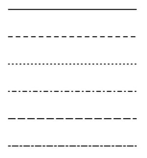
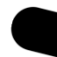
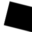
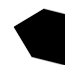
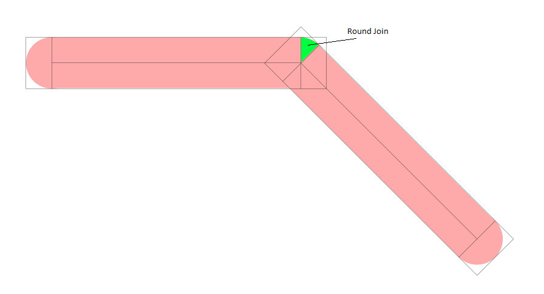
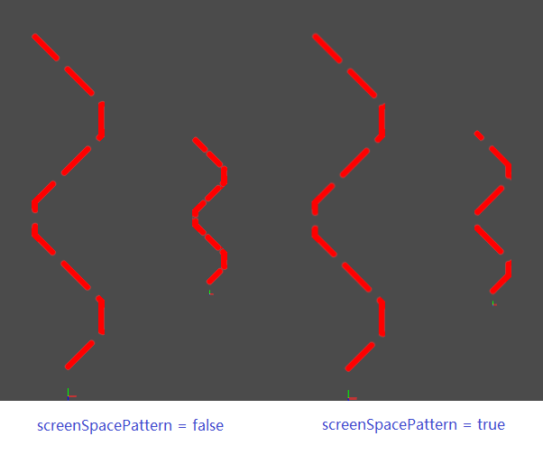

# Introduction
USD already has primitives to render 3D curve-like geometries, such as hair or grass. In practice, we also need curves in sketch or CAD document. The curve has uniform width, and its width will not change when we rotate or zoom the sketch. The curve may also have dash-dot patterns. We will provide a schema which could be applied to the curves primitive, and the primitive will become a uniform screen-width curve, and can have dash-dot patterns, or other type of patterns（such as waveline).

In this design, we don't consider any 3D-like curve styles, such as Blender's Grease Pencil or Tiltbrush.

Here is a picture of common curve patterns.

# Requirements

### Curve Width
The curve width is a screen-space width. It will not change when we zoom in or zoom out. The curve width is uniform across the whole curve.

### Curve Caps
The curve cap is the shape at the start or end of a curve or dash. There are different types of curve cap. The value can be different for the start and the end. But all the start caps in a curve should be the same, and all the end caps should be the same.
The curve cap will also impact the shape of the dot in a curve pattern. The start cap is the shape of the left half of the dot, and the end cap is the shape of the right half of the dot.

| cap type |   round   |  square  |  triangle  |
|:--------:|:---------:|:-----------:|:----------:|
|  figure  ||||

### Curve Joint
The curve joint is the shape at the joint of two curves, or at the joint of a polyline. The value is constant for the whole primitive.

### Curve Pattern
A dash-dot pattern is a composite of dashes and dots and the composition is periodic. 

You can also define other type of patterns.

# The implementation of DashDot curve style
Our implementation will be only applied to a BasisCurve with "linear" type. That is, the curve is a list of line segments or a polyline. The width of the line will be uniform, and it will not change when camera changes. There can be no pattern, which is called "sketch" style. It can also have dash dot pattern, which is called "dashDot" style.

To implement the curve style, we will add a style property to the BasisCurves, and add the special vertex and fragment shader. We will also provide two different materials: one is for the "sketch" style, and another is for the "dashDot" style.

### Modification to the BasisCurves
A new property is added to BasisCuves schema:

- style. A string uniform, which determines the type of the curve style. Currently its value could be "none", "sketch", "dashDot" and "screenSpaceDashDot". By default the value is "none", which means the curve doesn't have style. The value "sketch", "dashDot" and "screenSpaceDashDot" are only valid when the type is "linear". If the value is "sketch", the width of the curve will not change when camera changed. There is no pattern. If the value is "dashDot", the curve style pattern is dash dot pattern, and the pattern will be based on world unit. If we zoom in, the pattern on the curve will not change in world space. The dash size and the dash gap size in the screen space will be larger. If the value is "screenSpaceDashDot", the curve style pattern is dash dot pattern, and the pattern will be based on screen unit. If we zoom in, the pattern on the curve will change in the world space, so that the dash size and the dash gap size in the screen space will not change.

If the curve style is "sketch", "dashDot" or "screenSpaceDashDot", the curve must bind to a specific material. The property of the style, such as the cap shape or the scale of the dash dot pattern, will be set in the material via the surface input.

In the implementation, we also create special geometry when the curve style is "sketch", "dashDot" or "screenSpaceDashDot". Each line segment is converted to a rectangle which is composed from two triangles.
The shader of the BasisCurves is also modified. We add two new sections of shader code: "Curves.Vertex.DashDot" and "Curves.Fragment.DashDot". If the curve style is "sketch", "dashDot" or "screenSpaceDashDot", the vertex shader must be "Curves.Vertex.DashDot" and the fragment shader must be "Curves.Fragment.DashDot".

### Material to support the dash dot style
If the curve style is "sketch", it must contain a LineSketchSurface Shader. If the curve style is "dashDot" or "screenSpaceDashDot", it must contain a DashDotSurface Shader and DashDotTexture shader.

### LineSketchSurface
The shader will decide the opacity of pixels around caps and joint. The materialTag for this material is translucent.

This surface also has these special input:
- startCapType. An int input. It can be 0, 1, or 2. 0 means the cap type is round. 1 means the cap type is square. 2 means the cap type is triangle. The default value is 0.
- endCapType. An int input. It can be 0, 1, or 2. 0 means the cap type is round. 1 means the cap type is square. 2 means the cap type is triangle. The default value is 0.
- jointType. An int input. Currently it can only be 0, which means the joint type is round.

### DashDotSurface
The shader will decide whether the pixel is within a dash or a gap, so that we can decide its opacity. It will also handle the caps and joint. The materialTag for this material is translucent.

The DashDotSurface must has a color input, which connects to another shader whose shader is DashDotTexture. The DashDotTexture shader links to a texture which saves the information of the dash-dot pattern.

This surface also has these special input:
- startCapType. An int input. It can be 0, 1, or 2. 0 means the cap type is round. 1 means the cap type is square. 2 means the cap type is triangle. The default value is 0.
- endCapType. An int input. It can be 0, 1, or 2. 0 means the cap type is round. 1 means the cap type is square. 2 means the cap type is triangle. The default value is 0.
- jointType. An int input. Currently it can only be 0, which means the joint type is round.
- patternScale. A float input. The default value is 1. You can lengthen or compress the curve pattern by setting this property. For example, if patternScale is set to 2, the length of each dash and each gap will be enlarged by 2 times. This value will not impact on the curve width.

### DashDotTexture
The DashDotTexture shader is quite the same as UVTexture shader. The difference is that it outputs rgba value. The default value for wrap is clamp, and the default value for min/max filter is "nearest". The shader must have a dash-dot texture input.

### The dash-dot texture
The dash-dot texture is a texture that saves a type of dash-dot pattern. In the four channels we will save if the pixel is within a dash or a gap, and the start and end position of the current dash.