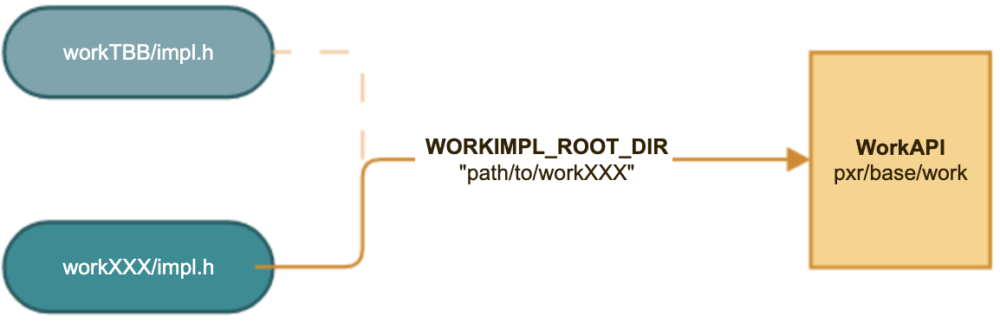

# Allowing Alternate Implementations of Libwork
Copyright &copy; 2025, Pixar Animation Studios,  version 1.0

## Contents
- [Introduction](#introduction)
- [Choosing Example Task Management Systems](#choosing-example-task-management-system)
- [Work API](#work-api)
- [Work API Callouts](#work-api-callouts)
- [Build Configuration](#build-configuration)
- [Caveats](#caveats)

## Introduction
Lib work is responsible for a majority of the parallel logic within USD, providing means for dispatching groups of tasks, scoped parallelism and parallel algorithms such as reduce via TBB/OneTBB. 

That being said, a few of our users have their own task management systems and are thwarted by USD's reliance on TBB. As such, we would like to allow users to provide their own work implementation that depends on their preferred task management library.

We propose creating an abstract layer that acts as an interface for the work API however the implementation details will reside outside of work. This proposal is not looking to create an abstract layer that will suit every parallel programming application, but generalize lib work enough such that most task management systems will be compatible. Note that we are also not looking to eliminate TBB as a dependency since we will still be using TBB's concurrent containers.

## Choosing Example Task Management Systems
Two other task management systems will be explored to better understand the explicit and implicit parallel constructs of our current system and also to ensure that this API will hold up against a variety of implementations. These examples will then exist in USD as examples for how one might build and link in their work backend. We considered several different systems but settled on Taskflow and Dispatch for the following reasons:

1. Dispatch:
    Users specifically requested we use Grand Central Dispatch/libdispatch; however Grand Central Dispatch is not well suited for burst processing and does not allow the user to limit the threads.

2. Taskflow: 
    Another popular open source task management system with thorough documentation that's header only and therefore more straight forward to begin prototyping with. It does have subtle but nontrivial differences in the way Taskflow supports thread limits and scoped parallelism compared to TBB

3. OpenMp: 
    This is a popular open source parallel system with lots of documentation; however it is not task based meaning that certain constructs like our WorkDispatcher would require more workarounds to implement.

4. Unreal Tasks: 
    A well known system used by the gaming community. While this was a close second choice, we decided on Taskflow because it was more straight forward to build against and begin prototyping with. There also were not as many built in parallel constructs such as parallel loops, sorts, and reduces. 

5. Pthreads: 
    This was an alternative some users are ok with using in lieu of libdispatch; however implementing work with pthreads would be akin to writing our own task management system, which would require much more time than allocated for this project.
	
## Work API
The goal is to abstract just the concurrent portion of work's API, leaving the serial logic, and error handling in the abstraction. Error handling in WorkDispatcher depends on lib tf and we would like to avoid having circular dependencies (discussed more under Build Configuration). Users will need to define and implement the function that will then be called in the abstraction layer like in the example below with sort.h.

`work/sort.h`
```
#include <workTBB/impl.h>
...
template <typename C>
void 
WorkParallelSort(C* container)
{
    if (WorkHasConcurrency()) {
        _WorkParallelSortImpl(container);
    }else{
        std::sort(container->begin(), container->end());
    }
}
```

`workTBB/impl.h`
```
template <typename C>
void 
_WorkParallelSortImpl(C* container)
{
    tbb::parallel_sort(container->begin(), container->end());
}
```

Note: We are avoiding using virtual methods for this abstraction, because it is undesirable to increase the overhead of task creation by adding the cost of a virtual function call especially when we could be creating millions of tasks during composition. 

Here is a list of API the work abstraction that will need to be implemented:

- void _RunDetachedTaskImpl(fn)
- void _WorkParallelSortImpl(container)
- void _WorkParallelForNImpl(n, callback, size_t grainSize)
- void _WorkParallelForEach_Impl(first, last, fn);
- V _WorkParallelReduceNImpl(identity, n, loopCallback, reductionCallback, grainSize)
- unsigned _WorkGetPhysicalConcurrencyLimitImpl();
- void _InitializeThreadingImpl( threadLimit);
- bool _WorkSupportsGranularThreadLimits();
- auto _WorkWithScopedParallelismImpl(fn)
- unsigned _WorkGetConcurrencyLimitImpl();
class Dispatcher
{
    - Dispatcher();
    - ~Dispatcher() noexcept;
    - Dispatcher(Dispatcher const &) = delete;
    - Dispatcher &operator=(Dispatcher const &) = delete;
    - inline void Run(callable)
    - void Reset()
    - void Wait()
    - void Cancel()
    - DeferTask Defer(callable)
}

## Work API Callouts

### WorkWithScopedParallelism
Through our various implementations, we've realized that ScopedParallelism must execute it's work in the same calling thread. This will be documented in the abstraction.

### Defer
While most lib work use cases are implementation agnostic, OpenExec takes advantage of the low level control over scheduling and memory allocation that TBB supports. We would like to preserve these optimizations seeing as most users will continue to rely on our TBB/OneTBB implementation of lib work.

We will be adding a new API, WorkDispatcher::Defer, which allocates memory for a task and returns the task handle without running it immediately. OpenExec's task emulation layer will be built on top of WorkDispatcher and thus needs a method to take advantage of TBB's task recycling, spawning continuation tasks, and bypassing the scheduler, which all require tbb::task_group::defer. Although Taskflow and libdispatch do not provide this level of control, we still would like to continue to support these behaviors in our TBB implementation and also provide a plugin point from which a user can optimize their work implementation if their task management library allows it. 

### ThreadLimits
Not all task management systems enable users to limit the number of threads spawned in the way that TBB does. As a result, we will not require users to support this functionality but we will still provide an interface in case a user would like to use a task management system that allows for that level of control. We do however want to maintain the option to limit our programs to run serially vs. at the maximum physical concurrency (i.e. PXR_WORK_THREAD_LIMIT set to 1 or 0 respectively). If the thread limit is set to a value between 1 and the physical concurrency then we will default to physical concurrency in the non granular case. We will move the logic for a single threaded implementation into the work abstraction layer such that the user is only responsible for writing a multi-threaded implementation.  

Unsurprisingly testWorkThreadLimits fails when we do not provide a thread limits implementation and instead default to the maximum physical concurrency. This test is very TBB specific for example it checks that any calls to TBB that happen before the work API is touched is unrestricted so we will add means to only enable this test only when built with TBB and add additional unit tests to test the ability to toggle between single threaded and multithreaded execution. 

### Other Considerations
It was brought up that explicit waiting (the ability to wait on a specific job) is a common pattern within game engines and could be useful. Currently the addition of such an API would not be beneficial for USD, and it does not seem likely that users would use lib work as a primary interface for task management within their own code. For these reasons, adding  API for explicit waiting will not be pursued.

## Build Configuration

### Requirements for DIY Work Library
* Must not have any dependencies within OpenUSD to avoid circular dependencies
    + We would like to treat the alternate implementation as a third party dependency and so they should not be built alongside USD. 
* Must provide all function declarations in a file called impl.h as opposed to having seperate header files for each functionality (dispatcher.h, sort.h etc.) 
    + While it is more inefficient to pull in all of the work implementation whenever it is included ,lib work itself is relatively small (~3,300 lines) and it prevents breaking the abstraction if we need to add more API under work in the future
* Must provide a config file to tell OpenUSD where to look for dependencies
* Users will be able to switch between different implementations via setting WORKIMPL_ROOT_DIR to their config file. Users can leave it empty to default to TBB.

A diagram illustrating what the build configuration would look like. "workXX" can be any alternate work implementation and also does not need to be prefixed by "work"
 
### Additional Build Details:
The Taskflow and libdispatch implementations will be kept under `pxr/extras` in order to provide examples showcasing how to implement work with another library, while also indicating that these examples are not currently being tested and supported by Pixar. The default TBB/OneTBB implementation will be kept under `pxr/base/workTBB` so as to to more easily isolate building workTBB from building work.

Other build configurations that were considered were having the alternate work implementation live inside or sibling to work, similar to workTBB as discussed above. While this allows alternate implementations to have dependencies within pxr, it means that users will need to rebuild USD every time they modify their code. This method would also require users to edit source code (the target audience for this proposal is experienced engineers who understand what they're doing and should thus be familiar with building and modifying USD, but it is still not preferable). 

## Caveats
The biggest caveat is that other implementations might not be as performant as TBB. Many of the optimizations in OpenExec are centered around TBB's constructs such as task recycling, scheduler bypass, and continuation tasks and utilize methods like defer or limiting threads to take advantage of them. However some of the other task management systems do not support these optimizations which will likely hinder the speed of OpenExec.
