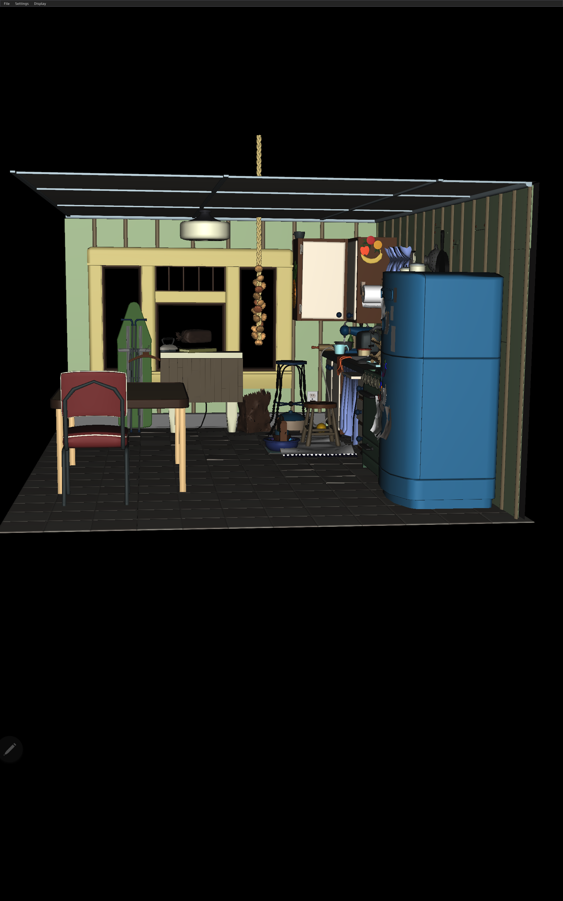

# Introduction

As we know, the importance of mobile devices graphics is increasing for this digital world. There are various types of mobile devices that require presentation, interaction, visualization, and other related graphics  is one of major mobile device markets.
We propose a new rendering pipeline to extend the USD capabilities to support Android platform with Vulkan backend. The new solution helps benefit Android users from the USD ecosystem.

# Technical challenges:

- USD does not support Android including build system, rendering pipeline, lib plugin, file loader system and so on
- hgiVulkan backend does not support Android specific function and parameters
- The Vulkan version in hgiVulkan is too high, resulting in fewer machines that can be adapted
- Currently there is no Android demo app

# Implementation 

## Development environment
- IDE: Android Studio Flamingo | 2022.2.1 Patch 2
- Development Kit: NDK 25.2.9519653

## Changes/Development:
- Compiled all core USD components on Android
- Add the Android specific Vulkan features to hgiVulkan
- Create a way of USD plugin management to meet Android's security policy requirements
- Build pass rendering pipeline OpenSubdiv support
- Demangle function names properly for Android platform
- Downgrade the Vulkan version to 1.0 in hgiVulkan for Android to adapt the Android devices
- Create first Android Studio project to render final frame on Android with hgiVulkan backend

# Showcase
- Devices: Galaxy Tab S8+ (model: SM-X800), 
- Android version: 13

# Future Work
- Validation on more Android devices
- Improved stability on Android Devices
- Improved performance