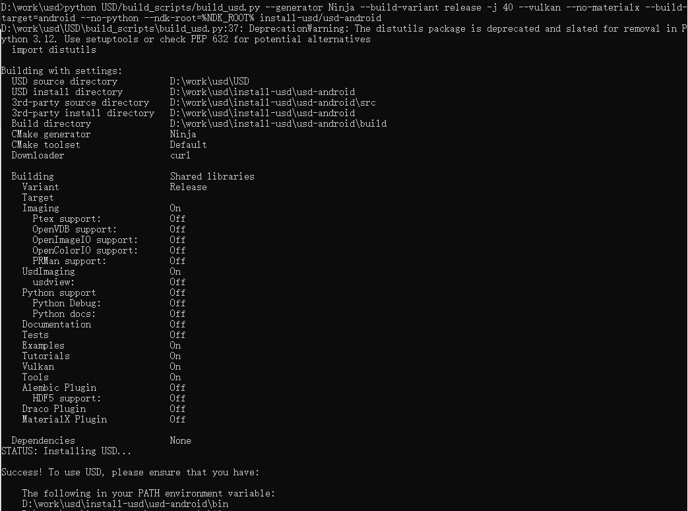

# Introduction

As we know, the importance of mobile devices graphics is increasing for this digital world. The mobile device market encompasses various requsts on graphic capabilities for presentation, interaction, visualization, and other related functions.
We propose a new rendering pipeline to extend the USD capabilities to support Android platform with Vulkan backend. The new solution helps benefit Android users from the USD ecosystem.

# Technical challenges:
These are the limitations in USD and we have addressed them in our Android work.
- USD does not support Android including build system, rendering pipeline, lib plugin, file loader system and so on
- HgiVulkan backend does not support Vulkan Android extension (e.g. VK_USE_PLATFORM_ANDROID_KHR, VK_KHR_ANDROID_SURFACE_EXTENSION_NAME), the Vulkan context cannot be initialized on Android.
- From this prototype mentioned in the proposal, minimum supported Vulkan version in HgiVulkan is 1.2, resulting in fewer machines that can be adapted
- Currently there is no Android demo app

# Implementation 

## Recommend Development environment
- IDE: Android Studio Flamingo | 2022.2.1 Patch 2
- Development Kit: The minimum supported NDK version is 22.0.7026061. In this prototype, we use 25.2.9519653 that is recommended.

## Changes/Development:
- Compiled all core USD components on Android. Disabled projects that can't run on Android, including usdviewq and all projects in USD/pxr/usd/bin.

- Created a way of USD plugin management to meet Android's security policy requirements. Originally, the USD plugin management mechanism loaded plugin libraries with the relative path by reading a JSON file. When we use NDK development on Android, we need to put the .so files in the jniLibs.srcDirs directory for the compiler to link them. After that, the .so files will be packaged into the APK file. If we put the JSON file in the jniLibs.srcDirs directory, it will not be packaged into the APK. To solve this problem, we put all non-so files in the Android app-specific location and specify this location through the environment variable 'PXRPLUGINPATHNAME'. After parsing the JSON file, USD is forced to specify the location of the .so files as jniLibs.srcDirs.

- Demangle function names properly for Android platform. The real namespace of standard library on Android is '__ndk1' other than 'std', so the original implementation can't demangle the symbols properly.

- Create first Android Studio project to render final frame on Android with HgiVulkan backend

## HgiVulkan Android adaption
The HgiVulkan module for Android depends on another work, and its proposal is https://github.com/PixarAnimationStudios/OpenUSD-proposals/pull/15. It elaborates how to support Vulkan 1.0 in HgiVulkan. The current HgiVulkan support Vulkan 1.2 or higher, but there are very few Android devices that support Vulkan 1.2. Therefore, degrade HgiVulkan to support Vulkan 1.0 that is supported by most of Android devices. Here we list the work to adapt HgiVulkan to Android.
- Add the Android-specific Vulkan extensions to HgiVulkan to enable right initialization of Vulkan on Android.
	- VK_USE_PLATFORM_ANDROID_KHR:
	- VK_KHR_ANDROID_SURFACE_EXTENSION_NAME

# Showcase
- Devices: Galaxy Tab S8+ (model: SM-X800)
- Android version: 13

# Screenshot of build process

# Future Work
- Validation on more Android devices
- Improved stability on Android Devices
- Improved performance
