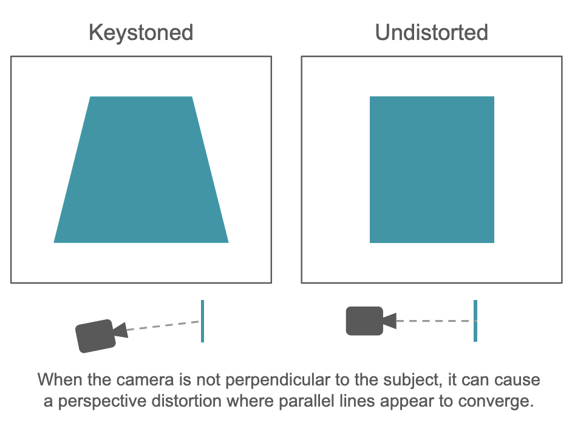
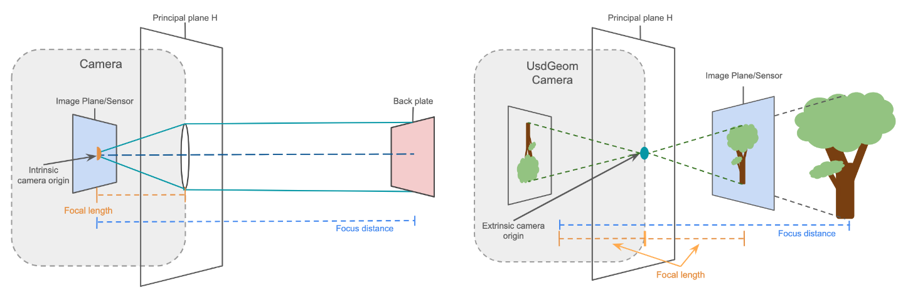
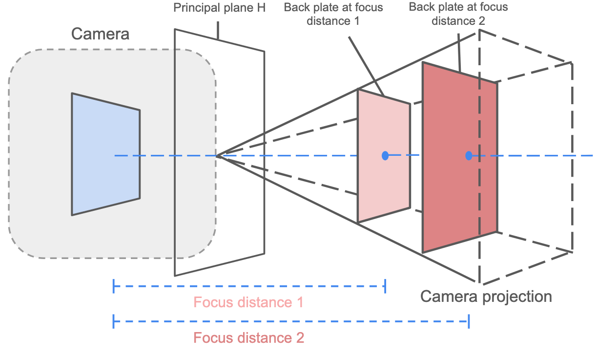
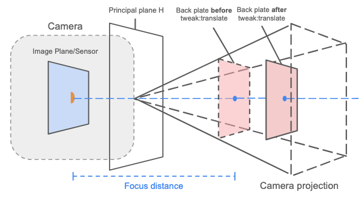

## Back Plate and Image Plane Support for USD

## Contents
- [Background](#background)
  - [Interchange](#interchange)
  - [Optical System](#optical-system)
- [Proposal](#proposal)
  - [Why Separate Schemas?](#why-separate-schemas?)
  - [Properties](#properties)
- [DCC Interchange](#dcc-interchange)
- [Engineering Work](#engineering-work)
- [Out of Scope](#out-of-scope)
- [Alternate Implementations](#alternate-implementations)

## Background

The majority of work in VFX is centered around augmenting existing footage, so it is important to view animation in the context of that footage (it doesn't matter if the animation looks good if it doesn't look integrated). A part of this augmentation process includes challenges such as:

- Stretching anamorphic shots: undistorting shots taken with a wider lens.
- Match move solving to replicate the camera's movement in the virtual environment.
- Adjusting the focus of a virtual camera to match that of the footage.
- Rotoscoping: masking/matting parts of live action footage for further editing such as drawing over it.
- Perspective correction aka de-keystoning: fixing distortions caused by the camera's relative position or angle to the subject.

  

_Fig 1. When the camera is not perpendicular to the subject it can cause a perspective distortion (left) where parallel lines appear to converge._ 

Other workflows include:
- Multi-plane camera: foreground, mid ground, background elements are all displayed on different planes facing the camera to create the illusion of depth in the scene. Essentially a virtual version of Disney's multi-plane camera.
- Portals: A surface in one scene where, another scene is also being displayed. For mirrors, this is often the same scene.
- Background plates: Displaying a background that could contain depth information on a card/image plane to reduce the complexity of the scene.
- Photogrammetry: recreating a 3D model from stitching together various overlapping photos and scene information.

For these examples, media is often times displayed on a 2D card, which we're referring to as a back plate, that is rendered like any other object in the scene. One possible photogrammetry workflow as an example: you can load a mesh of the subject and array of cameras (provided by a company like Lidar Lounge) into Maya from which the mesh can then be simplified and exported as USD. Then you can import it all into Mari, so the cameras become projectors; with each having the path to a back plate's image, that can then be projected onto the mesh. Without back plates, the utility of tools like usdview in matchmove, virtual production, photogrammetry, and other workflows is quite restricted and requires compositing before work can be evaluated in context.

Another feature we hope to introduce in order to support VFX/animation pipeline is image planes. As mentioned above, VFX artists will need to match the virtual camera to the movements and focus of the physical camera that was used to more seamlessly blend the live action footage into a virtual environment. In practice, this is commonly done via modifying the film back/sensor distance to the lens. The image plane is a construct that will allow us to translate the sensor along the optical axis (thus changing the depth of field) as well as project an image directly onto the sensor. These images will always be at an infinite distance in the scene and always in focus irrespective of whether the camera itself is focused at infinity. In a potential scene, the image plane would be the far-away castle that rests atop a hill as a backdrop and back plates would hold the vines and branches to "shoot" through.

### Interchange
By adding support for this feature we expand the use of USD when interchanging with other software like [Maya](https://help.autodesk.com/view/MAYAUL/2025/ENU/?guid=GUID-E2490B87-087E-476A-9C1D-A917D009001A), [Blender](https://docs.blender.org/manual/en/latest/modeling/meshes/import_images_as_planes.html), [Renderman](https://rmanwiki-26.pixar.com/space/REN26/19661891/PxrImageDisplayFilter), and [Nuke](https://www.nukepedia.com/tools/gizmos/3d/imageplane3d/) ([another impl](https://www.nukepedia.com/tools/gizmos/3d/imageplane/)). In particular we are aware of interest in using USD with [Composure](https://dev.epicgames.com/documentation/en-us/unreal-engine/composure#plate) (Unreal Engine's compositing plugin) that would require back plate support to do so. Our proposal will cover what capabilities these DCC's back plate equivalents provide and outline the differences compared with our back plates.

### Optical System
Our current UsdGeomCamera uses a pinhole model, where everything is in focus and blur is shader applied; however we are presenting a new thin lens model that will be used with image planes and back plates in order to provide more realistic camera controls. Note that by introducing this new model we're not removing any features of the pinhole model, but instead providing an alternate way to control depth of field that is more intuitive for VFX purposes. 

_Fig 2. back plate/image plane API camera model (left); our system's camera model (right)_

Let us begin by defining a few terms:

- **Principal plane H**: A common simplification in optics is to reduce a complex system into two principal planes (H_near and H_far) that represent the point at which all refraction occurs. These planes can be calculated by taking incident rays parallel to the optical axis and finding their intersection with the emerging rays that intersect the focal point. For practical purposes we are assuming an infinitely thin lens such that H_near and H_far are equal, which lets us work with a single principal plane H. This can also be seen as the plane in which the apex of the viewing frustum lies. Note that this is a mathematical reference, it does not physically exist.
- **Intrinsic camera origin**: The origin of the components within the camera sits at the camera sensor when it is at the focal length. We did consider using the apex of the frustum as our camera origin; however that location is a bit arbitrary given that this point sits at a virtual reference. Instead we've chosen to use our current model since the focus distance when capturing photos is often measured from this point. In this model, our camera is still considered +Y up looking down the -Z axis.
- **Extrinsic camera origin**: UsdGeomCamera, GfCamera, and GfFrustum all use a pinhole model such that the apex of the frustum is the camera origin. In order to maintain backwards compatibility, computations under a pinhole model, where the origin of the camera sits at the principal plane H, will need to be offset by the focal length to refactor the intrinsic camera origin to the principal plane. This must take place before any other transformations on the camera such as rotating the camera along the X axis such that it matches the stage's orientation.
- **Focus distance**: In cinematography this is the distance from the **camera sensor** to the plane at which objects in the scene will be in focus. While some optical definitions measure this from the principal plane or frustum apex, we strictly adhere to the former (sensor-to-subject) definition to align with on-set practices.
- **Flange focal distance(FFD)/back focus**: The distance between the sensor and the back of the lens. Since our lens is infinitely thin, this is the distance from the image plane/sensor to the principal plane H. 
- **Focal length**: The distance from the principal plane H to the focal point when the lens is focused at infinity.

## Proposal
This proposal aims to add native support for back plates to USD and will outline the framework for image planes though we will leave the latter for when there is better infrastructure to implement image planes in Hydra. Back plates are placed at the focus distance by default, and scaled to fit the camera frustum such that the plate is always in focus. If the focus distance changes, then the back plate will also shift along the optical axis to remain at focus distance and scale accordingly. This auto-focus setup is tailored for match moving and assumes that whatever photos were captured are intended to be shown as is without any additional blurring. However let's say that the artist took the shot with everything in focus, and wanted to blur it virtually; this is also possible. We offer another set of controls (translate, rotate, scale) that allow us to tweak the plate to further adjust the image **after** it has been set to the focus distance. This means if we have a shot in full focus, we can simply tweak the plate to a position with the "right" amount of blurriness. Note that because these controls do not affect the focus distance of the camera, shifting the plate back could also further blur the footage. For background plate workflows, this may pose problems if the background was shot off-focus, and the plate needs to be moved away from the focus distance in order to avoid occluding objects in the scene. For a never-occluding background that is captured with some depth of field or blur, we advocate using an image plane instead of a back plate. If the background should block some elements, then in order to cheat the plate's position while also maintaining focus, one may consider increasing the depth of field. 

  
  

_Fig 3. Left. The back plate will be default be positioned at focus distance and scaled to fill the camera frustum accordingly. Right. back plate model depicting the effects of tweak:translate. Back plate is placed at the focus distance and the translation is applied to the back plate's center at that point. Note that the size of the back plate does not change as it is translated._

Other image adjustments provided by our tweak controls include perspective corrections or de-squeezing if the image was shot through an anamorphic lens. Geometrically, this set up is like the inverse of a film projector, with the image plane being analogous to a movie screen in extrinsic space. Unlike a film projector though, the transformations applied through the schema, i.e. scale, rotation, and translation, are applied on the back plate itself. We can think of it like tilting the screen to correct for key-stoning as opposed to adjusting the lens in the projector. 

An image plane on the other hand refers to the camera sensor, such that images constrained to the sensor are always in focus and it can be used to shift the sensor along the optical axis to adjust the focus. For example shifting the image plane back can shorten the focus distance. We discussed fixing the image plane at the focal length; however, it does not make sense to restrict the sensor because that would imply that our lens that is always focused at infinity, yet also needs to somehow exhibit aperture blur which creates a contradictory model. By explicitly providing a parameter to adjust the sensor distance; we enable camera blur to be interchangeable with other software since it it is not shader applied. Furthermore, in VFX, if the flange focal distance is not correct then the camera will not be calibrated properly and have trouble focusing as intended. This is typically corrected by inserting camera shims to increase the FFD; however we can mimic this in our system by simply moving the sensor. 

Key implementation differences between the two are: a camera should only have one image plane whereas multiple back plates can be associated with the camera, and back plates should be shot as any other object during rendering (meaning additional depth, color, and alpha information will be taken into account during the render), while image planes are composed before or after depending on the renderer. Neither will emit light, cause shadowing, nor produce secondary transmissions (e.g. reflections and refraction). With image planes and back plates being two distinct concepts, we'll propose two different schemas for them, single-apply for image planes and multi-apply for back plates. 
### Why Separate Schemas?
If we implement a Multi-Apply API Schema for back plates we can:
- Author attributes directly to the camera
- Author multiple back plates to camera, since multi-apply schemas can be applied several times to the same prim
- multiple back plates could be used to view CG elements in context with rotoscoped foreground elements

If we implement a Single-Apply API Schema for image planes we can:
- Author attributes directly to the camera
- Restrict the user to only authoring one image plane to the camera
- This will need to be explicitly applied since not all camera will have media associated with them.

Other considerations we had:
- Creating a base multi-apply schema that contained all the properties shared among image planes and back plates and could be included as a builtin schema by both
- Creating a shared schema with a property to toggle between the two concepts

These alternative solutions were primarily to reduce the redundancy among the two; however the namespacing of the properties for the former solution would look something like `backPlate:imageFitBase:_instance_name_:propertyName` for back plates and similarly for image planes, which is not as user friendly. Furthermore we would also need to implement extra logic to ensure that there can only be one image plane authored to each camera. In order to draw a clear distinction between the two concepts as well as simplifying the property namespacing we've opted for two separate schemas.

### Properties
| **Property** | **Back Plate Description** | **Image Plane Description** |
| -------- | ---------------------- | ----------------------- |
| **float2 scale:tweak[^1]**   | Scales the XY dimensions of the plate.[^2] The back plate's default scale will be determined by it's focus distance and the size of the camera frustum.  | Scales the image plane onto the sensor.[^2]  | 
| **XXX rotate:tweak[^1]**  | **(float3f)** 3D rotation around the center of the plate in degrees.[^2] | **(float)** Rotation in degrees of the image plane on the sensor around the z-axis.[^2] | 
| **XXX translate:tweak[^1]**  | **(float3f)** 3D translation in scene units of the center of the plate.[^2] | **(float2)** XY translation of the image plane on the sensor measured in 1/10s of a scene unit.[^2] | 
| **float sensorDistance**  | N/A | Translates the sensor along the optical axis where 0.0 indicates that the sensor sits at the lens' focal length and positive values indicate that the sensor is moving further from H. Note that by default this value will be set to 0.0 and changing this value affects the focus distance but not the focal length. Measured in 1/10s of a scene unit. | 
| **asset image**  | Asset path to the file containing a texture or sequence of textures. Hydra nor Usd textures support extracting images from media; though this is currently a project on the road map. When it is available we will revisit this schema and add media support for image planes as well. The images by default will be centered on the back plate.  | Same as back plate.  | 
| **asset alpha:image**  | Asset path to channel representing the opacity of the back plate. If a single-channel texture is fed into this property, the alpha values will be set to that channel. If a two-channel texture is fed into this property, the alpha values will be set to the second channel. If a four-channel texture is fed into this property then the fourth channel will be considered the alpha channel. If any other n-channel texture is fed into image then they will be ignored and the alpha will be set to 1.0 as a default.  | N/A  | 
| **asset depth:image**  | File path to a **single**-channel texture that describes the depth associated with the image if one exists. If not then the back plate will have uniform depth. The depth channel is a linear, floating point distance value computed as `computedDepth = ((textureValue - minOffset) * normalizingFactor) + worldSpaceOffset`, where the offsets can be trivially set by the user.  The depth channel is not a hardware generated z buffer as these have unknown format and are not generally readable outside of the GPU. | N/A | 
| **float minOffset**  | Value to shift the depth values if minimum value of current range is not set at 0 if needed.[^3] | N/A | 
| **float normalizingFactor**  | Value to scale the texture depth value if needed.[^3] | N/A | 
| **float worldSpaceOffset**  | Offset to shift the depth into world space if needed.[^3]  | N/A  | 
| **float3f gain**  | Scales the per-channel upper bound of the normalized signal before gamma, analogous to per-channel exposure or slope. Must be >= 0.[^4]  | Same as back plate.  | 
| **float3f lift**  | Raises or lowers the signal floor (black level) of the normalized value prior to the gain and gamma stages. Ranges from 0-1.[^4] | Same as back plate. | 
| **float3 gamma**  | Per-channel power applied to the normalized RGB signal after lift and gain. Must be greater than some epsilon value.[^4] | Same as back plate.  | 
| **token visibility ["all","solo","mute"]**  | Toggles the visibility of the back plate to all cameras, only the associated camera, or no cameras, with "solo" being the fallback. Note that in use cases such as in photogrammetry, where you may have many plates in the scene, it can be useful to disable certain back plates to reduce clutter in your workflow.  | N/A  | 
| **bool mute**  | N/A  | Toggles the visibility of the image plane. The fallback value is true.  | 

[^1]: These will be grouped using an `uiHints:displayGroup` called "Plate Fine Adjustments". Note "cheat" was an alternate choice for the namespace suffix.
[^2]: Transformation matrices will be applied in the order of `translate•rotate•scale•v`,where v is the center/origin of the back plate.
[^3]: `computedDepth = ((textureValue - minOffset) * normalizingFactor) + worldSpaceOffset`.
[^4]: Lift, gain, and gamma are applied in the order of `(x*(gain-lift)+lift)^(1/gamma)`. 

Other considerations that will not be included:

- **Width/Height**: We felt that these values are repetitive given that we have scale for image planes and back plates' size are determined by the focus distance and camera frustums; however we will provide APIs to retrieve the dimensions of plate and planes. 
- **Fit**: Describes how the image should be adjusted to fit within the dimensions of the card. The same effects can be achieved by modifying the properties of the frustum and transformation of the back plate; furthermore a fit token would be contrary to our model since it describes how an image would be pasted onto a texture card. It does not encapsulate the semantics of a projection that are often needed for digital processing of VFX footage (de-keystoning, anamorphic images etc).
- **Channel Names**: Since Usd and Storm do not currently support channel naming, we felt that it would be better to provide separate inputs for alpha and depth similar to USdPreviewSurface. If support for channel naming is added in the future then we may revisit this proposal and add channel name properties.
- **Relation to UsdRenderPass**: While we currently will not be interacting with additional render passes, having individual bools to toggle whether or not image planes are visible and back plates are visible, can be useful for render pass workflows. For instance, a background render pass would want the image plane visible but not the back plates; whereas other render passes may want differently.

#### API Methods
- CreateImagePlane(imagePlaneName)
- SetImagePlane*Attr(imagePlaneName, value)
- GetImagePlane*Attr(imagePlaneName, attribute)
- GetImagePlaneHeight()
- GetImagePlaneWidth()
- SetImagePlane([])
- GetImagePlane()

- CreateBackPlate(backPlateName)
- SetBackPlate*Attr(backPlateName, value)
- GetBackPlate*Attr(backPlateName, attribute)
- GetBackPlateHeight()
- GetBackPlateWidth()
- SetBackPlates([])
- GetBackPlates()

## DCC Interchange
Here we list the image plane features of [Maya](https://help.autodesk.com/view/MAYAUL/2025/ENU/?guid=GUID-E2490B87-087E-476A-9C1D-A917D009001A), [Blender](https://docs.blender.org/manual/en/latest/modeling/meshes/import_images_as_planes.html), [Composure](https://dev.epicgames.com/documentation/en-us/unreal-engine/composure#plate), [Renderman](https://rmanwiki-26.pixar.com/space/REN26/19661891/PxrImageDisplayFilter), and [Nuke](https://www.nukepedia.com/tools/gizmos/3d/imageplane3d/) ([another impl](https://www.nukepedia.com/tools/gizmos/3d/imageplane/)) and highlight the level of support we have for certain features. 

:white_check_mark:: Fully supported

:warning:: Supported but with restrictions

:construction:: Future work

### Maya
- Color grading controls
- Camera visibility modes
- Alpha and depth support depth maps
- Luminance
- Various modes to fit the image plane onto the camera frame / frame cropping and offset controls
- Non-camera associated image planes
- Supports images, animation, and media

:warning: Maya supports standard image planes as well as free image planes, which are image planes not associated with a camera. We've observed that the standard use cases for this seem to be a modeling reference, and it is suggested that this specific image plane would be better represented as a texture card.

:construction: We will not support displaying image planes on media in our initial implementation.

### Blender
- Different types of shading: emission, shadeless, and their [BSDF](https://docs.blender.org/manual/en/latest/render/shader_nodes/shader/principled.html) shader
- Different render methods: forward vs deferred, back face culling, 
- Alpha channel support
- Various modes to fit the image plane onto the camera frame
- Always camera facing toggle
- Grouping multiple image planes at once
- Supports images and animation

:warning: Our image planes will not be emissive, thus we will only support Blender's shadeless shader option.

:warning: A group of image planes via Blender will correspond to individual back plates in USD. When exporting to USD you will lose the image plane grouping. Although you could implement some sort of grouping mechanism via metadata.

### Composure
- Media pass: pre-processing passes applied before rendering i.e. anti-aliasing, OCIO
- Layer pass:post-processing passes before the plate is integrated with other layers i.e. adding/subtracting/masking layers etc.
- Different compositing modes to allow the layer pass to sample from either a custom render pass or the texture directly after the media passes
- Supports images and media

:warning: The layer passes, and anti aliasing media passes will be composited before being written back to USD.

:warning: Our color and transform controls can correspond to Composure's color keying/scaling correcting media passes; however to support a full breadth of color transformations back plate and image plane textures should be interpretted through the applicable UsdColorSpaceAPI.

:construction: We will not support displaying image planes on media in our initial implementation.

### Nuke
Choose reference frame + reference camera, supports images and animation

:white_check_mark: This should be relatively straightforward with our current schema.

### Renderman
- 2D translation, scale, and rotation controls
- Alpha channel support
- Various modes to fit the image plane onto the camera frame
- Color gain, offset, and linearization
- Supports shadow AOVs

:construction: We are aiming to support the use of image planes pre and mid render. Adding means to support additional post render passes like shadow AOVs are out of scope. 

## Engineering Work
### Hydra Integration
- Write a BackPlateAPIAdapter that inherits from UsdImagingAPISchemaAdapter  
- Generate BackPlateSchema in hd 
- Add scene index filter
    - In order to integrate back plates in Hydra, we will be defining a scene index filterto identify back plates in the scene and produce camera associated texture cards for the renderer to process. Scene filters exists as an intermediary step between HdSceneIndices and HdSceneIndexObservers that can accept scene updates and transform/modify those updates to the next filtering scene index or renderer. For our use cases, a part of these transformations can include any color/depth information updates. 
- Define new back plate SPrim type   

- Image planes on the other hand involve more explicit control over the render passes and could vary as to whether it's incorporated pre/post render. Generating and rearranging Hydra tasks is one option, however it would be complex and is not recommended since the HdTask interface for Hydra 2.0 is still being developed. Another option would be to create a filtering scene index that converts the necessary data into hydra prims and then define a render index that will use that data to apply the specified compositions in a render pass; however this solution is very render specific and may need to define several render indices and filtering scene indices.

### HdPrman Integration 
- Add depth and distortion fields toPxrImagePlaneFilter in Rman
- Renderman already has a PxrImagePlaneFilter which is a sample filter plug-in that allows us to operate on raw ray samples before they are pixel filtered and supports the properties mentioned in the table above. The biggest difference between our back plate and PxrImagePlaneFilter is that we also need to compare our back plate's depth with the pixel's scene depth, which depending on the difficulty could mean that this is a feature better incorporated as an addendum to PxrImagePlaneFilter or exist as its own sample filter.

### Storm Integration
- We will define a shader node (most likely a UsdPreviewSurface) to handle opacity, color corrections, and extrinsic transformations of the back plate, and also define a separate shader to handle depth displacements within Storm. 

### Testing and Validation
In order to create baselines for our tests, we will be creating a scene in Composure and validating that a duplicate scene in usdview looks identical. For validation, we will be type-checking that each property is correctly typed and that the color grading property values are in a valid range.

## Out of Scope
- **Lens distortions/re-distorting**: While we do provide a subset of distortion corrections, rotation for keystoning, and mechanisms to crop and scale the photo, we are not providing properties to calculate nor apply lens distortions/corrections. This should be done prior to handing off to USD.
- **Color grading**: We offer limited color controls via the schema properties. If more complex color grading needs to be done then a user should refer to the ColorSpaceAPI.
- **Match moving solves**: USD will not be will not be providing functionality to perform match move solves. These should be calculated prior and supplied to the metadata or in another layer to the camera.
- **Framing**: Editorial framing, framing to specify the "safe" region of the shot, involves integration with UsdRender and is out of scope for now. FDL integration is currently being explored and can be included either via metadata or a file format plugin. 
- **Projection painting**: I.e. enabling users to paint textures onto some geometry is used by ILM for their Mars/Commodore system and also frequently used in gaming as decals. While it would be useful to include this feature, it should be part of the shading system since the painted texture would need to be exported as a material or primvar that the shader node can consume. In our shading pipeline we associate cameras with the projection setup and part of the model build extracts the static xform and stamps it out as a primvar that the shader node can consume.
- **Adding additional render passes**: In order to support image planes, we would need to apply its properties in a post-procesing stage which most likely entails specifying additional render passes in the renderer. It may be possible to create a scene index that wraps the properties that a render index can then detect and apply as a separate render pass; however this method would be very render specific and dependent. The other option is to hold off until more work has been done to improve HdTask's interface in Hydra 2.0 to allow us to generate additional Hydra tasks for an additional render pass.
- **Full compositing graph**: While we do want to support interchange with Composure; this would also likely involve investigating how USD render passes can be used to achieve a similar affect to Composure's layer passes.
- **Displaying media**: USD currently does not support media inputs although when that feature is available we will enable back plates and image planes to display media.

## Alternative Implementation Strategies
### 1. Concrete prim type
Here is a working implementation that was done before Multi-Apply schemas were added to USD.

It's a fully featured solution that is based around Autodesk Maya's "underworld" image plane nodes where many planes 
can live under a camera. This specific implementation is just a quick attempt to move maya image planes across packages 
and the hydra implementation is just a workaround that generates an HdMesh rprim (instead of creating a new image plane 
prim type). Reference internal PR from Luma: https://github.com/LumaPictures/USD/pull/1

#### Pros:
- Prim attributes like [visibility, purpose] can be leveraged to provide intuitive functionality
- Easy to see Image Planes in a hierarchy
#### Shortfalls:
- Requires relationships between camera + plane prims
- Requires an extra API schema to encode the relationship on the Camera.
- There's the possibility that someone targets something other than an ImagePlane with the relationship, so there are more ways to "get stuff wrong". 

### 2. Using existing USD types (Plane + material + camera + expressions)
- It is possible to create a UsdGeomPlane with a material and accomplish the same thing as a back plate.
- No need for this proposal :)
#### Shortfalls:
- Requires users to implement complex authoring code.
- No explicit identity as an "Image Plane". This will make it hard to successfully roundtrip from DCCs to USD.
- Would require defining canonical texture coordinates for UsdGeomPlane