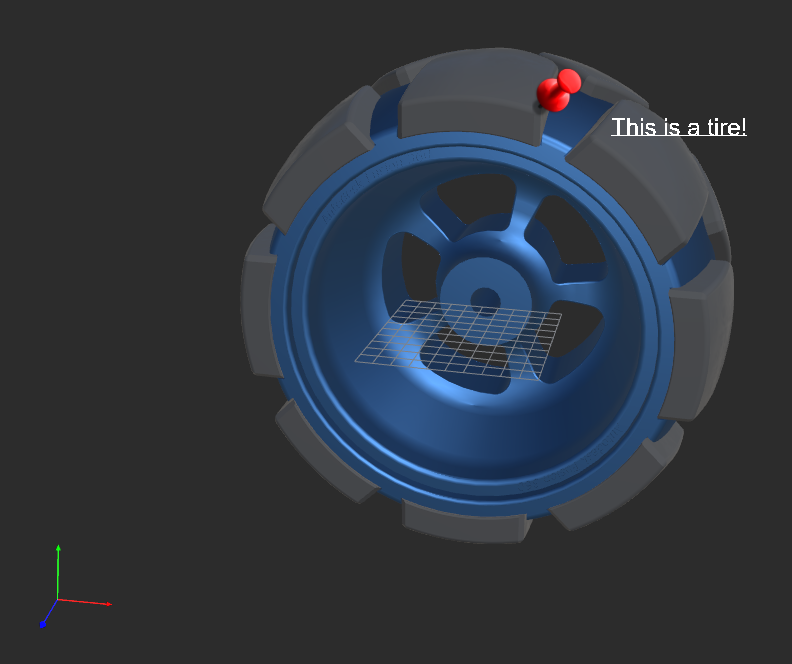

# Billboards XformOp for OpenUSD

- [Purpose and Context](#purpose-and-context)
- [Specification](#specification)
- [Design and Implementation](#design-and-implementation)

## Purpose and Context
In the viewport rendering, there are use cases that certain renderables need to be a
fixture at a predefined screen location and in fixed pixel size. Examples include the axis tripod
at a corner of the viewport, or a fixed pixel-sized callout following the character. The renderable
could also maintain its facing alignment. A callout with texts is one such example. We called
such transformations `billboards transformations` and intend to support them as `XformOp`s in the
transformation stack in USD.

### Transformation Stack in OpenUSD
The core of managing the transformation stack in USD is `UsdGeomXformable` (`Xformable`).
`Xformable` provides a schema base for schemas such as `Gprim`s, `Camera` and `Xform` to embed
transformation operations. The operation to compute the transformation matrix (such as
translate, rotation and scale) is `UsdGeomXformOp` (`XformOp`). Every `Xformable`-based schema
maintains an ordered set of `XformOp`s. A local transformation matrix (i.e. a typical model-to-world
matrix) of a primitive is constructed by chain-multiplying the individual `XformOp` matrix in
the specified order in `xformOpOrder`. `xformOpOrder` is a `Xformable` attribute that defines a
token array of ordered `XformOp`s.

Here is an example of the transformation stack in USD:
```python
def Xform "Cones"
{
    double3 xformOp:translate = (1.0, 0.0, 0.0)
    double3 xformOp:rotateXYZ = (-90.0, 0.0, 0.0)
    uniform token[] xformOpOrder = ["xformOp:translate", "xformOp:rotateXYZ"]
    def Cone "Cone1"
    {
        double radius = 1.0
        double height = 3.0
        color3f[] primvars:displayColor = [(0.8, 0.0, 0.8)]
    }
    def Cone "Cone2"
    {
        double3 xformOp:translate = (0.0, 1.0, 0.0)
        uniform token[] xformOpOrder = ["xformOp:translate"]

        double radius = 1.0
        double height = 3.0
        color3f[] primvars:displayColor = [(0.8, 0.8, 0.0)]
    }
}
```
In this example both `Cones` and `Cone2` defined their local transformations. The local
transformation defined in `Cones` is a left-multiplied matrix of the local transformation
of `Cone2`. In other words, transformation of `Cones` is a part of the transformation stack
of `Cone2`. If you flatten the transformation stack, `Cone2` inherently defined an ordered
set of `XformOp`s of [*Cones*:`xformOp:translate`, *Cones*:`xformOp:rotateXYZ`, `xformOp:translate`].

Currently USD only support **simple** `xformOp`s. **Simple** means a transformation matrix
can be computed solely on Op's attributes. In our previous example, the matrix of
`xformOp:translate` can be computed with the authored offset vector ```(1.0, 0.0, 0.0)```.
There are no external parameters required in this matrix computation. All `XformOp`s supported
in USD right now have and only need one attribute to compute its local transformation.

Billboards transformation is not simple. It is **compound** and **extrinsic**.

### Examples of billboards transformation


This screenshot demonstrates some use cases of the billboards transformation:
  - Callout: display screen facing texts at a fixed screen location with a fixed screen size.
  - Pin: display a screen facing pin with a fixed scale.
  - Axis tripod: display an axis tripod at a fixed screen location with a fixed screen size.

### Billboards Transformation
A billboards transformation places the renderable (or transformable in USD)
in a predefined screen location, with a constant pixel-scaled size, or a
locked facing alignment. A billboards transformation may consist of three types
of transformations: affix the position, affix the size and align the front facing.
Each of these transformations is defined as a `XformOp` in USD. XformOp `affixPosition`
constructs the transformation that positions the transformable at an authored screen location.
XformOp `affixScale` constructs the transformation that scales the renderable to an authored
screen size. XformOp `align` constructs the transformation that maintains the orientation of
transformable's front facing.

`affixPosition`, `affixScale` and `align` are **compound** since they all require a set of
attributes (instead of single one) to compute the transformation matrix. All three
XformOp are **extrinsic** as they all request the current viewing states (such as
the view matrix and the projection matrix) to compute the local transformation of the
billboarded primitives (again, a transformable in USD).

XformOps `affixPosition` and `affixScale` can specify the target position and size
in a selected coordinate space:
- `ndc`: coordinate is in the normalized device space ([-1.0, 1.0]x[-1.0, 1.0])
- `view`: coordinate is in the view space, where camera is at (0,0,0) and faces the x-y plane.
- `screen`: coordinate is in the screen space ([0, width-1]x[0, height-1] where width and
height are in pixels).

XformOp `affixPosition` consists of two attribute fields to affix the transformable to the
specified screen location:
- `affixPosition:anchor`: source location that is specified in the model space.
- `affixPosition:anchorage`: target location that is specified in the selected
coordinate space (`ndc`, `view`, or `screen`).

`affixPosition` constructs the local transformation that affixes `anchor` to `anchorage`
on the screen.

XformOp `affixScale` consists of three attribute fields to affix the screen size of the
transformable.
- `affixScale:baseSize`: the unit size in the model space.
- `affixScale:scaleSize`: the equivalent unit size in the selected coordinate space (
`ndc`, `view`, or `screen`).
- `affixScale:pivot`: the center position of the scaling in the model space.

`affixScale` constructs the local transformation that scales the transformable to
match the model-space unit size of `baseSize` to `scaleSize` in the designated space.

XformOp `align` fixes the alignment with a reference plane that is orthogonal to the
front normal of the transformable. Three types of the reference plane are supported:
- `screen`: front normal is orthogonal to the screen plane (i.e. the near plane of the
viewing frustum).
- `viewer`: front normal points to the camera location.
- `plane`: front normal is orthogonal to a custom plane.

`align` constructs the local transformation that maintains the orientation of the
transformable's front facing. It consists of one optional attribute field for the
`plane` reference plane:
- `align:plane`: a 3D plane defined by the authored normal of the plane.

XformOps `affixPosition`, `affixScale`, and `align` can be turned off with authored
value of `off`. This `off` mode allows artist and developers to disable the billboards
transformation with overrides.

All billboards XformOps are acceptable Ops in `xformOpOrder`. Billboards XformOps can
combine with the existing XformOps in USD. This allows the use cases such as rendering a
fixed-size axis-tripod at a fixed screen location. The axis-tripod can, of course, synchronize
its rotation with the trackball action of the camera.

## Specification

### Design and Implementation Requirements
- Billboards XformOp needs to have no functionality impact on xformOp usages in existing USD
stages and layers.
- Billboards XformOp should have zero or ignorable performance impact on current xformOps
and transformation stack.
- Billboards xformOp should behave in the same way, from designer's point of view, of xformOps
such as translate and rotation.
- Billboards xformOp needs to work with `Xform`, `Xformable` and any schema
that is based on `Xformable` without explicit and additional effort.
- Billboards xformOp needs to work within the current schema API of the transformation stack.

### .usda Examples
A full example can be found in [billboards.usda](./billboards.usda). Examples listed below
demonstrate the billboards XformOp in various use cases.

#### Billboards `xformOp` in `Xform`
```python
def Xform "billboardXform"
{
    token xformOp:affixPosition = "screen" # supported tokens: "off", "screen", "ndc", "view"
    float3 xformOp:affixPosition:anchor = (1.0, 5.0, 6.0) # anchor location in the model space
    float3 xformOp:affixPosition:anchorage = (12, 34, 56) # anchored location in the screen space ("screen" mode)

    token xformOp:affixScale = "ndc" # supported tokens: "off", "screen", "view", "ndc"
    float xformOp:affixScale:baseSize = 1.0 # unit size in the model space that is scaled to match `scaleSize` in the designated space
    float xformOp:affixScale:scaleSize = 0.2 # uint size in clip space ("ndc" mode in this example)
    float3 xformOp:affixScale:pivot = (0.0, 0.0, 0.0) # center position of the scale transformation in the model space

    token xformOp:align = "plane" # supported tokens: "off", "screen", "viewer", "plane"
    float3 xformOp:align:plane = (-1.0, -5.5, 60.0) # plane normal in the world space (optional field - "plane" mode only).

    uniform token[] xformOpOrder = ["xformOp:align", "xformOp:affixPosition", "xformOp:affixScale"]

    def Cone "coneShape"
    {
        double radius = 2.0
        double height = 3.0
        color3f[] primvars:displayColor = [(0.5, 0, 0)]
    }
}
```

#### Billboards `xformOp` in Gprim
```python
def Cone "billboardCone"
{
    token xformOp:affixPosition = "screen" # supported tokens: "off", "screen", "ndc", "view"
    float3 xformOp:affixPosition:anchor = (1.0, 5.0, 6.0) # anchor location in the model space
    float3 xformOp:affixPosition:anchorage = (12, 34, 56) # anchored location in the screen space ("screen" mode)

    token xformOp:affixScale = "ndc" # supported tokens: "off", "screen", "view", "ndc"
    float xformOp:affixScale:baseSize = 1.0 # unit size in the model space that is scaled to match `scaleSize` in the designated space
    float xformOp:affixScale:scaleSize = 0.2 # uint size in clip space ("ndc" mode in this example)
    float3 xformOp:affixScale:pivot = (0.0, 0.0, 0.0) # center position of the scale transformation in the model space

    token xformOp:align = "plane" # supported tokens: "off", "screen", "viewer", "plane"
    float3 xformOp:align:plane = (-1.0, -5.5, 60.0) # plane normal in the world space (optional field - "plane" mode only).

    uniform token[] xformOpOrder = ["xformOp:align", "xformOp:affixPosition", "xformOp:affixScale"]

    double radius = 2.0
    double height = 3.0
    color3f[] primvars:displayColor = [(0.5, 0, 0)]
}
```
#### Billboards `xformOp` with existing USD `xformOp`
```python
def Cone "constantCone"
{
    token xformOp:affixScale = "ndc" # supported tokens: "off", "screen", "view", "ndc"
    float xformOp:affixScale:baseSize = 1.0 # unit size in the model space that is scaled to match `scaleSize` in the designated space
    float xformOp:affixScale:scaleSize = 0.2 # uint size in clip space ("ndc" mode in this example)
    float3 xformOp:affixScale:pivot = (0.0, 0.0, 0.0) # center position of the scale transformation in the model space

    double3 xformOp:translate = (5.0, 0.0, 0.0)

    uniform token[] xformOpOrder = ["xformOp:translate", "xformOp:affixScale"]

    double radius = 2.0
    double height = 3.0
    color3f[] primvars:displayColor = [(0.5, 0, 0)]
}
```

### Mathematics
This section shows the simplified mathematics to construct the local transformation of the
transformable. Each billboards XformOp can have various space modes of `screen`, `ndc`
and `view` space. Here we demonstrate the mathematics on the `screen` space.

#### `affixPosition`: affix the transformable to a screen position

```cpp
GfVec3f anchorOnScreen = model2screen(anchor); // `anchor` is authored in the model space
GfVec3f offsetOnScreen = anchorage - anchorOnScreen; // `anchorage` is authored in the `screen` space in this example
GfVec3f offsetInWorld = screen2world(offsetOnScreen);

GfMatrix4d mat{1.0};
mat.translate(offsetInWorld);
```

#### `affixScale`: affix the transformable to a screen size
```cpp
float scaleSizeModel = ComputeScaleSizeInModelSpace(scaleSize, `screen`); //`scaleSize` is authored in the `screen` space in this example
GfVec3f scale{scaleSizeModel/baseSize}; // `baseSize` is authored in the model space
GfMatrix4d mat{1.0};
mat *= GfMatrix4d{1.0}.SetTranslate(-pivot); // `pivot` is authored in the model space
mat *= GfMatrix4d{1.0}.SetScale(scale);
mat *= GfMatrix4d{1.0}.SetTranslate(pivot);
```

#### `align`: align  to camera's near plane (screen mode)
```cpp
GfMatrix4d view2model = world2model * view2world;
GfVec3d x = Vec3d{view2model.GetRow(0).GetNormalized()};
GfVec3d y = Vec3d{view2model.GetRow(1).GetNormalized()};
GfVec3d z = GfCross(x, y).GetNormalized();

GfMatrix4d mat;
mat.SetRow(0, Vec4d{x, 0.0});
mat.SetRow(1, Vec4d{y, 0.0});
mat.SetRow(2, Vec4d{z, 0.0});
mat.SetRow(3, {0.0, 0.0, 0.0, 1.0});
```

## Design and Implementation
### Changes to `UsdGeomXform`, `UsdGeomXformable` and `UsdGeomXformOp`
There will be no changes to `UsdGeomXform` or any schema based on `UsdGeomXformable`.
`UsdGeomXformable` will add a new set of Get/Create API of billboards XformOp,
similar to the current XformOps such as `translate` and `scale` ..etc.

`UsdGeomXformOp` will be expanded to support the new set of billboards `XformOp`s. Here
are the list of changes in `UsdGeomXformOp`:
- New XformOp tokens `xformOp:affixPosition`, `xformOp:affixScale`, and `xformOp:align` to
define the respective billboards XformOp.
- New tokens `screen`, `view`, and `ndc` to specify the billboards mode (indicating by its
  target space). An additional token `off` can deactivate the billboards transformation.
- New tokens to define the attribute fields of the billboards xformOp:
  - `xformOp:affixPosition:anchor`
  - `xformOp:affixPosition:anchorage`
  - `xformOp:affixScale:baseSize`
  - `xformOp:affixScale:scaleSize`
  - `xformOp:affixScale:pivot`
  - `xformOp:align:plane`.
- Since USD does not support compound attributes (attributes that have multiple
sub-attributes, i.e. fields), these attribute fields are collected into a dictionary
and set as the custom data of the main attribute of the billboards XformOp.

### Accessing the active camera states
Billboards transformations construct the local transformation using active camera
states such as the view matrix and projection matrix. Currently, USD (the scene description)
does not store the camera states nor provides APIs to access them. We propose
a registry of the renderer context to bridge (and soft-couple) the USD and the renderer. The
examples of the renderer are a hydra render delegate like HdStorm or a scene index implementation.
Codes behind the hydra layer updates the camera states stored in the registry whenever the
camera is updated. While computing the local transformation, billboards XformOps retrieve
the latest updated camera states from the registry.

The registry (named **RendererContext**) maintains a map of a `TfToken`
and a `VtValue`. The registry provides a built-in set of camera states and explicit
APIs to get/set them. Users are allowed to add any generic data entry to the registry
with a custom token and any value type of `VtValue`.

### Runtime update of billboards `xformOp`s
Billboards xformOps rely on the active camera states to compute the local transformation.
This creates the inherent dependency of billboards transformation on camera states such as
the view matrix and the projection matrix. In other words, the billboards transformations
need to be updated whenever the camera states are changed. An XformOp usually is
computed during the sync phase of the scene rendering if its associated prim is dirty.
Our billboards XformOp will need to mark its prim (i.e. the transformable) dirty so
the prim will be visited during the next sync.

OpenUSD provides `ChangeTracker` to manage the invalidation and dirtiness of the prims.
Unfortunately, USD layer cannot access components in the Hydra layer, where `ChangeTracker`
resides in. We will need to rely on prim's attributes to invalidate the prim in our
billboards XformOps.

Billboards XformOps create private attributes in the attached prim for each dependent
camera state. We will call these private attributes **state attributes**.
In the renderer context, billboards XformOps register the change observers
to set the new values in the state attributes when the renderer modifies the
camera states. With the changed value of the state attribute, USD marks the prim
dirty and the billboards transformation will then be re-computed in the next rendering.