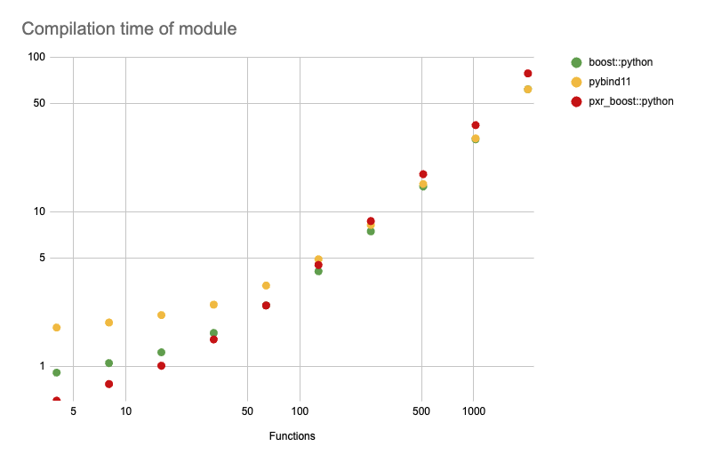

# Removing boost::python

Copyright &copy; 2024, Pixar Animation Studios, version 1.0

## Introduction

The community has been asking for the removal of all boost library
dependencies from OpenUSD for some time now. Boost is seen as an extremely
heavy-weight dependency by most users and is a frequent source of build issues
and support tickets on OpenUSD's GitHub repo. Within some subcommunities like
the games industry, anything that brings in a boost dependency is an immediate
non-starter, which hinders OpenUSD's adoption by those users.

Thanks to the recent "de-boostification" work, boost::python is the last
remaining use of boost in OpenUSD. Unfortunately, this library is used heavily
throughout the source tree, as it's responsible for all of OpenUSD's Python
bindings. A rough search of the codebase shows 573 files that include a
boost::python header.

We propose to replace OpenUSD's use of boost::python with a new Python binding
library, based on boost::python, that will be included with OpenUSD itself. This
achieves the goal of removing the last boost dependency with relatively low cost
and risk, requiring purely mechanical and automatable updates to the majority of
the source tree and centralizing the most intensive changes to a few locations.

## Details

### pxr_boost::python

A copy of boost::python would be embedded in OpenUSD under
`pxr/external/boost/python`. Tentatively named `pxr_boost::python`, this copy
would be modified heavily to create what would essentially be a modernized,
isolated version of boost::python:

- Its namespace would be changed from boost to pxr_boost to distinguish it from
  its upstream source. It would also be placed into the same namespace used
  throughout OpenUSD.

- Uses of other parts of boost like the MPL and preprocessor libraries would
  be removed. Initial experiments as well as the recent de-boostification work
  have demonstrated these can be replaced using only built-in language features
  from modern C++ standards.

- Various workarounds to support older (ancient, in some cases) compilers and
  C++ standards would be removed as needed.

The name `pxr_boost::python` was chosen to provide a breadcrumb for developers
(primarily those who work on OpenUSD itself) that indicates its upstream
parent and where to look for documentation or other support. However, it's
important to note that this library will not have any boost dependencies
once this work is completed.

Critically, pxr_boost::python would maintain exactly the same behavior as
boost::python.  It would also maintain almost exactly the same public API. The
few exceptions to this are places where other boost types are part of the API,
such as boost::noncopyable or boost::mpl::vector.

Because of this, replacing boost::python with pxr_boost::python throughout
the tree should be easily scriptable and incur minimal risk of breaking
anything or introducing accidental behavior changes.

As an added benefit, using pxr_boost::python could potentially decrease compile
times for Python bindings throughout the tree. Profiling has shown that in many
cases, the expensive part of compiling Python bindings today is processing the
headers for the other parts of boost that boost::python uses, like the MPL and
preprocessor libraries mentioned above. Replacing these with C++ language
features can reduce those costs significantly. Using an early and incomplete
prototype, the time to compile OpenUSD's Python bindings on an M1 Mac dropped by
~7% (from 7:14 to 6:46).

### Bring Your Own Boost

We *do not* intend to add the "Bring Your Own Boost" (BYOB) feature.

The BYOB feature would have allowed clients to choose to build OpenUSD against
either the embedded pxr_boost::python or an external boost::python. This was
aimed at giving clients an easy way to maintain current behavior if they relied
on OpenUSD's use of boost::python, e.g. for compatibility with other Python
bindings.

One of the drawbacks of this feature was that it would force pxr_boost::python
to maintain compatibility with boost::python. Although we do not have any
plans for changes that would break that compatibility, this feature would
have hindered us from doing so if we wanted to in the future.

Another drawback was that it would introduce fragmentation into the OpenUSD
ecosystem regarding Python bindings. This could make distributing extensions for
OpenUSD (e.g. additional schemas) via PyPI or other platforms more difficult and
confusing. Extension authors would most likely provide distributions that relied
on pxr_boost::python, leaving any clients using the BYOB feature unable to use
these distributions. This isn't necessarily a deal-breaker: one could argue
that BYOB is an advanced feature for customizing builds, and that "regular"
distributions should target standard configurations and not be on the hook
to support every possibility.

This feature was explicitly called out during earlier discussions and
presentation but there was no feedback from the community that the backwards
compatibility it was meant to provide was important or useful. We are open to
revisiting this based on feedback to this proposal.

## Risks

### Maintenance

Embedding a modified version of boost::python means OpenUSD would be taking on
the burden of keeping it up-to-date, e.g. when new version of Python are
released with breaking API changes.

There have been concerns expressed that Pixar would be unable or unwilling to
update pxr_boost::python to support versions of Python beyond what's specified
in the VFX Reference Platform, or on platforms beyond what's currently
supported. There have also been concerns expressed about patching security
issues should they arise.

Commit history on GitHub shows 5 changes to accommodate Python API changes over
the last 4 years, with the most recent change addressing an issue in Python
3.11. This suggests the maintenance burden is not significant, at least for this
category of changes. 

In theory, pxr_boost::python could piggy-back off maintenance and support from
the upstream boost::python project. Unfortunately, the boost::python project has
had very, very little activity over the last few years. However, it recently
accepted a patch to support a newer version of numpy. This is a faint sign of
life, but gives some (minimal) hope that boost::python itself may be updated in
the future, which would allow us to take those patches and apply them to
pxr_boost.

Another example: Python is pushing forward with the removal of the GIL. An
initial implementation of this is available with Python 3.13, and I believe
"no-GIL" mode is intended to be the default in the long term. If we ever needed
to update pxr_boost::python to accommodate that, doing so could be difficult
since we currently do not have broad expertise in the library's internal
implementation. 

However, note that updating pxr_boost::python *would not* be required for
OpenUSD to build against and work with a "no-GIL" Python. Python C API
extensions must opt in to "no-GIL" mode, otherwise Python will enable the
GIL at runtime. pxr_boost::python would need to be updated to take full
advantage of the increased parallelism that "no-GIL" mode provides, but
in the interim this would not block OpenUSD from being used with future
versions of Python.

### Support

OpenUSD would also be on the hook for answering support queries for build
issues related to pxr_boost::python. 

In practice, the USD team is already shouldering this burden. Clients that
build OpenUSD via the shipped build script (build_usd.py) already file issues
on the OpenUSD GitHub repo when the build fails due to an issue with boost,
which is typically because of boost::python.

### Client Impact

Because different Python binding libraries cannot interoperate, changing
OpenUSD's default binding library may impact third-party code that tries to
interoperate with OpenUSD via Python.

For example, suppose a client used boost::python to wrap C++ functions that
accepted OpenUSD types like UsdStage or UsdPrim. That currently "just works"
as long as their OpenUSD libraries are built against the same boost::python
shared library. Changing OpenUSD to use the embedded pxr_boost::python would
break this. 

Several users have reported having software built on top of OpenUSD that use
pybind11 to wrap functions that interoperate with boost::python-wrapped
OpenUSD types. This is done by using adapters that bridge boost::python and 
pybind11, e.g. take a boost::python-wrapped Usd.Stage and pass it to a
pybind11-wrapped C++ function. One popular example of this is the
[`pyboost11`](https://yyc.solvcon.net/en/latest/writing/2021/pyboost11/pyboost11.html)
adapter published on the web. Those adapters would have to be updated to work
against pxr_boost::python instead. This update ought to be straightforward
because of its similarity to boost::python.

Note that OpenUSD's bindings and bindings from other libraries can coexist
without problems as long as they're not expected to interoperate.

## Alternatives

### pybind11

We had previously proposed replacing boost::python with pybind11. pybind11
is a modern Python binding library that looks similar to boost::python,
but is *not* a drop-in replacement. It has significant differences in public
API and approach to more complex features like custom type conversions.

Using pybind11 would require rewriting all of the Python bindings and the
foundational utilities and infrastructure throughout the OpenUSD codebase.
Since Pixar's own codebase is built on top of OpenUSD, using pybind11
would also require Pixar to update all of that code at the same time,
which is an additional 3700+ files on top of the 570+ files in OpenUSD.

The scale of such an update along with the differences mentioned above
makes this approach extremely risky, for both OpenUSD and Pixar. It's
difficult to anticipate performance and implementation issues, and
the ground-up nature of the rewrite means that such issues could show
up late in the project. It also means this approach would take a 
significantly longer time to implement and deliver to the community.

According to benchmarks, pybind11 has slower runtime performance than
boost::python. The benchmark in the nanobind documentation 
[here](https://nanobind.readthedocs.io/en/latest/benchmark.html) shows
over 2x more overhead when calling into C++ when using pybind11.

Benchmarks also show modules using pybind11 are slower to compile than
those using boost::python. Although the numbers published with
the pybind11 documentation [here](https://pybind11.readthedocs.io/en/stable/benchmark.html)
show otherwise, re-running this benchmark shows boost::python-based
modules compiling faster than pybind11, and a prototype version of
pxr_boost::python even faster than that.

See [this page](compile_times/README.md) for more information about this
benchmark.

The primary benefit of using pybind11 is that OpenUSD would not take on the
maintenance and support cost for its own Python binding library. pybind11 is a
widely-used library and, unlike boost::python, has an active community and
maintainers.

Ultimately, the pxr_boost::python approach achieves the project goals
with significantly less risk and time, and with additional benefits than
converting to pybind11. This comes at the cost of potential maintenance
and support burden, which we do not believe to be significant. Note that
the pxr_boost::python approach does not preclude converting to pybind11
should the situation change in the future.

### nanobind

nanobind is another Python binding library written by the same author as
pybind11. It is not a feasible alternative because it does not contain
features present in both boost::python and pybind11 that are required by
OpenUSD.
