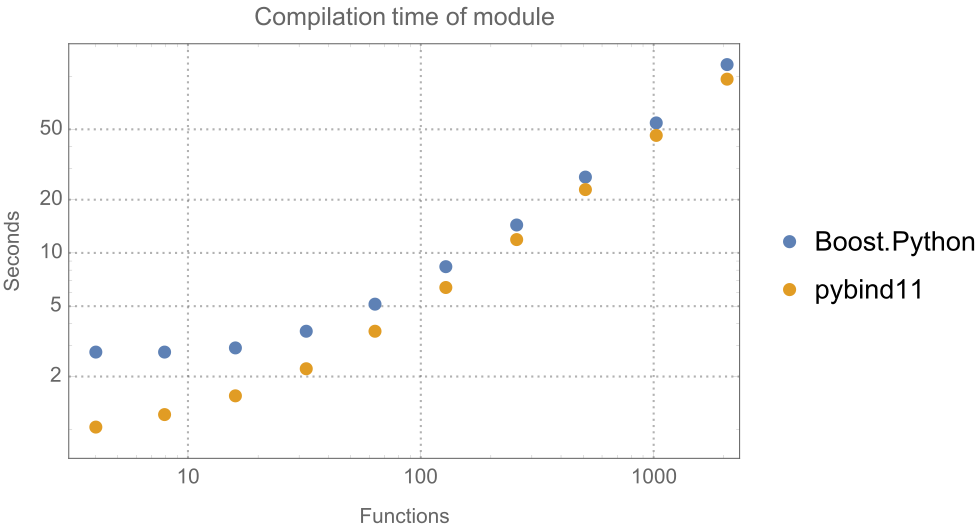
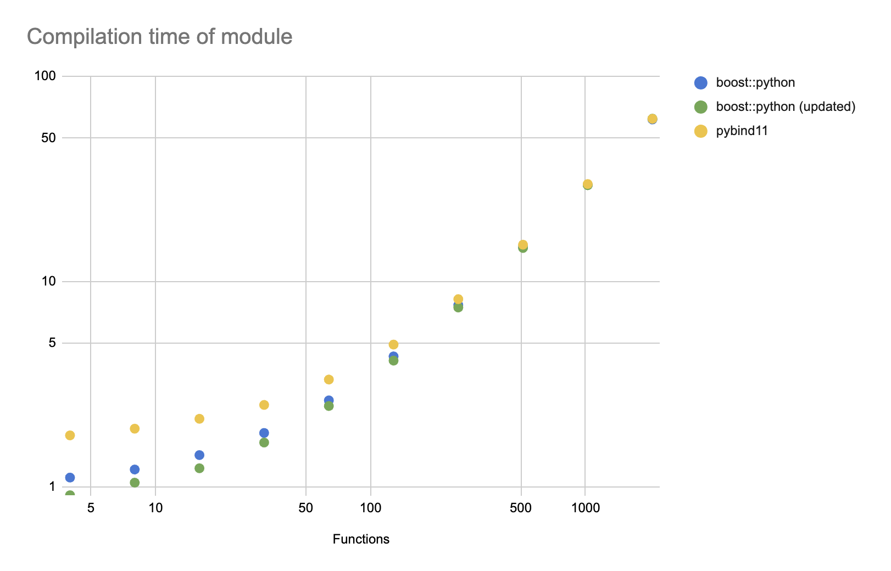

# Compile Time Benchmarks

Copyright &copy; 2024, Pixar Animation Studios, version 1.0

The pybind11 documentation contains a benchmark showing the compile
times for a module wrapping N C++ class, each with 4 member functions,
using both pybind11 and boost::python. A graph showing the results
is published with the documentation and reproduced here:

Note that this graph (and the ones below) are log-log plots.

These results were last updated in 2016 and generated using Apple LLVM 7.0.2
(clang-700). Re-running this benchmark using a modern compiler and machine
yielded significantly different results.

In addition, the module code used by the benchmark for boost::python was
not as minimal as it could be. It includes the header `boost/python.hpp`,
which includes all of boost::python's headers and functionality, instead
of just the headers necessary for the module. The pybind11 code is required
to include the `pybind11/pybind11.hpp` header because pybind11 intentionally
put the majority of its functionality in a single header. boost::python
is much more modular, allowing client code to pick and choose which headers
are needed. This means the benchmark isn't comparing apples-to-apples; it
is biased towards pybind11.

The results below show the benchmark results using the original boost::python
module code and an updated version correcting the above issue, and the
original pybind11 code. 

These tests were run on a Mac Mini M1 with 8 cores and 16 GB RAM, using
pybind11 2.13.1 and boost v1.82.0.

| Number of Functions | boost::python | boost::python (updated) | pybind11 |
|---------------------|---------------|--------------------------|----------|
|                   4 |         1.108 |                   0.9089 |    1.779 |
|                   8 |         1.213 |                    1.047 |    1.918 |
|                  16 |         1.426 |                     1.23 |    2.143 |
|                  32 |         1.828 |                    1.642 |    2.504 |
|                  64 |         2.635 |                    2.474 |    3.329 |
|                 128 |         4.317 |                    4.117 |    4.929 |
|                 256 |         7.685 |                    7.471 |    8.205 |
|                 512 |        14.731 |                   14.572 |   15.118 |
|                1024 |        29.583 |                   29.457 |   29.853 |
|                2048 |        61.615 |                    62.15 |   62.049 |
