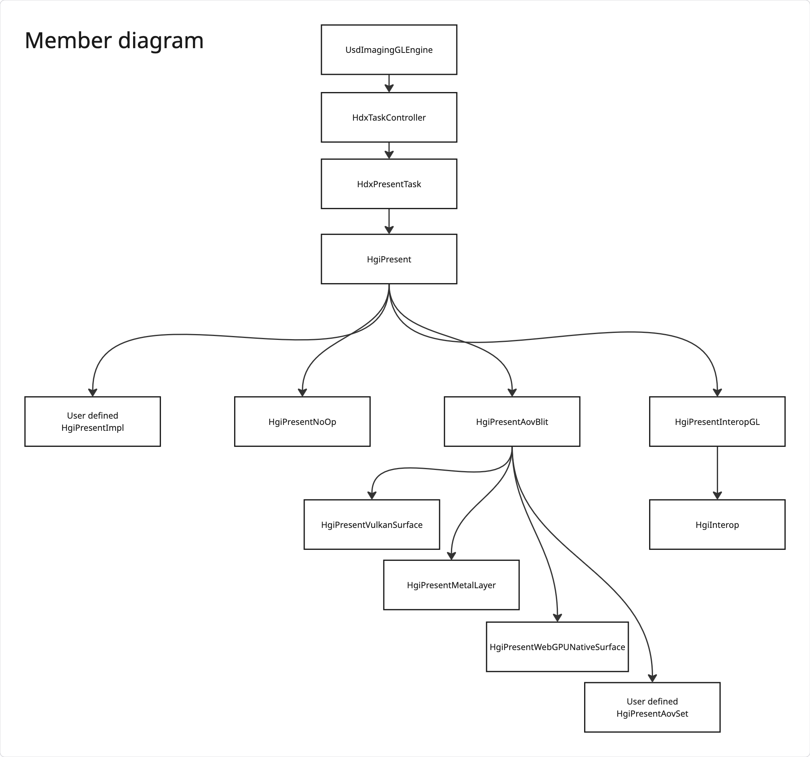
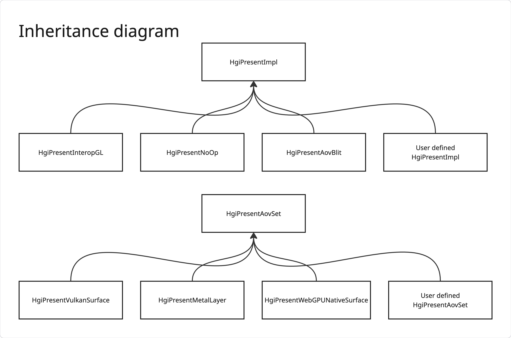
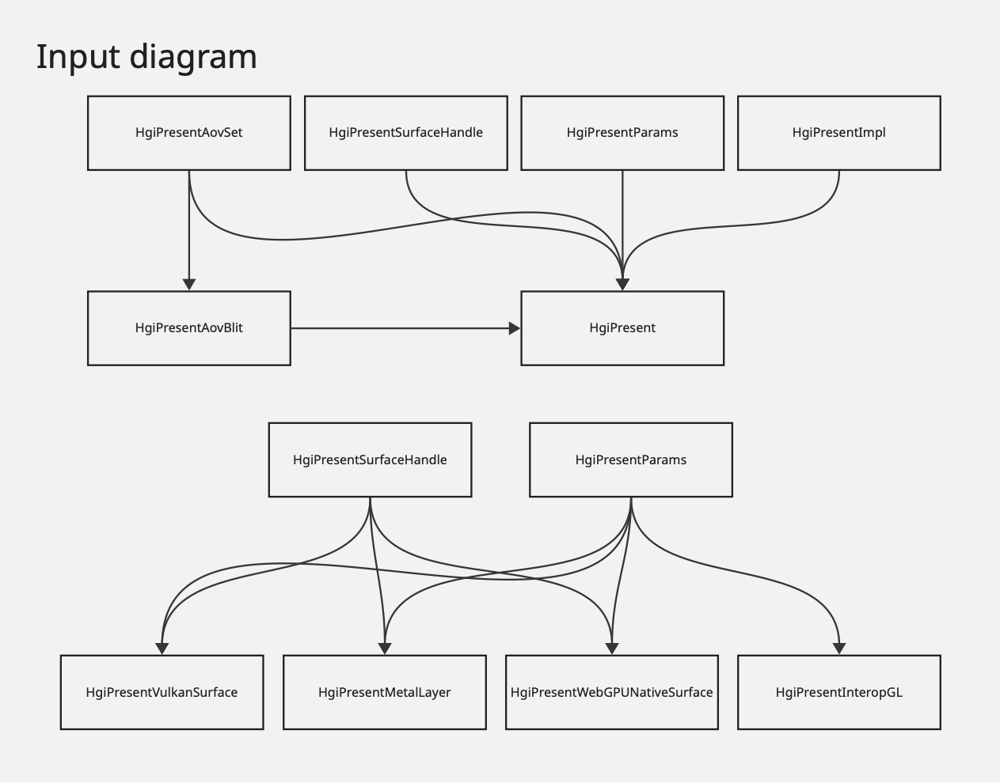

# HgiPresent

## Glossary

- Presentation: generally refers to the act of presenting a framebuffer to a display
  device. In this document we generalize the term to "presenting an AOV to a client
  application"
- AOV: "Arbitrary Output Variable." Image rendered by Hydra. These typically have
  a semantic interpretation such as: color, depth, primId, etc.
- Surface: destination for presentation. Usually backed by a pool of images in
  rotation, so that one can be written to while another is presented.
- Swap-chain: a specific type of surface image pool. A fixed number of images,
  all of the same format, are used in sequence for writing and presentation.
- Blit: fast copy of pixel data from a source image to a destination image, sometimes
  involving sub-regions and format conversions.

## Introduction

USD provides a high level rendering API for stages, known as `UsdImagingGLEngine`.
Rendering is split into a semi-customizable list of tasks managed by `HdxTaskController`.
The final task of this list is `HdxPresentTask`. The name might suggest that this
task can be used to present the final render output to an external surface, but
unfortunately this is currently not the case. Only presentation through HgiInterop
is supported, which makes it only useful for presenting to an OpenGL framebuffer.

In all other cases the application is responsible for implementing its own external
code for presenting the AOV at the end of the rendering. Depending on the target
API(s) and platform(s) this could represent a significant amount of code just to
do something useful with the output of `UsdImagingGLEngine`, and requires careful
handling for surface formats, color spaces, and knowledge about the Hgi framebuffer
coordinate system (if you don't want an upside down image). While this is acceptable
for applications with complex presentation requirements, which would rather implement
their own solution, this represents an adoption barrier for application that would
rather have most if not all rendering done by Hydra.

What should be a simple exercise of writing a basic USD viewer that renders to a
window quickly evolves into authoring hundreds of lines of code for swap-chain
initialization and blit; possibly multiple times if targeting multiple platforms
with differing API support.

Presentation is a complex topic that straddles the line between Storm and the client
application. It's impossible to offer a single implementation that will please
everyone, but we believe that through carefully thought out extension mechanisms,
USD can offer presentation solution**s** that span from fully customized to simple
"batteries included."

## Goals

- The present task should actually be useful. In its most basic form, it should
  behave as an AOV sink at the end of the render graph. It is a task which depends
  on all other tasks, and it encodes the last set of render commands before the
  image is output to a display or serialized.
- Minimize the amount of graphics related code needed to bring an AOV to a window
  in the simplest cases. If a client application wants to render to a window, they
  should have the option to only care about the window, and let Storm do the rest.
- Provide different levels of abstractions so a client application can use the one
  it needs for its presentation requirements. This could mean a fully custom presentation
  engine, a custom swap-chain, or just changing a few `UsdImagingGLEngine` parameters.

## Non-goals

- This will not replace the current OpenGL interop, but live alongside it. It will
  not provide any new OpenGL presentation solutions, as the current HgiInterop is
  considered sufficient.
- USD will not provide any presentation implementation except for generic ones 
  based on the low-level APIs which Hgi is built on. For example an implementation
  using the Vulkan WSI API would be provided as a simple solution for applications
  that don't have complex presentation requirements. But it would not support anything
  application or platform specific.
- This will not force applications to use the present task. The `disable` flag will
  remain, although we hope that by making it more useful, developers will want to
  use it.

## API outline

`HgiPresentImpl` is the main interface of the HgiPresent API. It implements the
actual presentation. A pointer to an implementation is typically used wrapped in
the `HgiPresent` value type, which mostly serves to hide the null pointer value.

`HgiPresentImpl` is the highest level of abstraction. It's a pure virtual type.
Applications can provide their own implementation.

`HgiPresentAovBlit` is the second level of abstraction. It implements `HgiPresentImpl`
and handles the blitting of images, but delegates the acquisition and presentation
of said image to an external `HgiPresentAovSet` implementation.

`HgiPresentVulkanSurface`, `HgiPresentMetalLayer`, `HgiPresentWebGPUNativeSurface`
and `HgiPresentInteropGL` are the lowest level of abstraction. They fully implement
`HgiPresentImpl`, but still offer some configuration parameters.

<details open>
<summary>Member diagram</summary>


</details>
<details>
<summary>Inheritance diagram</summary>


</details>
<details>
<summary>Input diagram</summary>


</details>

## Core API details

This API notation uses pseudo-code instead of C++ to provide more details.
Pointers are not nullable unless prefixed with `optional`.

### New `class HgiPresent`

Main entry point to HgiPresent, it's a move-only value type that uniquely
owns an instance of `HgiPresentImpl`. Its functions are all simple forwards to the
`HgiPresentImpl` interface and are not repeated here. It has no public constructors
and is instead initialized using a static factory method. Its main purpose is to
hide various initialization details and the `HgiPresentImpl` null pointer value.

`static func Create(unique HgiPresentImpl* impl) -> HgiPresent`

Create an `HgiPresent` instance from an existing `HgiPresentImpl` instance.
Ownership will be taken. This is used to create fully custom presentation solutions.

`static func Create(borrow Hgi* hgi, unique HgiPresentAovSet* aovSet) -> HgiPresent`

Create an `HgiPresent` instance from a new `HgiPresentAovBlit` instance, which will
take ownership of the given `HgiPresentAovSet` instance and use it as a source of
AOVs. This provides a level of abstraction over presentation blitting, but allows
control over the presentation target AOVs.

`static func Create(borrow Hgi* hgi, HgiPresentSurfaceHandle surface, HgiPresentSurfaceParams params) -> HgiPresent`

Create an `HgiPresent` instance from a new `HgiPresentAovBlit` instance, which will
be initialized with a new `HgiPresentAovSet` created using the given `HgiPresentSurfaceHandle`
and `HgiPresentSurfaceParams`. This is mostly a convenience function to simplify
generic surface presentation.

If the `Hgi` implementation doesn't support the `HgiPresentSurfaceHandle` type,
a coding error is generated, and the returned presentation behaves as if the
implementation was `HgiPresentNoOp`

### New `interface HgiPresentImpl`

This is the interface for actual implementations of presentation. It may be implemented
by an application to provide fully custom presentation.

`virtual constructor(borrow Hgi* hgi)`

For convenience, a presentation implementation always has access to the `Hgi` instance.

`virtual func IsFormatSupported(HgiFormat format) -> bool`

Check whether or not a given AOV format is supported for presentation. It's generally
expected that any 3 or 4 component format convertible to float is at least supported,
but the implementation is free to impose additional requirements.

`virtual func IsValid() -> optional bool`

Check if the current presentation is valid and functioning. This might return no
value if the presentation is in an indeterminate state. For example initialization
might not be complete until the first call to `Present()`.

`virtual func Present(HgiTextureHandle color, HgiTextureHandle depth) -> void`

Do the presentation. The depth AOV can be ignored if not required by the implementation.
Any operation is valid (even doing nothing), as long as the AOVs are free to be
reused once the function returns[^1].

### New `class HgiPresentNoOp implementing HgiPresentImpl`

This is a dummy presentation implementation used as a "null" fallback when nothing
else is available. It supports all formats, is always valid, and does nothing
for presentation.

### New `class HgiPresentAovBlit implementing HgiPresentImpl`

This implementation acquires an AOV from its `HgiPresentAovSet` instance, records
all the necessary blit commands to a new `HgiCmds` object, then passes this object
to `HgiPresentAovSet`. It will record any additional implementation-specific commands,
submit them, and present.

Format support and validity checks are based on the instance's internal state,
and the results of `IsFormatSupported()` and `IsValid()` called on the `HgiPresentAovSet`
instance.

`constructor(borrow Hgi* hgi, unique HgiPresentAovSet* aovSet)`

Create an `HgiPresentImpl` that will blit to the AOVs provided by `HgiPresentAovSet`.

### New `interface HgiPresentAovSet`

This functions much like a swap-chain, but with relaxed requirements. It allows
a user to acquire an image, modify it, then submit it for presentation. But unlike
a swap-chain, there is no requirement that an image be reused, that all images have
the same format, or that they be acquired in a specific order.

`virtual func IsFormatSupported(HgiFormat format) -> bool`

Same as `HgiPresentImpl.IsFormatSupported()`.

`virtual func IsValid() -> optional bool`

Same as `HgiPresentImpl.IsValid()`.

`virtual func Acquire() -> optional HgiTextureHandle`

May return the next AOV to use for presentation. This function is allowed to block
as long as necessary, and return nothing if no AOV is available (timeout or error).

Every non-null returning call to `Acquire()` must be followed by a matching
`SubmitAndPresent()` call.

`virtual func SubmitAndPresent(unique optional HgiCmds* commands) -> void`

Finishes the command buffer, submits it, and presents the last acquired AOV. This
function receives a command buffer which already records the necessary blit commands
to assign the AOV content for presentation. It may add additional commands.

This function should not wait. It can assume the AOV is free to be re-used once
the submitted command buffer has finished executing.

Every call to `SubmitAndPresent()` will be preceded by a matching non-null-returning
`Acquire()` call. If an error occurred in `HgiPresentAovSet`, the command buffer
argument will be null.

### New `struct HgiPresentSurfaceParams`

This is a common set of parameters for "surface based" AOV set implementations.
They allow an application to override the defaults of the generic presentation
implementations.

Some fields are optional. If not set by the application, they will be inferred by
`HdxTaskController` from other parameters, such as `HdAovDescriptor` and
`HdxColorCorrectionTaskParams`

`field optional preferredSurfaceFormat: HgiFormat = HgiFormatUNorm8Vec4`

The preferred surface format. Not all values are supported. If no exact match is
possible, then a "best fit" is performed. This fit will try to maximize coverage
of the original color range, minimize quantization losses, and minimize unused
storage bits.

`field optional srcColorSpace: TfToken = GfColorSpaceNames->LinearRec709`

Source texture color space. Supported values are system dependent. Only `LinearRec709`
and `SRGBRec709` are guaranteed.

`field optional surfaceColorSpace: TfToken = GfColorSpaceNames->SRGBRec709`

Must be the same as srcColorSpace, except when srcColorSpace is `LinearRec709`,
then it can be `SRGBRec709`, in which case the sRGB transfer function is applied
in hardware before presentation[^2].

`wantVsync: bool = true`

Try to enable display refresh rate synchronization (also known as v-sync).

### New `class HgiPresentVulkanSurface implementing HgiPresentAovSet`

An implementation of `HgiPresentAovSet` using a `VkSurfaceKHR`.

`constructor(borrow HgiVulkan* hgi, VkSurfaceKHR surface, HgiPresentSurfaceParams params)`

Create an `HgiPresentAovSet` which sources AOVs from a `VkSurfaceKHR` surface swap-chain.

### New `class HgiPresentMetalLayer implementing HgiPresentAovSet`

An implementation of `HgiPresentAovSet` using a `CAMetalLayer`.

`constructor(borrow HgiMetal* hgi, borrow CAMetalLayer* surface, HgiPresentSurfaceParams params)`

Create an `HgiPresentAovSet` which sources AOVs from a `CAMetalLayer` drawable pool.

### New `class HgiPresentWebGPUNativeSurface implementing HgiPresentAovSet`

An implementation of `HgiPresentAovSet` using a `wgpu::Surface`.

`constructor(borrow HgiMetal* hgi, wgpu::Surface surface, HgiPresentSurfaceParams params)`

Create an `HgiPresentAovSet` which sources AOVs from a `wgpu::Surface` surface
texture pool.

### New `union HgiPresentSurfaceHandle = VkSurfaceKHR | borrow CAMetalLayer* | wgpu::Surface`

Represents all supported handle types. The actual available types in the union[^3]
will depend on the USD features enabled at build time.

### New `class HgiPresentInteropGL implementing HgiPresentImpl`

An `HgiPresentImpl` which uses the existing `HgiInterop` library to present to an
external OpenGL framebuffer.

`constructor(borrow Hgi* hgi, uint32_t fboName, HgiInteropCompositionParams composition)`

Create an `HgiPresentImpl` which composes the AOV into the given OpenGL framebuffer.
If `fboName` is `0`, then this uses the currently bound framebuffer.

## Other API details

HgiPresent requires changes to existing APIs.

### New `struct HgiInteropCompositionParams`

HgiInterop supports composition, but the parameters are hardcoded and different
backends use different values. As part of HgiPresent, we expose the parameters
and make them uniform across all backends. This makes them reusable for other
`HgiPresentImpl` implementations.

We also change the default behavior: composition is now disabled when using the
default parameter values. Composition is opt-in: the new default is to overwrite.
This follows the principle of the "least surprising behavior".

`field colorSrcBlendFactor: HgiBlendFactor = HgiBlendFactorOne`  
`field colorDstBlendFactor: HgiBlendFactor = HgiBlendFactorZero`  
`field colorBlendOp: HgiBlendOp = HgiBlendOpAdd`  
`field alphaSrcBlendFactor: HgiBlendFactor = HgiBlendFactorOne`  
`field alphaDstBlendFactor: HgiBlendFactor = HgiBlendFactorZero`  
`field alphaBlendOp: HgiBlendOp = HgiBlendOpAdd`

Color and alpha blending options, if the destination supports it.

`field depthFunc: HgiCompareFunction = HgiCompareFunctionAlways`

If a depth buffer is available in the destination, only copy pixels that pass the
depth comparison.

`field dstRegion: GfRect2i = default(GfRect2i)`

The region of the destination framebuffer to copy into.

### Modified `interface HgiBlitCmds`

`virtual func BlitTexture(HgiTextureHandle src, GfRect2i srcRegion, HgiTextureHandle dst, GfRect2i dstRegion, HgiSamplerFilter filter) -> void`

To implement `HgiPresentAovBlit` we need a more flexible kind of texture-to-texture
copy. Taking inspiration from `vkCmdBlitImage`, this behaves as if:
```
srcImage = 2D read-only image `src`
dstImage = 2D write-only image `dst`
srcSampler = sample with `ClampToEdge` clamping, `filter` filtering

sampleImage(image, sampler, coord) = function sampling `image` with `sampler`
    at normalized coordinates `coord`.
writeImage(image, coord, value) = function writing `value` at integer coordinates
    `coord` to `image`

threadCount: vec2u = global number of threads on X and Y
threadCoord: vec2u = global X and Y thread coordinates
assert that threadCount == dstRegion.size

pixelCoord: vec2f = threadCoord + 0.5
coordScale: vec2f = srcRegion.size / dstRegion.size
inCoord: vec2f = (pixelCoord * coordScale + srcRegion.position) / srcImage.size
outCoord: vec2u  = threadCoord + dstRegion.position

color: vec4f = sampleImage(srcImage, srcSampler, inCoord)
writeImage(dstImage, outCoord, color)
```

Notably, this supports:
- Rescaling a source region into a destination region, using the given filter type.
- Flipping a region either horizontally or vertically by using negative sizes.
- Converting a float convertible format to a different float convertible format.
  - Includes support for conversion to and from sRGB formats.

This may be implemented using either (in order of preference):
- A native blit command already supporting the described behavior.
- A compute shader dispatch.
- A render pass.

### Modified `class HdxTaskController`

`func SetEnablePresentation(bool enabled) -> void`  
`func SetPresentationOutput(TfToken api, VtValue framebuffer) -> void`

We deprecate these two functions in favour of the following.

`func DisablePresentation() -> void`

Configures the present task to behave as if the presentation was `HgiPresentNoOp`.

`func EnablePresentation(forward HgiPresent presentation) -> void`

Configures the present task to use the given presentation.

### Modified `class UsdImagingGLEngine`

The changes are the same as in `HdxTaskController`.

## Example presentation use cases

### Simple USD view app with a native window

- Create the window on the application side using the platform API.
- Use one of `HgiPresentVulkanSurface`, `HgiPresentMetalLayer` or
  `HgiPresentWebGPUNativeSurface`, depending on the platform.

### Write AOVs to disk

- Implement `HgiPresentImpl`.
  - Use `HgiBlitCmds.CopyTextureGpuToCpu()` to obtain a CPU copy of the AOV.
  - Use `HioImage` to write the buffer as an image file on disk.

### Interop to a DX11 texture to continue rendering in a proprietary pipeline

- Use `HgiPresentAovBlit`.
- Implement `HgiPresentAovSet`.
  - Check that `HgiVulkan` is being used.
  - Create an internal shared Vulkan/DX11 image using external memory extensions.
  - Return the shared image in `Acquire()`.
  - Receive the blit command buffer in `SubmitAndPresent()`.
  - Submit the commands using DX11 synchronization extensions.
  - Copy the shared Vulkan/DX11 image to the external DX11 image.

## Risks

This proposal almost exclusively introduces new functionality, and makes no changes
to existing one, except for deprecating a couple of functions. It does not pose
any significant risks.

## Alternate solutions

Instead of improving support for presentation, we could remove all references to
it and shift the concern entirely to the application:
- Remove `HdxPresentTask`.
- Move HgiInterop usage outside of `UsdImagingGLEngine` and `HdxTaskController`.
  - Dependencies to `HgiInterop` should only exist at the application level.

For reasons explained in the [introduction section](#introduction), we decided it
would instead be more helpful to extend the features of the `HdxPresentTask`.
After all the images need to go somewhere, so let's make it easier for the developers.
We believe USD imaging should be usable without graphics expertise.

## Open questions

- Presentation may require that very specific extensions be available and enabled
  on the rendering API. For example, rendering to a `VkSurfaceKHR` requires a
  different extension for each window API, and DX11 interop requires three different
  extensions for external memory and API synchronization. *How can these extensions
  be communicated to the Hgi instantiation code?*
- Vulkan device selection checks for WSI presentation support. This check makes
  potentially erroneous assumptions and should be removed. *Is this check actually
  required? If so how can we replace it?*
- Since presentation can be implemented externally, *should it use a plugin system?*

[^1]: This introduces an implicit requirement for host-side synchronization.
While far from desirable, it's necessary for correct rendering given the lack of
support for explicit synchronization in Storm. This should be revisited once such
a feature is added. We would expect this function to return device-side and
host-side synchronization primitives (a semaphore and fence in Vulkan terms).

[^2]: Surfaces generally support a format with automatic conversion from linear to
non-linear sRGB, for example in Vulkan: `VK_FORMAT_R8G8B8_SRGB`. This parameter
could also be relaxed to allow more kinds of implicit conversions in the presentation
implementation. `GfColorSpace` matrices and coefficients could be used in a blit
shader to support other conversions.

[^3]: The term "union" here is used as a synonym for "sum type". In C++ this would
translate to a `std::variant`.
