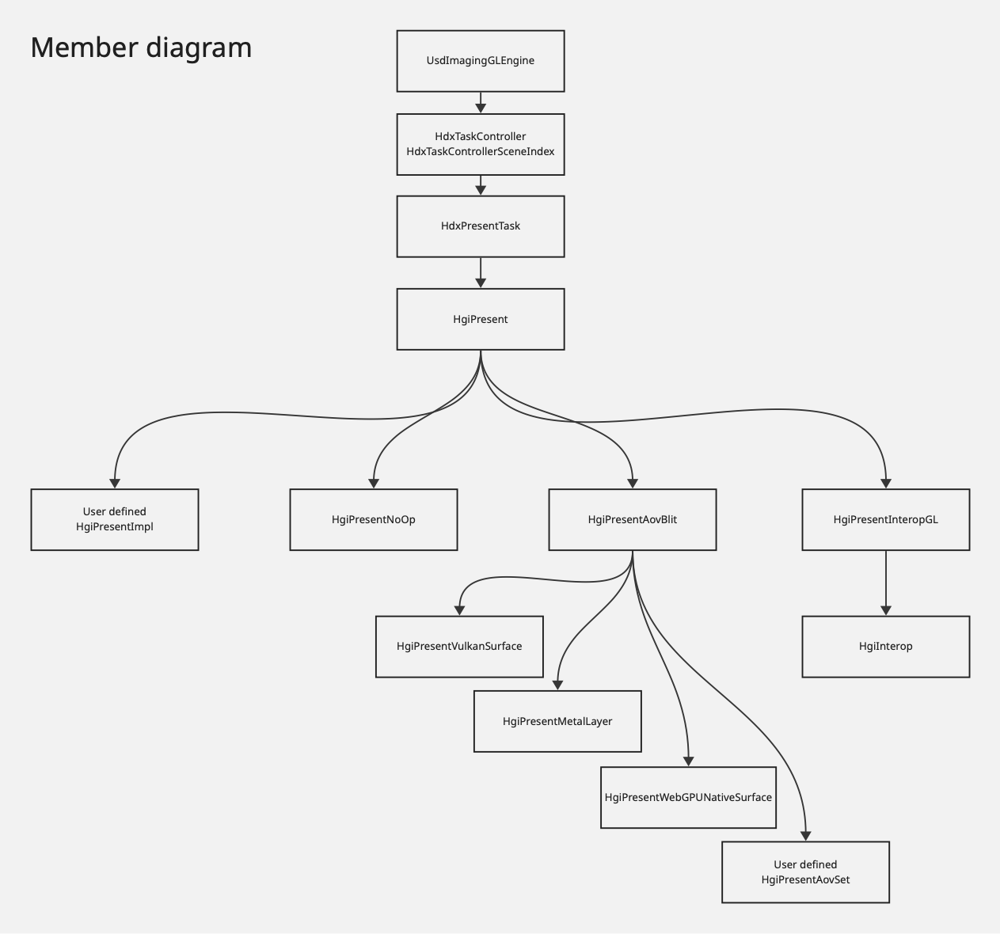

# HgiPresent

## Glossary

- Presentation: generally refers to the act of presenting a framebuffer to a display
  device. In this document we generalize the term to "presenting an AOV to a client
  application"
- AOV: "Arbitrary Output Variable." Image rendered by Hydra. These typically have
  a semantic interpretation such as: color, depth, primId, etc.
- Surface: destination for presentation. Usually backed by a pool of images in
  rotation, so that one can be written to while another is presented.
- Swap-chain: a specific type of surface image pool. A fixed number of images,
  all of the same format, are used in sequence for writing and presentation.
- Blit: fast copy of pixel data from a source image to a destination image, sometimes
  involving sub-regions and format conversions.

## Introduction

USD provides a high level rendering API for stages, known as `UsdImagingGLEngine`.
Rendering is split into a semi-customizable list of tasks managed by `HdxTaskController`/
`HdxTaskControllerSceneIndex`.
The final task of this list is `HdxPresentTask`. The name might suggest that this
task can be used to present the final render output to an external surface, but
unfortunately this is currently not the case. Only presentation through HgiInterop
is supported, which makes it only useful for presenting to an OpenGL framebuffer.

In all other cases the application is responsible for implementing its own external
code for presenting the AOV at the end of the rendering. Depending on the target
API(s) and platform(s) this could represent a significant amount of code just to
do something useful with the output of `UsdImagingGLEngine`, and requires careful
handling for surface formats, color spaces, and knowledge about the Hgi framebuffer
coordinate system (if you don't want an upside down image). While this is acceptable
for applications with complex presentation requirements, which would rather implement
their own solution, this represents an adoption barrier for application that would
rather have most if not all rendering done by Hydra.

What should be a simple exercise of writing a basic USD viewer that renders to a
window quickly evolves into authoring hundreds of lines of code for swap-chain
initialization and blit; possibly multiple times if targeting multiple platforms
with differing API support.

Presentation is a complex topic that straddles the line between Storm and the client
application. It's impossible to offer a single implementation that will please
everyone, but we believe that through carefully thought out extension mechanisms,
USD can offer presentation solutions that span from fully customized to simple
"batteries included."

## Goals

- The present task should actually be useful. In its most basic form, it should
  behave as an AOV sink at the end of the render graph. It is a task which depends
  on all other tasks, and it encodes the last set of render commands before the
  image is output to a display or serialized.
- Minimize the amount of graphics related code needed to bring an AOV to a window
  in the simplest cases. If a client application wants to render to a window, they
  should have the option to only care about the window, and let Storm do the rest.
- Provide different levels of abstractions so a client application can use the one
  it needs for its presentation requirements. This could mean a fully custom presentation
  engine, a custom swap-chain, or just changing a few `UsdImagingGLEngine` parameters.

## Non-goals

- This will not replace the current OpenGL interop, but live alongside it. It will
  not provide any new OpenGL presentation solutions, as the current HgiInterop is
  considered sufficient.
- USD will not provide any presentation implementation except for generic ones 
  based on the low-level APIs which Hgi is built on. For example an implementation
  using the Vulkan WSI API would be provided as a simple solution for applications
  that don't have complex presentation requirements. But it would not support anything
  application or platform specific.
- This will not force applications to use the present task. The `disable` flag will
  remain, although we hope that by making it more useful, developers will want to
  use it.

## API outline

`HgiPresentImpl` is the main interface of the HgiPresent API. It implements the
actual presentation. A pointer to an implementation is typically wrapped in the
`HgiPresent` value type, which mostly serves to hide the null pointer value.

`HgiPresentImpl` is the highest level of abstraction. It's a pure virtual type.
Applications can provide their own implementation.

`HgiPresentAovBlit` is the second level of abstraction. It implements `HgiPresentImpl`
and handles the blitting of images, but delegates the acquisition and presentation
of said image to an external `HgiPresentAovSet` implementation.

`HgiPresentVulkanSurface`, `HgiPresentMetalLayer`, `HgiPresentWebGPUNativeSurface`
and `HgiPresentInteropGL` are the lowest level of abstraction. They fully implement
`HgiPresentImpl`, but still offer some configuration parameters.

<details open>
<summary>Member diagram</summary>


</details>
<details>
<summary>Inheritance diagram</summary>


</details>
<details>
<summary>Input diagram</summary>


</details>

## Core API details

This API notation uses pseudo-code instead of C++ to provide more details.
Pointers are not nullable unless indicated otherwise.

### New `class HgiPresent`

Main entry point to HgiPresent, it's a move-only value type that uniquely
owns an instance of `HgiPresentImpl`. Its functions are all simple forwards to the
`HgiPresentImpl` interface and are not repeated here. It has no public constructors
and is instead initialized using a static factory method. Its main purpose is to
hide various initialization details and the `HgiPresentImpl` null pointer value.

`func const GetImplementation<type Impl extends HgiPresentImpl = HgiPresentImpl>() -> Impl`

Get the actual presentation implementation, optionally downcasting it to the given
`HgiPresentImpl` subclass. This returns null if the implementation is not actually
of the given type.

`func static Create(unique HgiPresentImpl* impl) -> HgiPresent`

Create an `HgiPresent` instance from an existing `HgiPresentImpl` instance.
Ownership will be taken. This is used to create fully custom presentation solutions.

`func static CreateNoOp() -> HgiPresent`

Create a no-op presentation. Used as a "null" fallback when nothing else is available.

`func static CreateAovBlit(borrow Hgi* hgi, unique HgiPresentAovSet* aovSet) -> HgiPresent`

Create an `HgiPresent` instance from a new `HgiPresentAovBlit` instance, which will
take ownership of the given `HgiPresentAovSet` instance and use it as a source of
AOVs. This provides a level of abstraction over presentation blitting, but allows
control over the presentation target AOVs.

`func static CreateAovBlit(borrow Hgi* hgi, HgiPresentSurfaceHandle surface) -> HgiPresent`

Create an `HgiPresent` instance from a new `HgiPresentAovBlit` instance, which will
be initialized with a new `HgiPresentAovSet` created using the given `HgiPresentSurfaceHandle`.
This is mostly a convenience function to simplify generic surface presentation.

If the `Hgi` implementation doesn't support the `HgiPresentSurfaceHandle` type,
a coding error is generated, and the returned presentation behaves as if the
implementation was `HgiPresentNoOp`

`func static CreateGLInterop(borrow Hgi* hgi, uint32_t fboName) -> HgiPresent`

Create an `HgiPresent` instance from a new `HgiPresentInteropGL` instance, which
will be initialized using the given OpenGL framebuffer object name.

### New `func HgiPresentSurfaceToAovSet(borrow Hgi* hgi, HgiPresentSurfaceHandle surface) -> unique nullable HgiPresentAovSet*`

Create a new `HgiPresentAovSet` instance using the given `HgiPresentSurfaceHandle`.
If the `Hgi` implementation doesn't support the `HgiPresentSurfaceHandle` type,
a coding error is generated, and null is returned.

This function is internally called by `func static CreateAovBlit(borrow Hgi* hgi, HgiPresentSurfaceHandle surface) -> HgiPresent`.
It's also exposed in the API for applications that wish to wrap an existing `HgiPresentAovSet`.

### New `interface HgiPresentImpl`

This is the interface for actual implementations of presentation. It may be implemented
by an application to provide fully custom presentation.

`constructor(borrow Hgi* hgi)`

For convenience, a presentation implementation always has access to the `Hgi` instance.

`func virtual const IsColorFormatSupported(HgiFormat format) -> bool`

Check whether or not a given AOV format is supported for presentation. It's generally
expected that any 3 or 4 component format convertible to float is at least supported,
but the implementation is free to impose additional requirements.

`func virtual const IsDepthFormatSupported(HgiFormat format) -> bool`

Check whether or not a given AOV depth format is supported for presentation. Depth
presentation is an optional feature: this may return false for all formats.

`func virtual const IsValid() -> optional bool`

Check if the current presentation is valid and functioning. This might return no
value if the presentation is in an indeterminate state. For example initialization
might not be complete until the first call to `Present()`.

`func virtual UpdateParams(HgiPresentParams params) -> void`

Set the presentation parameters for the subsequent `Acquire()` calls.

`func virtual Present(HgiTextureHandle color, HgiTextureHandle depth) -> void`

Do the presentation. The depth AOV can be ignored if not required by the implementation.
Any operation is valid (even doing nothing), as long as the AOVs are free to be
reused once the function returns[^1].

`func virtual Destroy() -> void`

Immediately destroy the presentation implementation. Presentation resources are
released, and all future function calls on this object become invalid.

### New `struct HgiPresentParams`

A generic set of parameters for presentation. Which parameters are used depends
on the presentation implementation.

`field HgiPresentSurfaceParams surface = default`

Parameter for configuring a presentation surface. See
[`HgiPresentSurfaceParams`](#new-struct-hgipresentsurfaceparams).

`field HgiPresentCompositionParams composition = default`

Parameter for compositing into an existing frambuffer. See
[`HgiPresentCompositionParams`](#new-struct-hgipresentcompositionparams-extends-hgiinteropcompositionparams).

### New `struct HgiPresentSurfaceParams`

This is a common set of parameters for "surface based" presentation implementations.
They allow an application to provide "opinions" to the presentation implementation.

`field TfToken srcColorSpace = GfColorSpaceNames->LinearRec709`

Source texture color space. Supported values are system dependent. Only `LinearRec709`
and `SRGBRec709` are guaranteed.

`field bool extendedColor = false`

If true, then source may contain colors outside the primaries of its color space,
and we wish to preserve these in the presented output. Otherwise the out-of-bounds
colors will be clamped to the space.

`field HgiFormat preferredDstFormat = HgiFormatUNorm8Vec4`

The preferred destination format. Not all values are supported. If no exact match
is possible, then a "best fit" is performed. This fit will try to maximize coverage
of the original color range, minimize quantization losses, and minimize unused
storage bits.

`field TfToken preferredDstColorSpace = GfColorSpaceNames->SRGBRec709`

Must be the same as srcColorSpace, except when srcColorSpace is `LinearRec709` and
extendedColor is `false`, then it can be `SRGBRec709`, in which case the sRGB transfer
function is applied in hardware before presentation[^2].

`field bool wantVsync = true`

Try to enable display refresh rate synchronization (also known as v-sync).

### New `struct HgiPresentCompositionParams extends HgiInteropCompositionParams`

The composition parameters will simply reuse the structure defined by the `HgiInterop`
library (see [`HgiInteropCompositionParams`](#new-struct-hgiinteropcompositionparams)).
There are no additional fields, but some could be added in the future if required.

### New `class HgiPresentNoOp implementing HgiPresentImpl`

This is a dummy presentation implementation used as a "null" fallback when nothing
else is available. It supports all formats, is always valid, and does nothing
for presentation.

### New `class HgiPresentAovBlit implementing HgiPresentImpl`

This implementation acquires an AOV from its `HgiPresentAovSet` instance, records
all the necessary blit commands to a new `HgiCmds` object, then passes this object
to `HgiPresentAovSet`. It will record any additional implementation-specific commands,
submit them, and present.

Format support and validity checks are based on the instance's internal state,
and the results of `IsColorFormatSupported()`, `IsDepthFormatSupported` and `IsValid()`
called on the `HgiPresentAovSet` instance.

`constructor(borrow Hgi* hgi, unique HgiPresentAovSet* aovSet)`

Create an `HgiPresentImpl` that will blit to the AOVs provided by `HgiPresentAovSet`.

### New `interface HgiPresentAovSet`

This functions much like a swap-chain, but with relaxed requirements. It allows
a user to acquire an image, modify it, then submit it for presentation. But unlike
a swap-chain, there is no requirement that an image be reused, that all images have
the same format, or that they be acquired in a specific order.

`func virtual const IsColorFormatSupported(HgiFormat format) -> bool`

Same as `HgiPresentImpl::IsColorFormatSupported(HgiFormat)`.

`func virtual const IsDepthFormatSupported(HgiFormat format) -> bool`

Same as `HgiPresentImpl::IsDepthFormatSupported(HgiFormat)`.

`func virtual const IsValid() -> optional bool`

Same as `HgiPresentImpl::IsValid()`.

`func virtual UpdateParams(HgiPresentParams params) -> void`

Same as `HgiPresentImpl::UpdateParams(HgiPresentParams)`.

`func virtual const GetRgbaSwizzle() -> HgiPresentAovSet::RgbaSwizzle`

Hgi assumes that the color component order is always RGBA. This can't hold for presentation
as some surfaces only support BGRA (or ABGR). Normally this is not a problem when
using the surface in `HgiBlitCmds::BlitTexture()` or as a render attachment, since
it will do the component reordering, but when using the `HgiBlitCmds::Copy*()` functions
this is not the case. This function can be called to get the necessary swizzle to
convert from the underlying presentation surface component order to RGBA.

`func virtual Acquire(borrow HgiCmds* commands, uint32_t width, uint32_t height) -> optional HgiTextureHandle`

May return the next AOV to use for presentation. This function is allowed to block
as long as necessary, and return nothing if no AOV is available (timeout or error).
The function may add commands needed to acquire the AOV of the desired width and
height to the command buffer. The resulting AOV dimensions might be different due
to implementation limitations.

The implementation may impose usage limits for the texture. At least the following
usages must be supported:
- Color target
- `BlitTexture()` destination

Every non-null returning call to `Acquire()` must be followed by a matching
`SubmitAndPresent()` call.

`func virtual SubmitAndPresent(unique HgiCmds* commands) -> void`

Finishes the command buffer, submits it, and presents the last acquired
AOV. This function receives a command buffer which already records the
necessary commands to assign the AOV content for presentation. It may
add additional commands needed to finish presentation.

Due to Hgi synchronization limitations, it's not possible for an
implementation to ensure the presentation command buffer is done
executing before drawing for the next frame has started, which might
cause problems if dependencies of the presentation command buffer are
reused for the next frame. An implementation is allowed to wait until
the command buffer is done executing before returning to avoid such
issues.

An implementation can assume the AOV is free to be re-used once the
submitted command buffer has finished executing.

Every call to `SubmitAndPresent()` will be preceded by a matching non-null-returning
`Acquire()` call.

`field static const HgiPresentAovSet::RgbaSwizzle identityRgbaSwizzle = {0, 1, 2, 3}`

 The identity RGBA swizzle.

#### New `struct HgiPresentAovSet::RgbaSwizzle`

Indices for swizzling a color from any order to RGBA.

`bitfield uint8_t r : 2`

The index of the R component.

`bitfield uint8_t g : 2`

The index of the G component.

`bitfield uint8_t b : 2`

The index of the B component.

`bitfield uint8_t a : 2`

The index of the A component.

`func const operator[](size_t i) -> uint8_t`

Query the component index by its RGBA index: `R = 0`, `G = 1`, `B = 2`, `A = 3`.

### New `class HgiPresentVulkanSurface implementing HgiPresentAovSet`

An implementation of `HgiPresentAovSet` using a `VkSurfaceKHR`.

`constructor(borrow HgiVulkan* hgi, VkSurfaceKHR surface)`

Create an `HgiPresentAovSet` which sources AOVs from a `VkSurfaceKHR` surface swap-chain.

### New `class HgiPresentMetalLayer implementing HgiPresentAovSet`

An implementation of `HgiPresentAovSet` using a `CAMetalLayer`.

`constructor(borrow HgiMetal* hgi, borrow const CAMetalLayer* surface)`

Create an `HgiPresentAovSet` which sources AOVs from a `CAMetalLayer` drawable pool.

### New `func HgiPresentDynamicCastHgiMetal(borrow Hgi* hgi) -> HgiMetal*`

The `HgiMetal` type definition requires Objective-C++. this function can be used
to perform `dynamic_cast<HgiMetal*>` from regular C++.

### New `class HgiPresentWebGPUNativeSurface implementing HgiPresentAovSet`

An implementation of `HgiPresentAovSet` using a `wgpu::Surface`.

`constructor(borrow HgiWebGPU* hgi, wgpu::Surface surface)`

Create an `HgiPresentAovSet` which sources AOVs from a `wgpu::Surface` surface
texture pool.

### New `union HgiPresentSurfaceHandle = VkSurfaceKHR | borrow const CAMetalLayer* | wgpu::Surface`

Represents all supported handle types. The actual available types in the union[^3]
will depend on the USD features enabled at build time.

### New `class HgiPresentInteropGL implementing HgiPresentImpl`

An `HgiPresentImpl` which uses the existing `HgiInterop` library to present to an
external OpenGL framebuffer.

`constructor(borrow Hgi* hgi, uint32_t fboName)`

Create an `HgiPresentImpl` which composes the AOV into the given OpenGL framebuffer.
If `fboName` is `0`, then this uses the currently bound framebuffer.

## Other API details

HgiPresent requires changes to existing APIs.

### New `struct HgiInteropCompositionParams`

HgiInterop supports composition, but the parameters are hardcoded and different
backends use different values. As part of HgiPresent, we expose the parameters
and make them uniform across all backends. This makes them reusable for other
`HgiPresentImpl` implementations.

We also change the default behavior: composition is opt-in. The new default is
to overwrite. This follows the principle of the "least surprising behavior".

`field HgiBlendFactor colorSrcBlendFactor = HgiBlendFactorOne`  
`field HgiBlendFactor colorDstBlendFactor = HgiBlendFactorZero`  
`field HgiBlendOp colorBlendOp = HgiBlendOpAdd`  
`field HgiBlendFactor alphaSrcBlendFactor = HgiBlendFactorOne`  
`field HgiBlendFactor alphaDstBlendFactor = HgiBlendFactorZero`  
`field HgiBlendOp alphaBlendOp = HgiBlendOpAdd`

Color and alpha blending options, if the destination supports it.

`field HgiCompareFunction depthFunc = HgiCompareFunctionAlways`

If a depth buffer is available in the destination, only copy pixels that pass the
depth comparison.

`field GfRect2i dstRegion = default`

The region of the destination framebuffer to copy into.

### Modified `interface HgiBlitCmds`

`func virtual BlitTexture(HgiTextureHandle src, GfRect2i srcRegion, HgiTextureHandle dst, GfRect2i dstRegion, HgiSamplerFilter filter) -> void`

To implement `HgiPresentAovBlit` we need a more flexible kind of texture-to-texture
copy. Taking inspiration from `vkCmdBlitImage`, this behaves as if:
```
srcTexture = 2D sample-only texture `src`
srcRegion = source rectangle coordinates
dstTexture = 2D write-only texture `dst`
dstRegion = destination rectangle coordinates
srcSampler = sample with `ClampToEdge` clamping, `filter` filtering

sampleTexture(texture, sampler, coord) = function sampling `texture` with `sampler`
    at normalized coordinates `coord`.
writeTexture(texture, coord, value) = function writing `value` at integer coordinates
    `coord` to `texture`

vec2u threadCount = global number of threads on X and Y
vec2u threadCoord = global X and Y thread coordinates
assert that threadCount == dstRegion.size

vec2f pixelCoord = threadCoord + 0.5
vec2f coordScale = srcRegion.size / dstRegion.size
vec2f srcCoord = (pixelCoord * coordScale + srcRegion.position) / srcTexture.size
vec2u dstCoord  = threadCoord + dstRegion.position

vec4f value = sampleTexture(srcTexture, srcSampler, srcCoord)
writeTexture(dstTexture, dstCoord, value)
```

Notably, this supports:
- Rescaling a source region into a destination region, using the given filter type.
- Flipping a region either horizontally or vertically by using negative sizes
  (`maxX < minX` and/or `maxY < minY`).
- Converting a float convertible format to a different float convertible format,
  including support for conversion to and from sRGB formats.

This may be implemented using either (in order of preference):
- A native blit command already supporting the described behavior.
- A compute shader dispatch.
- A render pass.

### Modified `class HdxTaskController` and `class HdxTaskControllerSceneIndex`

`func SetEnablePresentation(bool enabled) -> void`  
`func SetPresentationOutput(TfToken api, VtValue framebuffer) -> void`

We deprecate these two functions in favour of the following.

`func DisablePresentation() -> void`

Configures the present task to behave as if the presentation was `HgiPresentNoOp`.

`func EnablePresentation(forward HgiPresent presentation) -> void`

Configures the present task to use the given presentation.

`func EnableVsync(bool vsync) -> void`

Enable or disable display refresh rate synchronization for presentation, if supported.

### Modified `class UsdImagingGLEngine`

The changes are the same as in `HdxTaskController`/`HdxTaskControllerSceneIndex`.

### Other Hgi-specific modifications

To allow integration with low-level presentation APIs, some Hgi-specific implementation
changes need to be made. They are explained here in rough detail.

#### Modified `class HgiMetal`, `class HgiVulkan`, `class HgiWebGPU`

`func CreateTextureFromExisting(<implementation specific>) -> HgiTextureHandle`

Swap-chains images need to be wrapped into the implementation-specific `HgiTexture`
subclass before they can be returned from an `Acquire()` call. Arguments will necessarily
include an API specific image handle, and possibly other information needed to
populate `HgiTextureDesc`.

#### New `interface HgiVulkanCmds extends HgiCmds`

Common interface for all Vuklan `HgiCmds` implementation to expose the underlying
command buffer.

`func virtual GetCommandBuffer() -> borrow HgiVulkanCommandBuffer*`

Returns the command buffer used inside this `HgiCmds` subclass.

#### Modified `class HgiVulkanTexture`

`func DiscardContents(borrow HgiVulkanCommandBuffer* cmdBuffer) -> void`

Transition the image from `VK_IMAGE_LAYOUT_UNDEFINED` to its default layout (as
given by `GetDefaultImageLayout()`). This is an efficient way to return the image
to its default layout when its contents don't matter.

This is used to reset a Vulkan swap-chain image for the next frame, since the same
set of images is used for the lifetime of the swap-chain.

#### Modified `class HgiVulkanCommandQueue`

`func SubmitToQueue(unique HgiVulkanCommandBuffer* cmdBuffer, HgiSubmitWaitType wait = HgiSubmitWaitTypeNoWait, VkSemaphore waitSemaphore = VK_NULL_HANDLE, VkSemaphore signalSemaphore = VK_NULL_HANDLE) -> void`

Optionally "wait" and "signal" semaphores can be provided to synchronize with external
Vulkan calls. More specifically these are required for `vkAcquireNextImageKHR()`
and `vkQueuePresentKHR()`.

## Example presentation use cases

### Simple USD view app with a native window

- Create the window on the application side using the platform API.
- Use one of `HgiPresentVulkanSurface`, `HgiPresentMetalLayer` or
  `HgiPresentWebGPUNativeSurface`, depending on the platform.

### Write AOVs to disk

- Implement `HgiPresentImpl`.
  - Use `HgiBlitCmds::CopyTextureGpuToCpu()` to obtain a CPU copy of the AOV.
  - Use `HioImage` to write the buffer as an image file on disk.

### Interop to a DX11 texture to continue rendering in a proprietary pipeline

- Use `HgiPresentAovBlit`.
- Implement `HgiPresentAovSet`.
  - Check that `HgiVulkan` is being used.
  - Create an internal shared Vulkan/DX11 image using external memory extensions.
  - Return the shared image in `Acquire()`.
  - Receive the blit command buffer in `SubmitAndPresent()`.
  - Submit the commands using DX11 synchronization extensions.
  - Copy the shared Vulkan/DX11 image to the external DX11 image.

## Risks

This proposal almost exclusively introduces new functionality, and makes no incompatible
changes to existing functionality, except for deprecating a couple of functions.
It does not pose any significant risks.

## Alternate solutions

Instead of improving support for presentation, we could remove all references to
it and shift the concern entirely to the application:
- Remove `HdxPresentTask`.
- Move `HgiInterop` usage outside of `UsdImagingGLEngine` and `HdxTaskController`/
  `HdxTaskControllerSceneIndex`.
  - Dependencies to `HgiInterop` should only exist at the application level.

For reasons explained in the [introduction section](#introduction), we decided it
would instead be more helpful to extend the features of the `HdxPresentTask`.
After all the images need to go somewhere, so let's make it easier for the developers.
We believe USD imaging should be usable without graphics expertise.

## Open questions

- Presentation may require that very specific extensions be available and enabled
  on the rendering API. For example, rendering to a `VkSurfaceKHR` requires a
  different extension for each window API, and DX11 interop requires three different
  extensions for external memory and API synchronization. *How can these extensions
  be communicated to the Hgi instantiation code?*
- Vulkan device selection checks for WSI presentation support. This check makes
  potentially erroneous assumptions and should be removed. *Is this check actually
  required? If so how can we replace it?*
- Since presentation can be implemented externally, *should it use a plugin system?*

[^1]: This introduces an implicit requirement for host-side synchronization.
While far from desirable, it's necessary for correct rendering given the lack of
support for explicit synchronization in Hgi. This should be revisited once such
a feature is added. We would expect this function to return device-side and
host-side synchronization primitives (a semaphore and fence in Vulkan terms).

[^2]: Surfaces generally support a format with automatic conversion from linear to
non-linear sRGB, for example in Vulkan: `VK_FORMAT_R8G8B8_SRGB`. This parameter
could also be relaxed to allow more kinds of implicit conversions in the presentation
implementation. `GfColorSpace` matrices and coefficients could be used in a blit
shader to support other conversions.

[^3]: The term "union" here is used as a synonym for "sum type". In C++ this would
translate to a `std::variant`.
