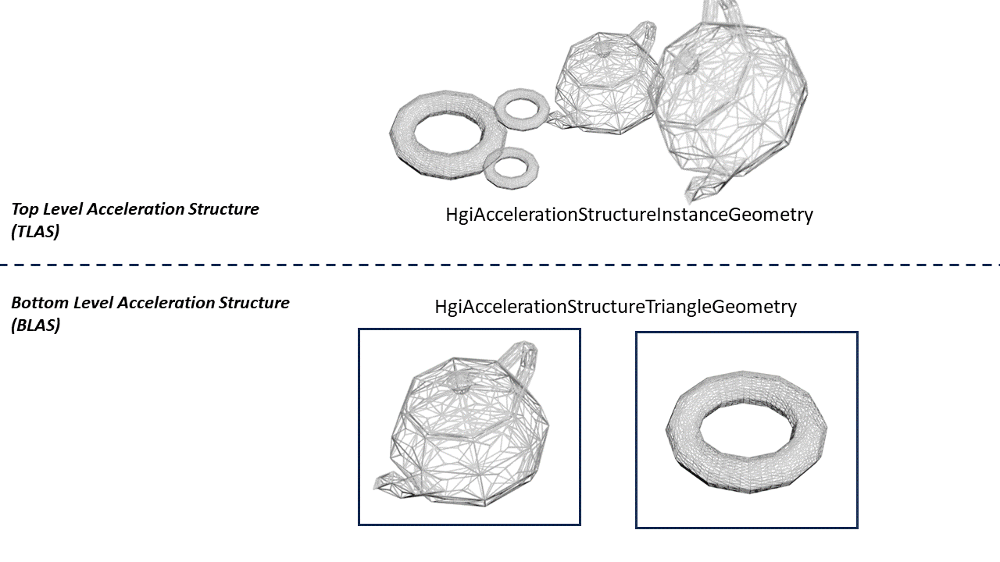
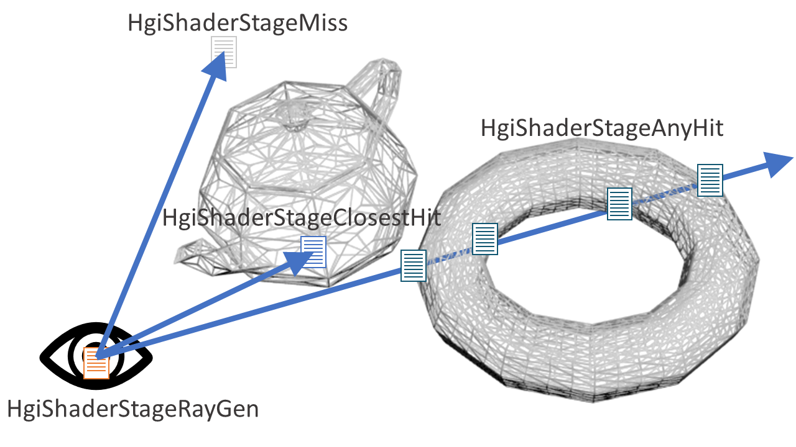

# HGI Ray Tracing

The code for the proposal described here is available in the following branch:

https://github.com/autodesk-forks/USD/tree/adsk/feature/hgiraytracing

## Background

The Hydra Graphics Interface (HGI) library is the abstraction layer used by USD Hydra Imaging core package and the HdStorm render delegate to support the advanced functionality provided by modern graphics APIs, such as Vulkan or Metal. By abstracting the low-level interface to the GPU into a simple and easy to use API, HGI allows the higher level rendering code to perform a set of common graphics functionality without targeting a specific vendor graphics API. A render delegate that uses HGI can then easily target new GPU APIs.

The HGI interface is currently based on rasterization only. It does not support any of the recently released extensions to the Vulkan or Metal graphics APIs that enable GPU-accelerated ray tracing.

## Expectations

Hydra render delegates should be able to utilize GPU-accelerated ray tracing, while still taking advantage of the easy-to-use HGI interface to send commands to the GPU. In areas of the renderer not directly related to raytracing (e.g. compositing textures using full screen quads) render delegates should be able to use the existing HGI library with no changes, then use the new ray tracing extensions to HGI for ray tracing functionality. Potentially it could be possible for ray tracing render delegates to share HGI GPU resources with other render delegates, such as HdStorm, to allow efficient mixed operations (where ray traced images are combined with raster operations).

## Requirements

To add ray tracing functionality to HGI requires adding several new entities to the HGI API:

* Acceleration Structure: A representation of the GPU data structure used to efficiently trace rays through a scene.
* Acceleration Structure Commands: Similarly to existing HGI compute and graphics commands, these are the commands that are submitted to the GPU to build acceleration structures.
* Ray Tracing Pipeline: Similarly to the existing HGI compute and graphics pipelines, the ray tracing pipeline represents the global state that must be setup on the GPU to begin ray tracing.
*Ray Tracing Commands: Similarly to the existing HGI compute and graphics commands, these are the commands that are submitted to the GPU to trigger ray tracing.

In addition to these new entities some existing HGI entities will need to be extended to perform ray tracing or related functionality:

* HGI buffer types will be required to represent the various buffers used to build and retain ray tracing acceleration structures.
* HGI shader types will be required to represent the various new ray tracing shader types.

## Out of Scope

While this extension does potentially allow the highly efficient sharing of HGI resources between ray tracing and traditional rasterization render delegates (such as HdStorm), the exact mechanism that could be used to do so is beyond the scope of this proposal.

There are no GPU ray tracing extensions for the OpenGL API, which is currently the default HGI backend. For the ray tracing extensions to be useful, the HGI implementation should provide a means to create a ray tracing compatible Vulkan backend in CreatePlatformDefaultHgi, or a similar function that returns only a ray tracing compatible backend. The exact mechanism for this is beyond the scope of this proposal.

Also beyond the scope of this proposal is how, and if, the existing HGI shader generation functionality should be upgraded to support the ray tracing shader types. This proposal assumes these shaders will be provided by the render delegate as unprocessed strings in the native shader language used by the backend.

## Interface Changes

### Acceleration Structure

The concept of an acceleration structure, a 3D database of scene geometry that can be queried by rays, will be added to HGI via two new classes: HgiAccelerationStructureGeometry and HgiAccelerationStructure.  HgiAccelerationStructureGeometry  contains the actual geometry which is queried by rays, also known as the bottom-level acceleration structure (BLAS.) HgiAccelerationStructure is the whole acceleration structure which can (after being built on the GPU) be queried by rays.  This is also know as the top-level acceleration structure (TLAS).

HgiAccelerationStructureGeometry can be created by one of two descriptor structures, to define the type of geometry to be created:

`HgiAccelerationStructureGeometry` can be created by one of two descriptor structures, to define the type of geometry to be created:
* `HgiAccelerationStructureTriangleGeometryDesc` to create the BLAS containing the triangles that make up the geometry to be queried. The positions and indices are contained in the struct as buffers with the `HgiBufferUsageAccelerationStructureBuildInput` usage bit set.
* `HgiAccelerationStructureInstanceGeometryDesc` to create the TLAS containing instances of BLAS created previously. Each instance contains a `HgiAccelerationStructureHandle` referencing a BLAS containing the triangles for the instance, along with a transform, visibility mask, and some flags.

A `HgiAccelerationStructure` object is created with a vector of `HgiAccelerationStructureGeometry` handles contained in a `HgiAccelerationStructureDesc` struct. The buffer that will contain the acceleration structure is initially empty, and it must be built using a `HgiAccelerationStructureCmds` command on the GPU. The command is enqueued and executed on the HGI command queue, as with other HGI command types (e.g. HgiGraphicsCmds). HgiResourceBindings will also be extended so HgiAccelerationStructure resources can be bound along with buffers, samplers, etc.

### Ray Tracing

To cast rays that intersect with an acceleration structure and produce images, the classes HgiRayTracingPipeline and HgiRayTracingCmds will be added to HGI. HgiRayTracingPipeline contains all the state necessary to render using ray tracing, passed via the HgiRayTracingPipelineDesc structure:

* The groups that specify the shaders and resources used for ray tracing a specific instance.
* The resource bindings, a description of the resources (acceleration structures, UBOs, input and output textures, etc.) that will used for rendering, each with an associated binding index linking the resources with a group.
* The shaders used to create rays and shade ray-geometry intersections (hits) and misses.

The pipeline and the associated resources themselves must match the layout defined in the pipeline. These are bound, and the actual ray traced rendering occurs, via a HgiRayTracingCmds object, enqueued and executed on the HGI command queue as with other HGI command types (e.g. HgiGraphicsCmds).

### Buffer Types

New HgiBufferUsage buffer types will be added for the new ray tracing usage modes:

* `HgiBufferUsageAccelerationStructureBuildInput`: Input for an acceleration structure build.
* `HgiBufferUsageAccelerationStructureStorage`: Storage for a built acceleration structure.
* `HgiBufferUsageShaderBindingTable`: Buffer used to store a table binding ray tracing instances to shaders.
* `HgiBufferUsageShaderDeviceAddress`: Flag used to indicate that the GPU address of the buffer can be retrieved.

### Shader Types

New HgiShaderStage shader function types will be added for the new ray tracing usage modes:

* `HgiShaderStageRayGen`: Ray generation shader that generates the initial (primary) rays for ray tracing.
* `HgiShaderStageAnyHit`: Shader executed for all the intersections along a ray with any geometry.
* `HgiShaderStageClosestHit`: Shader executed for the closest ray-geometry intersection that was not discarded by an any-hit shader
* `HgiShaderStageMiss`: Shader executed when a ray fails to intersect with any geometry.
* `HgiShaderStageIntersection`: Custom intersection shader, for tracing rays against geometry not represented by triangles.
* `HgiShaderStageCallable`: Callable shader to allow arbitrary code execution from another shader.

## Implementation Details

The initial implementation of these ray tracing extensions will be based on the hgiVulkan backend, though the intention is that the same functionality could be added to the hgiMetal backend. If, because the initial implementation is based on Vulkan, there are areas of the interface that closely match the Vulkan ray tracing API, and would be difficult to implement using Metal, then they will be redesigned to be more generic and accommodate both APIs.

No OpenGL ray tracing API exists, so the assumption is that these extensions will never work on OpenGL, and have no effect if called on an OpenGL HGI device. Similarly, they will have no effect on Vulkan or Metal device that does not support ray tracing, i.e. with a GPU or driver lacking hardware ray tracing support.

For the ray tracing extensions to work, the Vulkan API version must be 2.0 or higher. The implementation uses this higher API version, as well as upgrading the ShaderC Vulkan version to 1.2 and the SPRIV version to 1.5. This is only done for the new ray tracing shader types, and other types remain at 1.0 for backward compatibility.

The performance and functionality of existing HGI code will not be affected at all. The use of ray tracing extensions requires the user to have a hardware that supports hardware ray tracing, currently this means a GPU such as NVIDIA RTX series or AMD RX 6000 series. If the code is running on an older device that does not support ray tracing, then the ray tracing interface will not be available but otherwise there will be no changes to HGI functionality.

The only change to the existing HGI interface will be a means to allow the render delegate to select a backend that supports ray tracing in CreatePlatformDefaultHgi. The default implementation would be to return a Vulkan 1.0 or OpenGL backend just as it does now. If the CreatePlatformDefaultHgi function is called without any argument the result will be an OpenGL HGI version that does not support ray tracing, exactly as in the current implementation (Note, this functionality has been implemented in [this branch](https://github.com/autodesk-forks/USD/blob/c7a05671e615d7406bf9bbdc7894f4020ebf0c46/pxr/imaging/hgi/hgi.h#L153) with the CreateHgiOfChoice function).

