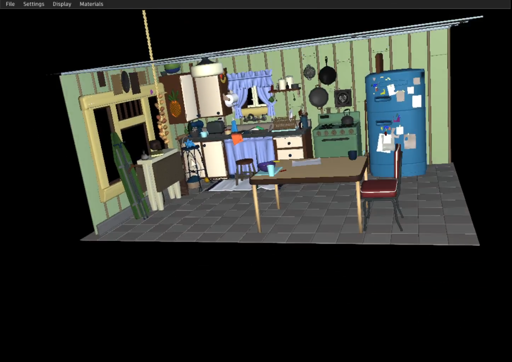

# Goal and Showcase
  This proposal and its associated implementation is first in the series to get HGI's Vulkan backend to feature parity and stability with existing implementations like OpenGL and Metal.

  The implementation associated to this proposal showcases a stably functioning "DefaultMaterialTag" Renderpass which is the material base pass with default lighting applied to it. This showcase also stabilizes asset rendering (tested with USD Kitchen Scene) and resolves multiple draw-item rendering. Industry standard GPU debugging tools like RenderDoc and Nsight (Nvidia) were used to debug and identify the challenges. However some broken features have been disabled to get to this point and will be addressed in subsequent iterations. 
  
  

# Limitations
  This showcase does not rely on HGIInterop to present HGIVulkan render targets via OpenGL context. It uses a pure Vulkan composition, swap-chain management and presentation layer created by borrowing HGIVulkan's primary handles. This layer is owned by the application and is outside the scope of this proposal.

# Features/Bugs Fixed
  1. Fixed bug around loading of Vulkan Instance Layer List - resolves loading of Vulkan Debug and Validation Layers
  2. Fixed use of wrong usage flags applied to Vulkan buffers (reported by Vulkan Validation layer)
  3. Fixed bad renderpass load and clear operation heuristic applied on render targets belonging to same execution task but different draw-batches
  4. Fixed bad index buffer binding offset when multiple draw-items are rendered
  5. Provided Vulkan support in build script and cmake files
  6. Provided the ability to create a Hgi Backend of choice when more than 1 API is compatible on a platform
  7. Provided unit-test helper and a unit test for HgiVulkan with baseline image comparison 
  8. Provided some clean-up around removal of OSD when Vulkan backend is enabled

# Features Disabled 
  1. Disabled MSAA when Vulkan is enabled as MSAA-resolve is currently broken
  2. Disabled Multi-draw direct feature support when Vulkan is enabled
  3. Disabled GPU Frustum Culling when Vulkan is enabled as feature is broken
  4. Disabled loading of Vertex Attribute Divisor Extension because instancing is broken

# Testing
  A HGI unit test helper was added to the HdSt project to facilitate unit testing of HGI backends. A unit test that tests the following has been added as well
  1. Testing of successful HgiVulkan creation (through HGI abstraction)
  2. Testing of successful sample HgiVulkan graphics pipeline (through HGI abstraction)
  3. Testing of successful sample graphics queue with simple triangle draw execution (through HGI abstraction)
  4. Provided image base-line comparison with unit test output written to disk (following a GPU - CPU copy)

# Next updates
  The goal to achieve feature parity and stability for HgiVulkan will continue. The next proposal and associated implementation will aim to resolve issues with instancing, multi-draw indirect, GPU Frustum Culling, Blending and MSAA.