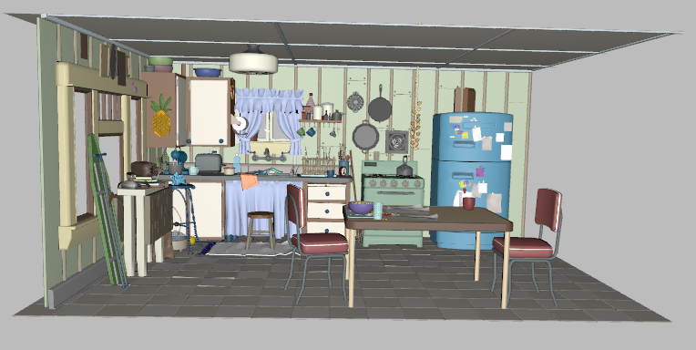
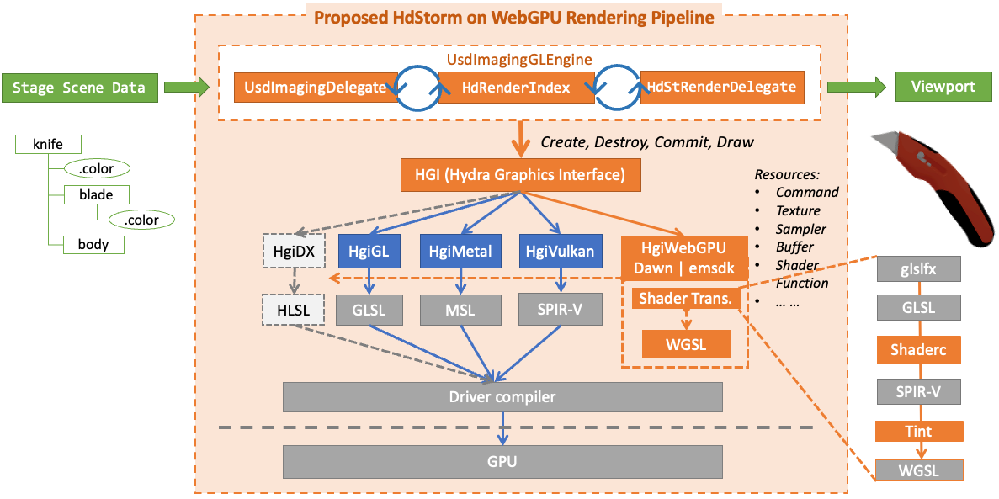
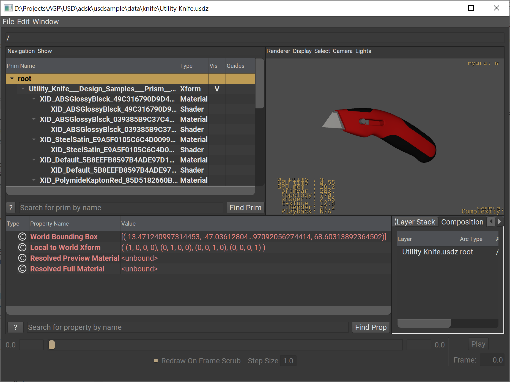
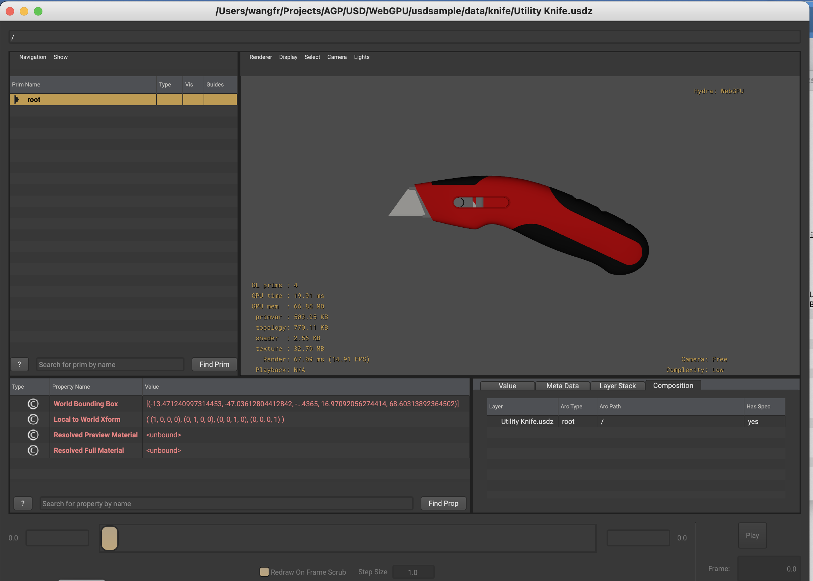
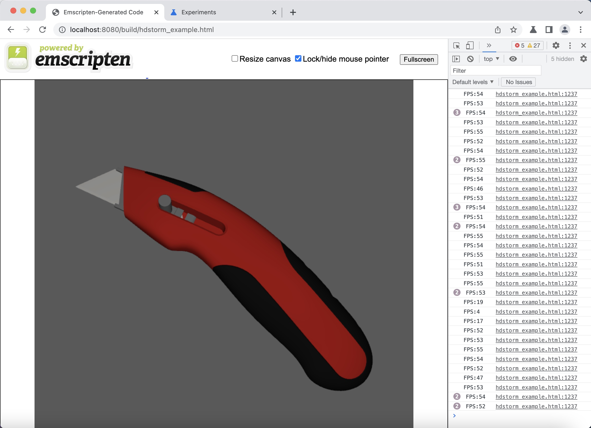

# Introduction

Even though WebGL is the most widely adopted Web graphics API, it lacks several key functionalities to run HdStorm. In contrast, WebGPU is the latest web standard that is aiming to provide "modern 3D graphics and computation capabilities". Generally speaking, WebGPU is the successor to WebGL. 

We propose a new WebGPU-based implementation to extend the Hydra Graphics Interface (Hgi). This new addition will pave the way for new workflows on the Web.

Initially, this implementation supports the HdStorm rasterization rendering pipeline on the web using the new [WebGPU API](https://developer.mozilla.org/en-US/docs/Web/API/WebGPU_API). It can be compiled through Emscripten for a web environment or using the cross-platform [Dawn](https://dawn.googlesource.com/dawn) implementation for running natively in a desktop environment.



Thanks to the abstraction layer introduced by HGI, changes necessary to introduce this new backend are mostly contained into the new HgiWebGPU folder, reducing the risk of affecting other parts of the USD ecosystem or introducing regressions. 

# Design

This new WebGPU based graphics backend shares the same HdStorm rasterization rendering pipeline through the HGI abstraction with others backends, e.g., HgiGL, HgiMetal, HgiVulkan and the recent [HgiDX](https://github.com/autodesk-forks/USD-proposals/tree/adsk/feature/DirectX12Hgi/proposals/DirectX_hgi) proposal.

In addition to supporting the new graphics API, we need to consider how to handle the current shader code. In contrast to the other backends, like Metal, where most of the differences are in the way bindings and attributes are set, WGSL and GLSL have fundamental differences that make it difficult to manipulate the current shaders to create valid WGSL code. In order to handle the existing GLSL code, a runtime solution is adopted, where [shaderc](https://github.com/google/shaderc) is used to generate valid SPIR-V code and then translated to WGLS by [Google Tint](https://dawn.googlesource.com/tint).



# Development 

As we worked on a WebGPU based backend, we developed 2 solutions for different scenarios according to their advantages and disadvantages:

## Branch 
The corresponding development branch is **[adsk/feature/webgpu](https://github.com/autodesk-forks/usd/tree/adsk/feature/webgpu)**.

##Dawn-based
* Useful for easier debugging and development on desktop (Windows and macOS). 
* It can be tested by enabling the `--dawn` option when building using build_usd.py.
* To try it out, you can use `usdview`, set the environment variables listed below.
* Due to some [limitations](#limitations), some features need to be disabled:
  >```
  >export HDST_ENABLE_PIPELINE_DRAW_BATCH_GPU_FRUSTUM_CULLING=0
  > export HD_ENABLE_PACKED_NORMALS=0
  > export HDX_ENABLE_OIT=0
  > export HGI_ENABLE_WEBGPU=1
  > ```
Below screenshots demonstrate a knife asset loaded in USDView with WebGPU backend on both Windows (1st image) and macOS (2nd image).



##Emscripten-based
* It is used for rendering and viewing on a web browser.
The WebAssembly content can be tested using a new target called `usdviewweb`.
* It can be built using the `--emscripten` option on macOS only. 
* Although Emscripten build target not yet supported on Windows, the built WebAssembly contents could be depolyed and loaded into browser on both macOS and Windows platforms.

Below screenshots demonstrate a knife asset loaded in USDViewWeb on Chrome browser.


# Testing

## Automation
**Dawn-based solution**: Existing tests were verified to work as expected and a new test `testUsdviewWebGPU` has been introduced.

In addition, one can get a general idea of the gaps and partial failures because of known issues and limitations discussed in this proposal. This can be tested with the
environment variables mentioned in the [development](#development) section, in particular, the `export HGI_ENABLE_WEBGPU=1` variable.


**Emscripten-based solution**: The testing mechanism is still under consideration. Generally speaking, C++ test cases could be run in a browser after being converted to WebAssembly. Python cases needs "Python on Web" is ready, which is under research to enable python execution on web.  


# Limitations

## USD WebGPU backend
There are several limitations due to the lack of support for certain features compared to more mature APIs. Some builtin functions are missing as well as some graphics capabilities, for example:

- OIT is disabled due to missing support of GLSL `atomicAdd`.
- Binding of a  writable buffer to the vertex shader, which is not supported in HgiWebgpu. Could be worked around as the vertex shader actually doesn't access that attribute.
- Issue with Frustum culling.
- Packed normals is disabled due to missing support for format `HgiFormatPackedInt1010102`.
- Doesn’t support dome light due to missing support for float32 filtering.
- UV problems with models using the faceVarying interpolation due to missing support for builtin `primitive_ID`.
- Not possible to pass write buffers to the vertex stage (e.g. constPrimVars), as defined in https://www.w3.org/TR/webgpu/#dom-gpudevice-createbindgrouplayout in the device timeline section.
- Only vertex, fragment and compute shaders are available. Some functionalities use either Tesselation shaders or Geometric Shaders is not supported.
- Some builtins are available in GLSL, but missed in WGSL and tint reader with using SPIR-V:
  - determinant
  - isinf
  - isnan
  - gl_primitiveID
  - barycentric coords
- gl_Pointsize is readonly

Additionally, there are some general limitations and risks:
- Problems using SPIR-V and shader compilation of "OpenSubdiv::Osd::MTLPatchShaderSource::GetCommonShaderSource()" as it is not supported when targeting Vulkan 1.0,
- Current handling of the plugin system more difficult in the context of emscripten and how dynamic libraries are handled.

Luckily, the API specification has taken an approach that allows it to grow and introduce more features as it evolves.

## WebGPU Limits Specifications

Additional to the implementation details, there are certain [security and privacy 
considerations](https://www.w3.org/TR/webgpu/#privacy-considerations) when moving to the web. In these scenarios the WebGPU API doesn't expose specific information that could lead to hardware exploits. This leads to more constrained limits on some graphics features. For example, when testing some of the models, the following limits where exceeded and had to be worked around or some capabilities disabled:
  - When there are multiple render targets, we exceed the [limit of 32 bytes per sample](https://www.w3.org/TR/webgpu/#dom-supported-limits-maxcolorattachmentbytespersample) across all targets. This usually happens when selection is included.
  - When the model uses a set of features (e.g. selection, textures, etc), usually, the [number of interstage attributes](https://www.w3.org/TR/webgpu/#dom-supported-limits-maxinterstageshadervariables) is exceeded.
  - When a model uses a set of features that increases the number of required buffers (e.g roughness, textures) we quickly exceed [the maximum buffers per shader stage](https://www.w3.org/TR/webgpu/#dom-supported-limits-maxstoragebufferspershaderstage).
 

