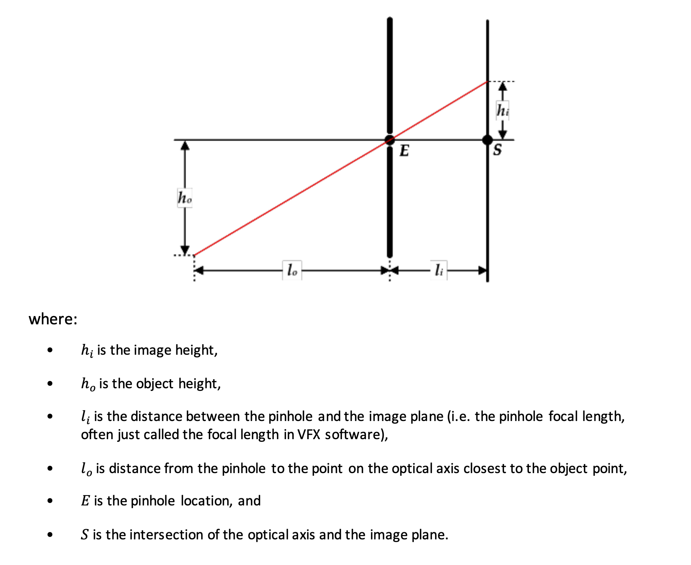

## Image Plane Support for USD

## Contents
- [Introduction](#introduction)
- [High Level Anatomy of an Image Plane](#high-level-anatomy-of-an-image-plane)
- [Pinhole Camera Diagram](#pinhole-camera-diagram)
- [UsdGeomImagePlaneAPI Schema](#usdgeomimageplaneapi-schema)
  - [Properties](#properties)
  - [API Methods](#api-methods)
- [Hydra Implementation](#hydra-implementation)
- [Alternative Implementation Strategies](#alternative-implementation-strategies)
- [Use Cases](#use-cases)
- [Open Questions](#open-questions)

## Introduction
This proposal aims to add native support for Image Planes to USD. An Image Plane is a camera constrained image that 
can be seen in "screen space" when looking through that camera.

The majority of work in VFX is centered around augmenting existing footage, so it is important to view animation in 
the context of that footage (it doesn't matter if the animation looks good if it doesn't look integrated). Without 
this ability, the utility of tools like usdview is quite restricted and requires compositing before work can be 
evaluated in context.

## High Level Anatomy of an Image Plane
Conceptually, an Image plane must provide the following information:
- associated camera
- image (can be animated per frame)
- fit to filmback (how image is positioned in relation to cameras filmback)     
- visibility (whether image plane is visible or not, because it should be hide-able for different workflows)

And could potentially also provide:
- depth (if an image plane is in space, this is how far away from pinhole camera this plane should exist in space) 
- "image attributes" like alpha gain, preview lut, etc.

## Pinhole Camera Diagram
This proposal will follow the same nomenclature from the Cooke site. Here is a reproduced CG Camera diagram. 
(from https://cookeoptics.com/i-technology/ > "Cooke Camera Lens Definitions for VFX" > CG Camera diagram 2.1.)


## UsdGeomImagePlaneAPI Schema
The UsdGeomImagePlaneAPI schema defines basic properties for rendering an image plane. The UsdGeomImagePlaneAPI  
schema derives from UsdSchemaBase and will be a Multi-Apply Schema that would be restricted to UsdGeomCamera prim 
types.

### Properties
- asset image = @@ : *Path to image file*
  - can be time sampled per frame
  - This will have to be per frame, as USD/Hydra do not at this time support a $F substitution for image/texture asset paths. [See below](#out-of-scope-f-frame-token)
- double depth = 0 : *Distance, in scene units, from the pinhole to the point on the optical axis where the image plane sits l0 in above* 
  pinhole camera diagram
  - alternative name: "distance" (Autodesk Maya used "depth")
  - A nice default could be -1 or "infinite" so that it would always be behind CG. That might be hard to coexist with a physically placed in scene camera depth that exists in front of and behind cg elements.
- bool enabled = True : *Control image plane visibility.*
  - regardless of this value, if the (camera) prim itself is invisible, the image plane will not be visible in the viewport/render
- token visibility ["all views", "camera only"] : *Whether this viewport is visible when the scene is viewed through the same camera prim*
  - the "none" case could be handled by "enabled" property
- array of float[2] placement = [(0,0), (1,0), (1,1), (0,1)] : *Coordinates relative to the camera film back for each corner of the image plane's image*
- float rotation = 0.0 : *Refine the placement of an image plane by rotating along the optical axis.*
  - Applied after placement coordinates

### Suggestions for Metadata
The following won't be part of the schema, but would be informal properties. 
- Application specific data for round tripping such as ("maya:fit" = "horizontal") 

### Why a Multi-Apply API Schema?
  If we implement a Multi-Apply API Schema for Image Planes we can:
  - author attributes directly to camera
  - author multiple image planes to camera, since multi-apply schemas can be applied several times to the same prim    
  multiple image planes could be used to view CG elements in context with rotoscoped foreground elements as well as background plates

#### API Methods
- CreateImagePlane(imagePlaneName)
- SetImagePlane*Attr(imagePlaneName, value)
- GetImagePlane*Attr(imagePlaneName, attribute)
- SetImagePlanes([])
- GetImagePlanes()

#### A Minimum Usage Example:
```
camera = stage.GetPrimAtPath('/world/cam')
imagePlaneApi = UsdGeomImagePlaneAPI(camera)
imagePlaneApi.CreateImagePlane("imagePlane1")
framesToImages = [(f, fileSequence.frameAt(i) for f in fileSequence.frames()]
imagePlaneApi.SetImagePlaneImageAttr(framesToImages, "imagePlane1")
```
##### Which would generate this .usda:
```
def Xform "world" {
    def Camera "cam" (        
        apiSchemas = ["UsdGeomImagePlaneAPI:imagePlane1"]
    ){
        ...
        string[] imagePlanes = ["imagePlane1"]
        asset imagePlane1:image = {
            1001: @/path/to/image.1001.exr@, 
            1002:...
            }
        float imagePlane1:depth = 1000.0
    }
}
```

## Hydra Implementation
TODO: Flesh out and discuss with Hydra team.

Ideas:
- Use UsdPreviewSurface textures in a way similar to GeomModel texture cards.
- Do the compositing in an Hdx post task

## Use Cases
### Hydra / Usdview
It would be helpful to be able to view CG elements against a backdrop of the production plate when checking exported usd caches.

### DCC Interchange
Having a "UsdLux" style standard for Image Planes would be very useful when implementing importers and exporters for DCCs like Maya, Blender, Nuke, etc.

### Photogrammetry
Reasonably specific example:
Load a mesh and array of cameras - provided by a company like Lidar Lounge - into Maya.
Clean up / simplify the mesh and export as USD.
Import into Mari, so as the cameras become projectors; with each having the path to an image plane's image, which can be projected onto the mesh.

## Alternative Implementation Strategies
### 1.) As a concrete prim type
Here is a working implementation that was done before Multi-Apply schemas were added to USD.

It's a fully featured solution that is based around Autodesk Maya's "underworld" image plane nodes where many planes 
can live under a camera. This specific implementation is just a quick attempt to move maya image planes across packages 
and the hydra implementation is just a workaround that generates an HdMesh rprim (instead of creating a new image plane 
prim type).

Reference internal PR from Luma: https://github.com/LumaPictures/USD/pull/1

#### Pros:
- Prim attributes like [visibility, purpose] can be leveraged to provide intuitive functionality
- Easy to see Image Planes in a hierarchy
#### Shortfalls:
- Requires relationships between camera + plane prims
- Requires an extra API schema to encode the relationship on the Camera.
- There's the possibility that someone targets something other than an ImagePlane with the relationship, so there are more ways to "get stuff wrong". 

### 2.) Using existing USD types (Plane + material + camera + expressions)
- It is possible to create a UsdPlane with a material and accomplish the same thing as an image plane.
#### Pros:
- No need for this proposal :)
#### Shortfalls:
- Requires users to implement complex authoring code.
- No explicit identity as an "Image Plane". This will make it hard to successfully roundtrip from DCCs to USD.

## Appendix: "Fit" Strategy Discussion
One of the key decisions for this schema is to come up with a universally acceptable way to describe how the
image plane will be positioned in relation to the camera film back. We want something that will cover all use cases
without being to burdensome to describe.

In our discussions, we determined fit should be relative to the film back as opposed to in scene space or render space.
The exact form this takes is still up for discussion...

#### 1. A "fit" token
Applications like Autodesk Maya use a fit heuristic to make it easy for artists to describe how to position the image
on the film back.
  "horizontal" - fit image width to filmback and keep image aspect ratio
  "vertical"- fit image height to filmback and keep image aspect ratio
  "fill" - stretched to filmback
  "to size" - constant size, centered on filmback, and requiring more data to define "image size" and then further 
  describe positioning

#### 2. Corner coordinates
An array of image corner coordinates that will allow any manipulations of scale and shearing to be done
on the image. We add a rotate parameter, but we could also split out scale and keystone if we want to handle
those specifically.

#### 3. Position + Rotation + Scale
Fit could also be described with:
- float[2] position = (0,0) *Lower left coordinate of film back* 
- float[3] rotation = (0, 0, 0) *Rotate the image plane in any xyz direction*
- float[2] scale = (1.0, 1.0) *Scale image in x and y, these would probably be relative to film back size*

## Out of Scope: $F Frame token proposal
Image planes in USD beg the question of movies and image planes in USD to avoid repetitively described file paths for
frame samples. Look for that in a separate proposal
