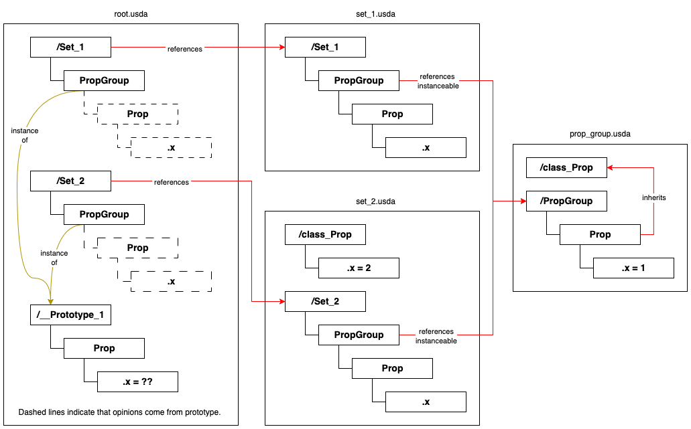
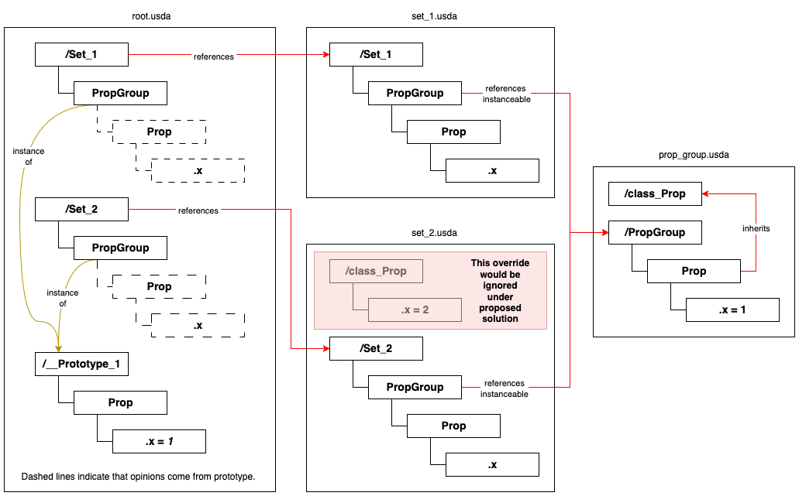
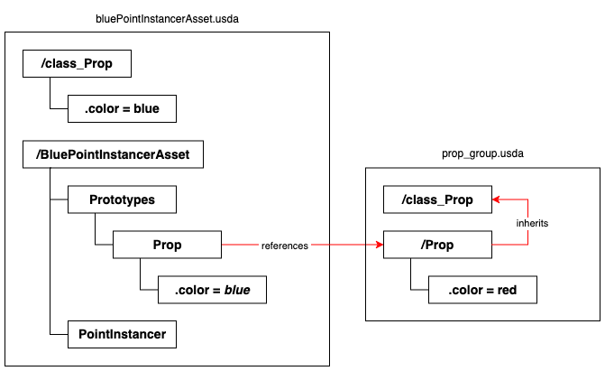
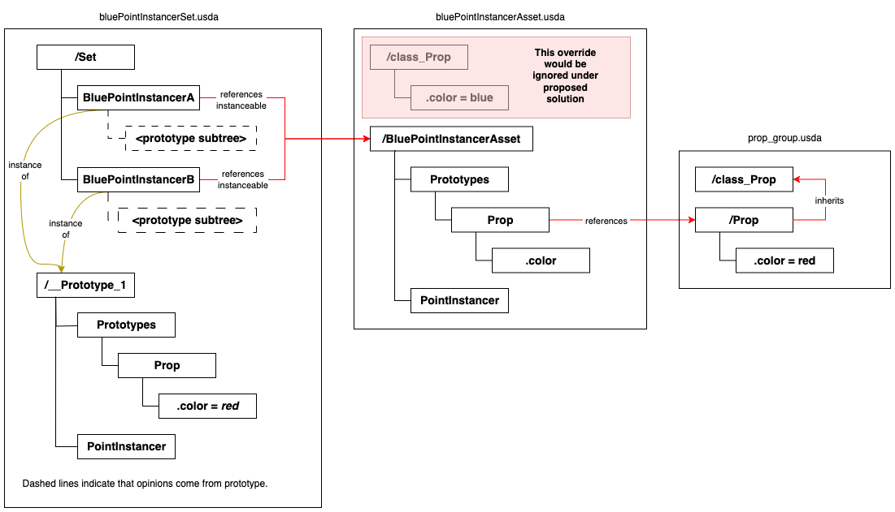

# Class Encapsulation within Native Instances

## Background
 
USD's native instancing feature does not consider inherits and specializes
arcs on children beneath the instance when creating prototypes. This can give
unexpected and non-deterministic results when an asset containing such a child
prim is referenced and instanced in two different assemblies, but class
overrides are only applied to the instance in one of those assemblies.

This issue was initially filed in [GitHub issue #3201](https://github.com/PixarAnimationStudios/OpenUSD/issues/3201)
in August 2024.

## Example

The diagram below shows an example scenegraph and composition structure that
illustrates the issue.

The .usda files for this example are located in the `./example` subdirectory.

To observe the problem directly, load `root.usda` into a `UsdStage` and get
the value of `/Set_1/PropGroup/Prop.x` or `/Set_2/PropGroup/Prop.x` or
`/__Prototype_1/Prop.x`. This value will switch between 1.0 and 2.0
non-deterministically. If `/Set_1/PropGroup` and `/Set_2/PropGroup` were
_not_ marked instanceable, the value of `/Set_1/PropGroup/Prop.x` would
be 1.0 and the value of `/Set_2/PropGroup/Prop.x` would be 2.0.

## Discussion

`UsdStage` only looks at the composition arcs authored on the instance prims
(those marked `instanceable=True`) to compute the instancing key that 
determines the shared prototypes. It does not look at any of the child prims
beneath those instances, which keeps the computation fast and independent of
the size of the subtree beneath those instances.

In the example above, the `PropGroup` instances all reference the same asset,
so `UsdStage` determines they all have the same instancing key and thus can
use a single prototype, even though they are split across `set_1.usda` and
`set_2.usda`. `UsdStage` then picks one of the instances and composes the
subtree beneath it to serve as the shared prototype.

The issue is that `set_2.usda` has a class override for an inherit arc
authored on a child prim inside the `PropGroup` instance specified in that
layer. If `UsdStage` selects `/Set_2/PropGroup` to serve as the prototype,
that class override will be composed into the opinions for
`/Set_2/PropGroup/Prop`, which will cause the value of `x` to resolve to
2.0. If it instead selects `/Set_1/PropGroup` to serve as the prototype,
`x` will resolve to 1.0 since there is no class override on that prim.

Because the inherit arc to `_class_Prop` is authored on a child of the
instance, it and the class override in `set_2.usda` do not contribute to the
instancing key, again because the key is only computed based on the
`instanceable` prim itself.

## Proposed Solution

### Ignore implied class overrides for inherit/specializes arcs on child prims beneath instances

Under this approach, opinions from implied inherit and specializes arcs due
to arcs authored on child prims beneath instances would be ignored during
composition. In the above example, the opinion in `/class_Prop` in `set_2.usda`
would be ignored, since this comes from the implied inherit arc associated
with the authored inherit arc in `prop_group.usda`. This fixes the 
non-determinism: ignoring this override means that the `Prop` prims across
both `/Set_1` and `/Set_2` can share the same prototype, and the value of
`x` would always be 1.0 no matter which instance which was selected to serve
as the shared prototype.

Conceptually, the idea is that the subtree of prims beneath instances are
encapsulated and sealed off from external modification. `UsdStage` already
ignores overrides on child prims of instances for exactly this reason. Ignoring
implied opinions would be an extension of this policy – one could argue that
`UsdStage` should have ignored these opinions from the very start and the fact
that it didn't is the real bug.

Note that this solution would continue to allow implied opinions for inherits
and specializes arcs authored on the instance itself. This solution would only
affect cases where children prims of instances had inherit/specializes arcs.

Also note that this solution would still allow _direct_ opinions from inherits
or specializes arcs authored on instance children prims. In the above example,
the opinions from `/class_Prop` in `prop_group.usda` would still be included
in the prototype shared by `/Set_1/Prop` and `/Set_2/Prop`.

## Alternate Solutions

The proposed solution simply disables the problematic class overrides. 
I considered alternate solutions that would enable this functionality instead,
but each solution came with a significant cost in either performance or code
complexity, or both. Enabling this functionality at all is also inconsistent
with USD's mental model of instancing and encapsulation, although one could
argue that the proposed solution is itself inconsistent with USD's mental
model of composability (see below).

### Add inherit/specializes arcs on child prims of instances to instancing key

Under this option, `UsdStage` would scan subtrees beneath instances to
determine whether any child prims had these authored arcs and incorporate
that into the instancing key, effectively splitting the prototype when the
original issue was detected. 

In the example above, `/Set_1/PropGroup` and `/Set_2/PropGroup` would have
different prototypes because `UsdStage` would detect the presence of the class
override in `set_2.usda`. If that class override was not present, then these
would revert to sharing a single prototype.

This enables the class-override-on-children functionality while retaining
the maximum amount of prototype sharing between instances. However, this makes
computing the instancing key slower and much more complex, diminishing the
performance gains `UsdStage` receives from instancing.

### Add ancestral composition arcs to instancing key

Under this option, composition arcs authored on namespace ancestors of a prim
would be included in that prim's instancing key. This means that instances
within different assets would never share a prototype, even if those instances
themselves referenced the same asset.

In the example above, `/Set_1/PropGroup` and `/Set_2/PropGroup` would have
different prototypes because `UsdStage` would see `/Set_1/PropGroup` came
from across the reference to `set_1.usda` and `/Set_2/PropGroup` came from
across the reference to `set_2.usda.`

This approach enables the class-override-on-children functionality without
having to search the subtree beneath instances to find those children,
keeping the instancing computation fast. However, in order to do so this
approach pessimistically reduces prototype sharing even for cases that don't
run into the original issue, which could have potentially large performance
implications.

For example, the Antiques Mall set from Toy Story 4 is built up by referencing
in multiple smaller sections and joining them together. Currently, `UsdStage`
is able to share a single prototype for all instances of a given prop across
all of these smaller sets. Under this proposal, `UsdStage` would instead
create a prototype for all of the instances within each smaller set. In other
words, if a given prop was referenced in N of the smaller sets, instead of one
prototype we'd have N prototypes. In a test build that implements this
solution, loading the full Antiques Mall in usdview consumes ~2400 MB of
memory, vs. ~1800 MB in a current build.

## Impact on Asset Construction and Composibility

The proposed solution means that a user cannot simply reference an asset and
make it instanceable without knowing whether that asset internally uses class
overrides on instances.

For example, consider this hypothetical `BluePointInstancerAsset` that
internally contains a point instancer that uses a referenced `Prop`. This
asset overrides the value of `Prop.color` via an implied inherit arc by
authoring an opinion on `/class_Prop.color` in `bluePointInstancerAsset.usda`
to change the color to "blue". This construction is legal today and would
continue to be legal in the proposed solution.

Now consider this hypothetical `Set` that references multiple copies of
`BluePointInstancerAsset` and makes them instanceable. Under the proposed
solution, the opinion from the implied inherit arc above would be ignored,
changing the color of the prop inside the `BluePointInstancerAsset` back to
"red" unexpectedly.

The .usda files for this example are located in the `./blue_pi_example`
subdirectory.