```mermaid

graph TD
    subgraph City
        direction TB

        %% Buildings
        subgraph BuildingA
            direction TB
            Room1["Room1"]
            Room2["Room2"]
            
            %% Geometry LODs for Room1
            subgraph GeoLOD_Room1 ["Geometry LOD"]
                Room1 --> GeoLOD_Room1_H["High"]
                Room1 --> GeoLOD_Room1_L["Low"]
            end
            
            %% Physics LODs for Room1
            subgraph PhysLOD_Room1 ["Physics LOD"]
                Room1 --> PhysLOD_Room1_F["Full"]
                Room1 --> PhysLOD_Room1_S["Simple"]
            end
            
            %% Material LODs for Room1
            subgraph MatLOD_Room1 ["Material LOD"]
                Room1 --> MatLOD_Room1_H["High"]
                Room1 --> MatLOD_Room1_M["Medium"]
                Room1 --> MatLOD_Room1_L["Low"]
            end
            
            %% Repeat for Room2 (simplified)
            subgraph GeoLOD_Room2 ["Geometry LOD"]
                Room2 --> GeoLOD_Room2_H["High"]
                Room2 --> GeoLOD_Room2_L["Low"]
            end
            subgraph PhysLOD_Room2 ["Physics LOD"]
                Room2 --> PhysLOD_Room2_F["Full"]
                Room2 --> PhysLOD_Room2_S["Simple"]
            end
            subgraph MatLOD_Room2 ["Material LOD"]
                Room2 --> MatLOD_Room2_H["High"]
                Room2 --> MatLOD_Room2_M["Medium"]
                Room2 --> MatLOD_Room2_L["Low"]
            end
        end
        
        subgraph BuildingB
            direction TB
            RoomB["SingleRoom"]
            
            subgraph GeoLOD_B ["Geometry LOD"]
                RoomB --> GeoLOD_B_H["High"]
                RoomB --> GeoLOD_B_L["Low"]
            end
            subgraph PhysLOD_B ["Physics LOD"]
                RoomB --> PhysLOD_B_F["Full"]
                RoomB --> PhysLOD_B_S["Simple"]
            end
            subgraph MatLOD_B ["Material LOD"]
                RoomB --> MatLOD_B_H["High"]
                RoomB --> MatLOD_B_M["Medium"]
                RoomB --> MatLOD_B_L["Low"]
            end
        end
    end
```

# Level of Detail (LOD) API for USD

## Summary

This proposal defines an API schema for managing Level of Detail (LOD) in USD compositions. LOD systems allow engines and applications to efficiently switch between asset representations based on configurable criteria such as distance, screen size, performance heuristics, or explicit authoring. This API standardizes LOD representation, enabling runtime composition, hierarchical evaluation, and multi-domain decoupling while maintaining deterministic behavior.

## Glossary

- **LOD (Level of Detail)**: A representation of an object at a specific resolution or fidelity.
- **LOD Switching**: Process of changing between LODs according to specified rules.
- **Transition Rules**: Functions and thresholds that determine when LODs switch.
- **Applied API Schema**: A USD schema applied to prims to extend functionality.
- **LOD Domain**: A set of LOD levels and heuristics applied to a prim hierarchy.
- **Active Level**: The currently selected LOD level in a domain.
- **Parent-Child Relation**: A child LOD’s activation is conditioned on its parent’s activation.
- **Heterogeneous Hierarchical LOD Network**: Multiple independent LOD domains coexisting on a prim hierarchy.

## Problem Statement

USD lacks a standardized runtime LOD representation. Current workarounds (variants, payloads, custom schemas) do not provide:

- Standardized interchange of LOD data.
- Multiple LOD domains simultaneously composed (e.g., cross-fading geometry while switching physics LOD).
- Runtime evaluation and deterministic selection.

## Existing Implementations & Reference Documents

- Game engines implement LOD systems
    - many common features to these systems such as distance from the camera switching
    - many unique features specific to singular engine capabilities
- Previous proposals have explored node-based approaches (see originalProposal.md)
- USD's Collections API provides a pattern for targeting sets of prims that we can leverage

## Proposal Details

### Proposal Overview

- Multi-domain support: Geometry, physics, material, or other LOD domains can coexist.
- Hierarchical LOD: Parent-child propagation ensures partial hierarchies behave predictably.
- Deterministic evaluation: Activation is frame-deterministic.
- Renderer-agnostic: API defines the data; selection logic is engine-dependent.

### API Schemas

- `LodAPI` (multi-apply): Top-level LOD configuration for a prim, supports multiple domains.
- `LodLevelAPI` (multi-apply): Defines individual LOD levels and associated members.
- `LodHeuristicAPI` (single-apply): Defines domain-specific runtime selection logic.

---

## **Formal Definition: Hierarchical Heterogeneous LOD**

## **Definitions**

1. **LOD Domain** $D$
   A set of LOD rules and heuristics applied to a prim hierarchy. For example, distance-driven geometric LOD constitutes a domain $D_1$, while entity-presence-driven physics LOD constitutes a domain $D_2$.

2. **LOD Level** $L \in D$
    A collection of prims within a domain that share the same LOD criteria.

3. **Active Levels**
   A level $L \in D$ is *active* at time $t$ if its domain heuristic selects it for rendering or simulation.

4. **Parent-Child Relation**
   Given two levels $L_p$ and $L_c$ in a hierarchy, $L_c \prec L_p$ if activation of $L_c$ is conditioned on the activation of $L_p$.

5. **Heterogeneous Hierarchical LOD Network.**
   A set of domains ${D_1, D_2, \dots, D_n}$, each with independent hierarchies and heuristics. Levels are parent-child conditioned withint their domain;  domains are mutually independent unless explicitly coupled.

---

## **Axioms**

* **P1: Hierarchical Resolution**
  Activation is evaluated top-down within a domain. A child level may only be active if its parent is active.

* **P2: Domain Independence**
  Activation in domain $D_i$ does not affect any $D_j$ for $i \neq j$, except through explicit cross-domain heuristics.

* **P3: Domain-Specific Conditioning**
  Heuristics or triggers affect only their own domain.

* **P4 Parent Activation Propagation**
  An LOD level $L_c$ in domain $D_i$ is considered *eligible* for activation only if its parent $L_p$ is active; ctivation propagates predictably within each domain, ensuring consistent runtime behavior:
  
  $$
  L_c \text{ active} \implies L_p \text{ active}, \quad L_c, L_p \in D_i
  $$

## **Implications for API Design.**

* Multi-domain support is safe: geometry, physics, and material LODs can coexist without interference.
* Parent-child propagation ensures that partial hierarchies do not activate unexpectedly.
* Decoupled heuristics allow runtime selection per domain while maintaining deterministic results.

## **Summary.**

* `LodAPI` as a multi-apply schema to handle multiple domains per prim.
* `LodLevelAPI` to define ordered levels with hierarchical relationships.
* `LodHeuristicAPI` to provide domain-specific, runtime-deterministic selection logic.

Together, they ensure that hierarchical LOD evaluation is predictable, efficient, and extensible across multiple asset types and runtime systems.


---


### Schema Definitions

#### LodAPI

```python
class LodAPI "LodAPI"
(
    inherits = </APISchemaBase>
    doc = """API for describing Level of Detail (LOD) facilities on a prim.
    
    This API schema provides the a way to define multiple LOD levels for a prim
    and rules for transition between them during rendering. It is expected to be 
    applied to a prim that serves as the root for LOD management, within a 
    hierarchy of LOD managed prims.
    
    This schema leverages collections to define sets of geometry for different
    detail levels, and provides properties to control LOD selection via 
    specified heuristics.
    
    The schema is multipleApply in order that multiple systems may independently
    specify level of detail criteria to a single prim; for example, a single prim
    may have geometry level of detail specification within it as well as physics
    level of detail.
    """

    customData = {
        string apiSchemaType = "multipleApply"
        token propertyNamespacePrefix = "lod"
    }
)
{
    uniform token version = "1.0" (
        doc = """Schema version for future extensions and compatibility"""
    )
    
    uniform token levelType = "none" (
        doc = """Names the system that consumes this LOD application.
        
        By convention, certain systems should reflect the singular form
        of the common term of art for the system, including,
        "geometry", "material", "lighting", "collision", "volume", and "physics"."""
    )
    
    rel lodLevels[] (
        doc = """Relationship to the LOD levels defined for this prim.
        
        This relationship targets prims with the LodLevelAPI applied.
        The order of the targets should match a high to low priority order.
        Empty or unresolvable references are ignored, additionally references
        to prims with no LodLevelAPI applied schema are ignored."""
    )
    
    rel heuristic (
        doc = """Relationship to the heuristic used for LOD selection.
        
        This relationship targets a prim with the LodHeuristicAPI applied.
        If no heuristic is specified, no automatic LOD switching will occur."""
    )
}
```

#### LodLevelAPI

```python
class LodLevelAPI "LodLevelAPI"
(
    inherits = </APISchemaBase>
    doc = """Defines a single LOD level for a prim, owning a collection of member prims.
    
    Each LOD level contains a collection of prims that participate in this level. 
    The ordering of LOD levels is determined by LodAPI:lodLevels[]."""
    
    customData = {
        string apiSchemaType = "multipleApply"
        token propertyNamespacePrefix = "lodLevel"
    }
)
{
    rel members (
        doc = """Targets a prim with a collection defining the members of this LOD level.
        
        Typically the collection:content:includes attribute on the target defines
        the geometry, room, or other prims participating in this LOD level.
        Empty collections are ignored."""
    )
    
    uniform int index = 0 (
        doc = """The LOD level index; used to match thresholds in heuristics."""
    )
}


class GeometryLodLevelAPI "GeometryLodLevelAPI"
(
    inherits = </LodLevelAPI>
    doc = """API that defines a single LOD level within an LOD group.
    
    This multi-apply API schema allows defining multiple LOD levels for a prim."""

    customData = {
        string apiSchemaType = "multipleApply"
        token propertyNamespacePrefix = "geometryLodLevel"
    }
)
{    
    point3f center = (0.0, 0.0, 0.0) (
        doc = """The center point of this LOD level, used for distance calculations.
        
        This value is used by distance-based heuristics to calculate the
        distance from the camera or other reference point."""
    )
    
    rel boundingVolume (
        doc = """Optional relationship to a prim that defines the bounding volume
        for this LOD level, used for distance or screen-size calculations. The
        bounding volume may be one of the geometry primitives, a mesh, or other
        primitive whose extent may be computed in a well defined manner."""
    )
    
    token computeDistanceTo = "center" (
        allowedTokens = ["center", "boundingVolume", "boundingBox"]
        doc = """Method used to compute distance from a reference point to this LOD.
        
        - center: Use the lodLevel:center property
        - boundingVolume: Use the lodLevel:boundingVolume prim
        - boundingBox: Use the computed bounding box of the collection content"""
    )
}


class CollisionLodLevelAPI "CollisionLodLevelAPI"
(
    inherits = </GeometryLodLevelAPI>
    doc = """API that defines a single LOD level within an LOD group.
    
    This multi-apply API schema allows defining multiple LOD levels for a prim. It
    is distinguished from a Geometry LOD object by type only."""

    customData = {
        string apiSchemaType = "multipleApply"
        token propertyNamespacePrefix = "collisionLodLevelAPI"
    }
)
{
}


```

#### LodHeuristicAPI

```python
class LodHeuristicAPI "LodHeuristicAPI"
(
    inherits = </APISchemaBase>
    doc = """API that defines the heuristic for LOD selection.
    
    This API schema defines how LOD levels should be selected during
    rendering or interaction. It supports various transition modes and
    can be extended for specific heuristic types."""

    customData = {
        string apiSchemaType = "singleApply"
        token propertyNamespacePrefix = "lodHeuristic"
    }
)
{
    uniform token type = "distance" (
        allowedTokens = ["manual", "distance", "screenSize", "framerate", "memory", "custom"]
        doc = """The type of heuristic to use for LOD selection.
        
        - manual: Explicitly set by the application
        - distance: Based on distance from camera or reference point
        - screenSize: Based on projected screen size
        - framerate: Based on target framerate (performance)
        - memory: Based on memory constraints
        - custom: Custom application-defined heuristic"""
    )
    
    uniform token transition = "discrete" (
        allowedTokens = ["discrete", "crossFade", "morphGeometry", "dithered"]
        doc = """How to transition between LOD levels.
        
        - discrete: Switch immediately between levels
        - crossFade: Blend between levels using opacity
        - morphGeometry: Interpolate geometry between levels
        - dithered: Use screen-space dithering pattern"""
    )
    
    uniform float transitionRange = 0.0 (
        doc = """Width of the transition region, in the units relevant to the
        heuristic type. For distance-based heuristics, this is in distance units.
        
        A value of 0 means immediate switching with no transition region."""
    )
    
    uniform int manualLodIndex = -1 (
        doc = """When type is 'manual', this specifies the LOD index to use.
        
        This property can be time-sampled to animate LOD transitions.
        A value of -1 means use automatic selection."""
    )
    
    uniform float[] distanceThresholds = [] (
        doc = """When type is 'distance', this defines the distance thresholds
        for LOD transitions in ascending order.
        
        For example, [10.0, 50.0, 100.0] means:
        - Use LOD 0 when distance < 10.0
        - Use LOD 1 when 10.0 <= distance < 50.0
        - Use LOD 2 when 50.0 <= distance < 100.0
        - Use LOD 3 when distance >= 100.0"""
    )
    
    rel referencePoint (
        doc = """The reference point for distance calculations.
        
        Typically targets a camera or other reference object.
        If unspecified, the active camera is used."""
    )
    
    uniform token screenSizeMetric = "projectedArea" (
        allowedTokens = ["projectedArea", "boundingSphereSize", "custom"]
        doc = """When type is 'screenSize', this defines how screen size is calculated.
        
        - projectedArea: Use projected area in pixels
        - boundingSphereSize: Use projected bounding sphere diameter
        - custom: Use application-defined metric"""
    )
    
    uniform float[] screenSizeThresholds = [] (
        doc = """When type is 'screenSize', this defines the screen size thresholds
        for LOD transitions in descending order.
        
        For example, [1000.0, 400.0, 100.0] means:
        - Use LOD 0 when screen size >= 1000.0
        - Use LOD 1 when 400.0 <= screen size < 1000.0
        - Use LOD 2 when 100.0 <= screen size < 400.0
        - Use LOD 3 when screen size < 100.0"""
    )
}

class PhysicsEntityLodHeuristicAPI "PhysicsEntityLodHeuristicAPI"
(
    inherits = </LodHeuristicAPI>
    doc = """Custom heuristic for physics LOD selection.
    
    Selects LOD based on whether an active entity is present in the prim or collection.
    For example, a room can switch to full physics LOD only when a player or other
    dynamic entity is inside."""
    
    customData = {
        string apiSchemaType = "singleApply"
        token propertyNamespacePrefix = "physicsEntityLodHeuristic"
    }
)
{
    rel activeEntities (
        doc = """Targets prims representing entities that trigger this LOD when present.
        
        For example, a player character, NPCs, or other dynamic objects."""
    )
    
    uniform token selectionMode = "any" (
        allowedTokens = ["any", "all"]
        doc = """Defines how multiple entities influence LOD selection:
        - any: if any entity is present, switch to this LOD
        - all: only switch if all listed entities are present"""
    )
}

```

### Heuristic Extensions

The base `LodHeuristicAPI` can be extended with more specialized heuristics as needed. For example:

```python
class FramerateLodHeuristicAPI "FramerateLodHeuristicAPI"
(
    inherits = </APISchemaBase>
    doc = """Extension of LodHeuristicAPI for framerate-based LOD selection.
    
    This API provides additional properties for controlling LOD based on
    renderer performance."""

    customData = {
        string apiSchemaType = "singleApply"
        token propertyNamespacePrefix = "framerateLodHeuristic"
    }
)
{
    uniform float targetFramerate = 60.0 (
        doc = """Target framerate to maintain in frames per second."""
    )
    
    uniform float hysteresis = 0.2 (
        doc = """How much the framerate can fluctuate before triggering an LOD change.
        
        Expressed as a fraction of targetFramerate. For example, with a target of
        60fps and hysteresis of 0.2, LOD changes will occur when framerate falls
        below 48fps or rises above 72fps."""
    )
    
    uniform int maxLodIncrease = 1 (
        doc = """Maximum number of LOD levels to increase (reduce detail) in a
        single update."""
    )
}
```

### Usage Examples

#### Example 1: Hierarchical LOD Demo: City → Buildings → Rooms

This example demonstrates two LOD domains:

- **Geometry**: standard camera distance heuristic, smooth cross-fade.
- **Physics**: entity-based heuristic, LOD depends on which rooms have players/NPCs.

Collections used for LOD membership:
- `GeometryLOD0` → detailed rooms
- `GeometryLOD1` → coarser building-level LOD

Hierarchical LOD:
- City → Buildings → Rooms.

Each level can have its own LOD in multiple domains.

Heuristic decoupling:
- Each LOD domain has its own heuristic rel.
- Allows runtime selection independently per domain.


```python
#usda 1.0
(
    defaultPrim = "City"
)

def Xform "City" (
    prepend apiSchemas = ["LodAPI"]
)
{
    uniform token lod:levelType = "geometry"
    rel lod:lodLevels = [
        </City/GeometryLOD0>,
        </City/GeometryLOD1>
    ]
    rel lod:heuristic = </City/CameraDistanceHeuristic>

    # Geometry LOD0: high detail
    def Scope "GeometryLOD0" (
        prepend apiSchemas = ["LodLevelAPI:high"]
    )
    {
        uniform int lodLevel:high:index = 0
        rel members = </City/HighDetailCollection>
    }
    
    # Geometry LOD1: low detail
    def Scope "GeometryLOD1" (
        prepend apiSchemas = ["LodLevelAPI:low"]
    )
    {
        uniform int lodLevel:low:index = 1
        rel members = </City/LowDetailCollection>
    }
    
    # Heuristic for geometry LODs
    def Scope "CameraDistanceHeuristic" (
        prepend apiSchemas = ["LodHeuristicAPI"]
    )
    {
        uniform token lodHeuristic:type = "distance"
        uniform token lodHeuristic:transition = "crossFade"
        uniform float lodHeuristic:transitionRange = 10.0
        uniform float[] lodHeuristic:distanceThresholds = [50.0, 200.0]
        rel referencePoint = </Camera>
    }
    
    # Physics domain: separate LOD API
    prepend apiSchemas = ["LodAPI"]
    uniform token lod:levelType = "physics"
    rel lod:lodLevels = [
        </City/PhysicsLOD0>,
        </City/PhysicsLOD1>
    ]
    rel lod:heuristic = </City/PhysicsHeuristic>
    
    # Physics LODs
    def Scope "PhysicsLOD0" (
        prepend apiSchemas = ["LodLevelAPI:full"]
    )
    {
        uniform int lodLevel:full:index = 0
        rel members = </City/Buildings>
    }
    
    def Scope "PhysicsLOD1" (
        prepend apiSchemas = ["LodLevelAPI:simple"]
    )
    {
        uniform int lodLevel:simple:index = 1
        rel members = </City/Buildings>
    }
    
    # Physics heuristic: entity-based
    def Scope "PhysicsHeuristic" (
        prepend apiSchemas = ["PhysicsEntityLodHeuristicAPI"]
    )
    {
        rel activeEntities = [
            </Player>,
            </NPCs>
        ]
        uniform token selectionMode = "any"
    }
    
    # Building hierarchy
    def Xform "Buildings" {
        def Xform "BuildingA" {
            def Xform "Rooms" {
                def Xform "Room1" {}
                def Xform "Room2" {}
            }
        }
        def Xform "BuildingB" {}
    }
    
    # Collections for geometry LODs
    def Scope "HighDetailCollection" (
        prepend apiSchemas = ["CollectionAPI"]
    )
    {
        rel collection:content:includes = [
            </Buildings/BuildingA/Rooms/Room1>,
            </Buildings/BuildingA/Rooms/Room2>,
            </Buildings/BuildingB>
        ]
    }
    
    def Scope "LowDetailCollection" (
        prepend apiSchemas = ["CollectionAPI"]
    )
    {
        rel collection:content:includes = [
            </Buildings/BuildingA>,
            </Buildings/BuildingB>
        ]
    }
}
```

#### Example 2: Three LOD domains: geometry, physics, material.

Hybrid membership model:

- `lod:lodLevels[]` → ordered LOD levels
- Each level → members → USD collections

Hierarchical LOD:
- **Geometry**: cross-fade LODs for rooms/buildings depending on camera
- **Physics**: entity presence in rooms triggers high LOD
- **Material**: screen-size-based switching (e.g., high-res textures for close objects)
- **Extensible**: More heuristics, LODs, or nested hierarchies can be added.

```
#usda 1.0
(
    defaultPrim = "City"
)

# Top-level City prim
def Xform "City" (
    prepend apiSchemas = ["LodAPI"]  # Geometry domain
)
{
    uniform token lod:levelType = "geometry"
    rel lod:lodLevels = [
        </City/GeometryLOD0>,
        </City/GeometryLOD1>
    ]
    rel lod:heuristic = </City/CameraDistanceHeuristic>
    
    # Geometry LODs
    def Scope "GeometryLOD0" (
        prepend apiSchemas = ["LodLevelAPI:high"]
    )
    {
        uniform int lodLevel:high:index = 0
        rel members = </City/HighDetailCollection>
    }
    
    def Scope "GeometryLOD1" (
        prepend apiSchemas = ["LodLevelAPI:low"]
    )
    {
        uniform int lodLevel:low:index = 1
        rel members = </City/LowDetailCollection>
    }
    
    # Camera-distance heuristic
    def Scope "CameraDistanceHeuristic" (
        prepend apiSchemas = ["LodHeuristicAPI"]
    )
    {
        uniform token lodHeuristic:type = "distance"
        uniform token lodHeuristic:transition = "crossFade"
        uniform float lodHeuristic:transitionRange = 10.0
        uniform float[] lodHeuristic:distanceThresholds = [50.0, 200.0]
        rel referencePoint = </Camera>
    }
}

# Physics domain LOD on City
def Xform "City" (
    prepend apiSchemas = ["LodAPI"]
)
{
    uniform token lod:levelType = "physics"
    rel lod:lodLevels = [
        </City/PhysicsLOD0>,
        </City/PhysicsLOD1>
    ]
    rel lod:heuristic = </City/PhysicsHeuristic>
    
    # Physics LODs
    def Scope "PhysicsLOD0" (
        prepend apiSchemas = ["LodLevelAPI:full"]
    )
    {
        uniform int lodLevel:full:index = 0
        rel members = </City/Buildings>
    }
    
    def Scope "PhysicsLOD1" (
        prepend apiSchemas = ["LodLevelAPI:simple"]
    )
    {
        uniform int lodLevel:simple:index = 1
        rel members = </City/Buildings>
    }
    
    # Entity-based heuristic
    def Scope "PhysicsHeuristic" (
        prepend apiSchemas = ["PhysicsEntityLodHeuristicAPI"]
    )
    {
        rel activeEntities = [
            </Player>,
            </NPCs>
        ]
        uniform token selectionMode = "any"
    }
}

# Material domain LOD
def Xform "City" (
    prepend apiSchemas = ["LodAPI"]
)
{
    uniform token lod:levelType = "material"
    rel lod:lodLevels = [
        </City/MaterialLOD0>,
        </City/MaterialLOD1>,
        </City/MaterialLOD2>
    ]
    rel lod:heuristic = </City/ScreenSizeHeuristic>
    
    # Material LODs
    def Scope "MaterialLOD0" (
        prepend apiSchemas = ["LodLevelAPI:highQuality"]
    )
    {
        uniform int lodLevel:highQuality:index = 0
        rel members = </City/HighMaterialCollection>
    }
    
    def Scope "MaterialLOD1" (
        prepend apiSchemas = ["LodLevelAPI:mediumQuality"]
    )
    {
        uniform int lodLevel:mediumQuality:index = 1
        rel members = </City/MediumMaterialCollection>
    }
    
    def Scope "MaterialLOD2" (
        prepend apiSchemas = ["LodLevelAPI:lowQuality"]
    )
    {
        uniform int lodLevel:lowQuality:index = 2
        rel members = </City/LowMaterialCollection>
    }
    
    # Screen-size heuristic
    def Scope "ScreenSizeHeuristic" (
        prepend apiSchemas = ["LodHeuristicAPI"]
    )
    {
        uniform token lodHeuristic:type = "screenSize"
        uniform token lodHeuristic:screenSizeMetric = "projectedArea"
        uniform float[] lodHeuristic:screenSizeThresholds = [10000.0, 2500.0, 500.0]
        rel referencePoint = </Camera>
    }
}

# Hierarchy: City -> Buildings -> Rooms
def Xform "Buildings" {
    def Xform "BuildingA" {
        def Xform "Rooms" {
            def Xform "Room1" {}
            def Xform "Room2" {}
        }
    }
    def Xform "BuildingB" {}
}

# Collections for geometry LOD
def Scope "HighDetailCollection" (
    prepend apiSchemas = ["CollectionAPI"]
)
{
    rel collection:content:includes = [
        </Buildings/BuildingA/Rooms/Room1>,
        </Buildings/BuildingA/Rooms/Room2>,
        </Buildings/BuildingB>
    ]
}

def Scope "LowDetailCollection" (
    prepend apiSchemas = ["CollectionAPI"]
)
{
    rel collection:content:includes = [
        </Buildings/BuildingA>,
        </Buildings/BuildingB>
    ]
}

# Collections for material LOD
def Scope "HighMaterialCollection" (
    prepend apiSchemas = ["CollectionAPI"]
)
{
    rel collection:content:includes = [
        </Buildings/BuildingA/Rooms/Room1/Materials/HighQuality>,
        </Buildings/BuildingB/Materials/HighQuality>
    ]
}

def Scope "MediumMaterialCollection" (
    prepend apiSchemas = ["CollectionAPI"]
)
{
    rel collection:content:includes = [
        </Buildings/BuildingA/Rooms/Room1/Materials/MediumQuality>,
        </Buildings/BuildingB/Materials/MediumQuality>
    ]
}

def Scope "LowMaterialCollection" (
    prepend apiSchemas = ["CollectionAPI"]
)
{
    rel collection:content:includes = [
        </Buildings/BuildingA/Rooms/Room1/Materials/LowQuality>,
        </Buildings/BuildingB/Materials/LowQuality>
    ]
}

# Entities for physics
def Xform "Player" {}
def Xform "NPCs" {}
```




---

### Implementation Considerations

1. **Performance**: LOD switching should be frame-deterministic and not require access to previous frame states.

2. **Integration with Game Engines**: The API is designed to be used as a data interchange format, with the execution logic handled by the renderer or engine.

3. **Edge Cases:** Empty parent LODs are evaluated normally; children render nothing if their collection is empty.

4. **Instance Handling**: For point instancing, each instance can use its own LOD switching based on its position relative to the reference point.

## Risks

1. **Performance Overhead**: Implementation must be careful to avoid excessive overhead during LOD selection, especially for scenes with many LOD-enabled assets.

2. **Compatibility**: Existing tools that use custom LOD solutions may need adapters to work with this standard.

3. **Complexity**: The API needs to balance flexibility with usability to ensure adoption.

## Alternative Solutions Considered

1. **Concrete LOD Node Types**: The original proposal used concrete node types rather than API schemas. This approach predates API schemas which provide better extensibility and composability.

2. **Variant-Based LODs**: Using USD variants for LOD switching was considered but rejected because it lacks standardized metadata for automatic LOD selection.

3. **Payload-Based LODs**: Using payloads for LODs is another option but focuses more on load-time optimization rather than runtime LOD switching.

## Excluded Topics

1. **Automatic LOD Generation**: This proposal does not address the generation of LOD levels from high-resolution models, which is considered a separate tool specific concern.

2. **Specialized Material Features**: Specialized material LOD features like mip-map generation are considered tool or runtime specific concerns.

3. **Pipeline Integration**: Specific workflows for authoring and managing LODs in content creation tools are outside the scope of this proposal.