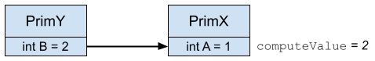
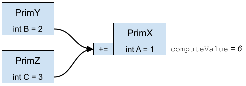
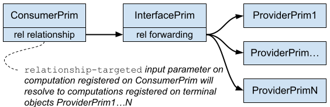
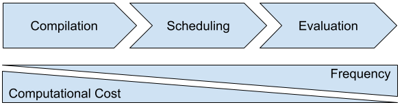

# OpenExec

Version 2 - June 21, 2025

## Background

Many schemas in USD provide computations as part of their C++ schema class interface, for example, `UsdGeomBoundable::ComputeExtent()` or the `UsdGeomXformCache`. Some schemas, like `UsdSkel`, involve more computation than others, and their computational implementations can span several layers of the OpenUSD framework (e.g., imaging). Moreover, there is a desire to grow USD’s computational abilities beyond the existing schemas, for example, in the domain of rigging and posing of characters, as well as constraint target computation.

Additionally, expensive computation often necessitates caching of resulting values, which in turn requires consideration of cache invalidation in response to input value changes. In addition to driving cache invalidation, tracking input dependencies is critical for debuggability, e.g., to be able to query whether a given computed result depends on time.

Lastly, there is a desire to author and combine building blocks for solving computational challenges within a scene. This is especially important for, but not limited to, the domain of character rigging.

## What it is

With OpenExec, we are adding a general-purpose framework for expressing and evaluating computational behaviors in a USD scene. This framework is built on top of USD and introduces new first-class concepts, including custom and built-in named computations associated with USD scene objects. The framework will include a fast, multi-threaded evaluation engine, and data management concepts for automatically caching and invalidating computed values.

Behind the scenes, it builds and maintains a dataflow network with computational tasks encoded as nodes within this network, and data traveling between computations encoded as edges (we use the term “connections”). More on our dataflow network later.

This framework already exists in Presto, Pixar’s in-house digital content creation (DCC) application, where it is called the Presto Execution System. We use this system to support character rigging, direct manipulation, computation of transform hierarchies, attribute inheritance chains, dataflow connections, bounding volumes, constraint target computation, aspects of validation, etc.

The OpenExec project involves open-sourcing this existing system, as well as redesigning how it interfaces with USD when used outside of Presto.

## What it is not

While OpenExec is a general purpose computation framework with the ability to compute values of arbitrary and custom data types, computations cannot modify the topology of the USD stage. For example, a computation cannot output prims or sub-trees of prims, or additional properties on a prim. Nor can it remove these types of objects from the USD stage. OpenExec always observes the composed USD stage.

However, there is no architectural limitation that would prevent one from, say, adding proceduralism to a scene by using computations on `UsdGeomPointInstancer` instead of its authored attribute values.

OpenExec by itself is not a rigging system. Pixar’s rigging system in Presto comprises:

1. The Presto Execution System
2. A rigging object model (OM) built on top of the Execution System
3. A library of deformers and rigging primitives built on-top of the rigging OM

With OpenExec, our immediate plans are to add item #1 to USD. As the project progresses, we also plan on delivering many of the pieces that make up item #2, effectively giving you the ability to implement a rigging OM similar (or equal) to Pixar’s. We have no immediate plans to open-source Pixar’s library of deformers and other rigging primitives (item #3), although we may revisit this decision in the future.

Lastly, OpenExec is a value-driven computation system, as opposed to being event-driven: When an input dependency changes, computed values receive invalidation, and then, when the client next requests results, evaluate to different results. There is no mechanism included with OpenExec that recomputes values as a result of an event triggering (e.g., clicking on an object); scene authoring is the only “event” that can induce recomputation. This means that while there is overlap between OpenExec and application-level interactive behaviors, OpenExec itself is not an interactive behavior system. For example, consider an interactive viewer displaying a car, and clicking on a car door should open said door. With OpenExec, you will be able to build a car-door-rig, which computes the door’s transform value after rotating it around a hinge pivot. The computation might depend on an “openness” attribute value (e.g., 0 being fully closed, 100 being fully opened). OpenExec will automatically invalidate computed values in response to authoring changes on dependent scene objects. However, observing click events and authoring to the openness attribute in response to those events is an application-level responsibility not provided by OpenExec.

## How it works

### Code Organization

OpenExec will ship with the OpenUSD distribution as a set of libraries built on top of USD. In terms of dataflow, OpenExec will observe the composed USD stage, and sit between USD and Imaging. Where applicable, we also plan on modifying imaging to prefer computed values over authored values when both exist.

<picture>
  <source media="(prefers-color-scheme: dark)" srcset="./1-inv.png">
  
</picture>

We are developing OpenExec in pxr/exec. It comprises several new libraries:

* **vdf (vectorized dataflow)** - Low-level vectorized dataflow library. Implements concepts of the dataflow network (nodes, connectors, edges) as well as the low-level evaluation engine and scheduler. The term “vectorized” refers to the fact that the network has the ability to optionally encode the topology of vector data, unlocking additional sparsity and parallelism during evaluation and invalidation. More on this later.

* **ef (execution foundation)** - Foundational execution library. Implements higher-level concepts on top of vdf that form the foundation of a fully functional execution system. For example, ef introduces concrete node types, as well as a scheduler with awareness of higher-level execution concepts and network structure.

* **esf (execution scene foundation)** - A scene abstraction layer closely modeled after USD that enables OpenExec to interface with the scene without creating a dependency on specific USD types. This library provides a mechanism for “journaling” scene access, allowing the system to maintain its internal dataflow network by mapping changes to scene objects to edits of corresponding dataflow network.

* **exec (execution)** - High-level execution library. This is the high-level OpenExec library that interfaces with efs. It is built on top of vdf and ef and introduces the concept of compilation, which converts scene description and computation definitions (see below) into a vectorized dataflow network. Exec maintains this network and updates it in response to scene changes.

* **esfUsd, execUsd** - Specializations of esf and exec, respectively for USD. **execUsd** is the primary library that OpenExec clients will be interfacing with.

OpenExec code leverages concepts from `pxr/base` (e.g., `arch`, `tf`, `trace`, `work`, …) as well as `pxr/usd/sdf`, and `pxr/usd/usd` and will therefore depend on these libraries, as well as appear after them in the build order.

We also want to outfit core USD schemas (e.g., `usdGeom`) with computational behaviors. The core schemas are currently located at `pxr/usd`, where they build after `pxr/usd/usd`. This means that the OpenExec libraries will sit downstream of the core schemas in the library stack. Therefore, we propose placing the code that registers the computational behaviors on core schemas in separate libraries  to be located in `pxr/exec` (e.g. `pxr/exec/execGeom`).

We are considering eventually moving existing USD core schemas outside of `pxr/usd` into a separate library downstream of `pxr/usd` and `pxr/exec`. This would solve the library dependency problem (amongst other things), and make for a cleaner library structure. Such a change, however, would require mainly mechanical but rather significant updates to client code (like header include paths and linker arguments), which makes us hesitant to move forward with this at the current time.

### New concepts

OpenExec will introduce new, first-class concepts to USD:

* Named computations provided by USD scene objects (e.g., prims and properties)
* Static, declarative input parameters to computations
* Custom computation callbacks
* Execution behavior registration as an extension to USD schema registration
* *Actions* for “affecting” (i.e., driving) computed values, and execution markers for locating the sources of a computed value in a stack of actions
* Client API for requesting computed values

#### Named Computations

With OpenExec, any USD scene object can be a computation provider, publishing an arbitrary number of named computations. 

Every computation will take zero or more input parameters (typically at least one), as well as a C++ computation callback responsible for reading input values, performing the computational work, and then outputting values (typically one).

Computations are published from two sources:

1. **Built-in computations**: These are computations that every USD object automatically publishes by default (e.g., a computation that provides the scene graph path of the object), or that every USD object of a specific type publishes by default (.e.g., a computation that provides the resolved value of a `UsdAttribute` object).

2. **Registered computations**: Schema registration will be extended with the ability to register arbitrary computations that perform computational work as defined by a C++ callback (e.g., a computation `computeExtent` registered on `UsdGeomBoundable` doing the work equivalent to `UsdGeomBoundable::ComputeExtent()`).

Named computations can be referred to by using an `ExecUsdValueKey`, which takes the computation provider path and the computation name token.

#### Input Parameters

Input parameters allow computations to ingest anything from resolved attribute values to results of other computations. Moreover, such attributes and computations may live on any prim or property in the scene. In order to find these values, therefore, the execution system may need to, for example, traverse a relationship, or look up or down the transform hierarchy.  As part of its computation definition language, OpenExec provides different input parameter types with which to specify how a computation should source its inputs in these and other cases. 

In practice, most computations take at least one input parameter with the exception of constant computations that always return the same value, serving as sources (root nodes) to the computational network. Constant computations are typically built-ins as opposed to registered computations.

An input parameter sources one or more values from the outputs of other computations in the computational dataflow network that OpenExec maintains under the hood. The computation on the source end need not be published on the same scene object as the consuming computation, so in order to resolve the input parameter to the source computation, input parameters generally encode three pieces of information:

1. **Computation provider resolution**: This determines the scene object the system is going to use in order to look up the computation by name. The OpenExec extensions to USD schema registration (see below) will provide many different kinds of inputs with unique provider resolution behaviors (e.g., an attribute input that resolves to a named `UsdAttribute` on a prim, or a relationship-targeted input that resolves to zero or more scene object(s) targeted by a specified `UsdRelationship`). 
2. **Computation name**: This is the name of the source computation as built-in, or registered on the computation provider explained above.
3. **Computation result type / input value type**: OpenExec dataflow values are strongly typed. This denotes the data type of the input value as expected by the computation callback, and it must match the data type of the output value returned from the source computation.

Every input parameter provides zero or more input values to the computation callback. For example, a relationship-targeted input, as mentioned, above may not resolve to any source computations if the specified `UsdRelationship` does not have authored targets, or if the targeted objects do not publish a computation with the specified name or result type. Conversely, the input parameter can resolve to more than one source computation if there are multiple authored targets.

Computation callbacks use iterator concepts (see example below) to expose the individual dataflow element values on inputs. This mechanism allows the system to hide (and optimize) implementation details about how vector values travel through the dataflow network, without leaking such details into user-provided callback code.

Input parameters map to one or more input connectors on a dataflow node, and are referred to via a `TfToken` name. Every input parameter has a default name as determined by the type of input that it is (in most cases, the input name is the name of the requested computation). In order to avoid name collisions, for example when multiple input parameters of the same type are used, input parameter names can be customized by augmenting the computation registration.

Mechanics of input parameter registration aside (covered below), it should be noted that once an input dependency has been declared *a priori*, the dependency is static with respect to evaluation. During evaluation, it is generally not possible to dynamically decide whether an input dependency should be satisfied or not. The evaluation engine will always make sure it is satisfied, even if the callback does not consume the resulting value. There are exceptions to this rule that go beyond the scope of this document.

#### Computation Callbacks

The computation callback is responsible for performing the computational work of a named computation. It manifests as a C++ function object.

The system treats callbacks as black boxes, but requires them to be side-effect free and stateless. This means that if a callback is invoked with the same input values, it is always expected to return the same output value(s). All state relevant to the callback is passed through input connectors. The callback is further expected not to make modifications to global state. This is an important limitation that enables OpenExec’s powerful and efficient data management and caching mechanisms, as well as basic thread-safety guarantees that every callback must satisfy (callbacks cannot opt out of parallelism). 

It is guaranteed that input dependencies are evaluated prior to computations that directly or transitively depend on these input values, but no other assumptions can be made about when a specific callback is invoked. In fact, callbacks will execute in parallel with other callbacks, other instances of the same callback, and other arbitrary code. Since output values are automatically and aggressively cached, the engine will not invoke a callback until it determines that the callback would produce a value that the system has not already cached (e.g., input values changed or caches have been invalidated, etc.)

In practice, most callbacks produce exactly one output, though this is not a limitation of the system. It is important to keep in mind, however, that the evaluation engine (more specifically its data manager) owns and manages the lifetime of output values produced by callbacks. Since input values are just output values sourced from other computations, the same is true for input value lifetime management.

Output values become non-mutable, as soon as the callback returns. Remember that output values are fed as input values to other computations, i.e. input values are also treated as constants within callbacks. Inadvertently mutating state internal to input values violates basic thread-safety guarantees, as multiple callbacks will read from the same input values in parallel.

To enforce the limitations mentioned above, callbacks are generally required to take the form of a free-standing, static function, or a non-capturing lambda converted to a function pointer using the unary `operator+()`. Constant input values are read, and output values are written, through a single const-reference to `VdfContext` parameter. However, for convenience, facilities exist to extract input values through the context objects and pass them to the callback through function arguments, as well as move the function return value to a single output.

In OpenExec, every callback instantiation maps to a single node in the dataflow graph, though the inverse is not true: Not all dataflow nodes also have a corresponding registered or built-in computation callback.

#### Computation Registration

OpenExec will extend USD’s schema registration facilities and provide the ability to register computations on schemas. The new execution behavior registration will populate an exec registry (analogous to the USD prim registry), which in turn will generate exec computation definitions (analogous to USD prim definitions) as an input to dataflow network compilation.

Exec registration introduces a domain-specific language built from C++ meta-programming constructs, not unlike `pxr_boost::python` or `pybind11` python wrapping language. We will not initially deliver the ability to register execution behaviors or implement computation callbacks outside of C++.

Once the client requests a computation, the system will automatically load the plugin that defines the exec registration code, and execute it to produce computation definitions.

#### Dynamic Registration (Configuration)

In Presto, prim- and execution registrations provide a builtin dynamic layer that enables registrations to be re-executed in response to value changes of special, dedicated attributes. We call this *configuration*, and it enables schemas to present a different interface (registered properties and execution behaviors) based on an authored attribute value. For example, the number of links in a sausage gprim, or selecting between two different versions of a deformer. Many of the use cases of configuration have since been subsumed by the advent of applied API schemas, which in Presto are predated by configuration. Thus, we do not currently have plans to add general configuration capabilities to USD prim and schema registration.

However, as mentioned above, input dependencies on computations are static. And while in some cases, a computation may end up ignoring certain input values at evaluation time, but the computational dependencies on the ignored input values still persist. There are cases where these unneeded dependencies negatively affect performance, and therefore we are proposing adding dynamic execution registration to OpenExec.

This mechanism will allow selected metadata to be flagged as *configuration metadata*. The system will monitor these attributes for value changes, and then re-execute portions of the exec registration as contained within a *configuration callback*. The configuration callback will have the ability to effectively un-register, and re-register computations that differ in their input dependencies or other aspects of execution behavior registration.

#### Actions and Execution Markers

In Presto, computations can alias attributes, meaning calling the equivalent of `UsdAttribute::Get()` may return a computed value instead of an authored value. This is manifested through two Presto-specific concepts:

1. **Attribute expressions**: Execution registration in Presto gives users the ability to register a computation as the value-provider for an attribute. Scene description API will then return the result of this computation instead of the attribute’s authored value – unless the authored value is specifically requested.

2. **Action Prims**: Actions provide controller-like behavior expressed via relationship targets, targeting attribute(s) in the scene. The action provides a computation that “drives” (“affects” in OpenExec lingo) the targeted attribute value. Action computations see the attribute value before the action takes effect as an input value and have the opportunity to modify or overwrite this value. Multiple actions can target the same attribute(s) and form an action stack – a deformation chain – executed in reverse namespace order. When querying an attribute that is affected by action(s) for its value, an **execution marker** needs to be provided to disambiguate which attribute value (as in, after which action in the stack) the client is requesting. The system also provides canonical execution markers, such as at-final to refer to the computed value after all actions affecting the requested attribute have been executed. When querying the value of an affected attribute through scene description API, Presto will return the computed result at-final by default, unless the value is requested at a different execution marker.

The ability to alias and affect attributes is a powerful concept, especially in the domain of character rigging, so we are planning on bringing this feature set to OpenExec.

With OpenExec, we have the opportunity to refine how computations relate to attribute values as provided by scene description APIs, and we decided not to allow aliasing at the scene-level. This means that a computation can never assume the identity of an attribute. With OpenExec, when querying an attribute value in USD, it will return the same authored value it always did prior to OpenExec. However, attaching an expression to an attribute or affecting an attribute through an action in OpenExec will bifurcate the attribute’s value, not changing the meaning of its authored value, but implicitly creating a computation identity for the computed value. The latter can only be requested through an `ExecUsdValueKey` that refers to the `computeValue` built-in computation provided by the `UsdAttribute`.

When requesting an attribute’s computed value via a value key as mentioned above, the system will automatically return the authored value if there is no computed value. This means that using OpenExec APIs, clients can expect to always get the computed value if there is one, with implicit fallback to values authored in the scene if there is no relevant computation to be performed.

#### Connectable Behaviors

With OpenExec, authoring connections between `UsdAttribute`s implies dataflow between those attributes by default. For example, requesting the `computeValue` builtin computation provided by an attribute A, which is connected to attribute B, will return the result of the `computeValue` builtin computation provided by attribute B. In effect, attribute A is then aliasing the computed value of the connected attribute B, a mechanism critical to building interfaces between independent object models.

Note that OpenExec will define semantics that apply to all attribute connections by default, but it will also be possible for schemas to specialize the meaning of attribute connection dataflow (including turning it off) for particular domains. E.g., shader schemas will likely need to specialize how connections flow data through shading networks.

<picture>
  <source media="(prefers-color-scheme: dark)" srcset="./2-inv.png">
  
</picture>

##### Authored Combiners

In the example above, `UsdAttribute` A has its own authored value. Furthermore, the attribute may be connected to more than one other attribute. A combiner, which is a specialized expression (see below), can be authored to the attribute to tell OpenExec how to combine relevant authored and computed values.

Here is a non-exhaustive list of proposed builtin combiners:

* **Plus (+)** - combines connected attributes by adding their `computeValue` results
* **PlusEquals (+=)** - combines connected attribute by adding their `computeValue` results, as well as adds the attribute’s own authored value
* **Times (*) **- combines connected attributes by multiplying their `computeValue` results
* **TimesEquals (*=)** - combines connected attributes by multiplying their `computeValue` results, as well as multiplies the attribute’s own authored value

<picture>
  <source media="(prefers-color-scheme: dark)" srcset="./3-inv.png">
  
</picture>

##### Expressions

Connectable behaviors are computed by a builtin `computeExpression` computation that every attribute provides. The `computeValue` builtin internally depends on the result of `computeExpression`. Unlike the former, we currently propose that `computeExpression` may be overridden through exec registration. This enables schema authors to provide alternate implementations of connectable behaviors – including turning off dataflow entirely.

All connectable behaviors (including authored combiners and expressions) are evaluated prior to actions affecting the same attribute. This means that the first action will observe – as an input – the result of connections, combiners and expressions.

##### Relationship Forwarding

Relationships generally do not participate in dataflow the same way that connections do. Thus, there is no implied dataflow imparted by authoring targets on relationships. However, depending on the type of input parameter used, OpenExec has hardcoded behavior for resolving the computation providers of the input parameter.

Input parameters that provide values sourced via relationship targets will automatically resolve the input computation provider to the terminal targeted objects in a chain of relationship targets passing through one or more other relationships. This behavior again is critical in modeling interfaces where a relationship can be exposed as a “gateway” into computations hidden behind said interface.

<picture>
  <source media="(prefers-color-scheme: dark)" srcset="./4-inv.png">
  
</picture>

#### Baking Computations

Prior to OpenExec, USD scenes were by design non-computational with respect to their values. There was a fixed cost associated with getting an authored value from the scene, even if said value was varying over time.

With the advent of OpenExec, and depending on the scene, values may need to be computed, which can incur arbitrary cost. We are planning on providing facilities for users to transform their scenes (or subset of their scene) into a state that is guaranteed not to require computation.

We do not yet have a proposal ready to share for baking computations into authored values.

#### Client API

Besides execution registration, clients will interface with OpenExec by making requests for computed values. Clients are first required to construct an execution system object instance, which maintains the execution state (e.g., dataflow network, schedules, etc.) tied to a specific USD stage. 

The `ExecUsdSystem` instance maintains a shared reference to the USD stage, though the object will typically live alongside the stage and not outlive it. Multiple instances referring to the same USD stage may be constructed, although caches are not shared across instances. It is typical for one system instance to live along one USD stage.

Values computed by OpenExec will be automatically and aggressively cached. Cached values will be invalidated in response to changes on the USD stage.

##### Requesting Values

In order for OpenExec to provide computed values, the system must complete the following steps:

1. Relevant dataflow network must be compiled. This network is stored within the `ExecUsdSystem`, and maintained across edits to the USD scene. The relevant parts of the network are compiled the first time a value keys is requested, but can then be re-used for subsequent computation of the same value key.
2. A schedule must be built to perform evaluation with. Schedules are an acceleration structure for the evaluation engine. They are cached within `ExecUsdRequest` objects. The total set of all requested value keys is batched into one schedule, and the same schedule can be used for many subsequent rounds of evaluation.
3. Evaluation must be performed to invoke the callbacks and cache the computed values. Requested values, and intermediate computed values, are aggressively cached within the `ExecUsdSystem`.

The runtime cost (and to some extent the memory cost) of all three steps above heavily amortizes over making batched requests for values. Requesting one value key at a time is pessimal for OpenExec performance, and performance-sensitive clients will often attempt to request **all** required value keys in one batch, before making decisions based on the computed values.

OpenExec’s lowest level API for requesting values – `ExecRequest` – is built to encourage this pattern, and incur the lowest possible performance overhead.

Once a request has been computed, resulting values can be extracted given the index of the value key in the request.

Alternatively, values can be extracted without indices by using value keys. This comes at a slightly higher cost, due to an extra level of indirection and the cost of constructing a value key.

The evaluation engine computes values in parallel and can produce results asynchronously. We are going to expose this capability through the client API:

##### High-Level API

We will provide higher level APIs to facilitate building of requests, as well as computing and extracting requested values on code-paths that are less performance critical. These concepts will trade off some level of performance for increased API ergonomics, and we are specifically targeting use cases where existing code would need to be ported to become OpenExec-aware.

##### Receiving Notification about Invalidation

OpenExec also provides a mechanism for receiving invalidation notification when input dependencies on previously computed values changes, causing their previously computed values to go invalid:

An invalidation callback function object can optionally be provided when a `ExecUsdRequest` is built. Upon invocation, this callback will provide a set containing the indices of value keys with invalidated values. The callback also provides a time range over which the value keys have been invalidated.

Notification will only be sent out for computed values that have previously been requested, and only when a value is invalidated for the first time after it has last been computed. To renew their interest in receiving invalidation notification, clients are expected to make another request for computed values before further invalidation is sent out.

Calling into OpenExec – for example to immediately compute values – from within an invalidation callback is not supported. Instead, callbacks are expected to be used for invalidating client-held state and data structures dependent on previously computed values.

### Architecture

OpenExec consists of three major subsystems:

1. **Compilation**: Turns computation definitions (resultant from execution registration) in combination with the authored USD scene into dataflow network. Compilation is also responsible for responding to changes to the USD scene and maintaining the dataflow network to be up-to-date with the authored scene. Structural edits (e.g., reparenting a prim) causes un-compilation of sub-network affected by the edits, and the affected subnetwork is re-compiled the next time the client requests a computed value.. Changes that are not structural in nature (e.g., attribute value changes), do not trigger compilation and are instead handled by value invalidation and dataflow network value initialization prior to evaluation. Decoupling the dataflow network from scene description through compilation enables the object model (OM) to leverage richer, higher-level concepts that can evolve separately from the evaluation engine. In a way, the language expressing execution behaviors through execution registration and scene description can be thought of as a complex instruction set that gets mapped to a much reduced instruction set (the dataflow network) through compilation.
2. **Scheduling**: Traversing large graph structures is comparatively inefficient (pointer chasing), unless the graphs are laid out in contiguous traversal order in memory. OpenExec dataflow networks are generally too complex to be reliably laid out optimally for common traversal paths. Also, different clients may require different traversal paths through the same network. Schedules are a way of addressing this problem. They serve as an acceleration structure for evaluation, generally guaranteeing that dataflow nodes are visited no more than once, and that data is accessed in contiguous order. Schedules are specific to request objects (keying off the set of requested values), and they are cached so that frequently making the same request for values does not incur repeated scheduling costs.

3. **Evaluation**: This is the process of evaluating dataflow nodes to satisfy a request for values. Nodes are processed as laid out in the schedule, traversing the dataflow network in a pull-based fashion: Starting at the leaf nodes, the evaluation engine traverses data dependencies until a cache hit or a root node is discovered. Then, unwinding the evaluation stack, node callbacks are invoked beginning with the root nodes, and nodes with fully cached input dependencies. Nodes are evaluated in parallel, only synchronizing on their input dependencies. Computed values are intelligently managed and aggressively cached along the way.

The three subsystems – or stages of execution – are listed in order of operation for when a request for computed values is made. Just like USD in general, OpenExec is designed with pay-for-what-you-use in mind: When making a request for computed values, the resulting dataflow network, schedule and evaluation work is limited to the computations requested (along with their dependent computations), as opposed to all computations registered on the stage.

The three stages are also listed in order of increasing frequency, and in decreasing order of computational cost: Compilation is very expensive, but only occurs after structural changes to the USD stage have been made. Evaluation is comparatively fast, but typically occurs for each rendered image, for example, after changing values in the animation interface of a character rig, or evaluating a time-dependent computation during playback.

<picture>
  <source media="(prefers-color-scheme: dark)" srcset="./5-inv.png">
  
</picture>

Speaking of time, it should be noted that OpenExec treats time as an input value to the dataflow network, and initializes a special root node with the current time code. A transitive, topological dependency on this special root node indicates that a dataflow node – and therefore a computation – is time-dependent. When setting a new time value, however, no topological edits need to be made: Value invalidation will automatically flag all time-dependent data as invalid, before value initialization sets a new time code on the time input node. During the next round of evaluation, time-dependent computations will be re-computed with the new time code value.

It has been mentioned above that OpenExec’s dataflow network is a **vectorized** dataflow network. This means that, in addition to scalar values, connections can flow vectors of data, and the topology of these vectors can be surfaced in the network topology itself. Connections in the OpenExec network are outfitted with masks (run-length encoded, fly-weighted bitsets) that indicate which specific elements in the vector a computation depends on. On connections that flow scalar values this mask is typically set to length one (1), value one (1).

Encoding vector topology in the network enables compilation to produce an optimized network that stores data of the same data type (e.g., many short curves) contiguously in memory, without producing false data dependencies. It also enables deformers to limit themselves to an operational subset of mesh points as bounded by weighting. The evaluation engine also exploits this additional information to track per-vector-element data dependencies and automatically extracts additional parallelism. The disadvantage of this encoding scheme is that these types of vectors are of fixed topology with respect to evaluation itself. For example, in Presto, character deformation cannot change the authored mesh topology, unless this evaluation fast-path is opted out of.

## The plan

As mentioned earlier, much of the OpenExec functionality and architecture already exists in the form of the Presto Execution System. Our plan involves open-sourcing as much of this system as it makes sense for the types of computations that we would like to support in USD, translating concepts from Presto to USD along the way. Once existing concepts have been ported to USD, we plan to leverage the OpenUSD community to evolve and improve OpenExec.

### New Exec Compiler

While the execution engine and scheduling sub-systems can be ported to USD in a straight-forward manner, porting compilation is more challenging: Presto introduces concepts that are not found in USD, or that have been subsumed by other features in USD. Furthermore, there are significant differences in the scene description APIs, as well as semantic differences between how scene description objects behave. To address these challenges, we are building a new compiler in OpenUSD, with the intention of it eventually replacing the one internal to Presto.

<picture>
  <source media="(prefers-color-scheme: dark)" srcset="./6-inv.png">
  
</picture>

To eventually be turned into:

<picture>
  <source media="(prefers-color-scheme: dark)" srcset="./7-inv.png">
  
</picture>

We initially considered porting the existing Presto Compiler to USD, but this approach would have introduced several complicating factors:

1. The existing Presto compiler is large in code size, and supports many features. We were unable to find a straightforward way to port this code outside of an all-or-nothing approach. Having to port all of the existing compilation code dramatically increases the scope of this task – slowing down OpenExec progress. We prefer to land OpenExec features in the USD distribution in an incremental fashion, unlocking its full feature set over time.

2. The Presto compiler exercises aspects of the scene that are not found in USD, or have been supplanted by more modern patterns in USD. Moreover, a few of the existing features are infrequently exercised, and of questionable value outside of the studio. We believe that some of this code would then be introduced as baggage into OpenUSD. We prefer revisiting the feature set from first principles, giving us the opportunity to decide whether a specific feature should be carried forward into OpenExec, or revisited in favor of a more modern pattern.

3. The Presto compiler is tightly coupled to Presto scene APIs, some of which have no equivalence in USD (as per point #2). Porting the compiler would require a layer of abstraction for scene access, which constitutes a significant refactor and further shifts the cost-benefit analysis in favor of revisiting the compiler architecture from first principles.

4. There are two architectural deficiencies in the Presto compiler architecture that the team has been planning to address: 1) Some code paths for first-time compilation are different from the code paths for re-compilation in response to processing scene changes. This carries a code maintenance burden. 2) The compiler architecture was built on top of scene description libraries that didn’t allow for concurrent access, and therefore it wasn’t designed with concurrency in mind. Although some multithreading was retrofitted, designing the relevant data structures with concurrency in mind promises big performance improvements.

With the new OpenExec compiler we are solving these challenges, while maintaining the ability to reference the existing Presto compiler and ensuring that compilation output is consistent between the two systems. Rather than rewriting the compiler from scratch, our strategy is to focus on architectural advancement while duplicating the algorithmic behaviors of the existing Presto compiler.

At the core of this new compilation architecture, OpenExec will introduce a stateless, light-weight scene access abstraction layer: `EsfStage`. This facility serves two purposes:

1. The `EsfStage` will maintain a journal of queries made of the scene, and connect those journal entries to the generated dataflow sub-network. This automatically records which scene changes should lead to un-compilation, and eventual re-compilation, of specific parts of the dataflow network.
2. It allows the compiler to ask questions about the scene through an interface that is consistent regardless of whether it is talking to a USD or Presto scene. Since, this is not a fully generic abstraction layer, it will mirror concepts that are common between USD and Presto (and since a Presto scene is a superset of USD, there are many such common concepts).

### Phase 1 - Minimally Featured Product

The first phase of the OpenExec project involves building a “minimally featured product”. This implies an implementation that only includes the minimal set of features required for a cherry-picked use-case of computational behaviors in OpenUSD: For this deliverable, we are adding a set of computations that interprets xform ops and produce world-space transform matrices on xformable gprims. We are not yet replacing any existing transform computations in OpenUSD with the OpenExec implementation.

We are planning on delivering this functionality by June 2025, in time for SIGGRAPH 2025. This first deliverable will enable users to explore the implementation, public APIs and some documentation, experiment, and give early feedback if so desired. This is very much a sandbox release, and all public APIs are subject to change based on feedback received internally and from the community.

### Phase 2 and Beyond

Computing the transform hierarchy through OpenExec serves as a great test bed for performance and scalability,  and allows us to iterate and improve on the system design. However, we think that entirely replacing OpenUSD’s transform hierarchy computations with an OpenExec implementation is a very large project, and will require careful client code updates.

While we still plan on ultimately completing this project, we are aiming to make use of OpenExec in a more additive fashion initially.

With phase 2 and beyond, our goals for OpenExec are threefold:

1. Incrementally deliver new features, and reach parity (and beyond) with Presto’s execution system.
2. Iterate on performance and scalability improvements along the way.
3. Leverage the computation framework by adding features to USD, or replacing existing USD features where there is a clear performance or usability advantage.

### Late Phase

In the long term, we are planning on deprecating and eventually removing schema methods that currently provide computational behaviors in OpenUSD. We expect these methods to be replaced with OpenExec computations. The required code transformations call for an extended deprecation period, and we will provide utilities and guidance to facilitate the eventual transition away from the deprecated schema methods. In the meantime, we will maintain both the existing schema methods, and any potentially newly added OpenExec computations.
