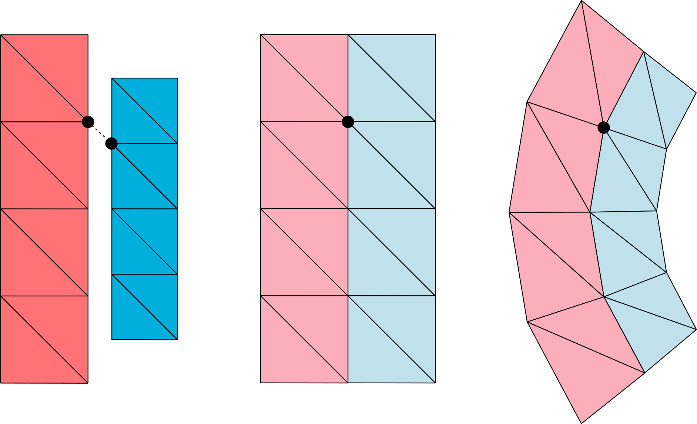
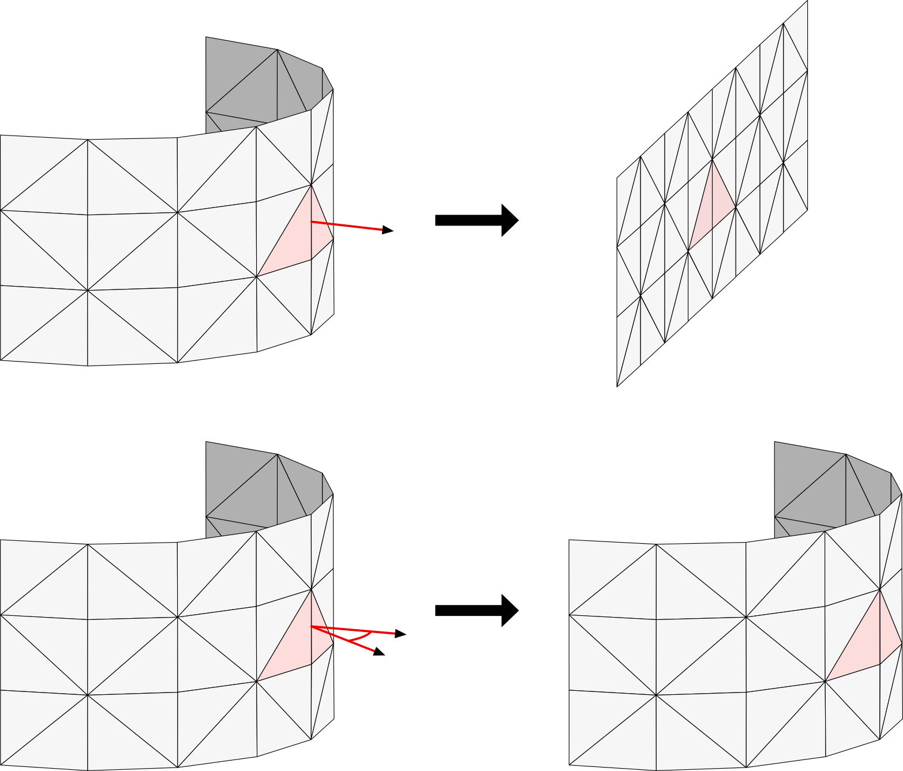
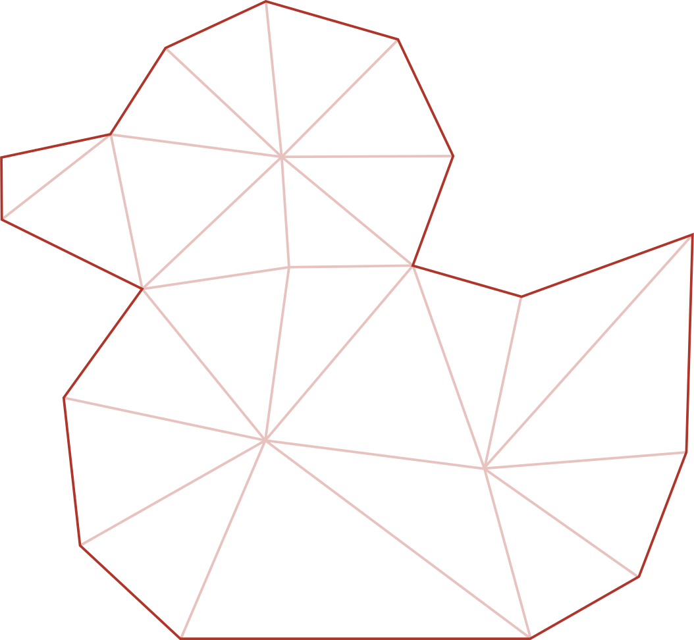
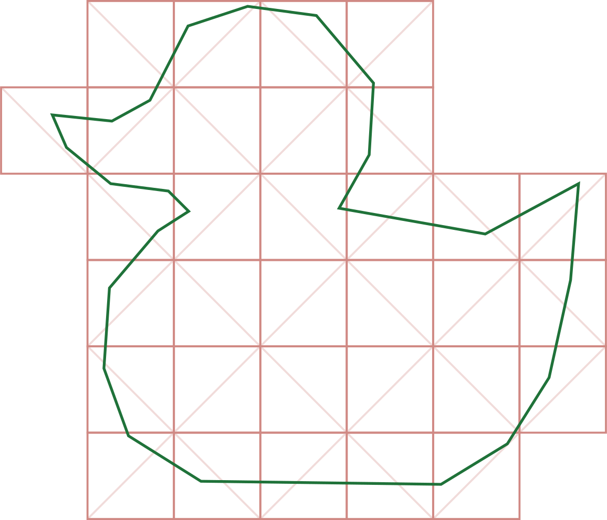
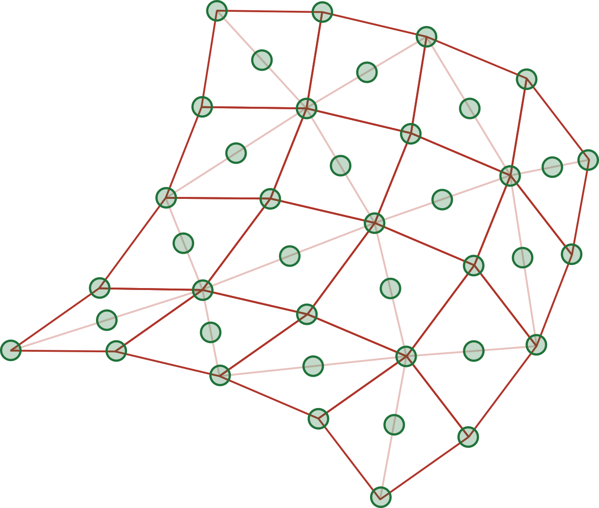
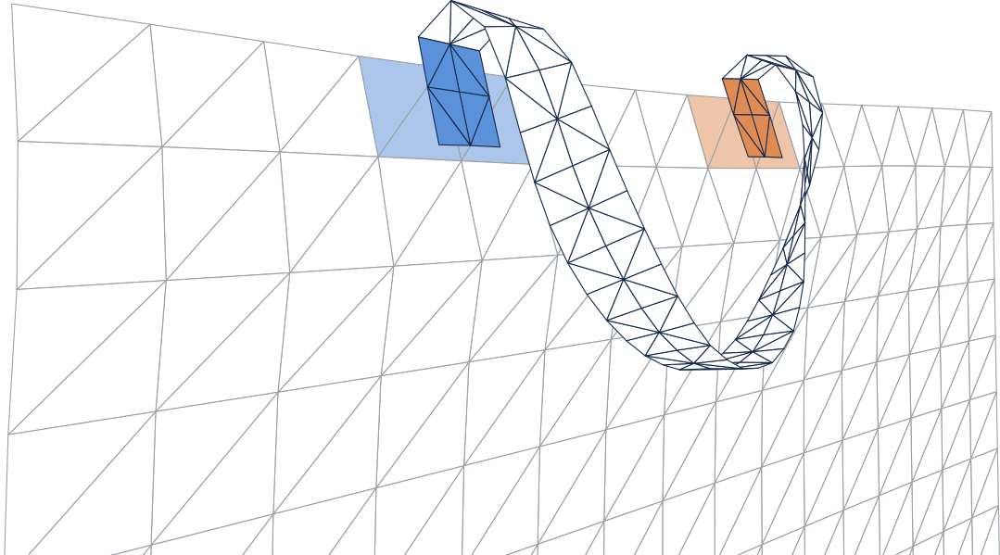

# Deformable Body Physics in USD Proposal

- [Purpose and Scope](#purpose-and-scope)
- [Guiding Principles](#guiding-principles)
- [USD Implementation](#usd-implementation)
  - [Scenes](#scenes)
  - [Rigid Body Refactor](#rigid-body-refactor)
  - [Physics Material](#physics-material)
  - [Deformable Materials](#deformable-materials)
  - [Deformable Bodies](#deformable-bodies)
  - [Simulation Geometry and Rest Shape](#simulation-geometry-and-rest-shape)
  - [Rest Shape Attributes](#rest-shape-attributes)
  - [Collision Geometries](#collision-geometries)
  - [Graphics Geometries](#graphics-geometries)
  - [Geometry Embeddings](#geometry-embeddings)
  - [Assigning Materials](#assigning-materials)
  - [Mass Distribution](#mass-distribution)
  - [Kinematic Deformables](#kinematic-deformables)
  - [Attachments](#attachments)
  - [Element Collision Filtering](#element-collision-filtering)

## Purpose and Scope

After extending USD with the ability to express rigid body physics simulation concepts in 2021, the USD Physics working group has decided to prioritize further extending USD with concepts to express deformable body dynamics. This specification defines a similarly basic set of abstractions for expressing the initial conditions for the simulation of elastic deformation, including that of volumes, surfaces (e.g. cloth, shells) and curves (e.g. hair, strands). Concerns around plastic deformation were left for a future extension.

Fewer generally available and commonly used tools and libraries exist for deformable simulation than for rigid body simulation, which made the search for a common set of abstractions more difficult. The same assumptions about target applications that were made for the USD Physics rigid bodies schema are made for deformables too: that the schema is primarily meant to serve interactive 3D graphics applications, and that users will be adding simulation capabilities to existing graphics-only USD content. A seamless extension of USD is intended, with the new simulation capabilities being made to interoperate with the existing rigid body abstractions, so that soft objects, cloth, hair, or fur can be represented and believably simulated.

> **Design Note**
>
> Initially, it was planned to modify the original USD Physics schema for rigid bodies to integrate deformables in a way that included significant refactors of the existing schema to combine commonalities. Ultimately, the importance of formulating the USD Physics deformable bodies schema using minimal changes in a manner that preserves backwards compatibility was recognized. This approach ensures that both current and future applications can load existing assets as well as those that include deformables.

## Guiding Principles

As for the USD Physics rigid bodies schema, the intention was to focus on real-world concepts rather than on simulation-specific abstractions, unless those abstractions were overwhelmingly common and helpful. In particular, real-world engineering quantities are used for material properties. USD's preference for unit independence is maintained. The pattern established in the USD Physics rigid bodies schema is also continued, in which material properties are added to materials rather than to the simulated objects directly. The concept of physics scenes is retained. The USD design principle of preferring the use of existing classes or the addition of APIs to existing classes before introducing new prims is also adhered to.

As with rigid bodies, all physics objects, now including deformables, automatically collide and interact by default.

## USD Implementation

### Scenes

The USD Physics rigid bodies schema established the concept of physics scenes to enable multiple independent simulations within a single stage with different settings for fundamental properties such as gravity. Like rigid bodies, deformables conceptually simulate in a scene. Everything in a scene interacts by default, and things in different scenes do not interact. The gravity of a scene is applied to all the deformables in the scene. Deformables are associated with a scene in the same manner as rigid bodies, using the `simulationOwner` attribute.

### Rigid Body Refactor

The USD Physics rigid bodies schema introduced the `UsdPhysicsRigidBodyAPI` class. The member attributes `kinematicEnabled`, `simulationOwner`, and `startsAsleep` from this class can be reused for deformables; however, the `velocity` attributes are not needed on deformables as they generally have different local velocities at different points, and the `rigidBodyEnabled` attribute needs to be renamed to generalize it. To address this issue, a new pseudo-base class, `UsdPhysicsBodyAPI`, was created by splitting it out from `UsdPhysicsRigidBodyAPI` and moving the shared attributes to it. It is here referred to as a pseudo-base class because, in practice, API inheritance is no longer supported in USD. Therefore, `UsdPhysicsRigidBodyAPI` and `UsdPhysicsBodyAPI` are independent APIs which are both applied to a rigid body. To maintain backwards compatibility, `UsdPhysicsRigidBodyAPI` is extended with custom code to access the shared attributes now defined in `UsdPhysicsBodyAPI`. A new `bodyEnabled` attribute is introduced, and `rigidBodyEnabled` is retained for backwards compatibility.

> **Design Note**
>
> To preserve existing content, `UsdPhysicsRigidBodyAPI` continues to support `rigidBodyEnabled` via custom accessors. Authoring the enable state through either API results in the corresponding value being written to the new `bodyEnabled` attribute, while reads resolve authored opinions from both attributes. Validators can be used to check consistency when both attributes have authored opinions. This approach leaves a clear path to deprecation of `rigidBodyEnabled`.

```usda
class "PhysicsBodyAPI"
(
    inherits = </APISchemaBase>
)
{
    bool physics:bodyEnabled = true ()
    bool physics:kinematicEnabled = false ()
    rel physics:simulationOwner ()
    uniform bool physics:startsAsleep = false ()
}

class "PhysicsRigidBodyAPI"
(
    inherits = </APISchemaBase>
    prepend apiSchemas = ["PhysicsBodyAPI"]
)
{
    bool physics:rigidBodyEnabled = true ()
    vector3f physics:velocity = (0.0, 0.0, 0.0) ()
    vector3f physics:angularVelocity = (0.0, 0.0, 0.0) ()
}
```

### Physics Material

The USD Physics rigid bodies schema introduced the `UsdPhysicsMaterialAPI` class, which includes attributes for density, surface friction (dynamic and static) and collision restitution. The density and surface friction attributes are reused for deformables. The restitution coefficient is not applicable to deformable abstractions, as their elasticity behavior is inherently simulated.

```usda
class "PhysicsMaterialAPI"
(
    inherits = </APISchemaBase>
)
{
    float physics:dynamicFriction = 0.0 ()
    float physics:staticFriction = 0.0 ()
    float physics:restitution = 0.0 () # ignored for deformable bodies
    float physics:density = 0.0 ()
}
```

> **Design Note**
>
> The material of the USD Physics rigid bodies schema defines dynamic and static friction coefficients for the surface domain to which the material is applied. More specifically, they represent coefficients of an isotropic Coulomb friction model between two rigid bodies in contact, also commonly referred to as *dry friction*. Coulomb friction is generally independent of the relative tangential velocity of the rigid bodies at a given contact point, with the exception of static friction, which applies only when the tangential velocity is zero.
>
> Many rigid body and, even more commonly, deformable body simulators ignore static friction. Specifying it for both rigid and deformable surfaces is nevertheless well motivated, as the static friction coefficient is an integral aspect of the Coulomb friction model.
>
> It should be noted that simulators may support more sophisticated friction models via schema extensions.

> **Design Note**
>
> In contrast to the refactor of the `UsdPhysicsRigidBodyAPI`, no common base material API is introduced. The existing `UsdPhysicsMaterialAPI` is reused directly for deformable bodies, with the `restitution` attribute documented as being ignored in that context. Introducing a dedicated base type to avoid this ambiguity would have required a new name — such as `UsdPhysicsBaseMaterialAPI` — as the `UsdPhysicsMaterialAPI` name is already taken, and its generic nature makes it suitable for direct reuse.
>
> The refactor of the `UsdPhysicsRigidBodyAPI` was better motivated: its rigid-body-specific name made it unsuitable for reuse as a common base, prompting the introduction of a new `UsdPhysicsBodyAPI`. This was reinforced by the presence of the `velocity` and `angularVelocity` attributes, which are not applicable to deformable bodies since these generally have different local velocities at different points.

### Deformable Materials

Three new material APIs are introduced: `UsdPhysicsVolumeDeformableMaterialAPI`, `UsdPhysicsSurfaceDeformableMaterialAPI` and `UsdPhysicsCurvesDeformableMaterialAPI`, each extending `UsdPhysicsMaterialAPI` with properties to specify the deformable behavior.

The USD schema defines fallback values for unauthored attributes. Attributes with physical units depending on distance, time or mass use special fallback values called *sentinel values*, indicating that a suitable default is chosen by the simulator (hereafter referred to as a *simulator default*). This is necessary because appropriate values for such attributes depend on the stage's unit settings.

`UsdPhysicsVolumeDeformableMaterialAPI` introduces the important engineering concepts of Young's modulus and Poisson's ratio as attributes:

- `youngsModulus` has units of mass/(distance·seconds·seconds), equivalent to force/area, a range of [0, inf), and a fallback value of -inf (simulator default).
- `poissonsRatio` is unitless, has a range of [-1.0, 0.5], and a fallback value of 0.3.

`UsdPhysicsSurfaceDeformableMaterialAPI` introduces properties for thin shells, including thickness and three distinct stiffness parameters for the deformation modes - stretch, shear, and bend:

- `thickness` has units of distance, a range of (0, inf), and a fallback value of -inf (simulator default).
- `stretchStiffness`, `shearStiffness`, `bendStiffness` have units of force/area, a range of [0, inf), and a fallback value of -inf (simulator default).

`UsdPhysicsCurvesDeformableMaterialAPI` introduces properties for deformable curves, including thickness and four distinct stiffness parameters for the deformation modes - stretch, shear, bend, and twist:

- `thickness`, `stretchStiffness`, `shearStiffness`, `bendStiffness` as covered above.
- `twistStiffness` has units of force/area, a range of [0, inf), and a fallback value of -inf (simulator default).

`UsdGeomBasisCurves`, the geometry type used for curve deformables, defines a `widths` attribute for rendering. The material's `thickness` parameter is intentionally separate, as the physical thickness that governs simulation behavior often needs to differ from the graphical width.

The `thickness` attribute for surface and curve deformables is needed to compute masses based on material density.

It is permitted to apply multiple physics material APIs to a single material. This makes it possible to use the material on both rigid objects and various types of deformable objects. For example, a general-purpose physics material instance, "rubberMaterial", can be defined by applying `UsdPhysicsMaterialAPI`, `UsdPhysicsVolumeDeformableMaterialAPI`, `UsdPhysicsSurfaceDeformableMaterialAPI` and `UsdPhysicsCurvesDeformableMaterialAPI` in combination. This means that e.g. the dynamic friction parameter has to be the same for rigid and deformable use cases. If this is a problem, the workaround is to create e.g. separate rigidRubber and deformableRubber materials.

For details on deformable material assignment, see [Assigning Materials](#assigning-materials).

```usda
class "PhysicsVolumeDeformableMaterialAPI"
(
    inherits = </APISchemaBase>
    prepend apiSchemas = ["PhysicsMaterialAPI"]
)
{
    float physics:youngsModulus = -inf ()
    float physics:poissonsRatio = 0.3 ()
}

class "PhysicsSurfaceDeformableMaterialAPI"
(
    inherits = </APISchemaBase>
    prepend apiSchemas = ["PhysicsMaterialAPI"]
)
{
    float physics:thickness = -inf ()
    float physics:stretchStiffness = -inf ()
    float physics:shearStiffness = -inf ()
    float physics:bendStiffness = -inf ()
}

class "PhysicsCurvesDeformableMaterialAPI"
(
    inherits = </APISchemaBase>
    prepend apiSchemas = ["PhysicsMaterialAPI"]
)
{
    float physics:thickness = -inf ()
    float physics:stretchStiffness = -inf ()
    float physics:shearStiffness = -inf ()
    float physics:bendStiffness = -inf ()
    float physics:twistStiffness = -inf ()
}
```

### Deformable Bodies

The class `UsdPhysicsDeformableBodyAPI` is introduced to denote that a prim is to be deformable, whether volume-, surface-, or curve-based. Its pseudo-base class `UsdPhysicsBodyAPI` is also applied to any prim that has `UsdPhysicsDeformableBodyAPI` applied.

```usda
class "PhysicsDeformableBodyAPI"
(
    inherits = </APISchemaBase>
    prepend apiSchemas = ["PhysicsBodyAPI"]
)
{
    float physics:mass = 0.0 ()
    float physics:density = 0.0 ()
}
```

The pose of a rigid body is represented by the Xform defined through the USD transform hierarchy. Rigid bodies receive simulation updates on the Xform of their underlying `UsdGeomXformable` prim. In contrast, deformable objects do not have a single coordinate frame suitable for representing their configuration in space. Instead, they receive per-vertex state updates on a dedicated `UsdGeomPointBased` geometry, referred to as the "simulation geometry" (or "simulation mesh", where applicable).

If a prim in a USD stage is marked with `UsdPhysicsRigidBodyAPI`, all prims in its subtree are considered part of the same rigid body and move rigidly with it. Likewise, all prims in the subtree of a prim marked with `UsdPhysicsDeformableBodyAPI` are considered part of the same deformable body. All `UsdGeomPointBased` prims within that subtree move and deform according to the motion of the deformable body's simulation geometry.

An exception applies when a body's subtree (rigid or deformable) contains a nested prim with `UsdPhysicsBodyAPI`. This prim defines the root of a distinct rigid or deformable body. For all UsdPhysics purposes, this prim and its subtree are not considered part of the body higher in the hierarchy.

The `UsdPhysicsDeformableBodyAPI` may be applied to any `UsdGeomImageable` prim that has no `UsdPhysicsRigidBodyAPI` applied to it. Two setup types are possible: the `UsdPhysicsDeformableBodyAPI` is applied to a suitable simulation geometry (explained in [Simulation Geometry and Rest Shape](#simulation-geometry-and-rest-shape)) to form a single-geometry deformable body, or to a `UsdGeomImageable` prim that has a direct simulation geometry child and may have other UsdGeomPointBased prims in its hierarchy.

> **Design Note**
>
> It might seem obvious to apply the deformable body API to the simulation geometry and place it at the root of the deformable body hierarchy, similar to how the simulation state is represented in the rigid body hierarchy. However, as with rigid bodies, additional geometries used for graphics or collision detection are often desired to be placed beneath the deformable body root. Unfortunately, USD prohibits parenting a `UsdGeomGprim` under another `UsdGeomGprim`, making this arrangement impossible. Alternatively the simulation geometry must be parented under the deformable body root prim if other geometries are required. This arrangement leads to another problem. The simulation geometry needs to be clearly distinguished from other geometries, which is not always possible based on the geometry type alone. Therefore, a mandatory simulation API is required to differentiate the simulation geometry from other geometries. Furthermore, if the simulation geometry is not placed at the deformable body root, it is assumed to be a direct child of the `UsdPhysicsDeformableBodyAPI` prim.

The `UsdPhysicsDeformableBodyAPI` has a `mass` and `density` attribute which, if defined, override the mass properties derived from material density as described in the section [Mass Distribution](#mass-distribution):

- `mass` has units of mass, a range of (0, inf), and a fallback value of 0, indicating that it will be ignored for the mass distribution.
- `density` has units of mass/(distance·distance·distance), a range of (0, inf), and a fallback value of 0, indicating that it will be ignored for the mass distribution.

> **Design Note**
>
> It was decided to not support `UsdPhysicsMassAPI` for deformables, as it specifies the inertia tensor which is redundant for spatially discretized deformables. Factoring out inertia and center-of-mass attributes was considered, but was deemed unnecessary.

> **Design Note**
>
> Using `UsdPhysicsDeformableBodyAPI` nesting under `UsdPhysicsRigidBodyAPI`, and vice versa, for the purpose of defining complex composite structures was contemplated. This would be useful to model parts such as bicycle wheels that have rigid and deformable components. It was decided against imposing such an interpretation of the USD hierarchy, as it would contradict how nested rigid bodies are interpreted—as independently moving. Further, implementations would need to generate attachments for such structures implicitly, which can already be achieved explicitly with this schema.

### Simulation Geometry and Rest Shape

The entire dynamic state of a rigid body is its pose in space and its instantaneous velocity. Both of these are captured in USD using the rigid body's transformation and velocity attributes. Joints between rigid bodies further capture the rest configuration of the connections they represent. This makes it possible to start simulating rigid bodies with nonzero initial velocities, and jointed configurations under initial load, i.e. making it possible to store out the entire state of a rigid body simulation to USD and continue the simulation later. For deformable simulation, both the dynamic state and the rest configuration need to be captured as well.

The dynamic state is represented with a `UsdGeomPointBased` prim, here referred to as the "simulation geometry" (or "simulation mesh", where applicable). It has support for position state through its `points` attributes and velocity through its `velocities` attribute, both defined in the prim's local space. These attributes can be time-varying and, as such, if the previous velocity or previous position states are required to support higher order integration schemes, they can be obtained at a prior time sample.

Depending on the type of deformable being modeled, a different geometry type and corresponding simulation API are required:

- Volume deformable body requires a `UsdGeomTetMesh` with a `UsdPhysicsVolumeDeformableSimAPI`.
- Surface deformable body requires a `UsdGeomMesh`, limited to triangular faces, with a `UsdPhysicsSurfaceDeformableSimAPI`.
- Curve-based deformable body requires a `UsdGeomBasisCurves`, limited to linear segments, with a `UsdPhysicsCurvesDeformableSimAPI`. Because the simulation state of a curve also includes cross-section orientation, the `UsdGeomBasisCurves`' `normals` are required with `varying` or `vertex` interpolation: the normal at each vertex represents the cross-section orientation of the outgoing segment (the segment from that vertex to the next). Together with the segment tangent, this defines the segment's material frame, representing the simulator's twist and shear state. Adjacent material frames must be oriented within 180° of each other; multi-turn twist is not representable. The normal at the last vertex of a non-periodic curve has no associated outgoing segment and is unused.

For volume deformables, a tetrahedral mesh is used to encode the simulation state. Even though some implementations might use other discretizations (e.g. hexahedral meshes), they must be converted to tetrahedral meshes.

For curve deformables, individual segments need to be addressable. The number of segments per curve is computed from the `UsdGeomBasisCurves` topology via its `ComputeSegmentCounts` function, which uses the `curveVertexCounts` and `wrap` attributes. Specifically, segments are enumerated flatly across the primitive in curve order: for a curve whose vertices are v[*a*], …, v[*b*], the segments are (v[*i*], v[*i*+1]) for *i*=*a*,...,*b*-1, plus a closing segment (v[*b*], v[*a*]) when the curve is periodic (`wrap` set to `'periodic'`).

The simulation APIs provide a `masses` attribute for specifying a per-point mass on the simulation geometry. When the `masses` attribute is specified, the size of the array must match the number of points defined in the simulation geometry's `points` attribute. These per-point mass definitions take precedence over any mass or density parameters specified by `UsdPhysicsDeformableBodyAPI` or `UsdPhysicsMaterialAPI`.

The rest shape of a deformable body is represented by attributes of the type-specific simulation API, detailed in the following subsection.

```usda
class "PhysicsVolumeDeformableSimAPI"
(
    inherits = </APISchemaBase>
)
{
    point3f[] physics:restShapePoints ()
    int4[] physics:restTetVertexIndices ()
    float[] physics:masses ()
}

class "PhysicsSurfaceDeformableSimAPI"
(
    inherits = </APISchemaBase>
)
{
    point3f[] physics:restShapePoints ()
    int3[] physics:restTriVertexIndices ()
    uniform token physics:restBendAnglesDefault = "flat" ()
    int2[] physics:restAdjTriPairs ()
    float[] physics:restBendAngles ()
    float[] physics:masses ()
}

class "PhysicsCurvesDeformableSimAPI"
(
    inherits = </APISchemaBase>
)
{
    point3f[] physics:restShapePoints ()
    normal3f[] physics:restNormals ()
    float[] physics:masses ()
}
```

### Rest Shape Attributes

Rest shape is a fundamental concept for simulating deformable objects. A simulator employs some constitutive material model that computes restoring forces on simplices based on the difference between the rest shape and the current shape. Storing the rest configuration alongside the dynamic state is essential: without it, an elastic object that is draped or suspended under gravity would continue to stretch further each time the simulation is saved and restarted from USD. In more complex use cases, it may also be necessary for the rest shape to change over time.

In the case of `UsdPhysicsVolumeDeformableSimAPI`, which is intended for tetmeshes, `restShapePoints` and `restTetVertexIndices` are specified. The rest shape always describes the same tetrahedral elements as the simulation mesh, in the same order: `restTetVertexIndices` must have the same length as the simulation `UsdGeomTetMesh`'s `tetVertexIndices`. The two index sets, however, reference different point arrays — `restTetVertexIndices` indexes into `restShapePoints`, while `tetVertexIndices` indexes into the simulation mesh's `points` — and the connectivity they express may differ. The rest shape's connectivity is unconstrained: tetrahedra may share vertices in the rest shape exactly as they do in the simulation mesh, share them in a different pattern, or not share them at all. This allows different portions of the tetmesh to have independent rest shapes. As a shortcut, when the rest connectivity matches the simulation connectivity exactly, `restTetVertexIndices` may be left empty and the simulation mesh's `tetVertexIndices` is used in its place; in this case, `restShapePoints` must contain the same number of points as the simulation mesh's `points`.

<p align="center"></p>

*2D illustration of a volume deformable. The rest shape on the left consists of two disconnected parts with tetrahedra of different sizes. For this reason, the mesh describing the rest shape cannot have the same topology as the simulation mesh shown in the middle - some vertices of the simulation mesh correspond to disjoint vertices in the rest shape. The right-hand side shows the simulation mesh after the simulation.*

This capability is more important in the case of `UsdPhysicsSurfaceDeformableSimAPI`, which is meant to be applied to surface meshes to represent cloth and shells. In modeling cloth, it is very common to define the planar rest shape of sections of the 3D mesh in a disjoint fashion in a 2D material "panel space." The `restShapePoints` attribute of `UsdPhysicsSurfaceDeformableSimAPI` has 3D points, but disjoint sets (w.r.t `restTriVertexIndices`) of these points can be coplanar to support planar rest shape descriptions from panel-based creation tools. Furthermore, this representation allows the description of the planar rest shape that should be compatible with models for 3D shells. As with the volume case, `restTriVertexIndices` may be left empty when the the rest connectivity matches the surface mesh's connectivity exactly, in which case the surface mesh's `faceVertexIndices` is used in its place and `restShapePoints` must contain the same number of points as the surface mesh's `points`.

Thin shells (e.g. cloth) based on triangular meshes also require the definition of the rest dihedral angle for the interior edges of the mesh. Using the mesh of cloth pants as an example, one might want to describe a pleat along a consecutive edge run down the front of each leg. Besides increasing the `bendStiffness` for these edges, the `restBendAngles` for these edges could be set to something like 75 degrees. The assignment of `restBendAngles` is specified via `restAdjTriPairs`, pairs of adjacent triangles the dihedral bend angles refer to.

The rest dihedral bend angles that are not explicitly specified are implicitly defined in two selectable ways. The attribute `restBendAnglesDefault` can be set to either `'flat'` or `'restShape'`. The former implies rest dihedral angles of zero degrees, which is useful for simulating cloth, for example. The latter implies rest angles based on the normals of the triangles, as defined by the rest shape points. This method is useful for simulating uneven 3D shells. The fallback value for `restBendAnglesDefault` is `'flat'`.

<p align="center"></p>

*Illustration showing the effect of `restBendAnglesDefault`. Using `flat`, which assumes dihedral angles of zero, causes the simulation mesh to settle into a flat shape (top). In contrast, using `restShape` results in the simulation mesh settling into a shape that corresponds to the dihedral angles defined by the triangle normals of the rest shape (bottom).*

In defining rest dihedral bend angles, the adjacency is determined by the topology provided by the simulation `UsdGeomMesh`'s `faceVertexIndices`, rather than the rest shape's `restTriVertexIndices`, because the rest shape topology may describe disjoint sets of triangles.

For `UsdPhysicsCurvesDeformableSimAPI`, the rest shape is specified through two attributes: `restShapePoints` and `restNormals`. Unlike for volume and surface deformables, no separate rest topology can be specified for curves. The rest topology is given by the simulation `UsdGeomBasisCurves`' `curveVertexCounts` and `wrap`.

The rest centerline is specified by `restShapePoints`, with one rest position per simulation geometry vertex. Rest segment lengths and rest bend angles between adjacent segments are derived from these positions.

The rest cross-section orientations are specified by `restNormals`, with one rest normal per simulation geometry vertex, interpreted in the rest configuration analogously to how `normals` is interpreted in the simulation state: each rest normal represents the rest cross-section orientation of the outgoing segment, defining the segment's rest material frame together with the rest segment tangent. Rest twist between adjacent segments is the relative rotation of their rest material frames around the segments' tangents. Rest shear, when modeled, is encoded by the rest material frame's orientation relative to the segment tangent.

> **Design Note**
>
> The cross-section orientation of a curve deformable segment $(v_i, v_{i+1})$ is represented by the UsdGeomPointBased normal at $v_i$ – the same attribute used for graphics rendering. An alternative considered was a separate per-segment normal attribute, keeping the graphics normals available for rendering. This was dismissed to avoid introducing an additional per-segment attribute, on the assumption that rendering can be deferred to separate graphics geometries deformed by the simulation geometry when needed.

> **Design Note**
>
> A limitation of `UsdPhysicsCurvesDeformableSimAPI` is that the rest length of the closing segment of a periodic curve and the rest bend angles at the wrap cannot be specified freely — they are implied by the positions of the first and last `restShapePoints`. As a result, it is not possible to describe a closed loop under tension. An earlier version of this proposal addressed this with a `restWrapPoints` attribute providing virtual rest points before the first and after the last vertex of each curve. It was decided not to include the attribute as the use case is uncommon. Future extensions may revisit this.

> **Design Note**
>
> The rest shape could be represented as a separate `UsdGeomPointBased` geometry. This approach was dismissed for the following reasons:
>
> - The rest shape merely adds information to the elements already described by the simulation geometry, and is therefore intimately connected to it.
> - In some cases the underlying geometry is not sufficient to represent all the required information. For example, the representation of rest angles between cloth panels (`restBendAngles`) would necessitate an additional API, which was deemed unnecessarily complex.

### Collision Geometries

Defining colliders for a deformable body works analogously to rigid bodies. `UsdGeomPointBased` geometries in the deformable body hierarchy can be marked with the `UsdPhysicsCollisionAPI`, which elects them to participate in collision detection. Deformable body colliders are limited to any `UsdGeomPointBased` prim because they need to be able to follow the deformable body's deformation. The collider geometries are embedded into the simulation geometry and contact forces/impulses computed against the colliders can be converted to constraints against the simulation geometry in the simulator. Embedding is supported through the `UsdPhysicsDeformablePoseAPI`, see section [Geometry Embeddings](#geometry-embeddings).

> **Design Note**
>
> In the original design, the choice for which collision geometry to use was left entirely up to the implementation, anticipating different use-cases: some implementations would use high-fidelity approaches and use graphics geometries directly, while others might use a lower fidelity simulation geometry, or even an intermediate resolution transient approximation. Allowing the explicit mark up with `UsdPhysicsCollisionAPI` provides several advantages, however:
>
> - Better consistency with the approach used for rigid bodies. With explicit marking, it is, for example, possible to have no collision detection at all but still simulate the dynamics of the deformable.
> - Providing the implementation with the approximation level intended by the application. One can choose to use the simulation geometry, a graphics geometry or a dedicated geometry used exclusively for collision detection. One could, for example, use a dedicated `UsdGeomPoints` prim and implement approximate collision detection by sampling the surface of a deformable using spheres.
> - Allowing for schemes where the simulation geometry is entirely unsuitable for collision detection, for example using hexahedral meshes (represented as tets) as described in the section [Simulation Geometry and Rest Shape](#simulation-geometry-and-rest-shape) above. A dedicated geometry can then be used to represent the surface used for collision detection instead.

Here is an example of a single geometry volume deformable body:

```usda
def TetMesh "volumeDeformable" (
    prepend apiSchemas = [
        "PhysicsDeformableBodyAPI",
        "PhysicsVolumeDeformableSimAPI",
        "PhysicsCollisionAPI"
    ]
) { ... }
```

<p align="center"></p>

*2D illustration of a single geometry volume deformable. The tetrahedral mesh surface is used for collision detection.*

And here is an example of a volume deformable body using a specialized simulation geometry:

```usda
def Xform "volumeDeformable" (
    prepend apiSchemas = ["PhysicsDeformableBodyAPI"]
)
{
    def TetMesh "simulationMesh" (
        prepend apiSchemas = ["PhysicsVolumeDeformableSimAPI"]
    ) { ... }

    def Mesh "collisionMesh" (
        prepend apiSchemas = ["PhysicsCollisionAPI"]
    ) { ... }

    ...
}
```

<p align="center"></p>

*2D illustration of a deformable body with a simulation mesh - here, a hexahedral-structured tetrahedral mesh (red) - and a separate collision mesh (green).*

And here is another example for a surface deformable configured for collision detection using point samples:

```usda
def Xform "surfaceDeformable" (
    prepend apiSchemas = ["PhysicsDeformableBodyAPI"]
)
{
    def Mesh "simulationMesh" (
        prepend apiSchemas = ["PhysicsSurfaceDeformableSimAPI"]
    ) { ... }

    def Points "collisionGeom" (
        prepend apiSchemas = ["PhysicsCollisionAPI"]
    ) { ... }

    ...
}
```

<p align="center"></p>

*Surface deformable body with a triangle simulation mesh (red) and point sampling for collision detection (green).*

The following collision-related schemas interact with deformable body colliders as follows:

- Group and pair filters as defined with `UsdPhysicsCollisionGroup` and `UsdPhysicsFilteredPairsAPI` directly apply to deformable body colliders.
- `UsdPhysicsMassAPI` as supported for rigid body colliders will be ignored. Instead, non-uniform mass distributions across the simulation geometry can be expressed directly by specifying per-point masses or by using deformable material API bindings affecting the simulation geometry, see [Assigning Materials](#assigning-materials) and [Mass Distribution](#mass-distribution) for more details.

Even though geometries are explicitly tagged to participate in collision detection, the implementation is still free to choose whether to create an intermediate representation for the collision geometry or geometries it uses internally. However, such an implicit approach has the disadvantage that the per-element collision filtering covered in the section [Element Collision Filtering](#element-collision-filtering) can't be applied. The `UsdPhysicsElementCollisionFilter` relies on explicit representation for deformable collision geometries in USD.

### Graphics Geometries

It should be recognized that often it is possible and desirable to simulate deformation at a lower discretization than used for rendering. For example, one might have a very detailed `UsdGeomMesh` of a car tire to capture all the geometric details of the treads carved into the running surface, made up of tens of thousands of triangles, but an approximate simulation of the stiff rubber material can be done using a volumetric mesh of less than a thousand elements. The simulation operates by deforming the volumetric mesh in response to gravity and collisions, and then deforming the graphics mesh by maintaining its embedding in the simulation mesh. Embedding is supported through the `UsdPhysicsDeformablePoseAPI`, see section [Geometry Embeddings](#geometry-embeddings).

Geometries that are exclusively used for graphics are not particularly tagged but are rather identified by being hierarchically beneath the `UsdPhysicsDeformableBodyAPI` prim and not being marked with a simulation API nor with a collision API.

The tire example would look something like this:

```usda
def Xform "tire" (
    prepend apiSchemas = ["PhysicsDeformableBodyAPI"]
)
{
    def TetMesh "simulationMesh" (
        prepend apiSchemas = [ "PhysicsVolumeDeformableSimAPI" ]
    ) { ... }

    def Mesh "collisionMesh" (
        prepend apiSchemas = [ "PhysicsCollisionAPI" ]
    ) { ... }

    def Mesh "graphicsMesh" (
        # to be deformed according to embedding in simulationMesh
    ) { ... }

    ...
}
```

For surface deformables, the simulation mesh is of type `UsdGeomMesh`, but can still be discretized differently than the graphics mesh:

```usda
def Xform "surfaceDeformable" (
    prepend apiSchemas = ["PhysicsDeformableBodyAPI"]
)
{
    def Mesh "simulationMesh" (
        prepend apiSchemas = [
            "PhysicsSurfaceDeformableSimAPI",
            "PhysicsCollisionAPI"
        ]
    ) { ... }

    def Mesh "graphicsMesh" (
        # to be deformed according to embedding in simulationMesh
    ) { ... }

    ...
}
```

For curve deformables, a similar pattern is followed:

```usda
def Xform "curvesDeformable" (
    prepend apiSchemas = ["PhysicsDeformableBodyAPI"]
)
{
    def BasisCurves "simulationGeom" (
        prepend apiSchemas = [
            "PhysicsCurvesDeformableSimAPI",
            "PhysicsCollisionAPI"
        ]
    ) { ... }

    def BasisCurves "graphicsGeom" (
        # to be deformed according to embedding in simulationGeom
    ) { ... }

    ...
}
```

It is common in the case of hair/fur simulation to simulate only a subset of curves and use the simulation results to deform a much larger number of curves used for rendering.

Pre-existing graphical assets often consist of multiple graphics meshes, for example, to facilitate easy assignment of graphics materials, and may be organized hierarchically. For example:

```usda
def Xform "rubberChickenToy" ()
{
    def Mesh "body" () { ... }
    def Mesh "eyeballs" () { ... }
    def Xform "left_leg" () {
        def Mesh "left_leg" () { ... }
        ...
    }
    def Xform "right_leg" () {
        def Mesh "right_leg" () { ... }
        ...
    }
    ...
}
```

Marking such an asset for rigid body simulation would be relatively easy as follows: apply `UsdPhysicsRigidBodyAPI` to rubberChickenToy, apply `UsdPhysicsCollisionAPI` and `UsdPhysicsMeshCollisionAPI` to all meshes in the subtree. For deformable body simulation, a tool is assumed to apply the `UsdPhysicsDeformableBodyAPI` to the root, then generate a suitable simulation `UsdGeomTetMesh` with `UsdPhysicsVolumeDeformableSimAPI` that represents the entire volume occupied by the body, eyeballs, right and left legs of the chicken toy. If, for example, the generated simulation mesh is suitable for collision detection as well, it can be re-used as a collider by applying a `UsdPhysicsCollisionAPI`:

```usda
def Xform "rubberChickenToy" (
    prepend apiSchemas = ["PhysicsDeformableBodyAPI"]
)
{
    def Mesh "body" () { ... }
    def Mesh "eyeballs" () { ... }
    def Xform "left_leg" () {
        def Mesh "left_leg" () { ... }
        ...
    }
    def Xform "right_leg" () {
        def Mesh "right_leg" () { ... }
        ...
    }
    def TetMesh "simulationMesh" (
        prepend apiSchemas = [
            "PhysicsVolumeDeformableSimAPI", "PhysicsCollisionAPI"
        ]
    ) { ... }
    ...
}
```

The simulator is responsible to embed the points of all graphical meshes into the volume described by the simulation mesh, which is covered in the next section. During simulation, the movement and deformation of the tetrahedra of the simulation mesh are governed by internal and external forces, while the embedded points of the graphical meshes are prescribed to move along the tetrahedra of the simulation mesh.

Note that alternatively, the tool could also generate a separate collision mesh with `UsdPhysicsCollisionAPI` or apply a `UsdPhysicsCollisionAPI` per graphics mesh in the subtree. If the simulation mesh doubles as a collision mesh, no embedding is required. Separate collision meshes, however, need to be embedded, so they can follow the motion of the simulation mesh.

### Geometry Embeddings

In order to make a deformable body subtree move and deform consistently, the graphics and collision geometries must be embedded into the motion-guiding simulation geometry. The embedding defines for each point of the non-simulation geometries a mapping into the local coordinate space of the simulation geometry. As the simulation geometry deforms, the embedded geometries follow its motion through this mapping.

The embedding is considered constant throughout the simulation for the purpose of this discussion. It is typically established in advance with respect to a reference configuration of both the embedded geometry and the simulation geometry, analogous to the *T-pose* used to determine skinning weights in character animation. This configuration is referred to as the *bind pose*.

A relatively straightforward example of an embedding can be seen for volume deformables, when mapping the vertices of an embedded geometry $M$ to the tetrahedra of a simulation geometry $S$. In the *bind pose*, each point $p_i^{bind}$ of $M$ is located within one tetrahedron of $S$, identified as $\tau^{bind}(i)$ based on the simulation geometry's vertex positions $q_{i,0..3}^{bind}$. For this tetrahedron, the barycentric weights $\omega_{i,0..3}^{bind}$ are computed such that

$$p_i^{bind} = \sum_{a=0}^{3} \omega_{i,a}^{bind}\, q_{i,a}^{bind}.$$

During simulation, the embedded point is evaluated from the current state of $S$ using the precomputed data $\tau^{bind}(i)$ and $\omega_{i,0..3}^{bind}$:

$$p_i^{t} = \sum_{a=0}^{3} \omega_{i,a}^{bind}\, q_{i,a}^{t}.$$

This example illustrates only one possible embedding approach. In practice, numerous embedding techniques exist, each with its own trade-offs in accuracy, robustness, and computational cost, and differing across volume-, surface- and curve-based deformables. Because of this diversity, the USD Physics deformable bodies schema does not prescribe specific embedding mechanisms or their associated precomputed data, such as $\tau^{bind}(i)$ and $\omega_{i,0..3}^{bind}$ from the example above. Instead, it defines only the minimal necessary information — the *bind poses* — providing sufficient context for simulators to compute arbitrary embedding data and update embedded geometries during simulation.

To facilitate the specification of auxiliary poses for deformable geometries, the `UsdPhysicsDeformablePoseAPI` is introduced. This API can be applied to any `UsdGeomPointBased` prim.

```usda
class "PhysicsDeformablePoseAPI"
(
    customData = {
        token apiSchemaType = "multipleApply"
        token propertyNamespacePrefix = "physics:deformablePose"
    }
    inherits = </APISchemaBase>
)
{
    uniform token[] purposes ()
    point3f[] points ()
}
```

A *multiple-apply* API schema allows multiple distinct poses to be specified for a single deformable geometry. The `purposes` attribute enables reuse of the same pose for different purposes. This makes the API useful beyond defining the *bind pose* used for embeddings. For example, it can define a pose that assists in specifying an implicit deformable self-collision filter, or a pose at which a graphical mesh is processed to generate a suitable simulation or collision geometry. The `points` attribute stores the actual geometry configuration and must match the size of the `points` array of the `UsdGeomPointBased` prim to which the API is applied.

A *bind pose* for a `UsdGeomPointBased` geometry can be specified by applying the `UsdPhysicsDeformablePoseAPI` and adding the `'bindPose'` token to its `purposes` attribute as well as storing the points representing the bind pose in the `points` attribute.

If no *bind pose* has been specified for a `UsdGeomPointBased` geometry in the deformable subtree, the simulator is assumed to interpret the *authored default value* of the `points` attribute as the *bind pose*.

The tire example from above is extended here with a custom `UsdPhysicsDeformablePoseAPI` that defines a `bindPose` purpose:

```usda
def Xform "tire" (
    prepend apiSchemas = ["PhysicsDeformableBodyAPI"]
)
{
    def TetMesh "simulationMesh" (
        prepend apiSchemas = [
            "PhysicsVolumeDeformableSimAPI",
            "PhysicsDeformablePoseAPI:custom"
        ]
    ) {
        token[] physics:deformablePose:custom:purposes = ["bindPose"]
        point3f[] physics:deformablePose:custom:points = [...]
        ...
    }

    def Mesh "collisionMesh" (
        prepend apiSchemas = [
            "PhysicsCollisionAPI",
            "PhysicsDeformablePoseAPI:custom"
        ]
    ) {
        token[] physics:deformablePose:custom:purposes = ["bindPose"]
        point3f[] physics:deformablePose:custom:points = [...]
        ...
    }

    def Mesh "graphicsMesh" (
        prepend apiSchemas = [ "PhysicsDeformablePoseAPI:custom" ]
    ) {
        token[] physics:deformablePose:custom:purposes = ["bindPose"]
        point3f[] physics:deformablePose:custom:points = [...]
        ...
    }

    ...
}
```

The `physics:deformablePose:custom:points` attributes of the 'simulationMesh', 'collisionMesh', and 'graphicsMesh' prims may be used by the simulator to compute embedding data. For example, when using the embedding method described above, each point of the 'graphicsMesh' bind pose can be located within a tetrahedron of the 'simulationMesh' bind pose, and the corresponding barycentric coordinates can then be computed, eliminating the need to represent the tetrahedra and barycentric weights explicitly in USD.

### Assigning Materials

The assignment of deformable materials follows the same principles as the assignment of rigid body materials. Physics materials are bound in the same way as graphics materials using the `UsdShadeMaterialBindingAPI`, either with no purpose qualifier or with a specific `'physics'` purpose. In the case of deformable materials two kinds of primitives can be affected:

Simulation geometries, tagged with a deformable simulation API, are affected by `'dynamic'` properties

- Density
- Young's modulus
- Poisson's ratio
- Surface or curve thickness
- Various stiffness parameters

Collision geometries, tagged with the collision API, are affected by `'surface'` properties

- Dynamic friction
- Static friction

Properties are by default propagated down the object tree to the simulation geometry and collision geometries. Additionally, materials can be bound to `UsdGeomSubset` prims of these geometries. Simulator implementations can use this feature, if they support sub-geometry element material assignments. For example, the non-uniform density of a volume deformable body may be inferred by reading the material densities of the simulation mesh's `UsdGeomSubset` prims with `'tetrahedron'` element type as described in section [Mass Distribution](#mass-distribution). `UsdPhysicsSurfaceDeformableMaterialAPI` `bendStiffness` values may be assigned to specific simulation mesh edges via a `UsdGeomSubset` using the `'edge'` element type.

Deformable material densities are superseded by values specified through `UsdPhysicsDeformableBodyAPI:mass` and `density`, analogous to how rigid body material densities are superseded by `UsdPhysicsMassAPI` masses and densities. Additionally, material densities are also superseded by explicit per-point masses specified on the simulation geometry, such as `UsdPhysicsVolumeDeformableSimAPI:masses`.

Example showing how to use a `UsdGeomSubset` prim in the previous rubber chicken toy setup to specify multi-material behavior.

```usda
def Material "softMat" (
    prepend apiSchemas = [ "PhysicsVolumeDeformableMaterialAPI" ]
) { ... }

def Material "hardMat" (
    prepend apiSchemas = [ "PhysicsVolumeDeformableMaterialAPI" ]
) { ... }

def Xform "rubberChickenToy" (
    prepend apiSchemas = ["PhysicsDeformableBodyAPI"]
)
{
    # by default the soft material is used

    rel material:binding:physics = </softMat> (
        bindMaterialAs = "weakerThanDescendants"
    )

    def Mesh "body" () { ... }
    def Mesh "eyeballs" () { ... }
    def Xform "left_leg" () {
        def Mesh "left_leg" () { ... }
        ...
    }
    def Xform "right_leg" () {
        def Mesh "right_leg" () { ... }
        ...
    }
    def TetMesh "simulationMesh" (
        prepend apiSchemas = [
            "PhysicsVolumeDeformableSimAPI", "PhysicsCollisionAPI"
        ]
    ) {
        # individual tetrahedra can use the hard material

        def GeomSubset "subsetHard" (
            prepend apiSchemas = ["MaterialBindingAPI"]
        )
        {
            uniform token elementType = "tetrahedron"
            uniform token familyName = "materialBind"
            int[] indices = [...]
            rel material:binding:physics = </hardMat> (
                bindMaterialAs = "weakerThanDescendants"
            )
        }
        ...
    }
    ...
}
```

> **Design Note**
>
> Material properties assume discrete values. Variations across a single deformable geometry may be realized using multiple `UsdGeomSubset` prims. However, this approach is not practical for approximating a continuous variation of properties such as density, thickness, or stiffness. A natural extension would be to allow primvars to act as multipliers on material values, so that the effective value can be expressed as `value_effective = value_material * value_primvar`. For example, a primvar named `physics:densityScale` with vertex interpolation could scale the material density across the geometry, yielding a spatially varying mass distribution. This approach would complement rather than replace material based assignment. Such a mechanism is not currently part of the UsdPhysics specification but could serve as a future extension point.

> **Design Note**
>
> Even though the USD Physics deformable bodies schema does not define how deformable materials affect graphics geometry, binding to graphics geometry can still be useful. Tools that generate simulation and collision geometry from graphics assets can use these bindings, including bindings on `UsdGeomSubset` prims, as hints for how to apply multiple materials to the generated simulation and collision geometry.

### Mass Distribution

For rigid bodies the specification of the mass distribution centers around `UsdPhysicsMaterialAPI`, `UsdPhysicsMassAPI` and geometries with `UsdPhysicsCollisionAPI`. The latter are used to define how mass is distributed. However, simulators may differ in how collision volumes are defined through `UsdPhysicsMeshCollisionAPI:approximation`, which also affects the effective mass distribution. For deformable bodies, mass is fundamentally a per-point quantity on the simulation geometry, which provides an opportunity to specify the mass distribution more definitively.

The mass distribution can be authored at several levels, listed below in order of decreasing precedence. When an attribute is not authored, per-point masses are implicitly derived from a lower-precedence authored attribute using the formulas below.

1. Per-point masses may be explicitly specified by the `masses` attribute given by `UsdPhysicsVolumeDeformableSimAPI`, `UsdPhysicsSurfaceDeformableSimAPI`, or `UsdPhysicsCurvesDeformableSimAPI`.

2. `UsdPhysicsDeformableBodyAPI:mass`, the total mass of the body. Per-point masses are derived as

   &nbsp;&nbsp;&nbsp;&nbsp;&nbsp;&nbsp;&nbsp;&nbsp;&nbsp;&nbsp;&nbsp;&nbsp;&nbsp;&nbsp;&nbsp;&nbsp; $\displaystyle m_p = m_{tot}\, \frac{V_p}{V_{tot}}$

   where $m_{tot}$ is the authored body mass, $V_p$ is the volume occupied by the point $p$ (defined below), and $V_{tot}$ is the total volume of the body, summed over all elements.

3. `UsdPhysicsDeformableBodyAPI:density`. Per-point masses are derived as

   &nbsp;&nbsp;&nbsp;&nbsp;&nbsp;&nbsp;&nbsp;&nbsp;&nbsp;&nbsp;&nbsp;&nbsp;&nbsp;&nbsp;&nbsp;&nbsp; $\displaystyle m_p = \rho V_p$

   where $\rho$ is the authored body density, $V_p$ is the volume occupied by the point $p$ (defined below).

4. `UsdPhysicsMaterialAPI:density`, applied according to the binding rules described in [Assigning Materials](#assigning-materials). If a single density applies to the whole simulation geometry, this is equivalent to case 3. If different densities apply to subsets of elements via `UsdGeomSubset`, $V_p$ decomposes into contributions $V_p^{(i)}$ from elements bound to each material $i$, and the per-point mass is

   &nbsp;&nbsp;&nbsp;&nbsp;&nbsp;&nbsp;&nbsp;&nbsp;&nbsp;&nbsp;&nbsp;&nbsp;&nbsp;&nbsp;&nbsp;&nbsp; $\displaystyle m_p = \sum_i \rho_i V_p^{(i)}$

   where $\rho_i$ is the density of material $i$. It therefore makes sense to restrict the `elementType` of the `UsdGeomSubset` for material mass properties assignment to:

   - `'tetrahedron'`: for volume material `density`
   - `'face'`: for surface material `density` and `thickness`
   - `'segment'`: for curve material `density` and `thickness`

The per-point volume $V_p$ is computed from the simulation geometry topology and the rest shape element volumes:

$$V_p = \sum_{e\, \in\, \tau(p)} \frac{V_e}{T}$$

where $\tau(p)$ is the set of elements adjacent to $p$ according to the simulation geometry connectivity, $V_e$ is the volume of elements $e$ evaluated based on the rest shape, and $T$ weights the contribution of a single element on its adjacent points:

- For volume deformables, $V_e$ is the volume of a single tetrahedron, while $T$ is 4.
- For surface deformables, $V_e = A_e d$, while $A_e$ is the area of a single triangle, $d$ is `UsdPhysicsSurfaceDeformableMaterialAPI:thickness`, and $T$ is 3.
- For curve deformables, $V_e = L_e \frac{\pi d^2}{4}$, while $L_e$ is the length of a single segment, $d$ is `UsdPhysicsCurvesDeformableMaterialAPI:thickness`, and $T$ is 2.

### Kinematic Deformables

USD Physics permits a rigid body to be set to a kinematic state, and have its motion be animated, such that an instantaneous velocity based on the movement can be inferred. Such a body will act as an infinitely massive physics object and can push other dynamic physics objects out of the way. The same feature is also desirable for deformables. Kinematic deformables are marked using their `kinematicEnabled` attribute. The pose of the kinematic deformable body can be animated by setting the points of the simulation geometry or changing its transform. Additional collision or graphics geometries are animated by the simulator using the [embedding](#geometry-embeddings) into the simulation geometry.

> **Design Note**
>
> The kinematicEnabled attribute applies to the deformable body as a whole – either the entire body is kinematic, or the entire body is dynamically simulated. Per-point or per-element kinematic state was left for a future extension.

### Attachments

Attachments between two deformable bodies or a deformable body and a `UsdGeomXformable` prim (for example, a rigid body or static collider) are supported. The objects being attached to each other are here referred to as 'attachment sources' and the location of the attachments are referred to as 'attachment sites'. A few basic rules apply:

- Deformable attachment sources and corresponding geometry feature indices always refer to the simulation geometries, not the associated collision or graphics geometries of a deformable.
- At least one of the sources needs to be a deformable simulation geometry.
- Each attachment site on a deformable consists of a simulation geometry feature, such as a triangle, and local coordinates describing a location on or near the corresponding feature if applicable.
- Each attachment site on a `UsdGeomXformable` source consists of a local position.
- Each attachment consists of two sites, one for each source. Each site describes a single point regardless of site type. The simulator solves each attachment as a point-point constraint, such that the two points are pulled towards each other.
- Self-attachment is allowed (both sources referring to the same deformable simulation geometry), provided the specified sites are suitably disjoint - e.g.: vertices should not be attached to themselves or adjacent faces.

> **Design Note**
>
> Constraining two points does not constrain the relative orientation of the elements they belong to. Additional rotational degrees of freedom can be eliminated by authoring more attachments — their relative positions can implicitly fix orientation. The schema does not currently support specifying rotational coupling directly; this is left for a future extension.

`UsdPhysicsAttachment` is a class representing a set of attachments between two sources (which may refer to the same prim in case of self-attachment):

```usda
class PhysicsAttachment "PhysicsAttachment"
(
    inherits = </Imageable>
)
{
    bool physics:attachmentEnabled = true ()
    rel physics:src0 ()
    rel physics:src1 ()
    uniform token physics:type0 (
        allowedTokens = ["point", "face", "tetrahedron", "segment"]
    )
    uniform token physics:type1 (
        allowedTokens = ["point", "face", "tetrahedron", "segment", "xform"]
    )
    int[] physics:indices0 ()
    int[] physics:indices1 ()
    vector3f[] physics:coords0 ()
    vector3f[] physics:coords1 ()
    float physics:stiffness = inf ()
    float physics:damping = 0.0 ()
}
```

- `attachmentEnabled`: Enables/disables the attachment.
- `src0`, `src1`: Specify the source primitives. The `src0` relationship always refers to a deformable simulation geometry. The `src1` relationship either refers to a deformable simulation geometry (may be the same as `src0` for self-attachment) or an arbitrary `UsdGeomXformable` prim.
- `type0`, `type1`: Specify the attachment site types for the corresponding sources. They define the kind of geometry feature the attachment sites refer to. The types need to be compatible with the corresponding sources as shown in the table below. The `type1` is set to `'xform'` for attachments to a rigid coordinate frame.
- `indices0`, `indices1`: Specify the geometry feature indices for the sites. They are interpreted according to the type attributes and typically both arrays need to have the same number of elements, one per attachment site. There is one notable exception. In the case of attachments to `UsdGeomXformable` prims (i.e. `type1` is `'xform'`), `indices1` is empty.
- `coords0`, `coords1`: Specify the local coordinates of the attachment sites relative to the corresponding site geometry feature described by `type0`, `indices0` or `type1`, `indices1` respectively. See the table below for how the coordinates are interpreted.
- `stiffness`, `damping`: Specify the constitutive properties of all attachments in the set. The stiffness attribute specifies the strength of the attachment in units of force/area, and has a range of [0, inf), while a value of inf (simulator default) implies that the simulator should treat the constraint as hard if it is possible. The damping attribute only applies if the constraint isn't hard. Its specified in units of mass/second, has a range of [0, inf), and a fallback value 0.

The following table shows the compatibility between sources and site types, as well as how indices and coordinates are interpreted.

| type | src | indices | coords |
|------|-----|---------|--------|
| point | `UsdGeomBasisCurves`<br>`UsdGeomMesh`<br>`UsdGeomTetMesh` | vertex indices | N/A |
| face | `UsdGeomMesh`<br>`UsdGeomTetMesh` (surface) | triangle indices | $(u, v, h)$ |
| tetrahedron | `UsdGeomTetMesh` | tetrahedron indices | $(u, v, w)$ |
| segment | `UsdGeomBasisCurves` | segment indices | $(u, s, t)$ |
| xform | `UsdGeomXformable` | N/A | $(x, y, z)$ |

The coordinates are interpreted according to site types as follows:

- `point`: The attachment point $p$ is the position of the vertex at the given index. No coordinates are specified.

- `face`: Each coordinate triple (`vector3f`) is interpreted as $(u, v, h)$, defined relative to the referenced triangle. The triangle's vertices are $x_0, x_1, x_2$, and its unit-length face normal is

  &nbsp;&nbsp;&nbsp;&nbsp;&nbsp;&nbsp;&nbsp;&nbsp;&nbsp;&nbsp;&nbsp;&nbsp;&nbsp;&nbsp;&nbsp;&nbsp; $\displaystyle \hat{n} = \pm\, \frac{(x_1 - x_0) \times (x_2 - x_0)}{\lVert (x_1 - x_0) \times (x_2 - x_0) \rVert}$

  with the sign +1 for `rightHanded` orientation and -1 for `leftHanded`. The vertex order $(x_0, x_1, x_2)$ follows the triangle's authored vertex indices in the source mesh – `faceVertexIndices` for `UsdGeomMesh`, `surfaceFaceVertexIndices` for `UsdGeomTetMesh`. The components are interpreted as follows: $(u, v)$ are reduced barycentric coordinates that locate an arbitrary point in the plane containing the triangle; $h$ is a signed offset along $\hat{n}$. The attachment point $p$ is computed as

  &nbsp;&nbsp;&nbsp;&nbsp;&nbsp;&nbsp;&nbsp;&nbsp;&nbsp;&nbsp;&nbsp;&nbsp;&nbsp;&nbsp;&nbsp;&nbsp; $\displaystyle p = u x_0 + v x_1 + (1 - u - v) x_2 + h\hat{n}$

- `tetrahedron`: Each coordinate triple (`vector3f`) is interpreted as $(u, v, w)$, defined relative to the referenced tetrahedron. The tetrahedron's vertices are $x_0, x_1, x_2, x_3$, ordered according to the source mesh's `tetVertexIndices` and `orientation` attributes. The components are interpreted as follows: $(u, v, w)$ are reduced barycentric coordinates that locate an arbitrary point in Euclidean space, relative to the referenced tetrahedron. The attachment point $p$ is computed as

  &nbsp;&nbsp;&nbsp;&nbsp;&nbsp;&nbsp;&nbsp;&nbsp;&nbsp;&nbsp;&nbsp;&nbsp;&nbsp;&nbsp;&nbsp;&nbsp; $\displaystyle p = u x_0 + v x_1 + w x_2 + (1 - u - v - w) x_3$

- `segment`: Each coordinate triple (`vector3f`) is interpreted as $(u, s, t)$, defined relative to a coordinate frame on the referenced segment. The frame is built from the segment tangent $\hat{t}$, the segment normal $\hat{n}$, and the binormal $\hat{b}$:
  - $\hat{t} = (x_1 - x_0) / \lVert (x_1 - x_0) \rVert$ is the unit segment tangent, where $x_0, x_1$ are the vertices of the referenced segment.
  - $\hat{n} = (n - (n \cdot \hat{t})\hat{t}) / \lVert n - (n \cdot \hat{t})\hat{t} \rVert$ is the unit segment normal, obtained by projecting the curve simulation geometry normal $n$ (see [Simulation Geometry and Rest Shape](#simulation-geometry-and-rest-shape)) onto the plane orthogonal to $\hat{t}$ and normalizing. The projection is necessary because simulation normals are not constrained to be perpendicular to the segment tangent – they may encode shear as part of the material frame.
  - $\hat{b} = ((x_1 - x_0) \times \hat{n}) / \lVert (x_1 - x_0) \times \hat{n} \rVert$ is the unit binormal.

  The components are interpreted as follows: $u$ is a reduced barycentric coordinate (**not** a parametric coordinate) that locates an arbitrary point on the *line* containing the referenced segment; $(s, t)$ is an offset vector in the *plane* perpendicular to that line, expressed in the $(\hat{n}, \hat{b})$ basis. The attachment point $p$ is then computed as

  &nbsp;&nbsp;&nbsp;&nbsp;&nbsp;&nbsp;&nbsp;&nbsp;&nbsp;&nbsp;&nbsp;&nbsp;&nbsp;&nbsp;&nbsp;&nbsp; $\displaystyle p = u x_0 + (1 - u) x_1 + s\hat{n} + t\hat{b}$

- `xform`: Each coordinate triple (`vector3f`) is interpreted as $(x, y, z)$, a local point in the coordinate frame described by the `UsdGeomXformable` prim.

### Element Collision Filtering

While `UsdPhysicsCollisionGroup` and `UsdPhysicsFilteredPairsAPI` allow for primitive-level collision filtering, which is also supported for deformable body colliders with `UsdPhysicsCollisionAPI`, `UsdPhysicsElementCollisionFilter` supports finer-grained filtering. The element-based filters support collision filtering between two deformable colliders and between deformable colliders and rigid body/static colliders. In the latter case, rigid body and static colliders are always filtered as a whole.

Element-level filtering is needed particularly in the context of attachments, where collisions between the attached regions typically need to be suppressed to avoid conflicting constraints

<p align="center"></p>

*Surface-surface deformable attachments requiring collision filtering. Dark and light triangles of the same color form one group pair: the dark triangles on the strap and the light triangles on the sheet are filtered against each other at each attachment. All white triangles can still collide against each other, and blue and orange triangles can collide across colors.*

The filtering always takes place at the level of the constituent elements of the deformable collision geometries they refer to:

- Triangles for `UsdGeomMesh`
- Surface triangles for `UsdGeomTetMesh`
- Segments for `UsdGeomBasisCurves`
- Points for `UsdGeomPoints`

Not supported is filtering based on tetrahedral elements. It is assumed filtering collisions at the tetrahedral mesh surface is sufficient.

```usda
class PhysicsElementCollisionFilter "PhysicsElementCollisionFilter"
(
    inherits = </Imageable>
)
{
    bool physics:filterEnabled = true ()
    rel physics:src0 ()
    rel physics:src1 ()
    uint[] physics:groupElemCounts0 ()
    uint[] physics:groupElemCounts1 ()
    uint[] physics:groupElemIndices0 ()
    uint[] physics:groupElemIndices1 ()
}
```

- `filterEnabled`: Enables/disables the filter.
- `src0`, `src1`: Specify the source primitives. Both must bear `UsdPhysicsCollisionAPI`. At least one must be a deformable body collider; the other may be either a deformable body collider or a rigid body/static collider. Self-filtering, with both sources referring to the same deformable collider, is supported.
- `groupElemCounts0`, `groupElemCounts1`: Specify the sizes of paired element groups for each source. Corresponding entries pair up to define group-pairs of mutually filtered elements.
- `groupElemIndices0`, `groupElemIndices1`: Specify the element indices belonging to each group, stored consecutively across all groups. Group boundaries are given by the corresponding group element counts array.

Each pair of groups defines the elements of both colliders that should not collide with each other. E.g.: triangles [4, 5, 6] of one collider mesh are each not colliding against any triangles [12, 13] of the other collider mesh. The storage layout is analogous to how `faceVertexCounts` specifies the number of vertices per face and `faceVertexIndices` specifies the vertex indices per face in order. Two special cases:

1. A group element count of 0 indicates that all elements of the corresponding collider are to be filtered against the matching group of the other collider.
2. An empty list of group element counts indicates that all elements of the corresponding collider are filtered against all groups of the other collider. This is also the case in general for rigid body and static colliders, which are always filtered as a whole.

#### Examples

**Two groups each:**

```usda
groupElemCounts0 = [2, 1], groupElemIndices0 = [3, 4, 6]
groupElemCounts1 = [2, 3], groupElemIndices1 = [9, 7, 2, 5, 6]
```

reads as:<br>
element 3 and 4 of src0 are filtered against element 9 and 7 of src1,<br>
element 6 of src0 is filtered against element 2, 5 and 6 of src1

**Pairwise:**

```usda
groupElemCounts0 = [1, 1], groupElemIndices0 = [3, 4]
groupElemCounts1 = [1, 1], groupElemIndices1 = [9, 7]
```

reads as:<br>
element 3 of src0 is filtered against element 9 of src1,<br>
element 4 of src0 is filtered against element 7 of src1

**Mixed:**

```usda
groupElemCounts0 = [3, 2], groupElemIndices0 = [6, 7, 8, 15, 16]
groupElemCounts1 = [0, 1], groupElemIndices1 = [33]
```

reads as:<br>
element 6, 7 and 8 of src0 are filtered against all elements of src1,<br>
element 15 and 16 of src0 are filtered against element 33 of src1

**One group against all:**

```usda
groupElemCounts0 = [3], groupElemIndices0 = [3, 4, 6]
groupElemCounts1 = [0], groupElemIndices1 = []
```

reads as:<br>
element 3, 4 and 6 of src0 are filtered against all elements of src1
