# USD Profiles Technical Specification

*Version 1.0 - Declarative Capability Taxonomy for OpenUSD*

## Table of Contents

1. [Introduction](#introduction)
2. [Architecture](#architecture)
3. [Domains](#domains)
4. [Capabilities](#capabilities)
5. [Profiles](#profiles)
6. [Profile Queries](capability-and-profile-queries)
7. [Authoring](authoring)
8. [Versioning](versioning)
9.  [Validation](validation)
10. [Late Binding](late-binding)
11. [Appendices](#appendices)

---

## Introduction

USD's flexibility via custom schemas, proprietary formats, and extensions makes its use applicable and attractive across industries, but that flexibility also introduces interoperability challenges. While comprehensive schemas exist for a wide variety of domains, and more are always in development, applications typically implement subsets relevant to their needs. Although expedient, this potentially creates inconsistencies and mismatches when working with documents between applications with differing schema support. These problems are not unique to USD. Systems like glTF and Vulkan place similar burdens on developers: reconciling SDK capabilities, document requirements, and runtime configurations often involves guesswork, experimentation, and platform-specific tweaks. This fragmentation complicates tool development and hinders reliable workflows.

Proprietary format extensions such as Adobe Scene Description (ASD) and Apple’s RealityKit introduce additional compatibility challenges by embedding custom schemas and runtime behaviors. While the USDZ specification mitigates some of these issues by restricting archive contents, the emergence of workarounds—like specialized schemas and format variants—underscores the need for a more robust, principled approach to interoperability.

USD Profiles addresses these challenges by enabling applications to:

- Discover and validate a document's compatibility and runtime requirements,
- Assess interoperability with particular scenes or scene elements,
- Determine capability satisfaction for declared functional needs.

Rather than relying on unstructured extension discovery and ad hoc resolution by application developers, USD Profiles introduces a declarative approach to extensibility and interoperability.

### System Architecture

**Profiles** and **capabilities** form the foundation of this system. A Profile represents a coherent set of functionality, defined as a specific node within a directed acyclic graph (DAG) of Capabilities—the atomic units of functionality. Organizing capabilities hierarchically enables modular, composable profiles that evolve incrementally without compromising backward compatibility or diagnostic clarity.

This document defines the rules for constructing capabilities, outlines their relationships, and describes mechanisms for querying and discovering capabilities in both applications and documents. It also proposes strategies for optimizing these queries to support fast capability resolution without unnecessary introspection.

By standardizing capabilities, this system simplifies interoperability checks, accelerates feature discovery, and provides a clear framework for declaring and validating conformance to functional requirements.

Much like a package manager encodes dependencies between libraries and applications, the profile system encodes relationships between versioned capabilities. However, unlike a package manager, it does not resolve, install, or bind components at runtime. Instead, it offers a declarative structure for reasoning about compatibility and functionality across applications and assets.
While the system is not a runtime resolver, its structured approach could enable future tooling that supports dynamic negotiation, discovery, or configuration of capability driven functionality - possibly including lightweight package management workflows built atop its declarative graph.

---

## Domains

Profile functionality applies to three distinct domains, each with specific scope and application:

### Layer Domain
- Capabilities that apply to a layer.

### Prim Domain
- Capabilities that apply to a prim and it's descendents.

### Application Domain
- Capabilities an application supports.

The Layer domain might declare file format capabilities, compression and encoding requirements, layer-specific metadata and extensions.

The Prim domain might declare schema-specific functionality such as skeletal animation and physics, geometric primitive support, or prim-level metadata.

The Application domain might declare support for physics simulation, import/export capabilities, or user interface and workflow features.

---

## Capabilities

### Definition

Capabilities are identifiers that represent specific functionality within the profile system. These identifiers are organized into a directed acyclic graph (DAG), where nodes may reference or depend upon others. Some of these nodes are designated as Profiles—groupings of related capabilities that define coherent sets of functionality.

For example, an `usd.image.avif` capability would depend on a more general usd.image capability, as would other image format capabilities like `usd.image.jpeg` or `usd.image.png.` Because the graph is complete, any profile’s full context can be traced through its transitive predecessors back to the root capability.

Capabilities capture modular features, whether core to USD or specific to a domain. For instance, while the `usd.physics` schema exists in the OpenUSD core, not all applications are equipped to simulate physics. Thus, a capability may be part of the schema library but not necessarily part of an application's runtime behavior.

### Graph Structure

The capability graph enforces two key principles:

1. **Ancestral Derivation**: Capabilities inherit from one another, creating a structured hierarchy.
2. **Interoperability Constraints**: Sibling capabilities must share a common descendant to ensure meaningful grouping and capability.

**Example Hierarchy:**
```
usd (root)
└── usd.image
    ├── usd.image.jpeg
    ├── usd.image.png
    └── usd.image.avif
```

### Naming Convention

Capabilities use **reverse domain notation** for hierarchical clarity and diagnostic stability:

- `usd.geom.skel` - USD skeletal geometry capability
- `usd.shade.material` - USD material shading capability
- `yoyodyne.dimensional.contabulator` - Vendor-specific extension

The naming scheme communicates logical functional grouping, but does not encode strict ancestry, as nodes may have multiple immediate predecessors.

### Authority and Extensions

- **Canonical Capabilities**: Published via OpenUSD plugin system, maintained by OpenUSD/AOUSD
- **Vendor Extensions**: Use unique prefixes (e.g., `yoyodyne.` for Yoyodyne Corporation)
- **Standardization Path**: Extensions may later declare relationships to official capabilities

Vendors can extend the capability system with proprietary nodes, using a unique prefix (e.g., yoyo. for Yoyodyne). For example, yoyo.usd.geom.skel might denote Yoyodyne’s custom skeletal system. If the extension later becomes standardized, it may declare a relationship to an official capability or be marked as deprecated, preserving the graph’s integrity.

#### Extension Requirements

- All USD-extending capabilities must transitively inherit from `usd`
- Vendor capabilities may define independent graphs using their own root nodes
- Plugins may publish multiple capability graphs simultaneously

---

## Profiles

### Definition

A **Profile** is a capability node designated by special tagging, representing a coherent set of functionality defined by its transitive predecessors in the capability graph.

Due to the versioning of capability nodes, previous profiles will generally still exist in a published graph so that assets published referencing a previous profile will still be able to express their required capabilities.

### 4.2 Profile Creation

Profiles are typically created corresponding to:

- **OpenUSD Releases**: Aggregate capabilities introduced in specific versions
- **Domain Standards**: Industry-specific capability sets (e.g., physics interchange)
- **Application Targets**: Capability sets for specific software ecosystems

**Example Profiles:**
- `usd.core.v23_05` - OpenUSD 23.05 baseline capabilities
- `realitykit.v1_0` - Apple RealityKit 1.0 profile  
- `aousd.interchange.v1_0` - AOUSD interchange requirements

### Profile Evolution

A new profile, perhaps corresponding to a new OpenUSD release can be created by creating a new profile capability, and specifying its predecessors as a previous release and new capability nodes:

```
usd.core.v23_11 → [usd.core.v23_05, usd.new.feature.v23_11]
```

When capabilities are removed, new profiles re-derive by specifying predecessors that exclude the removed capability.

### Build Integration

In future development, profiles could guide OpenUSD build processes as an alternative to configuration files, CMake options, or command-line switches.

---

## Capability and Profile Queries

Profiles, as grouping nodes in the capability graph, enable efficient capability queries. Queries help systems determine feature availability and compatibility, supporting scalable and modular design.

### Query Types

The system supports two principal query mechanisms:

#### Explicit Capability Query
Direct examination of declared capabilities within prim hierarchies via the ProfileAPI.

**Characteristics:**
- Fast resolution using authored metadata
- Enables caching and traversal optimizations
- Supports modular encapsulation

#### Introspective Query  
Discovery through exhaustive scene introspection, inferring capabilities from schemas and their effects.

**Characteristics:**
- Complete capability discovery
- Higher computational cost
- Used for validation and capability inference

For example, an asset management system might query a complex city model’s capabilities. Rather than examining each building individually, it can consult declared capabilities at a higher level (e.g., a city block assembly) to infer compatibility. Application of the ProfilesAPI indicates where such traversal can be pruned for efficiency. Conversely, a core profiles validator, used prior to asset publishing, would traverse the full subtree to ensure that authored and inferred requirements align.

In general, any domain of interest—application, scene, or subsystem—can be queried in terms of a profile, or a list of capabilities. The query surface is designed to be predictable and consistent across systems.

#### Example Capability Queries on USD Layers or Prims

- What is the narrowest set of required capabilities?
- Is this specific capability required?
- Does this capability set cover the required capabilities?

#### Example Capability Queries on Applications

- Can the application provide full read/write interoperation of the capabilities?
- Can the application display capabilities properly for review?
- Can the application display capabilities approximately for browsing?

These query types do not alter the design of the Profiles system, but they are essential considerations for how the system will be used in practice. Application support might vary by capability and can be reported explicitly, enabling UIs to reflect levels of support, for example through tooltip annotations, filtered lists, or icons in scene outliners.

### Query Examples

Let's consider the `usd.geom.subdiv` capability.

#### Capability Queries on USD Layers or Prims: usd.geom.subdiv

- What is the narrowest set of required capabilities?
  - `usd.geom.subdiv` would, or would not appear in a set depending on whether geometry requiring subdivision is present.
- Is this capability required?
  - true or false would be returned according to whether `usd.geom.subdiv` is in the narrowest set.
- Does this set of capabilities cover the required capabilities?
  - If `usd.geom.subdiv` is required, is it in the supplied set?

#### Capability Queries on Applications: usd.geom.subdiv

- Can the application provide full read/write interoperation with a set of capabilities?
  - A subdivision based mesh modeler would say yes
- Can the application display the capabilities properly for review (e.g. for dailies)?
  - If subdivision is accurately performed as required, then yes
- Can the application display the capabilities approximately, sufficiently for browsing?
  - Some representation, perhaps a low resolution polygonal rendering might be possible

Structred queries allow systems to reason about conformance and compatibility clearly and scalably when validating assets, filtering libraries, or offering runtime insights to users.

#### Traversal Pruning

ProfileAPI application indicates where scene traversal can be pruned for efficiency. Asset management systems can consult high-level declarations rather than examining individual components.Strategic authoring of profiles at traversal frontiers enables early exit from introspection, predicatble caching behavior, and modular validation boundaries.

---

## Authoring

### Mechanisms

Capability authoring enables meaningful queries and structured introspection. Authoring occurs through two primary mechanisms:

- **Explicit authoring** via the `ProfileAPI`, where a profile is applied manually or by tools to a prim.
- **Introspective authoring**, where tools infer capabilities from schema metadata and summarize them into a `Profile` for downstream use.

### ProfileAPI Authoring

#### Profile Declaration

The `ProfileAPI` declares that a prim conforms to a specific Profile, a named set of capabilities.

- Profiles are explicitly authored, not inferred
- Do not aggregate across hierarchies  
- Resolved using standard USD value resolution rules
- Most local applied profile governs query results

#### Resolution Semantics

- If no profile is authored on a prim, the nearest ancestor's ProfileAPI applies
- Capability requirements do not propagate upward through hierarchies
- Strategic authoring supports performance optimization

This structure supports modular encapsulation: components and assemblies may carry authored profiles, signaling capability boundaries and enabling caching and traversal optimizations.

An asset browser might use explicit queries to read capabilities authored at a scene’s default prim which is a conventional location for summarizing a scene’s profile. Conversely, a publishing tool might rely on introspective queries to scan the scene, determine required capabilities, and author them back onto the default prim for downstream use. Such a tool could also use capabilities to determine the validators to be run upon publishing an asset.

Capabilities are authored using an applied `ProfileAPI`, which attaches requirement metadata to prims. These are then resolved using standard USD value resolution rules. Crucially, capability requirements do not propagate upward or aggregate through a prim hierarchy. If a prim lacks an authored profile, the most local applied profile governs the query result.

To improve performance of introspective queries, a creator may explicitly author a profile at a strategic prim, serving as a traversal frontier. For deeply nested or layered assets, this allows early exit from introspection by establishing a canonical capability declaration near the top.

This scheme supports predictable caching and tool interoperability by combining:

- Strict local resolution semantics,
- A convention of using default prims for summary declarations, and
- An expectation that introspection-derived profiles will be authored explicitly by tools during publishing.

### Schema Capability Declarations

USD schemas may declare the capabilities they require via metadata. These declarations do not directly interact with the ProfileAPI: they do not create authored profiles, nor are they surfaced by ProfileAPI queries. Instead, they serve as introspection hints, which tools can analyze to determine what capabilities a schema implies.

Such introspective analysis is typically used by publishing tools to recommend or author a matching Profile on the default prim, serving as a summary of the asset’s capability requirements.

#### Metadata Integration

Capabilities can be registered at three distinct domains within a USD plugin:

- **Plugin Domain**: Broad capabilities associated with loading an entire plugin (`pluginfo.json`)
- **Schema Domain**: Specialized capabilities associated with specific schema classes (`schema.usda`)
- **Static Registration**: Capabilities introduced to the registry via coding.

Choosing the correct domain to author a capability ensures that tooling can reason effectively about the capabilities available at load time versus those required by individual prims. They are collected into a central capability registry at plugin load time.

#### Plugin vs. Schema Domain

The `pluginfo.json` method allows a plugin to advertise capability sets as part of its plug registration metadata. These capabilities are available as soon as the plugin is loaded, independent of whether any specific prims have been instantiated.
Use Case: Core packages such as `UsdGeom`, `UsdShade`, and `UsdSkel` declare their general capabilities at the plugin level.
Here is an example `UsdGeom/pluginfo.json` fragment. General capabilities are reported at the "Info" scope, and capabilities specifically to a class are reported at the class "Types" scope. These particular classes may be too fine grained, they are chosen here to invite feedback on that point.

`pluginfo.json`:
```json
{
  "Plugins": [{
    "Info": {
      "capabilities": {
        "usd.geom": {
          "docstring": "Geometry schemas and transform hierarchy",
          "predecessors": ["usd"]
        }
      }
    },
  ...
        "UsdGeomBoundable": {
            "alias": {
                "UsdSchemaBase": "Boundable"
            },
            "autoGenerated": true,
            "bases": [
                "UsdGeomXformable"
            ],
            "schemaIdentifier": "Boundable",
            "schemaKind": "abstractedType",
            "capabilities": {
                "usd.geom.boundable": {
                    "docstring": "Boundable prims with extents",
                    "predecessors" : [ "usd.geom" ]
            }
        },
  ]
}
```

Fine-grained or specialized capabilities that describe individual schema classes may be declared inside the schema definition files (e.g., `schema.usda`) using `extraPlugInfo` metadata.
These capabilities are only associated with the specific schema and, by extension, prims instantiated from it.
Use Case: Specializations such as `UsdSkelAnimation`, `UsdSkelSkeleton`, and related classes declare their advanced capabilities individually.
This following example fragment for `usdskel/schema.usda` illustrates how a schema can introduce capabilities. When a prim of type `UsdSkelSkeleton` appears in a scene, tools can infer the use of the `usd.geom.skel` capability.

`schema.usda`:
```usda
over "GLOBAL" (
    customData = {
        dictionary extraPlugInfo = {
            dictionary Capabilities = {
                "usd.geom.skel": {
                    string docstring = "LBS skeletal deformation and binding"
                    token[] predecessors = ["usd.geom"]
                }
            }
        }
        
    }
)
```

Both authoring mechanisms utilize the PlugInfo mechanisms already in place in OpenUSD, and the data can be authored in either place equivalently, as a result.

### Guidance:

Although capabilities may be authored in plugInfo.json or a schema.usda, or indeed directly in code:
- Author in `plugInfo.json` for broad declaration of functionality at plugin load time
- Author in `schema.usda` for fine grained capability declaration associated with prim types

### Extensions

The capabilities declared in OpenUSD using these mechanisms are considered canonical, as are profile capabilities tagged within the graph implicit within a specific OpenUSD release. These core capabilities are immutable for any given release.

Using the same mechanisms, plugins, applications, and codeless schemas may all extend the graph for their own purposes. It is a best practice to prefix any plugin or vendor extensions unambiguously, e.g. `yoyodyne.dimensional.contabulator`. The base usd capability is reserved and may have no predecessors. Vendor and plugin extensions must follow ancestral derivation rules and therefore transitively derive from the usd capability. This ensures that it is always possible to determine compatibility of a file found in the wild on the basis of being able to trace a path to the usd capability. If it's not possible, then it is easy to report incompatibility of the asset due to a lack of tracing capability requirements.

### Utility Capabilities

Capabilities may be convenience roll ups of simpler capabilities; for example:

```
usd.format.gltf-read [gltf, usd.format, usd.geom, usd.shadeMaterial]
usd.format.gltf-write [usd.format, usd.geom, usd.shadeMaterial]
usd.format.gltf [usd.format.gltf-read, usd.format-gltf.write]
```

---

## Versioning

Capabilities evolve over time to incorporate new functionality, fix inconsistencies, or improve compatibility. Versioning allows systems to reference a known state of functionality, enabling forward and backward compatibility checks.

Recall that a profile is a tagged capability node representing a coherent set of ancestral capabilities grouped under a single capability name. As an example, there might be a Reality Kit 1.0 profile, and a Reality Kit 2.0 profile.

An authored capability requirement may have an authored version; this authored capability may be authored on a prim, or may be most local in a hierarchy. Although the capability DAG may have diamonds where a capability with two versions exists through inheritance, there is no ambiguity due to the resolution rules.

When multiple versions of the same capability exist through inheritance:

1. **Versioned over Non-versioned**: If a capability references both versioned and non-versioned variants of the same ancestor, the versioned ancestor is preferred
2. **Latest Version Preference**: If multiple versioned ancestors of the same capability exist, the highest-numbered ancestor is preferred

### Naming Convention

Versioning follows USD schema versioning conventions using underscore notation:

- `yoyodyne.dimensional.contabulator` → `yoyodyne.dimensional.contabulator_v2`

Although Semantic Versioning, semver for short, was considered for Profiles, semver has specific meanings around compatibility and major, minor, and patch versions that are both marginally reflected in how the Profile system is intended to work and also highly redundant with the intent of the capability graph as well as being redundant with the intentions of schema versioning itself. Adding an extra layer of adjudication via semver would seem only to confuse and complicate matters. Therefore, versioning follows the schema versioning system; the capability name is suffixed with an underscore and integer version.

### When to Version

Version updates are required for:
- **Capability Removal**: Removing predecessors from existing profiles
- **Breaking Changes**: Fundamental alterations to capability semantics
- **Major Extensions**: Adding significant new functionality that affects compatibility

Version updates are **NOT** required for:
- **Schema Version Bumps**: Covered by existing USD schema versioning
- **Additive Graph Changes**: Adding capabilities without removing predecessors
- **Documentation Updates**: Clarifications that don't affect functionality

---

## Validation

### 8.1 Validation Framework

The validation system ensures authored profiles align with actual document capabilities through systematic checking mechanisms.

#### UsdValidator Integration
Check that authored profiles are not contradicted by document contents:
- Perform explicit profile queries
- Execute introspective capability analysis  
- Compare results for consistency
- Report discrepancies and missing capabilities

#### Command-Line Tools

**usdchecker**:
```bash
usdchecker --profile usd.core.v23_05 asset.usda
```
Validates asset compatibility against specified profile.

**usdprofile**:

```bash
usdprofile analyze --output-profile asset.usda
usdprofile validate --strict asset.usda
```
Traverses files and updates profile information to satisfy validation requirements.

### Validation Applications

#### Asset Pipeline Integration
- **Project Requirements**: Validate files against project capability standards
- **Delivery Validation**: Check vendor deliveries before submission
- **Quality Assurance**: Automated capability compliance checking

#### ibrary and Browser Integration
- **Content Filtering**: Filter document libraries by capability compatibility
- **Compatibility Warnings**: Alert users to potential compatibility issues
- **Feature Discovery**: Guide users toward compatible content

#### Certification and Badging
Enable third-party certification and badging services:
- **AOUSD Compliance**: Validate against industry interchange standards
- **Vendor Certification**: Verify compatibility with specific application ecosystems
- **Quality Metrics**: Provide standardized compatibility assessments

---

## Late Binding

Late binding refers to extending OpenUSD functionality on demand at runtime based on capability requirements discovered in documents or workflows.  Late binding could provide key functionality for users of the Profile system; for example, an application could discover that a given asset needs a particular schema to be present for the Review capability. The ability to late load the schema would provide a critical extensibility and interoperability mechanism.

Late binding allows systems to dynamically configure workflows, validations, and data handling logic based on metadata or rules. If certain properties (e.g., fire ratings, material quantities) must be exchanged in a specific format, a late-bound system could dynamically incorporate the required validation logic or property schemas without modifying the shared base. Extensions or updates to evolving schemas could be implemented and deployed without requiring changes to existing software infrastructure.

### Applications

Although the implementation of late binding is out of scope for the Profiles project, some useful applications are noted here:

#### Dynamic Schema Loading
Applications could discover required schemas and load them dynamically:
- Bundle schemas in USDZ archives
- Encode schemas within USD files
- Load schemas from centralized repositories

#### Plugin Extension
Extend existing OpenUSD plugin points with on-demand loading:
- Capability-driven plugin discovery
- Dynamic asset resolver configuration
- Runtime shader and material system extension

#### Validation Integration
Dynamic incorporation of validation logic:
- Load validators based on document capabilities
- Configure validation rules from capability metadata
- Support evolving validation requirements

### Implementation Considerations

While late binding implementation is outside the current project scope, the capability system provides foundation support for:

- **Centralized Registration**: AOUSD or vendor-maintained capability registries
- **Validated Extensions**: Certified plugin and extension delivery
- **Dynamic Configuration**: Runtime workflow adaptation based on capabilities

### Future Directions

Late binding could enable:

- **Package Management**: Lightweight capability-driven component installation
- **Dynamic Negotiation**: Runtime capability matching and configuration
- **Ecosystem Integration**: Seamless interoperation across diverse tool chains

---

## Appendices

### Appendix A: Proposed Capability Taxonomy

This topology is a suggestion, and is meant to be sufficient to form the basis of a prototype.


### Appendix B: # Vendor Adoption Pathway: Epic Nanite to USD Meshlet

## Overview

This document illustrates the complete vendor adoption pathway for capabilities in the USD Profiles ecosystem, using Epic's Nanite technology evolution into a standardized USD meshlet capability as a concrete example.

## The Adoption Journey

### Phase 1: Vendor Innovation
**Epic Games** develops Nanite virtualized geometry technology and wants to integrate it with USD workflows.

### Phase 2: AOUSD Standardization  
**AOUSD Working Group** recognizes the value and creates a vendor-neutral specification as `aousd.meshlet`.

### Phase 3: USD Core Integration
**OpenUSD Core** adopts the capability into the standard library, creating `usd.meshlet` and GeomUtilitiesProfile v4.0.

## Technical Implementation

### Stage 1: Vendor-Specific Implementation

Epic introduces `epic.nanite` capability:


**Key Characteristics:**
- Epic implements `epic.nanite` as vendor-specific capability
- EpicGeomProfile inherits from GeomUtilitiesProfile v3.0 + epic.nanite
- Follows governance rule: all capabilities trace back to USD root
- Epic maintains full control over their implementation

### Stage 2: AOUSD Standardization

AOUSD creates vendor-neutral meshlet specification:


**Key Characteristics:**
- AOUSD creates `aousd.meshlet` as vendor-neutral specification
- AOUSDGeomProfile provides industry standard incorporating meshlet technology
- Epic's implementation now inherits from AOUSD standard + retains their extensions
- Demonstrates standards body governance and vendor collaboration

### Stage 3: USD Core Integration

OpenUSD adopts meshlet into core USD:


**Notes:**
- USD Core adopts `usd.meshlet` creating GeomUtilitiesProfile v4.0
- AOUSD specification now inherits from USD core implementation
- Epic's implementation benefits from full ecosystem adoption
- Complete progression from vendor innovation to industry standard

## Governance Benefits

### For Vendors
- **Innovation Protection**: Vendors maintain control during development
- **Standards Pathway**: Clear route to industry standardization
- **Ecosystem Benefits**: Gain from broader adoption and ecosystem support

### For AOUSD
- **Industry Leadership**: Guide standardization of important technologies
- **Vendor Neutrality**: Create specifications independent of single vendors
- **Implementation Validation**: Ensure standards are implementable and useful

### For USD Core
- **Proven Technologies**: Adopt capabilities with demonstrated value
- **Industry Support**: Integrate technologies with broad ecosystem backing
- **Quality Assurance**: Benefit from vendor innovation and AOUSD validation

## Notes:

Capability Naming Evolution:
```
epic.nanite → aousd.meshlet → usd.meshlet
```

Profile Version Evolution:
```
EpicGeomProfile v1.0 (epic.nanite)
↓
EpicGeomProfile v2.0 (inherits aousd.meshlet + epic.nanite)
↓
EpicGeomProfile v3.0 (inherits usd.meshlet via AOUSD + epic.nanite)
```

Each stage maintains proper capability graph connections:
- All capabilities trace back to USD root
- Profile versioning preserves backward compatibility
- Vendor extensions can coexist with standards


---

This diagram shows the fully evolved capability graph after all three adoption stages are complete, demonstrating how the complete history of evolution is preserved in the graph structure.

```mermaid
graph TD
    %% =====================================================
    %% COMPLETE EVOLUTION GRAPH - ALL STAGES PRESERVED
    %% =====================================================
    
    subgraph EvolutionComplete["🌟 COMPLETE EVOLUTION - All History Preserved"]
        
        %% Original USD Core (Never Changed)
        subgraph USDCore["🏛️ USD Core Foundation (Immutable)"]
            USDRoot[usd]
            USDTyped[usd.typed]
            USDImageable[usd.imageable]
            USDBoundable[usd.boundable]
            USDGprim[usd.gprim]
            
            %% Original capabilities (unchanged since v3)
            USDGeomSubset[Geometry Subsets]
            USDGeomModelAPI[GeomModel API]
            USDMeshAPI[Mesh API]
            USDPointsAPI[Points API]
            USDBasisCurvesAPI[BasisCurves API]
            USDGaussian[Gaussian Splats API]
            
            %% NEW: Core integrated meshlet capability
            USDMeshlet[usd.meshlet]
        end
        
        %% Profile Evolution Chain - All Versions Preserved
        subgraph ProfileVersions["📋 Profile Version History"]
            GeomUtilsV3[GeomUtilitiesProfile v3.0]
            GeomUtilsV4[GeomUtilitiesProfile v4.0]
        end
        
        %% AOUSD Standardization Layer - All Versions Preserved
        subgraph AOUSDLayer["⚖️ AOUSD Standardization Layer"]
            AOUSDMeshletStandard[aousd.meshlet]
            AOUSDProfileV1[AOUSDGeomProfile v1.0]
            AOUSDProfileV2[AOUSDGeomProfile v2.0]
        end
        
        %% Epic Vendor Layer - All Versions Preserved
        subgraph EpicLayer["🎮 Epic Games Evolution"]
            EpicNanite[epic.nanite]
            EpicProfileV1[EpicGeomProfile v1.0]
            EpicProfileV2[EpicGeomProfile v2.0]
            EpicProfileV3[EpicGeomProfile v3.0]
        end
        
        %% Core USD hierarchy (immutable)
        USDRoot --> USDTyped
        USDTyped --> USDImageable
        USDImageable --> USDBoundable
        USDBoundable --> USDGprim
        
        %% Original v3 capabilities feeding into v3 profile
        USDGeomSubset --> GeomUtilsV3
        USDGeomModelAPI --> GeomUtilsV3
        USDMeshAPI --> GeomUtilsV3
        USDPointsAPI --> GeomUtilsV3
        USDBasisCurvesAPI --> GeomUtilsV3
        USDGaussian --> GeomUtilsV3
        
        %% NEW: v4 profile includes meshlet capability
        USDGeomSubset --> GeomUtilsV4
        USDGeomModelAPI --> GeomUtilsV4
        USDMeshAPI --> GeomUtilsV4
        USDPointsAPI --> GeomUtilsV4
        USDBasisCurvesAPI --> GeomUtilsV4
        USDGaussian --> GeomUtilsV4
        USDMeshlet --> GeomUtilsV4
        
        %% AOUSD standardization evolution
        USDMeshlet --> AOUSDMeshletStandard
        GeomUtilsV3 --> AOUSDProfileV1
        AOUSDMeshletStandard --> AOUSDProfileV1
        GeomUtilsV4 --> AOUSDProfileV2
        
        %% Epic evolution - all stages preserved
        %% Stage 1: Epic v1.0 inherits from USD v3 + adds nanite
        GeomUtilsV3 --> EpicProfileV1
        EpicNanite --> EpicProfileV1
        
        %% Stage 2: Epic v2.0 inherits from AOUSD standard + keeps nanite
        AOUSDProfileV1 --> EpicProfileV2
        EpicNanite --> EpicProfileV2
        
        %% Stage 3: Epic v3.0 inherits from AOUSD v2 (which has USD v4) + keeps nanite
        AOUSDProfileV2 --> EpicProfileV3
        EpicNanite --> EpicProfileV3
        
        %% Capability inheritance chain preserved
        USDMeshlet --> AOUSDMeshletStandard
        AOUSDMeshletStandard -.-> EpicNanite
        
        %% Evolution timeline annotations
        subgraph Timeline["⏰ Evolution Timeline"]
            T1[Time 1: Epic Innovation]
            T2[Time 2: AOUSD Standardization]
            T3[Time 3: USD Core Integration]
        end
        
        %% Timeline connections (dotted to show temporal relationship)
        T1 -.-> EpicProfileV1
        T2 -.-> AOUSDProfileV1
        T2 -.-> EpicProfileV2
        T3 -.-> GeomUtilsV4
        T3 -.-> AOUSDProfileV2
        T3 -.-> EpicProfileV3
    end
    
    %% =====================================================
    %% EVOLUTION HISTORY PRESERVATION DEMONSTRATION
    %% =====================================================
    
    subgraph HistoryPreservation["📚 History Preservation Benefits"]
        direction LR
        
        subgraph Compatibility["Backward Compatibility"]
            OldContent[Content created with Epic v1.0]
            CurrentRuntime[Current USD Runtime]
            OldContent --> CurrentRuntime
            CompatNote[✅ Still Works]
        end
        
        subgraph Migration["Migration Paths"]
            AnyVersion[Any Profile Version]
            TargetVersion[Target Profile Version]
            AnyVersion --> TargetVersion
            MigrationNote[🔄 Clear Upgrade Path]
        end
        
        subgraph Governance["Governance Audit Trail"]
            Decision[Governance Decision]
            GraphHistory[Graph Evolution History]
            Decision --> GraphHistory
            AuditNote[📋 Complete Decision Trail]
        end
    end
    
    %% =====================================================
    %% STYLING
    %% =====================================================
    
    classDef usdCore fill:#e3f2fd,stroke:#1976d2,stroke-width:3px
    classDef usdCapability fill:#e1f5fe,stroke:#01579b,stroke-width:2px
    classDef newCoreCapability fill:#c8e6c9,stroke:#388e3c,stroke-width:3px
    classDef aousdCapability fill:#e8f5e8,stroke:#2e7d32,stroke-width:2px
    classDef vendorCapability fill:#fff3e0,stroke:#f57c00,stroke-width:2px
    classDef profileV3 fill:#f3e5f5,stroke:#7b1fa2,stroke-width:3px
    classDef profileV4 fill:#c8e6c9,stroke:#1b5e20,stroke-width:4px
    classDef aousdProfile fill:#e1f5fe,stroke:#1976d2,stroke-width:3px
    classDef vendorProfile fill:#fff8e1,stroke:#ff8f00,stroke-width:3px
    classDef timelineNode fill:#fce4ec,stroke:#c2185b,stroke-width:2px
    classDef benefitNode fill:#f1f8e9,stroke:#558b2f,stroke-width:2px
    
    %% Apply core USD styling
    class USDRoot,USDTyped,USDImageable,USDBoundable,USDGprim usdCore
    class USDGeomSubset,USDGeomModelAPI,USDMeshAPI,USDPointsAPI,USDBasisCurvesAPI,USDGaussian usdCapability
    class USDMeshlet newCoreCapability
    
    %% Apply profile styling
    class GeomUtilsV3 profileV3
    class GeomUtilsV4 profileV4
    class AOUSDProfileV1,AOUSDProfileV2 aousdProfile
    class EpicProfileV1,EpicProfileV2,EpicProfileV3 vendorProfile
    
    %% Apply capability styling
    class AOUSDMeshletStandard aousdCapability
    class EpicNanite vendorCapability
    
    %% Apply timeline styling
    class T1,T2,T3 timelineNode
    
    %% Apply benefit styling
    class CompatNote,MigrationNote,AuditNote benefitNode
```



### History Preservation

- All profile versions (Epic v1.0, v2.0, v3.0) remain in the graph
- Evolution stages (epic.nanite → aousd.meshlet → usd.meshlet) are preserved
- Original USD capabilities from previous versions remain unchanged and accessible
- No breaking changes - only additive evolution through composition
- Governance decisions are reflected in the graph structure
- Complete audit trail of capability evolution is maintained


## Appendix C: # USD Profiles Versioning Strategy

This Appendix demonstrates how versioning works within the capability DAG.

## Core Principles

- New capabilities and profile versions are added through composition, not modification. This ensures that existing content, implementations, and stage compositions continue to function regardless of system evolution. New profile versions derive from existing profiles plus additional capabilities, eg:

```
ProfileV2 = ProfileV1 + NewCapability1 + NewCapability2
```

Deprecated capabilities can be removed through selective composition:
```
ProfileV3 = ProfileV1 + SelectedCapabilities (not including DeprecatedCapability)
```

Profiles can branch for specialized use cases and later converge:
```
SpecializedProfile = ProfileV1 + DomainSpecificCapabilities
UnifiedProfile = ProfileV2 + SpecializedProfile.capabilities
```

### Step 1: Initial Profile Creation

The first step establishes a baseline profile aggregating existing capabilities:


This creates a stable baseline capturing existing USD geometry utilities; all leaf capabilities contribute to the profile definition. It establishes semantic version v1.0 as compatibility anchor point

### Step 2: Additive Versioning

New capabilities are added:


The original capabilities and v1.0 profile remain completely unchanged, but new capabilities have been added independently to the capability graph. The v2.0 profile composes v1.0 + new capabilities through derivation mainting full backward compatibility for v1.0 consumers.

### Step 3: Subtractive Versioning (Elision)

The third step shows how deprecated capabilities are handled through selective composition:


The original capabilities and all previous profile versions remain unchanged. Deprecated capability is marked but still available in v2.0 for compatibility. The v3.0 profile uses selective composition to exclude deprecated capability. This shows a clean deprecation path without breaking existing content.


## Additional Notes

### Profile Authoring Guidelines

1. **Start with Minimal Profiles**: Begin with the smallest useful capability set
2. **Use Semantic Versioning**: Follow semver principles strictly for predictability
3. **Document Changes**: Maintain detailed changelogs for each version
4. **Test Compatibility**: Validate backward compatibility before releasing new versions
5. **Plan Deprecation Cycles**: Provide migration paths before removing capabilities

### Content Creation Guidelines

1. **Specify Minimum Versions**: Content should declare minimum required profile versions
2. **Avoid Deprecated APIs**: Don't use capabilities marked as deprecated
3. **Test Across Versions**: Validate content works across target profile version range
4. **Use Conservative Profiles**: Prefer stable, widely-supported profile versions
5. **Document Dependencies**: Clearly specify profile version requirements

### Application Integration Guidelines

1. **Support Version Ranges**: Applications should support ranges of profile versions
2. **Graceful Degradation**: Handle missing capabilities gracefully
3. **Version Negotiation**: Negotiate compatible profile versions with content
4. **Migration Support**: Provide tools for upgrading content between versions
5. **Clear Error Messages**: Report version incompatibilities clearly to users

## Conclusion

The USD Profiles versioning strategy provides a robust foundation for capability evolution while maintaining the stability requirements of production pipelines. By preserving graph immutability and using composition-based evolution, the system enables innovation without breaking existing content or implementations.

The three-step demonstration shows how this strategy handles both common evolution patterns: adding new capabilities and deprecating old ones. This approach ensures that USD Profiles can adapt to changing industry needs while providing the predictable compatibility guarantees that large-scale production environments require.

## Appendix D: ISO 19650 Relationship

The USD Profiles system draws inspiration from ISO 19650 information management frameworks used in architecture, engineering, and construction:

#### B.1 Key Principles Adopted
- **Standardized Views**: Enable formal conformance levels and collaboration
- **Modular Extensions**: Reuse core principles without duplication
- **Lifecycle Management**: Support information across project phases
- **Dynamic Requirements**: Enable tailoring without altering base standards

#### B.2 Information Exchange Requirements (EIR)
ISO 19650's EIR concept parallels USD Profiles' capability declarations:
- **What information**: Capability requirements
- **By whom**: Application and tool capabilities  
- **At what stage**: Lifecycle-appropriate capability sets

#### B.3 Conformance Levels
- **Preview**: Basic visualization and browsing capability
- **Coordination**: Detailed review and collaboration support
- **Design Conformance**: Full parametric editing and interchange

## Appendix C: Implementation Roadmap

#### Phase 1: Core Infrastructure
- Capability graph data structures
- ProfileAPI implementation
- Basic query framework
- Plugin integration mechanisms

#### Phase 2: Validation Framework
- UsdValidator integration
- Command-line validation tools
- Compatibility checking utilities

## Appendix D: Reference Links

- [Original Proposal](https://github.com/PixarAnimationStudios/OpenUSD-proposals/pull/75)
- [ISO 19650 Information Management](https://www.cdbb.cam.ac.uk/system/files/documents/InformationManagementaccordingtoBSENISO19650GuidancePart1Concepts.pdf)

### Appendix E: Glossary

**Capability**: An atomic unit of functionality within the USD Profiles system, identified by a unique name and organized within a directed acyclic graph.

**Profile**: A tagged capability node representing a coherent set of functionality, defined by its transitive predecessors in the capability graph.

**ProfileAPI**: USD API schema for explicitly authoring capability requirements on prims.

**Explicit Query**: Direct examination of authored ProfileAPI declarations for capability information.

**Introspective Query**: Discovery of capabilities through exhaustive analysis of schemas, prims, and scene structure.

**Capability Graph**: Directed acyclic graph (DAG) organizing capabilities with inheritance and dependency relationships.

**Domain**: Scope of capability application - Layer, Prim, or Application domains.

**Late Binding**: Runtime extension of functionality based on discovered capability requirements.

**Ancestral Derivation**: Principle requiring capabilities to inherit from predecessors, creating structured hierarchy.

**Reverse Domain Notation**: Naming convention using hierarchical identifiers (e.g., `usd.geom.skel`) for capabilities.

---

*This specification defines the USD Profiles system for declarative capability taxonomy in OpenUSD environments. Implementation details and API specifications will be provided in accompanying documentation.*
