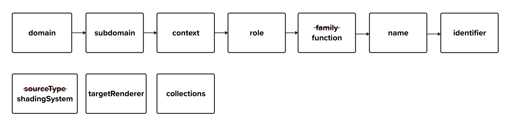
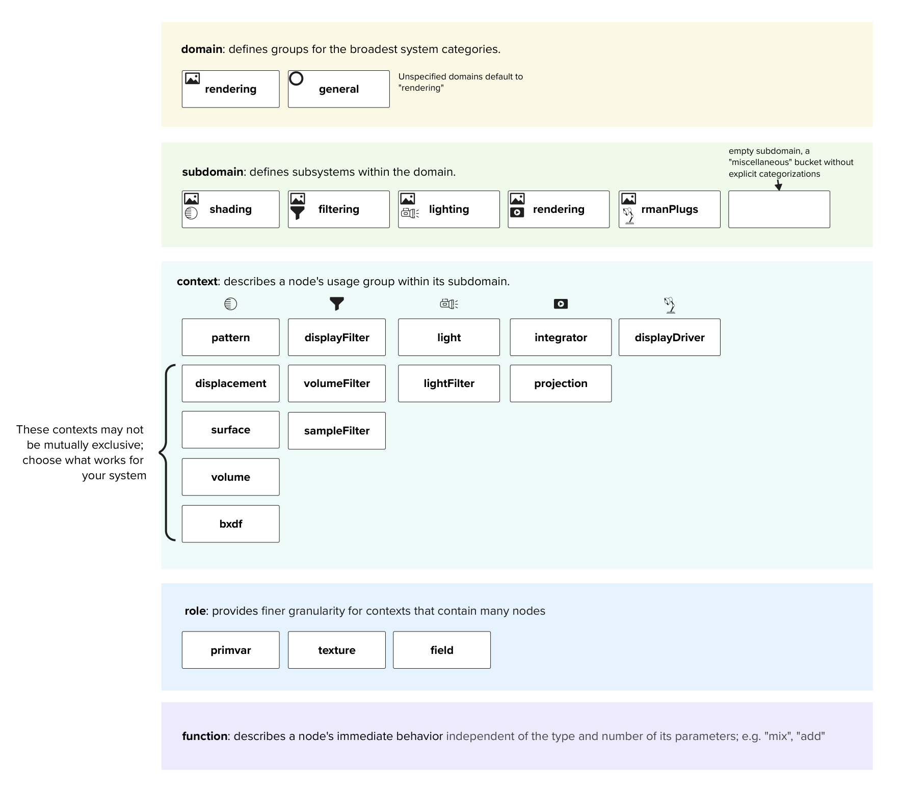

# Categorizing SdrShaderNodes

Sdr currently does not provide clear guidance on proper, consistent use of the handful of categorization fields it provides.
Additionally, as adoption of USD grows beyond computer graphics, we want to find a way to represent nodes in Sdr as our single registry solution from non-rendering domains.

We propose adding the following structure to SdrShaderNode metadata and fields to add this clarity and flexibility to Sdr. Unshaded items are optional. Shaded items are required and are discussed below.



We propose two additional metadata that don't currently exist on SdrShaderNode.

- **targetRenderer**, if defined, describes that a node was designed for, but not necessarily limited to, a specific renderer.
- **collections** allows parser plugin authors to group nodes in ways that cross-cut existing categorization groupings. This is specified as a vector of string.

We propose adding an implicit hierarchy that's easier to reason about than our current "bucket of fields" approach.
The following metadata items are added.
- **domain** continues enablement of Sdr's extensibility beyond our own domain knowledge following the removal of Ndr.
- **subdomain** breaks "domain" into smaller (but still large) conceptual buckets.

We propose migration of the following metadata and fields:
- **function** replaces "family" to better describe the "fundamental behavior of the node". This is a function in the same sense that a function in code can have overloads with different types.
- **shadingSystem** replaces "sourceType". "shadingSystem" more accurately identifies a system that usually has its own standard and shading language. Specification of "source container type" (e.g. "usda") is better suited to "discoveryType".
- **category** is removed.

In the following diagram, each hierarchy level's text boxes indicate the common values that are tokenized for easy reference in Sdr – with the exception of subdomain=rmanPlugs and context=displayDriver, which are included for illustrative purposes.
Sdr plugin authors should use these common values where they can, but create their own buckets when more specialization is necessary.



Here's some sample node data following the proposed hierarchy.

| field | example 1 | example 2 | example 3 |
| :---- | :---- | :---- | :---- |
| **domain** | rendering | general | rendering |
| **subdomain** | filtering | math | shading |
| **context** | sampleFilter |  | pattern |
| **role** |  | | geometric |
| **function** |  | add | position |
| **name** |  | add\_float |  |
| **identifier** | BackgroundSampleFilter | add\_float\_3 | ND\_position\_vector3 |

At the bottom of the hierarchy are function, name, and identifier:
- **function** is a **name** stripped of type specialization information.
- **name** is an **identifier** stripped of versioning information.
- **identifier** has a concise brief for what the node does, type specialization, and versioning information. See the above chart for examples.

Note that an SdrShaderNode is uniquely identified with an **identifier** and **shadingSystem**.
Convenience API on the SdrRegistry allows retrieval of individual SdrShaderNodes with:
- **name** and optional specification of **shadingSystem** and **version**
- **identifier** and optional specification of **shadingSystem**

See the SdrRegistry API for more information on the above behavior, and other convenience functions.

### Adoption of categorization for MaterialX in usdMtlx

As an illustrative example for adopting this categorization scheme, our Sdr parser plugin for MaterialX should be modified with the following correlations:

- **domain** should be "rendering" by default  
- **subdomain** has no analogues in MaterialX and will remain empty unless additional annotation of data at Sdr parse time is reasonable, or additional metadata is added to MaterialX nodes themselves.  
- **context** maps cleanly from MaterialX's "**context**"
  - *mtlx stdlib examples: \[pattern, surface, volume, light, displacement\]*
- **role** maps exactly from MaterialX's "**nodegroup**", with the exception of nodegroups "texture2d" and "texture3d" getting mapped to role "texture".
  - *mtlx stdlib examples: \[convolution2d, material, channel, pbr, compositing\]*
- **function** maps exactly from MaterialX's "**nodecategory**"
  - *mtlx stdlib examples: \[convert, subtract, tiledhexagons, dot\]*
- **targetRenderer** for MaterialX nodes will be empty, unless a shader author writes .mtlx specialized to a specific renderer.

### Additions and deprecations

Various deprecations to the SdrShaderNode constructor, methods, and metadata enums will be necessary.

SdrShaderNode methods referring to replaced metadata items will be removed and methods to get new metadata items will be added.
Some partial deprecations will also be made (renaming arguments).

```C++
class SdrShaderNode {
    // Deprecate
    TfToken GetCategory();
    TfToken GetSourceType();
    TfToken GetFamily();

    // Add
    TfToken GetShadingSystem();
    TfToken GetDomain();
    TfToken GetSubdomain();
    TfToken GetFunction();

    // The "context" item should be specified in metadata instead.
    SdrShaderNode(
      const SdrIdentifier& identifier,
      const SdrVersion& version,
      const std::string& name,
      const TfToken& function,         // renamed from "family"
      const TfToken& context,          // REMOVE context
      const TfToken& shadingSystem,    // renamed from "sourceType"
      const std::string& definitionURI,
      const std::string& implementationURI,
      SdrShaderPropertyUniquePtrVec&& properties,
      const SdrTokenMap& metadata = SdrTokenMap(),
      const std::string &sourceCode = std::string());
...
};

class SdrShaderNodeMetadata {
    // Deprecate API for the following
    Category

    // Add API for the following:
    Domain -> TfToken
    Subdomain -> TfToken
    Collections -> TfToken
    TargetRenderer -> TfToken
};
```

In the registry and parser plugins:

```C++
class SdrRegistry {

// Deprecate
SdrShaderNodeConstPtr GetShaderNodeByIdentifierAndType(
        const SdrIdentifier& identifier,
        const TfToken& nodeType);
// Add
SdrShaderNodeConstPtr GetShaderNodeByIdentifierAndSystem(
        const SdrIdentifier& identifier,
        const TfToken& shadingSystem);

// Deprecate
SdrShaderNodeConstPtr GetShaderNodeByNameAndType(
    const std::string& name,
    const TfToken& nodeType,
    SdrVersionFilter filter = SdrVersionFilterDefaultOnly);
// Add
SdrShaderNodeConstPtr GetShaderNodeByNameAndSystem(
    const std::string& name,
    const TfToken& shadingSystem,
    SdrVersionFilter filter = SdrVersionFilterDefaultOnly);

// Deprecate
SdrShaderNodeConstPtr GetShaderNodeByIdentifierAndType(
    const SdrIdentifier& identifier,
    const TfToken& nodeType);
// Add
SdrShaderNodeConstPtr GetShaderNodeByIdentifierAndSystem(
    const SdrIdentifier& identifier,
    const TfToken& shadingSystem);

// Deprecate
SdrShaderNodePtrVec GetShaderNodesByFamily(
    const TfToken& family = TfToken(),
    SdrVersionFilter filter = SdrVersionFilterDefaultOnly);
// Add
SdrShaderNodePtrVec GetShaderNodesByFunction(
    const TfToken& function,
    SdrVersionFilter filter = SdrVersionFilterDefaultOnly);

// Add
void ParseAll();
SdrShaderNodePtrVec ParseAndGetAll();
```

Beyond Sdr:
```C++
UsdShadeNodeDefAPI::GetShaderNodeForSourceType // deprecated
UsdShadeNodeDefAPI::GetShaderNodeForShadingSystem // added

HdRenderDelegate::GetShaderSourceTypes // deprecated
HdRenderDelegate::GetShadingSystems    // added
```

Additional documentation around the semantics of shader node categorization will also be written.