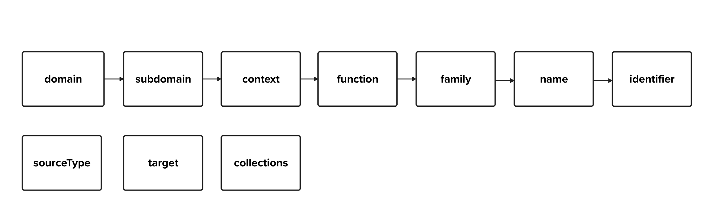

# Categorizing SdrShaderNodes

Sdr currently does not provide clear guidance on proper, consistent use of the handful of categorization fields it provides.
Additionally, as adoption of USD grows beyond computer graphics, we want to find a way to represent nodes in Sdr as our single registry solution from non-rendering domains.

We propose adding the following structure to SdrShaderNode metadata and fields to add this clarity and flexibility to Sdr.



We propose two additional metadata that don't currently exist on SdrShaderNode.

- **target** provides a renderer-first approach to identifying applicable nodes. Example values may include "renderman", or "arnold". An empty value indicates no guarantees on whether a renderer will work with the corresponding specific node.  
- **collections** allows parser plugin authors to group nodes in ways that cross-cut existing categorization groupings.

We propose adding an implicit hierarchy that's easier to reason about than our current "bucket of fields" approach.
The following metadata items are added.
- **domain** continues enablement of Sdr's extensibility beyond our own domain knowledge following the removal of Ndr.
- **subdomain** replaces "category"
- **function** replaces "role"

In the following diagram, each hierarchy level's text boxes indicate the common values that are tokenized for easy reference in Sdr – with the exception of subdomain=rmanPlugs and context=displayDriver, which are included for illustrative purposes.
Sdr plugin authors should use these common values where they can, but create their own buckets when more specialization is necessary.


Here's some sample node data following the proposed hierarchy.

| field | example 1 | example 2 | example 3 |
| :---- | :---- | :---- | :---- |
| **domain** | rendering | general | rendering |
| **subdomain** | filtering |  | shading |
| **context** | sampleFilter |  | pattern |
| **function** |  | math | geometric |
| **family** |  | add | position |
| **name** |  | add\_Float |  |
| **identifier** | BackgroundSampleFilter | add\_Float\_3 | ND\_position\_vector3 |

At the bottom of the hierarchy are family, name, and identifier, which currently exist on SdrShaderNode:
- **family** is a **name** stripped of type specialization information.
- **name** is an **identifier** stripped of versioning information.
- **identifier** has a concise brief for what the node does, type specialization, and versioning information. See the above chart for examples.

Note that an SdrShaderNode is uniquely identified with an **identifier** and **sourceType**.
Convenience API on the SdrRegistry allows retrieval of individual SdrShaderNodes with:
- **name** and optional specification of **sourceType** and **version**
- **identifier** and optional specification of **sourceType**

See the SdrRegistry API for more information on the above behavior, and other convenience functions.

### Adoption of categorization for MaterialX in usdMtlx

As an illustrative example for adopting this categorization scheme, our Sdr parser plugin for MaterialX should be modified with the following correlations:

- **domain** should be "rendering" by default  
- **subdomain** has no analogues in MaterialX and will remain empty unless additional annotation of data at Sdr parse time is reasonable, or additional metadata is added to MaterialX nodes themselves.  
- **context** maps cleanly to MaterialX's "**context**"  
  - *mtlx stdlib examples: \[pattern, surface, volume, light, displacement\]*  
- **function** maps roughly to MaterialX's "**nodegroup**"  
  - *mtlx stdlib examples: \[convolution2d, material, channel, pbr, compositing\]*  
- **family** maps roughly to MaterialX's "**nodecategory**"  
  - *mtlx stdlib examples: \[convert, subtract, tiledhexagons, dot\]*
- **target** for MaterialX nodes will be "MaterialX" or similar.

### Additions and deprecations

Various deprecations to the SdrShaderNode constructor, methods, and metadata enums will be necessary.

SdrShaderNode methods referring to replaced metadata items will be removed and methods to get new metadata items will be added.
Some partial deprecations will also be made.

```C++
class SdrShaderNode {
    // Deprecate
    std::string GetRole();
    TfToken GetCategory();

    // Add
    TfToken GetDomain();
    TfToken GetSubdomain();
    TfToken GetFunction();

    // The "context" item should be specified in metadata instead.
    SdrShaderNode(
      const SdrIdentifier& identifier,
      const SdrVersion& version,
      const std::string& name,
      const TfToken& family,
      const TfToken& context,          // REMOVE context
      const TfToken& sourceType,
      const std::string& definitionURI,
      const std::string& implementationURI,
      SdrShaderPropertyUniquePtrVec&& properties,
      const SdrTokenMap& metadata = SdrTokenMap(),
      const std::string &sourceCode = std::string());
...
};
```

In the registry:

```C++
class SdrRegistry {

// Deprecate
SdrShaderNodePtrVec GetShaderNodesByFamily(
    const TfToken& family = TfToken(),
    SdrVersionFilter filter = SdrVersionFilterDefaultOnly
);

// Add
void ParseAll();
SdrShaderNodePtrVec ParseAndGetAll();

// Partially deprecate
SdrIdentifierVec GetShaderNodeIdentifiers(
    const TfToken& family = TfToken(),   // REMOVE: default TfToken(), family is required
    SdrVersionFilter filter = SdrVersionFilterDefaultOnly
);
SdrStringVec GetShaderNodeNames(
    const TfToken& family = TfToken()    // REMOVE: default TfToken(), family is required
};

```

Additional documentation around the semantics of shader node categorization will also be written.