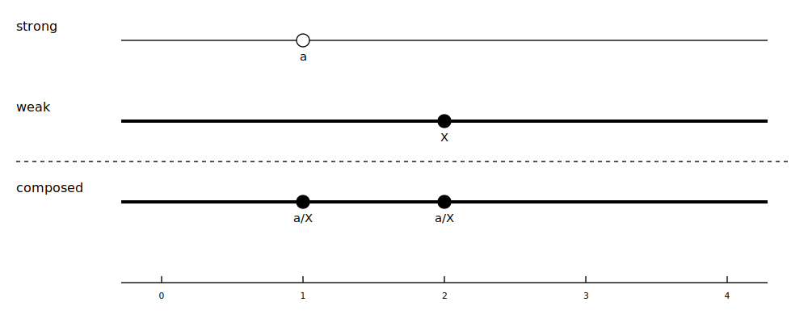

# Sparse Array-Editing Attribute Overrides in OpenUSD

It has become clear that the ability to sparsely edit a subset of array elements
in an attribute override is an important feature for several workflows.  Some
examples are: Modifying a subset of mesh point positions while leaving the
others untouched, appending or deleting elements from point instancer
attributes, and modifying `xformOpOrder` to incrementally add or remove
transform operations while leaving existing operations untouched.

This proposal introduces a new value type, `VtArrayEdit` that can sparsely edit
weaker `VtArray` opinions by inserting, erasing, and overwriting elements via a
simple editing language.

To support `VtArrayEdit`s in USD's core, we need to enhance USD's Value
Resolution algorithm for Attribute values.  Until recently, Attribute values in
USD could come from only the single strongest opinion in scene description.
That strongest opinion could be a prim definition fallback value, an attribute
spec default opinion, an attribute spec time-samples, or a value clip.

This changed when we introduced Pattern-Based Collections, adding the new
attribute value type `SdfPathExpression`. These expressions can refer to "the
weaker expression" in stronger expressions with the token `%_`.  This meant that
to produce the resolved value for such expressions, we could not stop at the
strongest opinion, but instead had to continue examining weaker opinions to
fill-in `%_` subexpressions.  We added this support as an ad-hoc special case
for `SdfPathExpression`, and it does not support time-varying values.

Historically, we have received requests to support dictionary-valued attributes,
where value resolution would "merge" opinions together, like Python's
`dict.update()`.

Here we refer to any value that can modify "weaker" values as "sparse" values or
sparse opinions.  This includes `VtArrayEdit`s and `SdfPathExpression`s that
contain `%_` references.  In contrast, "dense" values or opinions are complete
expressions of value, independent of any weaker opinions, such as `VtArray`s or
`SdfPathExpression`s that do not contain `%_`.

This proposal introduces a general framework for handling sparse attribute value
opinions of any type in USD, including time-varying opinions in time samples and
value clips.  This lets us handle `VtArrayEdit`, and `SdfPathExpression`
uniformly, and paves the way for new sparse-editing opinions in the future.

Since splines in USD are restricted to floating point scalars, which are always
dense values, we do not need to consider splines here.

## A Language for Sparse Array Editing

First let us consider sparse edits for `VtArray` with `VtArrayEdit`.

There are several kinds of edits that seem important.  The simplest being
overwriting an element at a specific index with a specific value, or overwriting
a range of elements with a sequence of new values.  But other operations like
reordering, inserting, and erasing elements also seem essential.  Here we
propose a language for specifying array edits.

It is tempting to adopt something like Python's list slicing since it is
powerful and familiar to many.  However, in OpenUSD many array-valued attributes
*correspond* by index with other array-valued attributes, so we consider it
essential to provide operations that are guaranteed not to change the modified
array's size, in addition to ones that can change its size.

An Array Edit consists of two parts:

* A set of named dense arrays that may be referred to for source data in override instructions.  
* A list of instructions that mutate the destination array at specified indexes using values from the named dense arrays, the destination array so-far, or literal values.

The proposed instructions are:

* `write opt-src-array<slice> to <slice>`  
* `write literal-value to <slice>`  
* `insert opt-src-array<slice> at <index>`  
* `insert literal-value at <index>`  
* `erase <slice>`

The `write-to` instruction overwrites array elements, but never changes array
size. In contrast, both the `insert-at` and `erase` instructions can change
array size.

Above, an `<index>` is either a bracketed numeric index, like `[123]`, including
negative indexing, meaning to subtract from the array's length to form the true
index, as in Python, or the bracketed special token `[end]` meaning the index
past-the-end of the array.  This is useful for appending, by insertion at `end`.
A `<slice>` is either an `<index>` or a bracketed Python-style slice
specification, like `[start:stop:step]`.  These values are optional in the same
way as for Python slicing.

An `opt-src-array` is an optional source array name.  If omitted, the `<slice>`
refers to elements of the destination array being edited.  A `literal-value` is
a literal element value using the existing `.usda` syntax for array elements.
For example, for a `string`\-valued array, this could be `"hello"`, or for a
`GfVec3f`\-valued array this could be `(1.2, 3.4, 5.6)`.

### Examples of Array Edit Instructions

The following examples apply to a hypothetical `int`\-valued array edit, so all
literal values are `int`s.

```
########################################################################
# 'write-to' never changes array size, it only overwrites existing elements.

# writing literals...
write 3 to [10]           # Set array index 10 to 3.
write 9 to [-1]           # Set the last array index to 9.
write 86 to [end]         # Error: write out-of-bounds.
write 9 to [10:20]        # Set array indexes 10..19 to 9.
write 0 to [:20]          # Set indexes 0..19 to 0.
write 0 to [:]            # Set all indexes to 0.
write -1 to [::2]         # Set even-numbered indexes to -1.

# writing destination array elements to other indexes...
write [-1] to [0]         # Set index 0 to the value of the last elt.
write [-10:] to [:10]     # Set the first ten values to the last ten values.

# writing named source array elements to the destination...
write src[23] to [13]     # Set index 13 to source array index 23.
write src[:] to [::-1]    # Write `src` to the array backward, starting from the 
                          # array's end.
write src[::-1] to [:]    # Write `src` backward to the array, starting from the 
                          # array's beginning.

########################################################################
# 'insert-at' can change array size by adding new elements.

# inserting literals...
insert 3 at [10]           # Shift elts at index >=10 up by 1, insert 3 at [10]
insert 9 at [-1]           # Shift the last elt up 1, insert 9 second-last.
insert 86 at [end]         # Append 86, making it the last elt.

# inserting destination array elements at other indexes...
insert [-1] at [0]         # Insert a copy of the last elt at the beginning.
insert [-10:] at [0]       # Insert a copy of the last 10 elts at the beginning.

# inserting named source array elements in the destination...
insert src[23] at [13]     # Shift elts at index >=13 up by 1, insert src[23].
insert src[::2] at [end]   # Append the even-indexed elts from src to destination.

########################################################################
# 'erase' can change array size by deleting elements.

erase [10]                 # Erase element 10, shifting elts at >=10 down 1.
erase [-1]                 # Erase the last element.
erase [end]                # Error: erase out-of-bounds.
erase [1::2]               # Erase odd-indexed elts.
```

This language is intentionally not Turing-complete.  There are no conditionals
of any kind, so applying an edit always terminates, and takes time proportional
to the number of instructions.

We will provide a C++ class, `VtArrayEdit<T>`, that can represent a sequence of
edits as described above, as well as apply those edits to a `VtArray<T>`.  In
addition, `VtArrayEdit<T>` will can compose with another `VtArrayEdit<T>`,
yielding a new instance that represents the action of both applied in sequence:
the function composition.

## Generalized Value Resolution with Composed Sparse Opinions

In order to make use of `VtArrayEdit`s within USD's value resolution framework,
we need to modify the attribute value resolution algorithm to support them.
This has already been done in an ad-hoc way for non-time-varying
`SdfPathExpression`.  Since we are introducing a second value type that requires
this, and since this new value type will support time-varying values, the time
is right to generalize value resolution to support sparse overrides for any type
including `VtArrayEdit`, `SdfPathExpression`, and possible future value types.

### Required Operations

The fundamental operations required to support sparse opinions are a predicate
`isDense(value) -> bool` and a composition operator `over(stronger, weaker) ->
value`, sometimes written infix, like `stronger over weaker`.

1. The `over` operator must be associative: `over(over(x, y), z)` must be
identical to `over(x, over(y, z))` for all `x`, `y`, and `z`.  This is required
to support partial flattening of layers.
     
2. If `isDense(x)` is `true` for some `x`, then `over(x, y) -> x` for all `y`.
This requirement lets us stop searching for values once a dense value is
encountered.

Note that these requirements also imply that if `isDense(y)` is `true` for some
`y` then `isDense(over(x, y))` must also be `true` for all `x`. If this was not
true, then `over(x, over(y, z))` (which is the same as `over(x, y)` by
requirement 2\) could differ from `over(over(x, y), z)`, breaking associativity.

For a concrete example, consider `SdfPathExpression`.  Its `isDense()` predicate
just returns true if the expression has no `%_` subexpression.  Its `over()`
operator just inserts the weaker expression where all the `%_` subexpressions
appear in the stronger expression.  The way that `VtArray` and `VtArrayEdit`
meet these requirements will be discussed later when we introduce `VtArrayEdit`.

With these operations in hand, we can resolve a single attribute value with
sparse opinions if we are given a list of opinions to resolve over.  We just
"fold" or "reduce" the `over()` operator over the opinions in strong-to-weak
order.  We can stop this process as soon as we have a value which `isDense()`.

### A Strength-Ordered Linearization of Attribute Value Opinions

To generate a strength-ordered list of opinions, from strongest to weakest, we
can modify the value resolution loop that we have today:

```
Resolve(Attribute A):
    for each PcpNode N in the A's PrimIndex:
        for each Layer L in N's layer stack:
            if L has a timeSamples opinion for A:
                return interpolated value from timeSamples
            elif L has a default opinion for A:
                return the default value
            else:
                for each ClipSet C that applies to N with source layer L:
                    if C has timeSamples for A:
                        return the interpolated value from C
    return A's fallback value from its owning Prim's definition.
```

If we skip the early returns, we generate the strength-ordered list of opinions
we seek:

```
Linearization(Attribute A):
    result = []
    for each PcpNode N in the A's PrimIndex:
        for each Layer L in N's layer stack:
            if L has a timeSamples opinion for A:
                result.append(the timeSamples)
            elif L has a default opinion for A:
                result.append(the default value)
            else:
                for each ClipSet C that applies to N with source layer L:
                    if C has timeSamples for A:
                        result.append(the ClipSet C)
    result.append(A's fallback value from its owning Prim's definition)
    return result
```

As mentioned, we do not need to generate the complete linearization in the
typical case: we can stop once we have a dense value.  The implementation in USD
will take this approach, but we present the algorithm this way, without
opimization, for clarity's sake.

### Composing and Evaluating Time-Varying Sparse Opinions

Simply folding `over()` opinions works fine for `default` and `fallback` values,
but in USD we must also consider time-varying values specified by time samples
and value clips.  USD has recently gained support for animation splines, but
since these are only scalar floating-point-valued we can ignore them.

For simplicity and without loss of generality, we consider time samples and
value clips together, as a *Series* of *Sample*s at distinct times.  A Sample is
a pair of time and value, and a Series is a list of Samples with unique times,
ordered by increasing time.

We can also consider non-time-varying opinions such as `default` and `fallback`
values in a similar way, as a Series with a single sample at the earliest time.

#### Composing Series of Samples

The following pseudocode computes the `over()` operation for two Series, in
terms of the `over()` operation for the values in the series.

```
GetHeldValue(series: Series, time: Time) -> Value:
    if there is a closest sample in series preceding time:
        return that sample's value
    else:
        return the value of the first sample

Over(strong: Series, weak: Series) -> Series:
    result = Series()
    for Time t in the union of strong and weak's sample times:
        strongValue = GetHeldValue(strong, t)
        if strong has a sample at t or not isDense(strongValue):
            result.Add(Sample(t, over(strongValue, GetHeldValue(weak, t))))
    return result
```

With this Series `Over()` function in hand, we can compose or flatten a sequence
of Series by folding this function over the sequence.  Partial flattening also
works, due to associativity requirement.

Here are some simple examples.  In the examples, open circles labeled with
lower-case italic letters indicate sparse opinions, while filled circles labeled
with upper-case letters indicate dense opinions. Composed samples are written
with `/` as the `over` operator.

1. A sparse sample over a dense sample at the same time.
    
1. An earlier sparse sample over a later dense sample.
    
1. A later sparse sample over an earlier dense sample.
    
1. One sparse sample over two dense samples.
    
1. Two sparse samples over one dense sample.
    
1. A dense followed by a sparse sample over a sparse sample.
    
1. Several series of both sparse and dense samples composed.
    


#### Evaluating a Strength-Ordering of Samples at a Specific Time

When asked to evaluate an attribute at time *t*, in general we must interpolate
from the sample values surrounding *t*.  With sparse opinions, our goal is to
find the samples bracketing *t*: those samples surrounding *t* that would have
appeared in the flattened, fully composed Series.  We could trivially do this by
flattening first, then finding the surrounding samples.  But this is wasteful:
we would be evaluating and composing many samples that do not contribute to the
result.  Here is how we can compute the relevant samples without waste:

```
GetBracketingSamples(series: Series, time: Time) -> (Sample, Sample):
    lo = the closest sample in series preceding time, or the first sample
    hi = the next sample after lo, or the last sample
    return (lo, hi)

Evaluate(strengthOrder: Sequence[Series], time: Time) -> Value:
    composed = Series()
    queryTime = time
    for series in strengthOrder:
        weaker = Series(GetBracketingSamples(series, queryTime))
        composed = Over(composed, weaker)
        lo, hi = GetBracketingSamples(composed, time)

        if isDense(lo.value):
            if isDense(hi.value):
                break
            queryTime = hi.time

        composed = Series((lo, hi))

    return Lerp(lo, hi, time)
```

We make small (up to 2-sample) Series out of the bracketing samples, compose
them to make up-to 4-sample series, then fetch the bracketing samples from
*that* series to trim back to at most 2 samples again, and repeat over the
sequence of Series.

We can stop once we have two dense bracketing samples.  If we encounter a dense
bracketing lower sample, but still have a sparse bracketing higher sample, we
must shift the time at which we query the remaining `strengthOrder` to be the
time of that bracketing higher sample.  The reason for this is that a dense
lower sample is considered stronger than any weaker samples in the entire
interval `[lo.time, hi.time)`.  So we must restrict our search for a dense value
only at `hi.time` from then on.

Here is an example showing the samples fetched and the steps taken while
evaluating a strength order of Series at the time 4.5.


This scheme works in general for any kind of "composed" attribute value type
that supports sparse opinions, and would work for both `SdfPathExpression` and
`VtDictionary`.  Of course for these types, (and any other non-interpolated
type) `Lerp()` only depends on the *lower* value, so we can avoid fetching and
computing the `hi` sample.

### Composing `VtArrayEdit`s

As mentioned earlier, to support partial and complete flattening, it is
essential to ensure that composition is associative. To compose two sparse array
edits, we can concatenate their source arrays and concatenate their
instructions, with the stronger’s instructions following the weaker’s.  The only
technical difficulty is if the named source arrays conflict, in which case we
rename one to make it unique, and update references to it in the instructions.

Since the application of an array edit to a dense array happens
instruction-by-instruction, and a complete destination array is available at
every step, this satisfies the associative property. This also means it is
possible to divide an array edit into separate opinions by splitting the
instruction list.  Optionally, unused source arrays can be deleted.

Handling time-samples works similarly.  In intervals covered by stronger dense
samples, those samples win.  If we have sparse samples over dense, we just
compose the sparse samples over the dense, writing the composed dense results at
the sparse samples’ time codes.  If we have sparse samples over sparse, we take
the union of these samples.  In the special case of a sparse sample over a
sparse sample at the same time code, we compose those sparse opinions to produce
the composed sparse sample at that time code.

### Handling Errors

The astute reader notes that we have not stated what happens with out-of-range
indexes and the like.  We believe we can define most behavior sensibly, even
when indexes are out-of-range, so that value resolution produces reasonable
results.  We attempt to do this as much as possible, since a sparse edit can
easily be “invalidated” by a non-local change to an upstream asset.  In
contrast, out-of-bounds indexing on a `src` array is a local error.  It's
confined to a single edit opinion.  In this case we emit a `TF_WARN()`
explaining the error, and optionally channel these to the validation system, but
still define the behavior (see below for details).  To help with debugging
sparse edits, we will provide `TF_DEBUG` flags that report details whenever
out-of-bounds indexing occurs to help track down asset issues.

For `write-to` instructions, since the intent is never to change the array size,
we silently ignore attempts to write to any out-of-bounds indexes.  If a
`write-to` a slice is partially in-bounds and partially out, only the in-bounds
portion will be written.  We will report these out-of-bounds errors if desired
via setting a `TF_DEBUG` flag.

Similarly, for `write-to` instructions, if the left-hand-side provides more
elements than are needed, those additional elements are ignored.  If the
left-hand-side provides fewer elements than are needed, those elements will be
repeated (cyclically as if indexed by modular arithmetic) as needed.

For `insert-at` instructions, we similarly silently truncate source slices to
their in-bounds portions, and ignore any out-of-bounds portions or indexes.
Again we will optionally report these errors if desired via a `TF_DEBUG` flag.

In either case if a `src` array is indexed out-of-bounds, we will emit a
`TF_WARN` about the error, and truncate the slice to the in-bounds portion.  If
the result is empty, this instruction is ignored and we proceed to the next
instruction.

## Code Structure and Refactoring

We propose to add a new class template, `VtArrayEdit<T>` that contains an array
of named source `VtArray<T>`s and a list of instructions as described above.

We will have a member function, `VtArrayEdit<T>::ComposeOver(VtArray<T>) ->
VtArray<T>` that computes the composition of an edit over a weaker dense
`VtArray<T>`, as well as `VtArrayEdit<T>::ComposeOver(VtArrayEdit<T>) ->
VtArrayEdit<T>` that computes the composition of one edit over another.

We will add support for `VtArrayEdit<T>`as a value type in `Sdf` for
serialization in `.usda` and `.usdc` files.  We will devise a syntax for
representing array edit opinions in `.usda` files, such as:

```
over "geom_mesh" {
    point3f[] points = edit (source src1 = <bracketed array data>,
                             source src2 = <bracketed array data>,
                             ...,
                             write (1, 2, 3) to [10],
                             erase [-1],
                             insert src1[:] at [:0]
                             )
}
```

We will add support for `VtArrayEdit<T>` to `.usdc` files, and we will handle
the version bump to both `.usda` and `.usdc` files in the familiar way, where we
only upgrade the file version if we encounter such a value when writing the
layer.

### Value Resolution

At the USD-level, via `UsdAttribute::Get()`, for example, we will never return a
sparse `VtArrayEdit<T>`, only a dense array.  Even if all the opinions in the
linearization are sparse, USD will compose over a weakest empty dense array to
ensure that the returned result is always dense.  However, sparse edits can be
written to the current edit target directly via `UsdAttribute::Set()`.
Inspection of individual sparse opinions in layers is, as always, done through
the `Sdf`\-level API.

The value resolution code in USD's core will be modified to look for
array-valued attribute types, and do the extended composition.  This will bring
some complexity, since we'll have to generalize the `ResolveInfo` object to
understand about attribute values that do not have just one
fallback/default/samples/clips source, and we must implement the logic to do the
recursive resolution for interpolation end-points as described above.

We propose to add a new `UsdResolveInfoSource`: `UsdResolveInfoSourceComposed`.
And we propose to add new data storage and API in this case for callers to
access the full list of opinions that compose the final value when obtained for
a given time.  Calling `GetResolveInfo()` without a specific time will also
report `UsdResolveInfoSourceComposed` but the extra information contained in the
resolve info structure will have the strength order linearization of opinions.

We propose also to handle `SdfPathExpression` as well within this same
framework, and establish a clear path forward for `VtDictionary`\-valued
attributes and any other value types that compose sparsely overriding opinions
in the future.

## Not Proposed / Possible Future Enhancements

Currently we do not propose supporting sparse array edits as fallback values in
prim schema.  This is another “system” of composition, so it could be handled in
principle following in parallel with the above logic, but we do not have a
current use-case for it, so we leave it as an optional future expansion.

Similarly we also leave support for sparse array edits for array-valued metadata
to the future.

It’s tempting to reach for more sophisticated kinds of value transformations in
sparse edits.  For example, It’s easy to imagine something like `write [:] + 100
to [:]` to add 100 to all the elements in an int-valued array.  Or `write [:] *
matrix4d(...) to [:]` to apply a transformation to for example.  While this
would be undeniably powerful, it would bring significant code and cognitive
complexity.  For those reasons we are not ready at this time to consider
expanding in this direction.
