# Spline Animation in USD

This project aims to support spline animation on USD attributes.  The project is
called **USD Anim** for short.

Spline animation means that time-varying attribute values are specified using
sparse _knots_, from which values can be _interpolated_ or _extrapolated_ at any
time coordinate.  The knots of an attribute form a _spline_, which is a function
mapping times to values.  A spline is a familiar concept in digital animation;
it is an artist-friendly mathematical representation of a value changing over
time, usually continuously.  USD already has _time samples_, which are discrete
time-varying values, interpolated linearly; splines will complement time samples
and support additional uses.

## Purposes

We believe spline animation is a general-purpose tool, and we expect its usage
to exceed what we can imagine ahead of time.  But we have some specific
motivations:

**Animation interchange.** It is frequently useful to employ multiple
applications in the course of creating, editing, viewing, and consuming scene
data.  This is a basic premise of USD, which is an interchangeable system of 3D
scene description.  Since many 3D applications represent varying values with
splines, it is a natural step to add splines to USD's vocabulary.

**Gaming pipelines.** Game engines can work with spline data, and many are
already compatible with USD for geometry transfer.  Controlling animation using
splines offers runtime flexibility, aids in fetching animation data back into
authoring tools, and reduces bandwidth requirements.  This is applicable to
linear-blend skinning animation using UsdSkel, but also more generally to any
animation runtime.  A particular interest for gaming applications is fast,
iteration-free runtime evaluation of splines, which USD Anim is intended to
support.

**OpenExec.** Pixar is beginning the process of open-sourcing its fast, powerful
attribute computation engine, called OpenExec.  Spline data is a natural way to
drive OpenExec rigging, and we see it as a prerequisite for OpenExec.

## Splines Versus Time Samples

Splines and time samples will coexist in USD.  Time-varying data may be authored
in either form; if both are present on the same attribute, time samples will
take precedence.  The tradeoffs are:

|                   | Splines                     | Time Samples          |
| ----------------- | --------------------------- | --------------------- |
| **Data format**   | Curves defined by knots     | Lookup tables         |
| **Data density**  | Sparse                      | Dense                 |
| **Purpose**       | Source format               | Computed values       |
| **Lookup speed**  | Full fetch, do some math    | Highly optimized read |
| **Interpolation** | Flexible, typically Beziers | Linear                |

## High-Level Requirements

USD Anim will aim to achieve all of the following:

- **Interchange-suitable:** a universal format.

    - USD Anim splines will support a variety of features, detailed in
      subsequent sections.  All clients will be able to read all valid USD Anim
      splines, given a minimum level of feature support.  USD Anim will provide
      a set of utilities to perform _reduction_, in which splines that use
      features outside the client's feature set can be converted to splines
      within the client's feature set, using emulations.  For example, if
      clients support only Bezier segments, held and linear segments can be
      emulated using Bezier segments.

    - USD Anim will not be designed to accommodate extensions.  If the community
      discovers missing features, we would prefer to either consider their
      inclusion directly in the USD Anim core, or assist with the design of a
      layered architecture that relegates features to higher levels.

    - USD Anim will not include any arbitrary tuning parameters.  All behavior
      will be mathematically justified, and all curve parameters will be
      controllable.

- **Majority Maya compatibility:** a familiar format.

    - Most Maya animation splines will be representable in USD with minimal
      translation.  In particular, USD Anim will support most Maya spline
      features.

    - However, USD Anim will be a product-agnostic format, and will differ from
      Maya in some ways, including API, serialization format, and mathematical
      representation.

- **Majority Presto compatibility:** a pragmatic format for Pixar.

    - USD Anim will be an open-source revision of technology that already exists
      within Pixar's Presto animation system.

    - Pixar's plan is to operate Presto on top of USD Anim, with an adapter
      layer.

    - This requirement should be mostly invisible to the outside world.
      However, it may influence the decisions Pixar makes about USD Anim.

- **Fast Hermite evaluation:** a runtime-friendly format.

    - USD Anim will support cubic Bezier curve segments, which are probably the
      spline model in widest use.  Bezier curves are parametric, so evaluating a
      curve at a given time may require an iterative solving process.  Pixar has
      found the cost of the solve negligible in the context of executing complex
      rigging, but it may not be fast enough for all applications.

    - USD Anim will also support cubic Hermite curve segments.  These differ
      from Bezier curves in that they have one fewer degree of freedom: tangents
      have fixed lengths, and only their slopes may be specified.  In return,
      Hermite curves are non-parametric, and can be evaluated in constant time
      via a simple cubic polynomial.

- **General USD standards:** a contextually appropriate implementation.

    - Open-source, multi-platform, C++.
    - Low-level and simple, with no external dependencies.
    - High-quality and fast.
    - Well-organized API.
    - Extensive Python wrapping, tests, and documentation.

USD Anim will specifically **not** aim to provide:

- **High-level editing operations.** There are lots of interesting ways to
  manipulate splines, but USD Anim will not try to tackle that topic; instead,
  USD Anim will provide a minimal implementation on top of which editing
  libraries could be built.  USD Anim will include editing primitives like
  inserting and altering knots, and a few simple utilities like resampling, but
  not higher-level operations like smoothing, stretching, randomization, etc.

## Nomenclature

We use the word _animation_, and the abbreviation _anim_, to refer to values
controlled by splines.  This doesn't necessarily imply character animation; it
just means "changing over time".

When we say _curve_, we mean a function that may be curved, or may consist of
straight lines.

We use the word _spline_ to mean the animation control curve for a
floating-point value.  This is both more and less than the word might otherwise
mean.

- Less: we reserve _spline_ for floating-point values in order to emphasize that
  they are the most common case, even though, for example, quaternion splines
  are still spline curves.

- More: we say _spline_ even when curves contain held or linear segments.  These
  straight-line segments are not the first example of a spline that probably
  comes to mind, and they are not interpolated using spline math, but we still
  call them splines.

We refer to the points where curve segments join as _knots_.  In a
character-animation context, these are typically called _keyframes_; we are
trying to be more general.

Mathematicians sometimes refer to a Bezier segment as having four knots.  We
only call the segment endpoints knots; we call the two internal control points
_tangent endpoints_ (or just tangents).  We say that the tangents belong to the
knots: if the segment has points 1, 2, 3, and 4, then 2 is one of the tangents
of 1, and 3 is one of the tangents of 4.

When something precedes or follows something else in the time dimension, we use
the prefixes _pre_ and _post_.  This is as opposed to _left_ and _right_, or
_in_ and _out_, which also frequently occur in spline APIs.  So, for example, we
have _pre-tangents_ and _post-tangents_ belonging to knots.

USD Anim will support instantaneous changes in value via _dual-valued knots_.
These knots have an ordinary value and a _pre-value_.  At precisely the knot
time, the value changes from the pre-value to the ordinary value.

There are apparently two common meanings of _Hermite curve_.  The first is the
original mathematical meaning: a class of curves that is a subset of Beziers,
with fixed-length tangents.  The second is a class of curves exactly equivalent
to Beziers, with varying tangent lengths, but using different basis functions.
In USD Anim, when we talk about Hermites, we are talking about the first
version: the restricted class of curves with fixed-length tangents.  This is
also what is meant by "Hermite" in Maya.

## Resources

[Freya Holmer's spline video](https://www.youtube.com/watch?v=jvPPXbo87ds) is a
wonderful introduction to splines.

[The Pomax Bezier page](https://pomax.github.io/bezierinfo/) is the definitive
resource for spline math in programming.

# OBJECT MODEL

Here is a summary of the proposed data fields that will make up splines and
related classes.  This is an abstract description, not a literal data structure.
However, the USD Anim API will follow this description at least partly.

We are proposing a generalization of splines that we call _series_.  A series is
a set of values over time for any value type.  _Splines_ are the most important
subtype of series, specifically for floating-point scalars.  Details are given
below.

```
//
// Common interface.
//

Series <ValueType>
    innerLoopParams : InnerLoopParams
    preExtrapolation, postExtrapolation : Extrapolation <ValueType>

Knot <ValueType>
    time : double
    postInterpolation : enum { held, linear, curve }
    value : ValueType
    preValue : ValueType (when dual-valued)

//
// Spline subtype.  For the value-type category of floating-point scalars.
//

Spline <ValueType> : Series <ValueType>
    curveType : enum { bezier, hermite }
    knots : array <SplineKnot <ValueType> >

SplineKnot <ValueType> : Knot <ValueType>
    preTangent, postTangent : Tangent <ValueType> (when segment is curve)

//
// Detailed parameters.
//

Tangent <ValueType>
    timeLength : double
    union
        slope : ValueType
        height : ValueType
    auto : bool

InnerLoopParams
    prototypeStartTime : double
    prototypeTimeLength : double
    numPreLoops : int
    numPostLoops : int

Extrapolation <ValueType>
    method : enum { held, linear, sloped, loop }
    slope : ValueType (when sloped)
    loopMode : enum { repeat, reset, oscillate } (when looping)

//
// Subtypes for other value-type categories.
//

// Lerp series.  For linearly interpolatable vectors.
LerpSeries <ValueType> : Series <ValueType>
    knots : array <LerpSeriesKnot <ValueType> >
LerpSeriesKnot <ValueType> : Knot <ValueType>

// Quaternion series.  For quaternion types.
QuatSeries <ValueType> : Series <ValueType>
    knots : array <QuatSeriesKnot <ValueType> >
QuatSeriesKnot <ValueType> : Knot <ValueType>

// Held series.  For non-interpolatable types.
HeldSeries <ValueType> : Series <ValueType>
    knots : array <HeldSeriesKnot <ValueType> >
HeldSeriesKnot <ValueType> : Knot <ValueType>
```

## Value Type Categories

All value types supported by USD attributes may have time-varying values.
However, not all value types are suitable for continuous interpolation.

Floating-point scalars - `double`, `float`, and possibly `half` - are the
expected typical case for spline interpolation.  The main USD Anim object model
will be designed around these types.  Floating-point scalars are the primary
_value type category_ in our object model.

We propose the following additional value type categories:

- **Floating-point vectors.** These can be linearly interpolated.  There are two
  cases: fixed tuples like `double3`, and arrays like `doubleArray`; these can
  also combine into arrays-of-tuples like `double3Array`.  While it would be
  possible to support Bezier splines of these values, and indeed Presto does, we
  aren't aware of any need for this in USD.  See
  [Question: splines of vectors](#splines-of-vectors).

- **Quaternions.** These typically encode 3D rotations.  They can be
  interpolated, but in different ways than scalars.  Like floating-point vectors
  (of which they are a sub-category), quaternions aren't typically authored with
  user-controlled tangents.

- **All other types.** Cannot be interpolated.  These include discrete,
  non-numeric types like `bool` and `string`, and vectors of them.  We also
  include quantized numeric types like `int`, and vectors of them; quantized
  types could be interpolated with rounding, but we're not aware of any need.
  An important future case for the "all other types" category is _constraints_,
  which tie one geometric transform to another, and which will be
  `SdfPath`-valued.

Here is a comparison of the features that we propose to implement for each value
type category:

|                          | Floating-point scalars | Floating-point vectors | Quaternions | All other types |
| :----------------------- | :--------------------: | :--------------------: | :---------: | :-------------: |
| **Object model**         | Spline                 | LerpSeries             | QuatSeries  | HeldSeries      |
| **Held segments**        | Yes                    | Yes                    | Yes         | Yes             |
| **Linear segments**      | Yes                    | Yes                    | Yes         | No              |
| **Bezier segments**      | Yes                    | No                     | Yes         | No              |
| **Explicit tangents**    | Yes                    | No                     | No          | No              |
| **Hermite segments**     | Yes                    | No                     | No          | No              |
| **Held extrapolation**   | Yes                    | Yes                    | Yes         | Yes             |
| **Linear extrapolation** | Yes                    | Yes                    | No          | No              |
| **Sloped extrapolation** | Yes                    | No                     | No          | No              |
| **Loops**                | Yes                    | Yes                    | Yes         | Yes             |
| **Dual values**          | Yes                    | Yes                    | Yes         | Yes             |

In this proposal, when we say _spline_, we specifically mean a spline of
floating-point scalar values.  When we say _series_, we mean either a spline, or
a time-varying value from one of the other categories above.

We are proposing that the object model (the series subtype) used to represent an
attribute is fixed, and determined strictly by the value type, with no concept
of subclassing.  Floating-point scalar types, for example, would always be
represented as splines, never as LerpSeries or HeldSeries, even though
floating-point scalars also meet the requirements for those simpler object
models.

## Series Are Not Time Samples

Series and time samples are similar: both encode varying values over time.  Our
LerpSeries and HeldSeries object models are particularly similar to time
samples, with series having just a few additional features that time samples
don't.  Despite the similarity, LerpSeries and HeldSeries are not time samples;
we are proposing that they be stored and accessed differently.

Here is a comparison of the features supported by series and time samples for
the lerped and held value type categories:

|                          | LerpSeries | Lerped time samples | HeldSeries | Held time samples |
| :----------------------- | :--------: | :-----------------: | :--------: | :---------------: |
| **Held segments**        | Yes        | No                  | Yes        | Yes               |
| **Linear segments**      | Yes        | Yes                 | No         | No                |
| **Held extrapolation**   | Yes        | No                  | Yes        | Yes               |
| **Linear extrapolation** | Yes        | No                  | No         | No                |
| **Sloped extrapolation** | Yes        | No                  | No         | No                |
| **Loops**                | Yes        | No                  | Yes        | No                |
| **Dual values**          | Yes        | No                  | Yes        | Yes (\*)          |

(\*) Held time samples are inherently dual-valued; they change value
instantaneously at each sample.

## Time Samples Are Not Series (Yet)

For now, we are proposing that there is no subtype of Series that represents
actual time samples.  Instead, we propose that series and time samples be
entirely distinct, except when it comes to attribute value resolution, at which
time either source may be consulted.

See [Question: unification of series and time samples](#unification-of-series-and-time-samples).

## Value Types

Each series holds values of a single type.

For scalar splines, this may be any interpolatable scalar type supported by USD
attributes; currently the list is `double`, `float`, and `half`.

For quaternion series, this may be any quaternion type supported by USD
attributes; currently the list is `quatd`, `quatf`, and `quath`.  Note that the
older `GfQuaternion` type is not a supported USD attribute value type, so it
will not be supported by quaternion series either.

Time, unlike series values, is always typed as `double`.  This is consistent
with the rest of USD.

The `half` type may require some special treatment in order to minimize rounding
artifacts and inefficient hardware support.  It is possible, for example, that
our in-memory representation of `half`-typed splines may use `float`s
internally.  See [Question: half-valued splines](#half-valued-splines).

## Knots and Segments

A series is primarily defined by its knots.  Each knot specifies a (time, value)
coordinate through which the series passes.

The regions between knots are called _segments_.  There is one important field
that applies to segments rather than knots: the interpolation method.  Rather
than introduce explicit segment objects, we propose to attach the interpolation
method to knot objects.  The field is called "post-interpolation" to clarify
that the method applies to the following segment, not the preceding one.

Bezier and Hermite segments have tangents; other segments do not.  Tangents are
attached to knots.  The presence or absence of a meaningful pre-tangent on a
given knot is determined by the post-interpolation method declared on the
previous knot.

### Non-Meaningful Data

The last knot in every series will specify a post-interpolation method that has
no effect, since there is no next segment (though there is extrapolation,
covered below).

Knots that are not adjacent to Bezier or Hermite segments may still have
tangents defined, even though those tangents will have no effect.  This includes
tangents at the first and last knots that point outside the range of all knots.

We propose that this slightly ungainly arrangement is a reasonable compromise
that allows graceful programmatic construction of splines.  It is more intuitive
to add knots one at a time, with all fields provided for each knot, than to
first create the knot structure and then fill in the details.  It is also handy,
at an interactive interpreter, to be able to make changes without starting over.

As an optimization, we may decide not to serialize these non-meaningful data.

## Segment Types

While it would be possible to support mixtures of Bezier and Hermite segments,
we do not expect this to be a common need.  We thus propose that each spline
specifies either Bezier or Hermite for its curve segments.  Any segment marked
with the interpolation mode "curve" then uses the spline-level curve type.

In **held** segments, the interpolated value is the same as the value at the
preceding knot.  There is an instantaneous value change (a "stair-step"
transition) at the following knot.

In **linear** segments, the value is interpolated linearly between the preceding
and following knot.

In **Bezier** segments, the value is determined by the Bezier curve defined by
the tangent slopes and lengths.

In **Hermite** segments, the value is determined by the Hermite curve defined by
the tangent slopes.  Hermite segments are exactly equivalent to Bezier segments
with tangent lengths that are one-third of the interval width.

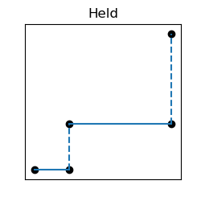
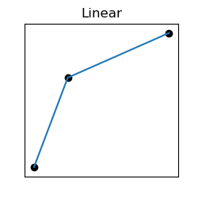
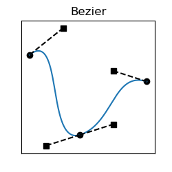
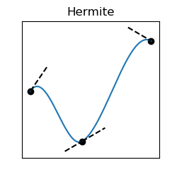

## Tangents

Tangents in USD splines can be specified in either of two forms:

- By slope and length.  This is how Presto represents tangent vectors.
- By height and length.  This is how Maya represents tangent vectors.

The two forms are equivalent; either can be converted to the other.  But the
conversion can lose numeric precision due to rounding error from multiplication
and division.  We want to allow clients to round-trip tangents through USD Anim
and get back exactly what they put in.

### Tangent Components

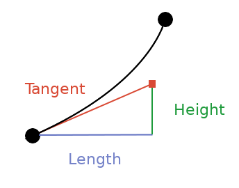

Tangent vectors are decomposed into _length_, in the time dimension, and
_height_, in the value dimension.

Lengths are always positive.  They are absolute offsets from the knots to which
they belong.  Their time scale is the same as the enclosing layer's time scale,
the same scale used by the knot times.

### Presto Tangents

Presto tangents are specified by _slope_ and _length_.

Slopes are "rise over run": height divided by length.  The types of slopes are
the same as the types of values; a slope specifies the value change per unit of
time.  A positive slope (regardless of whether it is a pre-slope or a
post-slope) increases in value as time increases, a negative slope decreases in
value as time increases, and a zero slope is _flat_: it does not change in value
over time.  Slopes may approach vertical, but they may never be infinite, so
they cannot quite be vertical, and they cannot invert past vertical.  This means
that slopes never cause a spline to become a non-function where the curve has
multiple values at any time.

### Maya Tangents

Maya tangents are specified by _height_ and _length_.

The units of height are the same as the units of values.

Height and length are both specified multiplied by 3; e.g. if a tangent vector
is 1.5 units in the time dimension, its length is recorded as 4.5.

Heights are positive for upward-sloping post-tangents, and negative for
upward-sloping pre-tangents.

### Continuity

Segment-to-segment continuity, as in all Beziers, depends on the alignment of a
knot's pre-tangent and post-tangent.  Continuity is not explicitly recorded as
part of spline data, and is not automatically preserved by USD editing
operations, but it may be ensured programmatically by clients, and it may be
queried from a spline.  These are the cases:

| Continuity class | Continuous value | Continuous tangents | Continuous slope | How achieved                          |
| :--------------- | :--------------: | :-----------------: | :--------------: | :------------------------------------ |
| Discontinuous    | No               | No                  | No               | Dual-valued knot                      |
| C0               | Yes              | No                  | No               | Broken tangents (mismatched slopes)   |
| G1               | Yes              | Yes                 | No               | Unequal tangents (mismatched lengths) |
| C1               | Yes              | Yes                 | Yes              | Identical tangents                    |

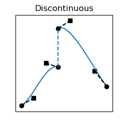
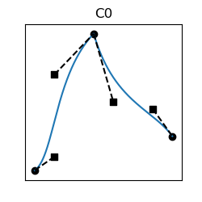
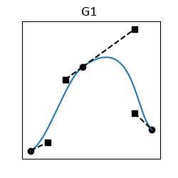
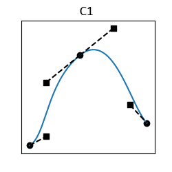

The higher continuities G2 and C2 are sometimes useful, but for now we are
proposing omitting them from the queries supported by USD splines.  That is for
two reasons:

- For G2 and C2, there aren't intuitive rules about how tangents align.
  Instead, more abstract geometric invariants must be maintained.

- Achieving G2 and C2 requires relinquishing some degree of "local control",
  which is typically a vital benefit of Bezier splines.  Local control means
  that a knot or tangent position may be changed without affecting the curve on
  any segments other than its own.

### Automatic Tangents

Sometimes spline authors want to specify only knot values, and get a "nice"
curve that interpolates those knots smoothly.  This sacrifices some degree of
control over the shape of the curve, but allows quicker work, and guarantees
consistently styled shapes with some degree of continuity.

USD Anim will allow any tangent to be specified as "auto".  Each of the two
tangents of a knot may be specified separately, so a knot may be "pre-auto" and
"post-manual", or vice versa.

Automatic tangents are computed only when knots are first defined, and when they
are edited.  We therefore say that automatic tangents are an _edit-time
behavior_.

The exact algorithm for computing automatic tangents has yet to be specified;
most likely we will adopt one of the Maya auto-tangent algorithms.  Other
algorithms are possible, and may be available in the future.  Ideally any
automatic tangent algorithm will support both Bezier and Hermite segments, but
in theory some algorithms could be applicable only to Beziers.

Automatic tangents are arguably in tension with our stated goal of not having
any magical tuning parameters in USD Anim.  Nevertheless:

- Automatic tangents are an opt-in behavior.
- We will publish an exact specification of the algorithm.
- We believe the utility outweighs any concerns about hard-coded behavior.

### Crossovers and Functional Forcing

Splines encode functions: for any time, there should be exactly one value.  It
is possible (using very long tangents) to construct a spline segment that, under
the Bezier rules, would cross over itself and form a loop.  Both Presto and Maya
consider this an unacceptable condition, and excise the loop from the spline, so
that every spline is indeed a function.

Presto and Maya have different algorithms for this "functional forcing", and
both have disadvantages.  Presto creates a vertical discontinuity at an
arbitrary time.  Maya shortens tangents until the loop disappears, resulting in
a smooth shape, but one that is very different than what is authored.

We may wish to choose one of these algorithms, but a third would be more
predictable: create a cusp (a sharp point) where the Bezier curve overlaps
itself.

It is also theoretically possible to forbid tangents that cause crossovers.  But
this would likely be surprising, and would violate our "All Splines Valid"
principle (described below under "Error Handling").

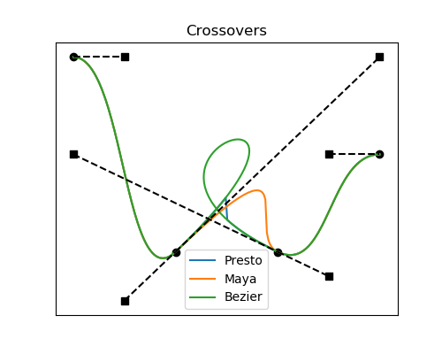

## Dual-Valued Knots

Value discontinuities may be introduced to a series by means of _dual-valued
knots_.  A dual-valued knot has two values: an ordinary value, and a
_pre-value_.  The value exactly at the knot time, and at any nonzero time delta
after the knot, is the ordinary value.  The value at any nonzero time delta
before the knot is the pre-value.  There is an instantaneous change in value at
exactly the knot time.

Any knot can be dual-valued, regardless of the interpolation methods of the
adjacent segments.  However, if a dual-valued knot follows a held segment, the
pre-value is ignored, because otherwise there would be a strange case where the
pre-value was effective at only the left side of a single knot.  So in this
case, if the pre-side value is queried, the value return is the held value from
the prior knot.

### Sided Queries

The fundamental USD value resolution operation is `UsdAttribute::Get`.  Starting
with USD Anim, clients may also call `GetPreValue`.  The two methods return the
same value, unless the specified time is exactly at a dual-valued knot.

Pre-values typically are not evaluated directly in order to render USD content.
They exist as a mechanism for shaping curves.  Querying pre-values is often
important for authoring systems, but usually not important for downstream
evaluation.

Sided queries will also affect other situations with value discontinuities:

- At a knot at the end of a held segment.
- At a time sample with held interpolation (e.g. for a string-valued attribute).
- At the boundary of loop iterations in "reset" mode.
- At "jump discontinuities" in value clips.

See [Question: schema-level methods](#schema-level-methods).

## Looping

_Looping_ is the repeating of series regions.  Looping will be supported in two
forms:

- _Inner loops_ come from Presto.  These specify a _prototype region_, which is
  repeated a finite number of times before and/or after the prototype region.
  The repeated portions are called the _echo region_.  Inner loops use a mode
  called _Continue_, described below.

- _Extrapolating loops_ come from Maya.  These use the entire series (from first
   to last knot) as the prototype region, and repeat it infinitely before and/or
   after the knots.  Extrapolating loops support modes called _Repeat_, _Reset_,
   and _Oscillate_, described below.

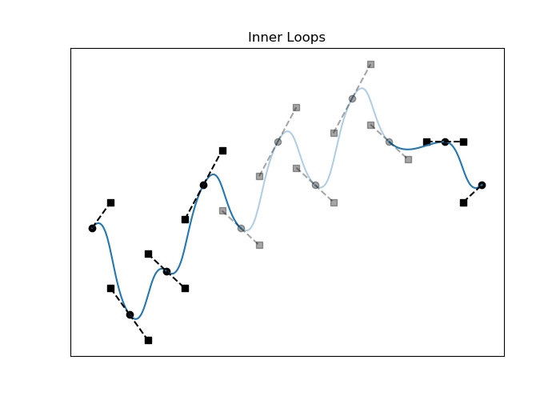
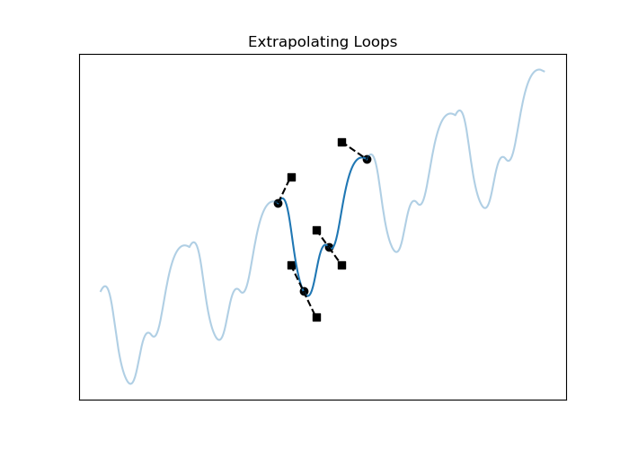

It will be possible to use both systems in the same series.  In that case, inner
loops are resolved first, and then extrapolating loops take into account the
entire series, from first to last knot, with the inner-loop repeats included.

### Looping Modes

The two looping systems work differently:

| Mode family              | Algorithm            | Continuous splines? | Altered prototype? |
| :----------------------- | :------------------- | :-----------------: | :----------------: |
| Continue                 | Copy whole knots     | Typically yes       | Typically yes      |
| Repeat, Reset, Oscillate | Copy knots in pieces | Typically no        | No                 |

Continue mode copies any knots that fall in the prototype region.  Knots are
copied wholesale; in particular, pre-tangent / post-tangent pairs from prototype
knots are kept together.  This has the advantage that, if the knots in the
prototype region are continuous, then the curve in the echo region is continous
also, including at the joins between iterations.  In return, a disadvantage of
Continue mode is that if a spline is first authored without looping, and looping
is later enabled, the shape of the curve in the prototype region may change.  A
common example is that the prototype region has knots at the start and the end,
and the end knot is overwritten by a copy of the start knot, thus changing the
shape at the end of the prototype region.  (The prototype region includes knots
exactly at the start, but excludes those exactly at the end.)

Repeat, Reset, and Oscillate modes exactly preserve the shape of the prototype
region.  The echoed knot at a join between iterations has a pre-tangent
determined by the end of the prototype region, and a post-tangent determined by
the start of the prototype region.  These modes generally do not preserve
continuity; the cases are explained below.

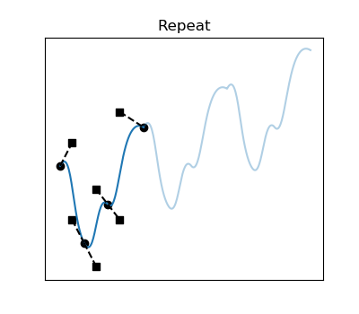
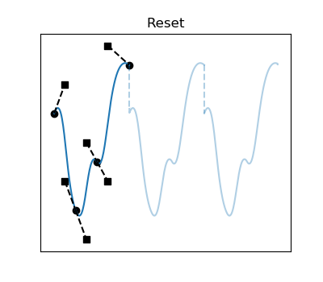
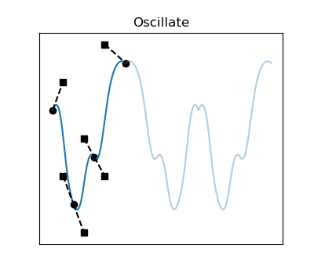

Continue and Repeat modes both use a _value offset_ at each loop iteration.
This ensures C0 continuity at the joins between iterations.  If the value at the
end of the prototype region is not the same as the value at the start, then the
iterations _accumulate_: each iteration is offset in value from its neighbors.

In Repeat mode, the joins between iterations can be continuous, but only to the
extent that the post-tangent of the first knot is continuous with the
pre-tangent of the last knot.  Otherwise, the joins in Repeat mode have
G1-discontinuous cusps.

Reset mode is like Repeat, except that it exactly reproduces the values from the
prototype region in each iteration.  If the value at the end of the prototype
region is not the same as the value at the start, then there are C0
discontinuities (instantaneous changes) at the iteration boundaries.

Oscillate mode is like Repeat, except that the shape of the curve is
time-reversed in every other iteration.  The iterations do not accumulate,
because the time-reversed iterations return the curve to its starting value.  In
Oscillate mode, the joins between iterations are G1-continuous only if the
tangents are flat, since the tangents across joins are mirrored.

### Knots Shadowed by Inner Loops

When inner looping is in use, any knots that are authored in the echo region are
_shadowed_: effectively overwritten by the echoed curve, and ignored for
purposes of evaluation.

Shadowed knots are still recorded in the series, and may still be accessed; see
the Looping API details below.

### Looping API

Looping works by creating echoed knots.  When clients ask for the set of knots
from a series, they may request them in three different forms:

- Only the authored knots, without any looping applied.

- Knots after resolving inner loops (the _baked spline_).

- Knots after resolving both inner loops and extrapolating loops.  Because
  extrapolating loops repeat infinitely, clients must specify a time range, so
  that the returned set of knots is finite.

Here are the categories of knots as they relate to looping.  Note that each
query returns knots without any indication of which of these categories they
belong to.  Clients can classify knots if they need to, by examining the looping
control parameters.

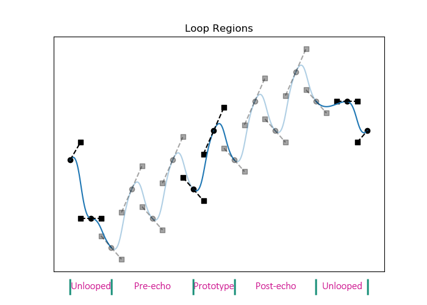

| Knot category             | Included in "authored knots" query? | Included in "baked knots" query? |
| :------------------------ | :---------------------------------: | :------------------------------: |
| Prototype knots           | Yes                                 | Yes                              |
| Echoed knots              | No                                  | Yes                              |
| Shadowed knots            | Yes                                 | No                               |
| Knots outside echo region | Yes                                 | Yes                              |

For now, we propose that USD Anim support at most one inner-loop region per
series; that inner loops support only Continue mode; and that extrapolating
loops support only Repeat, Reset, and Oscillate modes.
See [Question: looping limitations](#looping-limitations).

## Extrapolation

Extrapolation determines series values before the first knot and after the
last.  The available extrapolation methods are:

- **None.** Outside of the authored knots, no values are returned.  It is as
  though an `SdfValueBlock` has been authored in the extrapolating regions.

- **Held.** The extrapolated value is a constant, and is the same as the first
  or last knot.

- **Linear.** The extrapolated value is governed by a straight line that starts
  at the first or last knot, and whose slope is determined as follows:

    - If the first or last segment is held, the slope is flat.

    - If the first or last segment is linear, the slope matches that segment.

    - If the first or last segment is curved, the slope matches the tangent on
      the opposite side.  If there is a tangent on the extrapolating side, it
      has no effect (see "Non-Meaningful Data" above).

- **Sloped.** Like Linear, but with a slope that is explicitly set as part of
  the series data.

- **Looping.** See the "Looping" section above.

## Quaternion Series

Quaternions represent rotations, encoding a 3D axis and an angle.

Because quaternions are 4-dimensional vector quantities, it is difficult to
author or visualize quaternion animation curves directly.  Instead, clients may
simply establish (time, value) knots, and then opt for the following
interpolation methods:

- **Held**: the same meaning as elsewhere: a stair-step function that keeps each
  knot's value until the time of the next knot.

- **Linear**: spherical linear interpolation, or "slerp" for short.  Linearly
  interpolates a great circle on a sphere.

- **Eased**: the 5-dimensional spline is a smooth (G1) curve with automatically
  determined tangents.  This is similar to the scalar-spline case of Bezier
  curves with automatic tangents.  The resulting motion is not a great circle;
  direction and speed change smoothly, with no discontinuities at the knots.
  The easing algorithm comes from Maya, and is taken from a 1985 SIGGRAPH paper
  by Ken Shoemake.

Quaternion series will never have client-specified tangents.

Quaternion series will only support held extrapolation.  This has the same
meaning as elsewhere: the value outside all knots is identical to the value at
the first or last knot.

Quaternion series will support the following features identically to scalar
splines:

- Inner loops.
- Dual values.

### Quaternion Restrictions

USD assumes that quaternions are used to encode rotations.  Quaternions are also
mathematical primitives that can have other meanings, but USD enforces some
invariants that specifically help with rotations.

Quaternions are constrained to unit length; the QuatSeries implementation will
normalize after interpolation.

Quaternions representing orientation always have two possible values, facing in
opposite directions.  When evaluating a quaternion spline, the implementation
will select the direction that more closely aligns with that of the surrounding
knots.  It is TBD whether we can ensure that there are no "sign jumps" when
interpolating large angle changes; this could require stateful traversals of
segments in small increments, which is costly.

### Rotational Encoding

Values that specify 3D rotations may be specified in a variety of ways.  Each
will interpolate differently, depending on attribute value types.  Here are all
the rotational encodings supported by `UsdGeomXformOp` (taking `double` as our
precision, the other precisions being analogous):

| Encoding                     | Value Type(s) | Object Model         | Interpolation                               |
| :--------------------------- | :------------ | :------------------- | :------------------------------------------ |
| Three scalar Euler angles    | 3 x `double`  | 3 scalar splines     | Each angle spline-interpolated separately   |
| Vector of three Euler angles | `double3`     | Time samples         | Each angle linearly interpolated separately |
| Quaternion                   | `quatd`       | Quaternion spline    | Compound interpolation                      |
| Transform matrix             | `matrix4d`    | Time samples         | Per-element linear interpolation            |

In particular, USD Anim will not jointly interpolate rotations that are
expressed as multiple Euler angles.

Euler angles are interpolated without restricting the value to lie between zero
and a full circle; angles may "wind" beyond these limits.  This allows for
smooth interpolation even with large rotations.  This behavior results from USD
Anim not treating Euler angles any differently than any other scalar.

## Custom Data

It is important for clients to be able to store their own data alongside USD
scene description.  USD prims and attributes have _custom data_: values meaningful
only to clients, and stored blindly by USD.

USD series will also support custom data on individual knots.  The supported
types for custom data will be the same as those for prims and attributes,
including hierarchical types like dictionaries and arrays.

# INTEGRATION WITH USD

Series will be integrated into USD in the following ways.

## Attribute Value Resolution

The most important function of series will be to provide attribute values.
When clients call `UsdAttribute::Get` (or `UsdAttributeQuery::Get`), the
resulting value may come from a series.

USD will have the following list of value categories, in priority order:

- Time samples
- Series
- Default values
- Fallback values

When there are opinions about attribute values on multiple layers, USD will do
what it has always done: find the strongest layer with any kind of opinion, then
within that layer, take the opinion from the highest-priority value category
from the list above.  Thus, for example, a default value on a stronger layer
will override a series value on a weaker one.

The `UsdResolveInfo` class, accessed via `UsdAttribute::GetResolveInfo`, will be
extended to include series as a possible value source.

## Series Access

`UsdAttribute` will have new methods called `GetSeries`, `GetSeriesEditor`,
`GetSpline`, and `SetSpline`.  These will provide whole-series level read/write
access to series.  Finer-grained operations can be conducted by methods on the
returned objects; the API is described below.

Note that this is different from the way time samples are integrated into
`UsdAttribute`.  Time samples do not have their own class, and are directly
accessed via `UsdAttribute` methods like `Set`, `ClearAtTime`, and `Block`.  We
believe the higher complexity of series merits the different treatment.

We are also proposing that the time-sample-oriented methods of `UsdAttribute`
continue to address only time samples, and not series.

## Series Composition

The `pcp` library will need to be equipped to compose series.  The scope of this
task is still TBD, but at a minimum, series will need to be retimed when
crossing non-trivial layer scales and offsets, which affect the interpretation
of time.

For example, imagine layer A includes layer B as a sublayer with a layer offset,
and layer B has the strongest opinion for a given attribute.  Layer B's series
opinion will be authored using layer B's timeline, but that timeline must be
shifted in the context of layer A.  The same thing already happens for time
samples.

## Value Blocks

USD has a special value called `SdfValueBlock` that represents the absence of a
value, causing `UsdAttribute::Get` to behave as though no value were authored,
returning either a fallback value or no value.  Value blocks may be set on a
time-varying basis, and this will be true of series as it is for time samples.
We will treat "block knots" as held: they will affect the time region from the
knot's time until the next knot.

Value blocks will affect extrapolation when they are present as the first or
last knot in a series.  Evaluation in the extrapolated region of such a series
will return no value.  It will also be possible to disable _only_ extrapolation
by using the "None" extrapolation mode.

Series will introduce an additional pattern that can block weaker opinions: an
empty series.  As always, the presence of any series opinions overrides weaker
layers and default values.  A series with no knots is still a valid series, so
it blocks weaker opinions, but it provides no values.  Like `SdfValueBlock`, an
empty series will not block fallback values when `UsdAttribute::Get` is called.

## Serialization

Series will become part of the Sdf data model, and thus supported in the `usda`
and `usdc` file formats.

## Scalar Transforms

As an auxiliary improvement, we will add scalar translation and scaling to
`UsdGeomXformOp`.  This will bring translation and scaling up to the level of
rotations, which can already be expressed as scalars.  This improvement will
mean that translation, for example, can be expressed as three different ops - an
X translation, a Y translation, and a Z translation - rather than only as a
single vector-valued XYZ translation.

Transforms are one of the most common cases for spline-driven animation, so we
want to make it convenient to drive transforms from scalar splines.

## Series Utilities

There are a few utilities for series introspection and manipulation that are
sufficiently low-level and general to merit inclusion in USD Anim.

For any series:

- A **diff** utility that finds time regions that differ between two series.

For splines only:

- A **simplify** utility that eliminates knots that have little effect.
- A **resample** utility that generates a simpler set of knots.

The current implementations of the simplify and resample utilities always return
all-Bezier splines.  It is TBD whether this can be improved; for example, it
seems desirable that an all-Hermite input spline should result in an all-Hermite
output spline.

## Series in usdview

The `usdview` application will be updated to display series values, including a
basic visualization of curves over time.

## Motion Blur

When rendering animated USD content with motion blur, we must determine the time
coordinates at which samples should be taken.  This can include both how many
different samples should be taken for a given frame, and how the samples are
distributed in time.

In existing USD content, animated values are represented with time samples.
Time samples provide clear policy about render sampling: we sample at the time
sample times.

When rendering USD content containing splines, the situation will be different.
We could potentially use knot times for sampling, but knot times don't
necessarily indicate an intent to sample; they may only have been chosen in
order to achieve a desired curve shape with sparse data.

We have not yet determined what mechanisms we will implement for motion-blur
sampling of splines, but we are aware that changes and testing will be required.
It is possible that render hints, recorded via schemas, will play a role.

## Deferred Features

When there are series opinions on multiple layers, only the series from the
strongest layer will be considered.  There has been some discussion of _sparse
overrides_, where series knots could be integrated from multiple layers, but we
consider this a future feature, and not a trivial one.

We would eventually like it to be possible to include series in value clips.
This too is deferred until future development.  For the first release of USD
Anim, series in value clips will be silently ignored, much like default values
in value clips.

If clients want to use splines as retiming curves, it might be useful to have a
`timecode`-valued spline.  These would differ from `double`-valued splines in
just one way: in the presence of layer offsets (see "Series Composition" above),
the spline's values would be transformed in addition to its knot times.  We
believe we can defer this for now.

# ARCHITECTURE

USD Anim will be implemented as follows.

## Libraries

Most of USD Anim will reside in a library called `pxr/base/ts`, where `ts`
stands for "time series".  This will implement the central `TsSeries` and
`TsSpline` classes, and all of their supporting infrastructure.

Everything in the "integration" section above will require changes to existing
libraries, especially `sdf`, `pcp`, and `usd`.

## Optimizations

`TsSpline` will be designed with speed in mind.  The in-memory representation
will be optimized for floating-point scalar splines that contain only Bezier or
Hermite segments.  Less-common features like dual-valued knots, per-knot custom
data, and looping will likely be side-allocated.

A simple `TsEvalCache` class will be provided.  This will allow clients to
perform repeated evaluation with cached results.

The `usdc` "crate" format is optimized for "single-frame reads", where all
time-varying data for a given time is packed together, improving locality of
access.  For now, we are proposing **not** to include series in this system, but
instead to store series monolithically, alongside non-time-varying data.  This
is for two reasons.  First, series are sparse: there are typically fewer knots
than expected evaluation times.  We could store, at each frame time, the two
knots from each series that come before and after that time, but this would
cause extensive duplication that would undermine one of the advantages of
series, which is that their data is small.  Second, we already have a great way
to store precomputed per-frame values, which is to use time samples.

## Threading Model

USD Anim will comply with the typical USD threading model: it will be safe,
without external synchronization, to have multiple readers of the same data.
Multiple writers, or writer + reader combinations, will require separate
locking.

Not much is required to meet this goal.  Some cache classes will need internal
locks.

## Feature Reduction

Two things are simultaneously true:

- Different clients will want to support different sets of series features.
  This is already true of Presto and Maya.  We also want to ensure that clients
  can be written without supporting every series feature.

- USD is used for interchange, and we want all series to be readable by all
  clients.

Our proposed solution for this situation is _reduction_: an API that allows
clients to replace unsupported series features with emulations.  Clients pass a
set of input series (one, all in a layer, or all on a stage), a specification of
features the client supports, and in some cases parameters for emulation.  The
result is a set of output series that fall within the client's feature set, and
evaluate identically to the input series, or nearly so.

At minimum, clients must support Bezier segments.  Most other features are
optional.

Here is a list of emulations that will be available.  This list is not
necessarily complete yet.

| Feature              | Emulation pattern    | Parameters  |
| :------------------- | :------------------- | :---------- |
| Held segments        | Equivalent Beziers   | None        |
| Linear segments      | Equivalent Beziers   | None        |
| Hermite segments     | Equivalent Beziers   | None        |
| Automatic tangents   | Non-auto tangents    | None        |
| Dual-valued knots    | Closely spaced knots | Time delta  |
| Inner loops          | Baked splines        | None        |
| Extrapolating loops  | Baked splines        | Time window |
| Extrapolating slopes | Extra knots          | Time window |

We might want to have our reduction code insert metadata to indicate where
emulations have been applied.  This would help clients recognize, for example,
extra knots that weren't part of the original data.
See [Question: reduction metadata](#reduction-metadata).

## Round-Trip Considerations

It is desirable to allow USD series to be passed among multiple clients, with
piecemeal edits made by each, without introducing unintended changes in the
unmodified parts of the data.

This is a client responsibility; it isn't a pattern that the USD core can
enforce.  But we want Presto to work this way, so we have tried to imagine what
issues will crop up, how USD will behave, and what clients can do.

### Proprietary Custom Data

Client A creates a USD file containing series with per-knot custom data that are
meaningful only to Client A.  Client B modifies one of these series.  Client A
reads the file again.  What should happen?

We foresee two flavors of per-knot custom data: some (like a tangent-computation
algorithm) that may become invalid when a knot is edited, and some (like a
display color) that do not.  This means there's no single policy that will
always work, and supporting an extra "self-destruct" flag on custom data seems
complex.

For now, we propose to keep per-knot custom data truly _blind_ data: USD will do
nothing except preserve it where it exists.  If a knot is edited in Client B,
and this invalidates its custom data from Client A, that is just what happens.
Client A will have to decide what to do if inconsistent custom data comes back.

See [Question: custom data edit policies](#custom-data-edit-policies).

### Local Translations

When a client reads in a USD file, it may modify series for its own
consumption.  Reasons may include:

- Feature reduction, as described above.
- Other local modifications, such as for proprietary editing features.

Clients that do this should take care that these "read-time" modifications do
not leak back into the USD file from which the series came.  Clients may need to
cache the original series / layer / stage, and write modifications back to the
original only for series that have been intentionally edited.

## Test Framework

USD Anim will include tests that verify:

- The behavior and performance of `TsSeries` and `TsSpline`.
- The compatibility of `TsSeries` and `TsSpline` with Maya.
- The integration of `TsSeries` and `TsSpline` with USD.

To support these goals, the test infrastructure will include optional components
that will be available when the supporting packages are available.  These
include:

- A way to evaluate series in Maya, by invoking `mayapy`.
- A way to draw visualizations of series, by invoking `matplotlib`.

# SERIES API OVERVIEW

This section proposes some details of how clients will interact with USD series.

## Evaluation-Only Clients

For most software that only _evaluates_ USD data, `UsdAttribute` should provide
sufficient handling of series.  The `UsdAttribute::Get` method automatically
resolves attribute values from any source, including series.

For clients that perform _authoring_ of USD data, or require deeper
introspection of existing data, the series API will be relevant.

## Time Orientation

The X and Y axes of series may, in general, have various meanings.  In the first
release of USD Anim, the X axis of a series will always be time.  But there are
other possible uses of series.  For example, OpenExec may support the use of
splines as dimensionless mapping curves: values in, values out.  The underlying
math will not change at all, but the meanings will be different to clients.

There is thus a question of nomenclature: should the X axis of a series be
called `time` in the series API, or should it be generically called `x`?

We are proposing, for now, to keep the USD Anim API explicitly time-oriented.
That is why we have chosen the name `ts` ("time series") for the series library.
In our experience with Presto, we have used time-oriented series in the vast
majority of use cases, and we are also seeking to avoid introducing generality
to USD that is not yet required.

If non-time-oriented series usage does find its way into USD, we will have two
options, both of which are probably acceptable:

- **Generalize.** Make a copy of `ts`; rename classes, methods, and parameters
  to be more generic.  Reimplement `ts` as a header-only library that wraps the
  generic version with the original time-oriented names.  Continue referring to
  `ts` in places where time is in use, and refer to the generic library in
  places where it is not.

- **Live with it.** Hold our noses and call the `ts` API even in places where
  time is not involved.  This is what we have done in Presto.

See [Question: time-oriented API](#time-oriented-api).

## TsSeries and TsSpline

`TsSpline` will be the main class in the `ts` library.  It represents all the
data for one spline.  It allows splines to be defined, transferred, evaluated,
and edited.  It will be a low-level class, and will know nothing about USD.

`TsSeries` will encapsulate series in a consistent way, holding either a spline
or one of the other value-type categories.  In addition to allowing direct
access to the specific series subtype, `TsSeries` will implement methods that
are common to all subtypes.

We propose that `TsSeries` and `TsSpline` have _value semantics_, internally
carrying a copy of the data that they represent.  We propose that all series
objects be _copy-on-write_, so that making multiple copies of a series is cheap
as long as the copies are not modified.  It should be unnecessary to refer to
series objects by pointer.

Series can have different value types.  We propose that series classes be
non-templated, for simplicity, and to avoid the need for non-templated base
classes.  We propose that typed access to values and slopes be accomplished by
means of templated accessors and mutators, and that type-erased access be
available by passing `VtValue` as an in or out parameter, instead of the value
type.  We propose that typed read access be the moral equivalent of
`VtValue::UncheckedGet`, with no guardrails for incorrect types.  Typed write
access, on the other hand, will verify that all knots in a sequence use the same
type.

## Error Handling

We recognize two classes of potentially problematic data:

- **Immediately contradictory.** E.g. differently-typed knots in the same
  series.  These situations will result in coding errors and no changes to the
  series.

- **Eventually contradictory or non-standard.** Treatment of these situations
  varies, but they are allowed.  Interesting cases include:

| Condition         | Example                             | Behavior           |
| :---------------- | :---------------------------------- | :----------------- |
| Empty series      | `TsSpline()`                        | No values provided |
| Omitted data      | Missing tangents for curve segments | Assumed zero       |
| Inapplicable data | Tangents for linear segments        | Ignored            |
| Degenerate data   | Zero-size loop intervals            | Ignored            |
| Non-functions     | Crossovers                          | Forced functions   |

Because situations from the first category are always prevented, and situations
from the second category are always tolerated, there is no such thing as an
invalid `TsSpline` or other series, and there are no methods for validation.

Also see "Non-Meaningful Data" above.

# SERIES API PREVIEW

The full USD Anim interface is beyond the scope of this proposal, but some
highlights follow.

Some things to note:

- This is only a preview.  It is not complete, and may change.

- Some aspects of the API are simplified for clarity.  Types and parameter lists
  may change slightly.

- This API has methods that would, if possible, be virtual template methods.
  Those don't actually exist in C++.  For this proposal, we have adopted the
  convention of documenting the methods in a base class as comments, saying "all
  subclasses implement".  The final form of these methods is TBD.

## Access From UsdAttribute

Series are data attached to `UsdAttribute`s.

```c++
class UsdAttribute
{
    // ...

    // These signatures will not change, but their implementations will.
    template <typename T> bool Get(
        T *value, UsdTimeCode time = UsdTimeCode::Default()) const;
    bool Get(
        VtValue *value, UsdTimeCode time = UsdTimeCode::Default() const;
    UsdResolveInfo GetResolveInfo(UsdTimeCode time) const;
    bool ValueMightBeTimeVarying() const;

    // Pre-side value queries.
    template <typename T> bool GetPreValue(T *value) const;
    bool GetPreValue(VtValue *value) const;

    TsSeries GetSeries() const;
    TsSeriesEditor GetSeriesEditor();

    // Conveniences that bypass GetSeries[Editor].
    TsSpline GetSpline() const;
    bool SetSpline(const TsSpline &spline);

    // These methods will continue to apply only to time samples:
    // GetNumTimeSamples
    // Get[Unioned]TimeSamples[InInterval]
    // GetBracketingTimeSamples
    // Set, with non-default time
    // ClearAtTime

    // ...
};
```

Access to series values is in bulk, not individually by knot.

- To read a series, clients call `GetSpline` or `GetSeries`.

- To establish a spline, clients call `SetSpline`.

- To establish a non-spline series, clients call `GetSeriesEditor`, then one of
  `TsSeriesEditor`'s `Set` methods.

- To modify a series, clients read the series, modify it, and write it back.

See [Question: schema-level methods](#schema-level-methods).

## Series Encapsulation


`TsSeriesInterface` is a pure virtual interface class implemented by every kind
of series: splines, lerp / quat / held series, and the `TsSeries` wrapper.  It
declares (and in some cases implements) methods that are common to all series
subtypes.

Implementing `TsSeriesInterface` will not cause subclasses to require heap
allocation.  Client code will not refer to `TsSeriesInterface` by pointer.
Instead, clients will work directly with instances of concrete subclasses.  All
virtual method calls should be resolvable at compile time.

There are some methods that are common to all subtypes, but accept restricted
sets of parameters for some subtypes.  For example, all subtypes support
extrapolation, but LerpSeries doesn't support sloped extrapolation, and
QuatSeries and HeldSeries support only held extrapolation.  Rather than declare
these methods individually on subtypes, each with their own enum of supported
modes, we have opted to have a single method on `TsSeriesInterface` that serves
all subtypes.  Each subtype will have a protected virtual implementation that
validates arguments and raises coding errors for unsupported parameter values.

```c++
class TsSeriesInterface
{
    TfType GetValueType() const;

    // Conveniences that return whether all knots pass the tests of the same
    // names.
    bool IsC0Continuous() const;
    bool IsG1Continuous() const;
    bool IsC1Continuous() const;

    // Insert a knot at the specified time, exactly preserving the shape of the
    // curve.  If there is already a knot at that time, do nothing.  Return
    // whether a new knot was added.
    bool Split(double time);

    void RemoveKnot(double time);

    bool AreInnerLoopsEnabled() const;
    void SetInnerLoopParams(const TsInnerLoopParams &params);
    TsInnerLoopParams GetInnerLoopParams() const;
    void ClearInnerLoopParams();

    // See subclasses for extrapolation methods that each supports.
    void SetPreExtrap(TsExtrapMethod method);
    TsExtrapMethod GetPreExtrap() const;
    void SetPreExtrapLoopMode(TsLoopMode mode);
    TsLoopMode GetPreExtrapLoopMode() const;
    void SetPostExtrap(TsExtrapMethod method);
    TsExtrapMethod GetPostExtrap() const;
    void SetPostExtrapLoopMode(TsLoopMode mode);
    TsLoopMode GetPostExtrapLoopMode() const;

    // Baking creates new knots to render the effect of looping, then removes
    // looping directives.  These methods modify the series.
    void BakeInnerLoops();
    void BakeAllLoops(const GfInterval &timeRange);

    // These methods return a copy of the knots in baked form, without modifying
    // the series.
    TsKnotMap GetKnotsWithInnerLoopsBaked() const;
    TsKnotMap GetKnotsWithAllLoopsBaked(const GfInterval &timeRange) const;

    // All subclasses implement:
    // template <typename T> bool Eval(double time, T *valueOut) const;
    // template <typename T> bool EvalPreValue(double time, T *valueOut) const;

    bool Eval(double time, VtValue *valueOut) const;
    bool EvalPreValue(double time, VtValue *valueOut) const;

    // All subclasses implement:
    // template <typename T> bool SampleForDrawing(
    //     const GfInterval &interval,
    //     double tolerance,
    //     TsDrawingSamples<T> *samplesOut) const;

protected:
    // Virtual dispatch for non-virtual interface.
    // This is an implementation detail; these are possible examples.
    virtual TfType _GetValueType() const = 0;
    virtual bool _IsC0Continuous() const = 0;
    virtual bool _IsG1Continuous() const = 0;
    virtual bool _IsC1Continuous() const = 0;
    virtual void _Split(double time) = 0;
    virtual void _RemoveKnot(double time) = 0;
    virtual void _SetPreExtrap(TsExtrapMethod method) = 0;
    virtual void _SetPostExtrap(TsExtrapMethod method) = 0;
    virtual bool _Eval(double time, VtValue *valueOut) const = 0;
};

class TsSeries :
    public TsSeriesInterface
{
    // Construct (including implicitly) from any series subtype.
    TsSeries(const TsHeldSeries &heldSeries);
    TsSeries(const TsLerpSeries &lerpSeries);
    TsSeries(const TsQuatSeries &quatSeries);
    TsSeries(const TsSpline &spline);

    bool IsSlopeCapable() const;

    // Exactly one of the following TsSeriesInterface subclasses will always be
    // available.  Which one is available depends strictly on the value type.
    // Floating-point scalar types, for example, are always handled with
    // Splines, never with LerpSeries or HeldSeries.

    bool IsSpline() const;
    TsSpline GetSpline() const;

    bool IsLerpSeries() const;
    TsLerpSeries GetLerpSeries() const;

    bool IsHeldSeries() const;
    TsHeldSeries GetHeldSeries() const;

    bool IsQuatSeries() const;
    TsQuatSeries GetQuatSeries() const;
};

// An object returned by UsdAttribute to facilitate editing of non-spline
// series.  This allows us to elide a few very specific Set methods from
// UsdAttribute itself.
//
class TsSeriesEditor :
    public TsSeries
{
    TsSeriesEditor(std::function<bool(const TsHeldSeries&)> setter);
    TsSeriesEditor(std::function<bool(const TsLerpSeries&)> setter);
    TsSeriesEditor(std::function<bool(const TsQuatSeries&)> setter);
    TsSeriesEditor(std::function<bool(const TsSpline&)> setter);

    bool SetHeldSeries(const TsHeldSeries &heldSeries);
    bool SetLerpSeries(const TsLerpSeries &lerpSeries);
    bool SetQuatSeries(const TsQuatSeries &quatSeries);
    bool SetSpline(const TsSpline &spline);
};

template <class T>
class TsEvalCache
{
    TsEvalCache(const TsSeries &vs);
    bool Eval(double time, T *valueOut) const;
};
```

The `TsSeries(const TsSpline&)` constructor allows a `TsSpline` to be passed
anywhere a `TsSeries` is accepted as a parameter.

The `SampleForDrawing` method takes a time range and a tolerance parameter, and
returns a set of samples sufficient to draw the series with the specified
tolerance.  This is substantially faster than repeated evaluation, and proceeds
adaptively, with a varying sample interval.  It repeatedly splits the series
until the piecewise linear curve passing through the split points differs from
the true curve by less than the specified tolerance.  The exact form of this
interface is TBD.

## Series Classes

These are the workhorses of USD Anim, representing all the knots for one
series.  Many of the method declarations come from `TsSeriesInterface`.

```c++
// This is a simplification; the actual type will likely have a similar
// interface but a different implementation.  This type is denormalized, since
// each entry in the map stores the time twice, one in the key and once in the
// TsKnot value.  There will be analogous types for {Lerp,Quat,Held}Series.
//
using TsSplineKnotMap = std::map<double, TsSplineKnot>;

class TsSlopedInterface
{
    // All subclasses implement:
    // template <typename T> void SetPreExtrapSlope(const T &slope);
    // template <typename T> bool GetPreExtrapSlope(T *slopeOut) const;
    // template <typename T> void SetPostExtrapSlope(const T &slope);
    // template <typename T> bool GetPostExtrapSlope(T *slopeOut) const;

    void SetPreExtrapSlope(const VtValue &slope);
    bool GetPreExtrapSlope(VtValue *slopeOut) const;
    void SetPostExtrapSlope(const VtValue &slope);
    bool GetPostExtrapSlope(VtValue *slopeOut) const;

    // All subclasses implement:
    // bool EvalDerivative(double time, T *valueOut) const;
    // bool EvalPreDerivative(double time, T *valueOut) const;

    bool EvalDerivative(double time, VtValue *valueOut) const;
    bool EvalPreDerivative(double time, VtValue *valueOut) const;
};

class TsSpline :
    public TsSeriesInterface,
    public TsSlopedInterface
{
    // Curve type: Bezier or Hermite.  All segments with type 'curve' use this
    // interpolation method.
    void SetCurveType(TsCurveType curveType);
    TsCurveType GetCurveType() const;

    TsSplineKnotMap GetKnots() const;
    void SwapKnots(std::vector<TsSplineKnot> *knots);
    void SetKnot(const TsSplineKnot &knot);

    // Set{Pre,Post}Extrap: supports all methods.

    template <typename T> bool GetValueRange(
        const GfInterval &timeRange,
        std::pair<T, T> *rangeOut) const;
    bool GetValueRange(
        const GfInterval &timeRange,
        std::pair<VtValue, VtValue> *rangeOut) const;
};

class TsLerpSeries :
    public TsSeriesInterface,
    public TsSlopedInterface
{
    // Set{Pre,Post}Extrap: supports all methods.

    TsLerpSeriesKnotMap GetKnots() const;
    void SwapKnots(std::vector<TsLerpSeriesKnot> *knots);
    void SetKnot(const TsLerpSeriesKnot &knot);
};

class TsQuatSeries :
    public TsSeriesInterface
{
    // Set{Pre,Post}Extrap: supports Held, Linear, and Looped.

    TsQuatSeriesKnotMap GetKnots() const;
    void SwapKnots(std::vector<TsQuatSeriesKnot> *knots);
    void SetKnot(const TsQuatSeriesKnot &knot);
};

class TsHeldSeries :
    public TsSeriesInterface
{
    // Set{Pre,Post}Extrap: supports Held and Looped.

    TsHeldSeriesKnotMap GetKnots() const;
    void SwapKnots(std::vector<TsHeldSeriesKnot> *knots);
    void SetKnot(const TsHeldSeriesKnot &knot);
};
```

## Knots

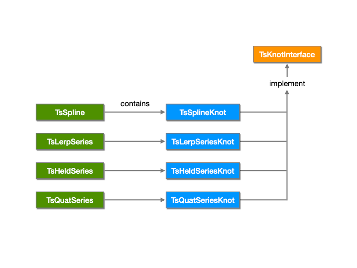

Each knot object represents one knot from a series.  The knot classes are mostly
simple data containers.

```c++
class TsKnotInterface
{
    void SetTime(double time);
    double GetTime() const;

    // SdfValueBlock support
    void SetBlock(bool block);
    bool IsBlock() const;

    TfType GetValueType() const;

    // All subclasses implement:
    // template <typename T> void SetValue(const T &value);
    // template <typename T> bool GetValue(T *valueOut) const;

    void SetValue(const VtValue &value);
    bool GetValue(VtValue *valueOut) const;

    bool IsDualValued() const;
    template <typename T> void SetPreValue(const T &value);
    template <typename T> bool GetPreValue(T *valueOut) const;
    void SetPreValue(const VtValue &value);
    bool GetPreValue(VtValue *valueOut) const;
    void SetPreBlock(bool block);
    bool IsPreBlock() const;
    void ClearPreValueAndPreBlock();

    // See subclasses for interpolation methods that each supports.
    bool SetPostInterp(TsInterpMethod method);
    TsInterpMethod GetPostInterp() const;

    bool IsC0Continuous() const;
    bool IsG1Continuous() const;
    bool IsC1Continuous() const;

    void SetCustomData(const VtDictionary &customData);
    VtDictionary GetCustomData() const;
    void SetCustomDataByKey(const TfToken &keyPath, const VtValue &value);
    VtValue GetCustomDataByKey(const TfToken &keyPath) const;

protected:
    // Virtual dispatch for non-virtual interface.
    // This is an implementation detail; these are possible examples.
    virtual bool _SetPostInterp(TsInterpMethod method) = 0;
    virtual bool _IsC0Continuous() const = 0;
    virtual bool _IsG1Continuous() const = 0;
    virtual bool _IsC1Continuous() const = 0;
};

class TsSplineKnot :
    public TsKnotInterface
{
    // SetPostInterp: supports all methods.

    void SetPreTanLen(double len);
    double GetPreTanLen() const;

    // The many tangent methods cover:
    // - Setting and getting
    // - Pre-tangents and post-tangents
    // - Typed and VtValue
    // - Presto and Maya forms
    // - Auto-tangents
    template <typename T> void SetPreTanSlope(const T &slope);
    template <typename T> bool GetPreTanSlope(T *slopeOut) const;
    void SetPreTanSlope(const VtValue &slope);
    bool GetPreTanSlope(VtValue *slopeOut) const;
    template <typename T> void SetPreTanHeight(const T &height);
    template <typename T> bool GetPreTanHeight(T *heightOut) const;
    void SetPreTanHeight(const VtValue &height);
    bool GetPreTanHeight(VtValue *heightOut) const;
    void SetPreTanAuto(bool auto);
    bool IsPreTanAuto() const;
    template <typename T> void SetPostTanSlope(const T &slope);
    template <typename T> bool GetPostTanSlope(T *slopeOut) const;
    void SetPostTanSlope(const VtValue &slope);
    bool GetPostTanSlope(VtValue *slopeOut) const;
    template <typename T> void SetPostTanHeight(const T &height);
    template <typename T> bool GetPostTanHeight(T *heightOut) const;
    void SetPostTanHeight(const VtValue &height);
    bool GetPostTanHeight(VtValue *heightOut) const;
    void SetPostTanAuto(bool auto);
    bool IsPostTanAuto() const;
};

class TsLerpSeriesKnot :
    public TsKnotInterface
{
    // SetPostInterp: supports Held and Linear.
};

class TsHeldSeriesKnot :
    public TsKnotInterface
{
    // SetPostInterp: supports only Held.
};

class TsQuatSeriesKnot :
    public TsKnotInterface
{
    // SetPostInterp: supports Held and Linear.
};
```

All knots must have the same value type.  Attempting to mix knot types in the
same series is an error.  Attempting to use an unsupported value type (e.g. for
`TsSpline`, something other than `double`, `float`, or `half`) is also an error.

There may only be one knot at any given time.  Passing multiple knots with the
same time to `SwapKnots` is an error.  Calling `SetKnot` with an existing knot
time will silently overwrite the existing knot.

See [Question: time snapping](#time-snapping).

## Automatic Tangent Computation

When splines contain automatic tangents, these are recomputed each time nearby
knots change.

During bulk editing operations, automatic tangent computation can be deferred in
order to avoid redundant processing.  An RAII helper class called
`TsAutomaticTangentBlock` will be provided for this purpose.

When knots with automatic tangents are serialized, the computed tangents will be
stored with the knots.  This denormalization will avoid a speed hit when reading
splines from USD files.  As with any denormalization, this admits the
possibility of inconsistent data - but only if a .usda file is edited outside of
the USD API.

## Structs and Enums

```c++
enum TsInterpMethod
{
    TsInterpHeld,
    TsInterpLinear,
    TsInterpCurve    // Bezier or Hermite, depends on curve type
};

enum TsCurveType
{
    TsCurveTypeBezier,
    TsCurveTypeHermite
};

enum TsExtrapMethod
{
    TsExtrapNone,
    TsExtrapHeld,
    TsExtrapLinear,
    TsExtrapSloped,
    TsExtrapLooped
};

enum TsLoopMode
{
    TsLoopRepeat,
    TsLoopReset,
    TsLoopOscillate
};

struct TsLoopParams
{
    // Prototype region to be copied.  Knots exactly at the start are included;
    // knots exactly at the end are excluded.
    double protoStart;
    double protoLen;

    // Number of copies to make of the prototype region.  Zero makes no copies.
    unsigned int numPreLoops;
    unsigned int numPostLoops;
};
```

## Reduction

See the "Feature Reduction" section above.

The basic implementation will be for individual series:

```c++
enum TsFeatureFlag
{
    TsFeatureHeldSegments,
    TsFeatureLinearSegments,
    TsFeatureHermiteSegments,
    TsFeatureAutomaticTangents,
    TsFeatureDualValuedKnots,
    TsFeatureInnerLoops,
    TsFeatureExtrapLoops,
    TsFeatureExtrapSlopes
};
using TsFeatureFlags = int;

struct TsReductionParams
{
    TsFeatureFlags supportedFeatures;
    double dualValueTimeDelta;
    GfInterval extrapolationTimeRange;
};

// Reduces the provided series, if necessary, to use only the specified
// features.  Returns whether any changes were made.
//
bool TsReduceSeries(
    TsSeries *series,
    const TsReductionParams &params);
bool TsReduceSpline(
    TsSpline *spline,
    const TsReductionParams &params);
```

We will likely also want conveniences for whole layers and stages.  These might
go in `usdUtils`:

```c++
bool UsdUtilsReduceSeriesInLayer(
    const SdfLayerHandle &layer,
    const TsReductionParams &params);

bool UsdUtilsReduceSeriesOnStage(
    const UsdStagePtr &stage,
    const TsReductionParams &params,
    const UsdEditTarget &editTarget = UsdEditTarget());
```

`ReduceSeriesOnStage` is potentially problematic, because it could lead to a
mixture of reduced and unreduced opinions in various layers.  But it certainly
does seem convenient.  If clients use a topmost layer as an edit target, that
should suffice for reading.

## Utilities

The following general-purpose series and spline utilities will be available:

```c++
// Returns the bounding interval of regions over which the specified series
// will evaluate to different values.  The returned interval may be infinite on
// either side when extrapolation differs.  The returned interval is a bound,
// and it is possible that there are regions within that bound where the series
// do not differ.
//
GfInterval TsFindDifferingInterval(
    const TsSeries &s1,
    const TsSeries &s2);

// Removes as many knots as possible from the specified intervals of a spline
// without introducing error greater than maxErrorFraction * value range in
// intervals.  Extremes (high or low points) are always preserved, and they are
// detected by finding knots that are above or below their neighbors by at least
// maxExtremeFraction * value range in intervals.
//
void TsSimplifySpline(
    TsSpline *spline,
    const GfMultiInterval &intervals = GfMultiInterval::GetFullInterval(),
    double maxErrorFraction = .01,
    double maxExtremeFraction = .001);

// Finds a new set of knots that describe a similar spline, but with possibly
// fewer knots.  First densely samples the spline by adding splits quantized
// to samplingInterval (both absolutely and in spacing).  Then calls
// TsSimplifySpline on the result.  Operates only within specified intervals.
//
void TsResampleSpline(
    TsSpline *spline,
    double samplingInterval,
    const GfMultiInterval &intervals = GfMultiInterval::GetFullInterval(),
    double maxErrorFraction = .01,
    double maxExtremeFraction = .001);

```

# QUESTIONS

Feedback is welcome on the following questions (or any other aspect of this
proposal).

## Splines of vectors?

See [Value Type Categories](#value-type-categories).

Should USD Anim support splines of floating-point vectors?  Any type that
supports addition and scalar multiplication can be represented by a spline.
Presto supports splines of floating-point vectors, but we have barely used them.

Among other things, values and tangents of vector-valued splines can't easily be
visualized in a 2D interface, making them less useful for artists.  These kinds
of splines, if they are useful at all, would presumably be used for programmatic
interpolation.

Our guess for now is **no**, we should not support splines of vectors in USD
Anim.

## Unification of series and time samples?

See [Value Type Categories](#value-type-categories).

It may sometimes be useful to write generic client code that can operate on
time-varying values without regard to whether they are series or time samples.
To support this pattern, we could represent time samples as a kind of series
that has a knot for each sample.  However, we don't think we have enough
information yet to determine whether this would be useful.

The most important use case for this kind of generic handling is value
resolution, and that will already happen identically for series and time
samples; calling `UsdAttribute::Get` will consult time samples, then series,
then defaults and fallbacks.

Another important case is for rendering: deciding the times at which to sample
an attribute.  Renderers often call methods like
`UsdAttribute::GetBracketingTimeSamples` for this purpose.  So far, though,
we're not sure there's an obvious analogue for splines.  We could return knot
times, but often the coordinates of spline knots are arranged for artist
convenience in achieving a shape, rather than to make runtime policy.

The fact that splines are typically sparse, and time samples are typically
dense, is enough of a difference that an API that treats them the same way might
be doing us a disservice.  For example, generic code that handles series might
slow down because it is asked to operate on every one of an attribute's time
samples.

One limiting factor for Pixar is that splines, for us, are only for source data,
and time samples are only for rendering.  For game pipelines in particular,
splines may be a runtime representation, not just a source form.  We may need
more community input to understand how best to serve the needs of clients that
use runtime splines.  The question of whether splines and time samples should be
accessible via a common API is just one of the relevant issues.

Our guess for now is **no**, we should not present time samples as series.

## Half-valued splines?

See [Value Types](#value-types).

Should USD Anim support splines of `half`-valued attributes?

On one hand, `half` is a scalar floating-point type just like `double` and
`float`.

On the other hand, `half` has low enough precision, and poor enough hardware
support in some environments, that it may be a fair amount of work to make
`half` splines work acceptably.  There is also rumor that `half` is not broadly
used.

For now we are **undecided** pending input and technical investigation.

## Looping limitations?

See [Looping](#looping).

How should USD Anim handle the following?

**Inner-loop regions.** Presto only supports one inner-loop prototype region per
series.  An unlimited number of inner-loop regions could theoretically be
supported if that is useful; rules would have to be designed that govern
behavior where echo regions overlap.

**Modes.** Minimum support for both Presto and Maya would be:

- Only Continue mode for inner loops.
- Only Repeat, Reset, and Oscillate modes for extrapolating loops.

We could also support Continue mode in extrapolating loops, and Repeat, Reset,
and Oscillate modes in inner loops.

Our guess for now is **minimal**: at most one inner-loop region, and only the
modes required to support Presto and Maya.

## Reduction metadata?

See [Feature Reduction](#feature-reduction).

When reduction is performed, should metadata be inserted that allows clients to
introspect what has changed?

Our guess for now is **no**, we should not include such metadata.

## Custom data edit policies?

See [Round-Trip Considerations](#round-trip-considerations).

When series are edited, and per-knot custom data is found on existing knots,
what should happen?  Some kinds of custom data become invalid when their knots
are edited, and others do not.

The minimum is for USD Anim to do nothing - simply to preserve custom data where
it exists.  But we could add other policies that could be tagged or registered
somehow, if that is important to clients.

The answer to this question will depend on both what kinds of custom data
clients store, and how important it is for that custom data to remain valid when
edited by other clients.

Our guess for now is **no**, we should not add additional policies for custom
data editing.

## Time-oriented API?

See [Time Orientation](#time-orientation).

Most series usage is time-oriented, but more general uses of series are
possible.  Should the initial version of USD Anim be implemented with generic
vocabulary, referring to "x" instead of "time"?

Our guess for now is **no**, we should not pursue a generic API yet.

## Schema-level methods?

See [Access From UsdAttribute](#access-from-usdattribute).

We are proposing new methods on `UsdAttribute`, such as `GetPreValue` and
`GetSeries`.  It is possible that we may want to replicate these methods on
schemas like `UsdGeomXformable` and `UsdGeomPrimvar`, which already have methods
similar to `UsdAttribute::GetTimeSamples`.  This is a question for further
study.

For now we are **undecided** as to whether this makes sense or not.

## Time snapping?

See [Knots](#knots).

Should USD Anim perform any time snapping?  In theory, knots with tiny time
differences should be allowed to exist, and considered distinct.  But there may
be situations where the possibility of rounding errors dictates that times with
a very small difference should be considered identical.  For example, in a call
like RemoveKnot, what happens when there is a tiny numerical difference between
the specified time and the nearest knot time?  Should the call be ignored, or
should it snap to the nearby time?  If we do want some degree of snapping or
tolerance, we will need to decide epsilon values carefully, allow clients to
configure them, and possibly scale them based on the time width of the segment
under consideration.

For now we are **undecided** as to whether this makes sense or not.
