# Regressive Splines in USD

Bezier splines are great for artists, but they have some interesting technical
challenges.  One is that they are parametric: rather than y = f(x) as we would
like, they are { x = f(t), y = f(t) }.  Among other things, this means they can
easily go backwards in time:

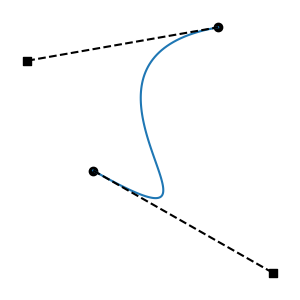

Such curves are non-functions: given a time, there is more than one possible
value.  This is intolerable for a system that governs values over time.  We call
these _regressive segments_.  They are mathematically _non-monotonic_ in the
time dimension.

Artists probably don't create regressive curves on purpose.  But they can
certainly create them by accident.  Splines can also be transformed, or
generated programmatically, and this can lead to unusual cases.  The bottom line
is that regressive curves are an unavoidable consequence of using Beziers, and
every animation system has to pick a way to deal with them.

Unfortunately, there has never been a standard for preventing regression.  There
are several different popular strategies.  This means that, given a regressive
curve, different clients will do wildly different things.  This document aims to
illustrate how regression arises, describe some known strategies, and propose a
spline authoring system that can accommodate many of these strategies, resulting
in non-regressive splines that will behave identically for all clients.

# When Regression Arises

When addressing regression, we are only concerned with x(t), not with y(t). 
This means we only care about the placement of the control points in the time
dimension.  Anything can change in the value dimension, and what happens in the
time dimension won't change at all.  This is because x(t) and y(t) are separate
functions.  Changing values will squash, stretch, and skew the curve in the
value dimension, but that doesn't matter for the question of regression.

We can also work in a _normalized interval_, scaled and translated so that the
start knot is at time 0 and the end knot at time 1.  This also has no effect on
regression.  The end result is that we care only about two numbers: the time
coordinates of the knot tangent endpoints, expressed relative to the normalized
interval.

If knot tangents don't leave the segment interval, we are guaranteed there is no
regression.  This is also intuitive for artists.  It's a conservative rule you
can learn: don't let a tangent cross the opposite knot, and you'll never get
regression.

If both tangents alight exactly at the opposite knot, we get a _single vertical_,
the limit of non-regression.  (Throughout this document, we use "vertical" in
the sense of "when graphed with time on the horizontal axis".)

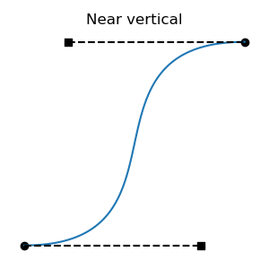
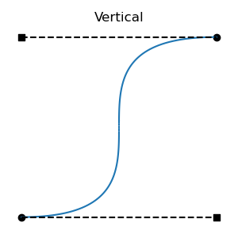
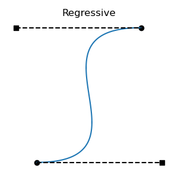

All regressive cases have at least one tangent outside the interval.  Is the
converse also true: that all cases with a tangent outside the interval are
regressive?  No: there are non-regressive curve shapes that can only be achieved
by placing one of the tangent endpoints outside the interval.  This can be
non-regressive if the out-of-bounds tangent isn't too long, and the segment's
other tangent is short enough.  These cases are fairly atypical, involving
regions of rapid change, but they are valid functions:

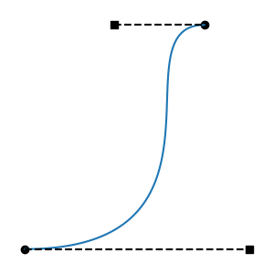

There's a graph that describes when regression arises:

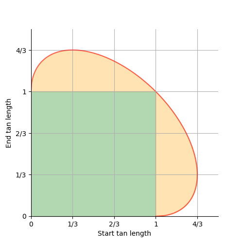

- In the green square, we have _contained tangents_, and there is no regression.

- In the orange ellipse sections, we have _bold tangents_, and there is no
  regression.

- On the red ellipse edge, we have a _single vertical_, and there is no
  regression.

- Everywhere else, we have regression.

- The ellipse also continues inside the green square, but it isn't meaningful
  there.

We've seen the (1, 1) point on the ellipse above; it's the symmetrical case with
the vertical in the center of the interval.  That one is also a corner of the
green box, one of the limits of contained tangents.

Here are two additional important cases, the (1/3, 4/3) and (4/3, 1/3) ellipse
limits.  These are the longest possible non-regressive tangents.  They put the
vertical at times 1/9 and 8/9 respectively.

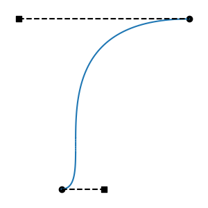
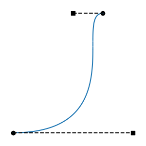

As we move between the above two limits, in the _center_ of the ellipse edge, we
make one tangent longer and the other shorter.  As we move between the (4/3,
1/3) limits and the (1, 0) limits, at the _fringes_ of the ellipse edge, we make
both tangents longer or shorter.

At (0, 1) and (1, 0), we get a vertical at either endpoint.  These are also at
corners of the green square, and limits of contained tangents.

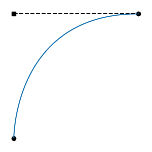
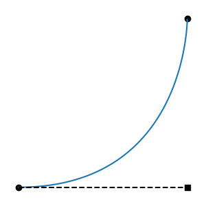

# Anti-Regression Strategies

First, most (all?) spline animation systems observe one important restriction,
which Ts will enforce as well: tangents may never face backwards, out of their
segment's interval.  Such a tangent will be ignored at runtime, as though it
were zero-length.  This prevents some of the worst cases.  But, even when forced
to face into their segments, tangents can cause regression by being too long.

To deal with long tangents, here are some strategies that we know of.  We
propose to offer all of them in USD Anim.

**Single-Tangent Strategies:** shorten each tangent in isolation.

- **Contain:** Forbid tangents from crossing neighboring knots in the time
  dimension.  This is overly conservative: it forbids bold tangents, which is
  both a slight creative limitation and a possible point of incompatibility.
  But the system is simple and intuitive, and it is used in some popular
  packages, including Houdini.

**Dual-Tangent Strategies:** for each spline segment, consider both tangents,
and shorten one or both.

- **Keep Start:** When tangents are long enough to cause regression, keep the
  start tangent the same, and shorten the end tangent until the non-regressive
  limit is reached, with a single vertical.  This is what Maya does, at both
  authoring time and evaluation time.  It's asymmetrical, always favoring the
  start tangent, a bias that often pushes the adjusted curve far to the right of
  the original regressive Bezier.  On the ellipse graph above, Maya finds the
  vertical line through the original point in tangent-length space, and takes
  the nearest intersection with the ellipse.  If the start tangent length is
  greater than 4/3, Maya alters both tangent lengths, always to (4/3, 1/3).  The
  latter case is illustrated by this particular segment:

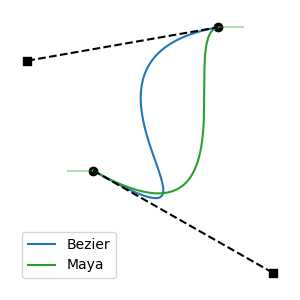

- **Keep Ratio:** When tangents are long enough to cause regression, shorten
  both of them, until the non-regressive limit is reached, with a single
  vertical.  In so doing, preserve the ratio of the original tangent lengths.
  We believe this is a novel strategy.  It is similar to Maya's strategy, but
  tends to produce curves that more closely match the original regressive
  Bezier.  On the ellipse graph above, this strategy finds the line from the
  origin to the original point, and takes the intersection of that line with the
  outer edge of the ellipse.  To avoid sharp bends at or near the endpoints, our
  prototype implementation clamps the ratio to [1/4, 4], thus always using the
  center portion of the ellipse edge, and keeping the vertical between 1/9 and
  8/9.

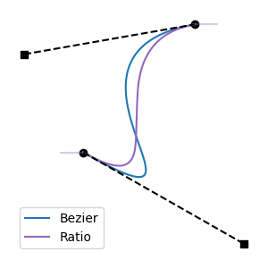

**Interactive Strategies:** as knots are interactively edited, clamp tangent
lengths.  Operate on both segments adjacent to the knot being edited.  Handle
edits to knot time, and edits to tangent length.  These strategies only work
during interactive edits, because they require differentiating between the knot
being edited (the "active" knot) and the other knot in the segment (the
"opposite" knot).

- **Limit Active:** Clamp the active tangent to the non-regressive limit, given
  the existing length of the opposite tangent.

- **Limit Opposite:** As the non-regressive limit is exceeded, shorten the
  opposite tangent to barely maintain non-regression.  When the (4/3, 1/3) limit
  is reached, clamp both tangents there.

# Authoring-Time Anti-Regression

Regression can be prevented at authoring time (regressive curves are never
created), or at evaluation time (regressive curves are adjusted just before
evaluation).

We propose that USD focus on **authoring-time prevention**, shortening
regressive tangents before they are stored in a spline.  This is because:

- What users see at authoring time should match what they get at runtime.

- There are some very different strategies in use in various DCCs.

- At authoring time, we can offer lots of flexibility, supporting any popular
  anti-regression strategy.

- If regressive splines are never written to USD files, imports to all DCCs will
  look the same.

  - (There is a slight asterisk regarding "bold tangents", explained below, but
    still mostly true.)

- Authoring-time flexibility means we can have runtime simplicity, with only a
  single fixed strategy.

Note that "authoring" here may mean interactive editing, or programmatic
editing.

# Proposed Default: Keep Ratio

We propose that anti-regression authoring behavior be enabled by default, and
that the default strategy be **Keep Ratio**, because:

- It permits all non-regressive cases, including bold tangents.  This is an
  important point of compatibility.

- It acts symmetrically, approximating the original regressive Bezier fairly
  closely given the circumstances.

This default can of course be changed.

# Evaluation-Time Anti-Regression

It is always possible that USD content will be generated without anti-regression
enabled, or even by directly writing `usda` content without the API.  Thus, we
must still have an anti-regression strategy at runtime.

We propose that runtime evaluation use a fixed **Keep Ratio** strategy.  This is
for the same reasons that we propose that Keep Ratio be the authoring default,
and also so that the authoring default matches the runtime behavior.

# Proposed API

## Authoring Mode Setting

Allow clients to control the mode used for authoring-time anti-regression
behavior.  Support all non-interactive strategies: Contain, Keep Start, and Keep
Ratio.  Also allow authoring-time anti-regression to be disabled with a mode
called None.  Allow the mode to be specified in the following ways:

- By default, globally enable Keep Ratio.

- Allow clients to change the global default.  This will be useful for clients
  that use only one strategy, or offer users the option to choose a strategy.

- Provide an RAII object that locally overrides the global default for all
  anti-regression authoring behaviors.

```c++
enum TsAntiRegressionMode
{
    TsAntiRegressionNone,
    TsAntiRegressionContain,
    TsAntiRegressionKeepStart,
    TsAntiRegressionKeepRatio
}

class TsSpline
{
    // Returns the current effective anti-regression authoring mode.
    // This may come from the hard-coded default,
    // from SetDefaultAntiRegressionAuthoringMode,
    // or from an AntiRegressionAuthoringSelector.
    //
    static TsAntiRegressionMode GetAntiRegressionAuthoringMode();

    // Set the global default anti-regression authoring mode.  Thread-safe.
    //
    static void SetDefaultAntiRegressionAuthoringMode(
        TsAntiRegressionMode mode);

    // RAII helper class that locally sets the anti-regression authoring mode.
    // The effect lasts as long as the object exists.
    // The effect is limited to the calling thread.
    // Multiple instances on the same thread will stack.
    //
    class AntiRegressionAuthoringSelector
    {
        AntiRegressionAuthoringSelector(
            TsAntiRegressionMode mode);
        ~AntiRegressionSelector();
    }
}
```

## Edit Limiting

The only two methods of `TsSpline` that can introduce regression are `SetKnot`
and `SwapKnots.`  Both of these will call `GetAntiRegressionAuthoringMode`, then
apply that mode to the newly set knots.

## Interactive Limiting

Support DCCs that want to illustrate limiting in real time as users manipulate
knots.  Support all strategies.

```c++
// Construct an instance of this class each time a knot is beginning a round of
// interactive edits.  Call Set for each change.
//
// Limits lengths of tangents to prevent regression.  Operates on the segments
// preceding and following the active knot, if they exist.
//
class TsRegressionPreventer
{
    // Anti-regression modes that can only be used with this class.
    //
    enum InteractiveMode
    {
        ModeLimitActive,
        ModeLimitOpposite
    }

    // Construct a Preventer to edit a knot in the given spline.  The mode will
    // be as returned by TsSpline::GetAntiRegressionAuthoringMode.  If 'limit'
    // is true, adjustments will be enforced before knots are written to the
    // spline.  Otherwise, knots will be written without adjustment, but the
    // SetResult will describe the adjustments that would be made.  The spline
    // must remain valid for the lifetime of this object.
    //
    TsRegressionPreventer(
        TsSpline *spline,
        TsTime activeKnotTime,
        bool limit = true);

    // Construct a Preventer as above, but using one of the interactive modes
    // that are only available to this class.
    //
    TsRegressionPreventer(
        TsSpline *spline,
        TsTime activeKnotTime,
        InteractiveMode mode,
        bool limit = true);

    // Set an edited version of the active knot into the spline, adjusting
    // tangent widths if needed, based on the mode.  Callers may change any
    // aspect of the active knot; the aspects that affect regression are knot
    // time and tangent widths.  SetResult is a struct detailing what
    // adjustments were made.
    //
    bool Set(
        const TsKnot &proposedActiveKnot,
        SetResult *resultOut = nullptr);
}
```

Interactive and edit limiting can be combined.  This allows real-time limiting,
but still provides a backstop for operations that edit splines in ways other
than single-knot dragging.  One sensible choice would be to use the same
strategy for both.  Another would be to use Limit Active or Limit Opposite
interactively, and Keep Start or Keep Ratio for edit limiting.

## Querying

Provide functions that reveal whether any regression is present in an individual
spline, an entire layer, or an entire stage.

```c++
class TsSpline
{
    bool HasRegressiveTangents() const;
}

bool UsdUtilsDoesLayerHaveRegressiveSplines(
    const SdfLayerHandle &layer);

bool UsdUtilsDoesStageHaveRegressiveSplines(
    const UsdStagePtr &stage);
```

## Bulk Limiting

Allow individual splines, entire layers, and entire stages to be de-regressed.
This supports cases where clients are importing content that may have been
generated without API guardrails.  It may also be useful for applications that
use the Contain strategy, and are importing content that may include bold
tangents, which Contain does not allow.

```c++
class TsSpline
{
    // Shorten any regressive tangents.
    // The mode will be as returned by GetAntiRegressionAuthoringMode.
    // Return whether anything was changed.
    //
    bool AdjustRegressiveTangents();
}

// Shorten any regressive tangents.
// The mode will be as returned by TsSpline::GetAntiRegressionAuthoringMode.
// Return whether anything was changed.
//
bool UsdUtilsAdjustRegressiveSplinesInLayer(
    const SdfLayerHandle &layer);

// Shorten any regressive tangents.
// The mode will be as returned by TsSpline::GetAntiRegressionAuthoringMode.
// Return whether anything was changed.
//
bool UsdUtilsAdjustRegressiveSplinesOnStage(
    const UsdStagePtr &stage,
    const UsdEditTarget &editTarget = UsdEditTarget());
```
