# Motivation
Text can be used in a viewport editing environment in many different ways.  For instance, documentation publishing, user interface elements, markup and comments, etc.  When using USD and Hydra for rendering in a design app it is important that the USD and Hydra framework supports text elements.

NOTE: in this design, the text primitive should be within a plane, or in general it is a 2D text. Deformable 3D text is not included in this design.

# The features of text
The text could be single-line single-style text, or multiple-line multiple-style text.

NOTE: Single-line single-style text is not a multiple-line multiple-style text whose line count and style count is 1. Because the implementation of single-line single-style text can be more optimized. 

### Single line single style text properties
The text properties are commonly called text style.

Common text styles

| property name |   example   |  comment  |
|:--------:|:---------:|:-----------|
|  typeface  |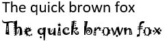| The name string of the font |
|  Bold  |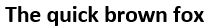| Bold is the property of a font. |
|  Italic  |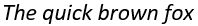| Italic is the property of a font. |
|  Weight  |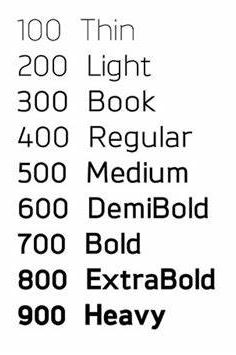| For some font library such as GDI, you can define the weight of the stroke. But Freetype doesn't have this feature. |
|  Height  |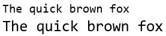| For some font, the appearance of a character may change when height of the character changes. So scale matrix can not be used to implement text height. |
|  Width factor  |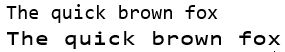| The factor will be multiplied to the width of each character, including the white space. |
|  Oblique  |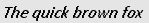| Oblique is a transform of the text mesh. It is different from italic, which is not a transform, but a property of font. |
|  Character spacing  |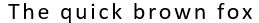| Character spacing is the space between characters. |
|  Underline  |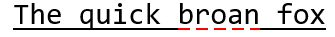| Underline is used for emphasis, comment or error mark. Underline could have line style. |
|  Overline  |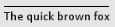| Overline is not commonly used. |
|  Strikethrough  |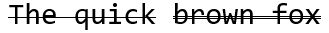| Strikethrough is used when you delete some text and want to keep the history at the same time. Sometimes we use two lines for strikethrough. |
|  Color  ||  |
|  Background color  |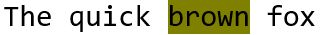|  |

Single line single style text can have special layout.

Common text layout

| property name |   example   |  comment  |
|:--------:|:---------:|:-----------|
|  Direction  |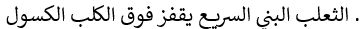| Some languages are written from left to right, while others are written right to left, such as Arabic. The Chinese characters can be written from left to right or right to left. |

### Multiline multi-style text properties

Common multiline text layout

| property name |   property value  |  example   |  comment  |
|:--------:|:---------:|:---------:|:-----------|
|  Markup language  |  |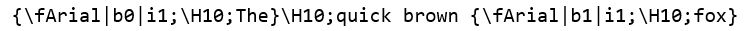| The markups will define the style of the subsequent string. |
|  Line space  |  |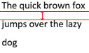| The space between two lines in the same paragraph. |
|  Lines flow direction  | Right to left |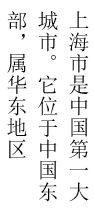| For some special language such as the Traditional Chinese script, while the baseline of the text goes from top to bottom, the flow direction of the lines can be from right to left (by default), or from left to right.  |
|  Lines flow direction  | Left to right |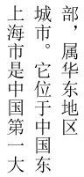|  |
|  Paragraph space  |  |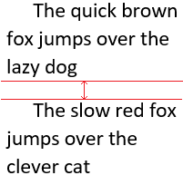| The space after the paragraph and before the next paragraph. |
|  Paragraph indents  | First-line indent |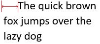| The space before the first character of the first line in the paragraph. |
|  Paragraph indents  | Left indent |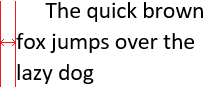|  |
|  Paragraph indents  | Right indent |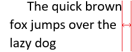|  |
|  Tab stops  |  |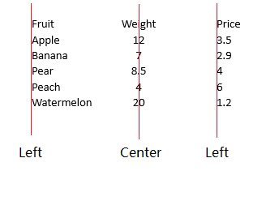| By default, the tabs all have the same pre-defined length. But you can also specify tab-stop position in the paragraph. The text after a tab will be just positioned at the tab stop. There are four tab-stop types: left, right, center and decimal. |
|  Paragraph alignment  | Left align |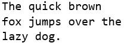| How the words or characters are distributed in a line in the paragraph. |
|  Paragraph alignment  | Center align |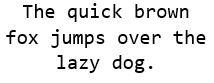|  |
|  Paragraph alignment  | Right align |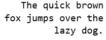|  |
|  Paragraph alignment  | Justify align |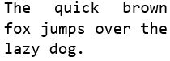|  |
|  Paragraph alignment  | Distributed align |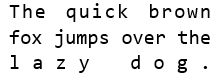|  |
|  Column  |  |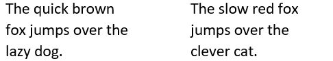| Column is the rectangle blocks that the multiline text will be put in. It is common in the layout of a web page, that when the width of the page is too wide, we will split the page into several blocks so that the width of one block will not be so wide.  |
|  Column alignment |  |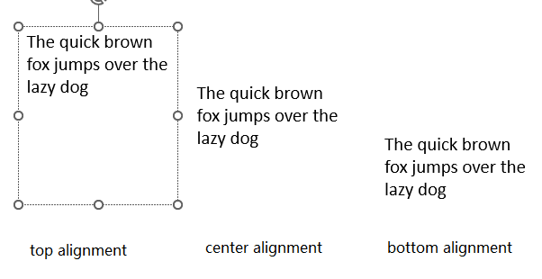| How the text content in the column is aligned in the vertical direction. |
|  Column margin |  | 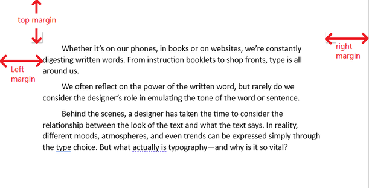 | Column margins are the borders in the four directions. |

This is a picture which illustrates what are the column margins and paragraph indents in an office word page.
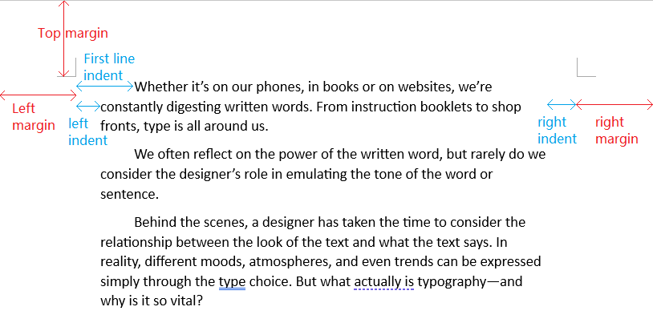

The work proposed here aims to tackle all of these properties. Those not listed can be considered in future works.

### Rendering technique
There are already many different techniques which can display the text on screen. One common technique is to directly use font engine such as GDI or Freetype to generate a texture for the text, and then render the texture on the screen. Another technique is to get the control points of the curves which form the outline of the characters, and then render the curves on the screen. Different techniques may have different quality and performance. 

# The single line single style text schema
A new primitive SimpleText is added, which inherits from Gprim. It inherits properties from Gprim.

We also have 3 schemas that the SimpleText primitive can bind. They are TextStyle, TextLayout, and TextRenderingTechnique. All the text schemas are in the UsdText domain.

### Properties inherited from Gprim
- doublesided
- extent
- orientation
- purpose
- visibility
- xformOpOrder
- primvars:displaycolor
- primvars:displayopacity

The primvars:displaycolor and the primvars:displayopacity will be the color and opacity of the SimpleText.

### Properties specialized for SimpleText
- textData. The text data is a UTF-8 string. This property must be specified for SimpleText.
- primvars:backgroundColor. The color of the background. By default there is no background color. (Currently this not supported in our implementation. Will be implemented in the future.)
- primvars:backgroundOpacity. The opacity of the background. By default there is no background opacity. (Currently this not supported in our implementation. Will be implemented in the future.)
- textMetricsUnit. The unit for textHeight and other text metrics. It is a string token, which could be "pixel", "publishingPoint" or "worldUnit". By default it is "worldUnit". If the text primitive doesn't have billboard, only "worldUnit" is valid. If the unit is set to other value, we will still use "worldUnit" unit. The unit of the textHeight will be the same as the unit of the world space. If the text primitive has billboard, that it always faces to the camera and the size will not change, only the value "pixel" and "publishingPoint" are effective. If metrics unit is "pixel", the unit will be pixel on the screen. If metrics unit is "publishingPoint", the unit will be desktop publishing point or 1/72 inch on the screen. If the unit is set to "worldUnit", we will use "pixel" as the value. 

### Properties of TextStyle
The style for the text is included in a separate class named TextStyle. A SimpleText primitive must be bound with a TextStyle. 

Currently the TextStyle class includes the following properties:

- typeface. The string for the font name. This property must be specified for TextStyle.
- textHeight. An int value represents the height of the text. This property must be specified for TextStyle. The unit is textMetricsUnit. If you want to get a float text height, you need to use a scale matrix.
- bold. A boolean value. By default it is false.
- italic. A boolean value. By default it is false.
- weight. An int value for font weight. By default, it is 0, which means the weight value is ignored, and the bold property will work. If it is not 0, we will ignore the bold property. 
We use the definition of weight in GDI on Windows. That is, the weight value is from 0 to 1000 (but 0 here means ignore the weight). 400 is defined as regular font, and 700 is defined as bold font. (Currently this not supported in our implementation. Will be implemented in the future.)
- obliqueAngle. A float value for the skew angle between the character's left line and the vertical axis. The unit is degree. By default it is zero.
- textWidthFactor. A float value for the scale factor of the character width. By default it is 1.0.
- charSpacing. A float value. This is defined as the scale factor of the character width plus the character space. By default it is 1.0.
- underlineType. This is a string token. "none" means there is no underline. "normal" means the underline is a normal line. You can define other type of underline. By default it is "none".
- overlineType. This is a string token. "none" means there is no overline. "normal" means the overline is a normal line. You can define other type of overline. By default it is "none".
- strikethroughType. This is a string token. "none" means there is no strikethrough. "normal" means the strikethrough is a normal line. "double" means the strikethrough is double lines. You can define other type of strikethrough. By default it is "none".

### Properties of TextLayout
The layout of the text is defined in a separate class named TextLayout. A SimpleText primitive doesn't need to have a TextLayout. In that case, all the properties are in default value.

Currently the TextLayout class includes the following properties:

- direction. This is a string token. By default it is "default", which means the direction is decided by the script of the text data. "leftToRight" means the text is written from left to right. "rightToLeft" means the text is written from right to left. "topToBottom" means the text is written from top to bottom. "bottomToTop" means the text is written from bottom to top. (Currently in our implementation the direction will always be "default". The other settings will not take effect, but will be implemented in the future.)

### Properties of TextRenderingTechnique
The text rendering technique is defined in a seperate class named TextRenderingTechnique. A SimpleText primitive doesn't need to have a TextRenderingTechnique. In that case, the technique is the default technique.

Currently the TextRenderingTechnique includes the following properties:

- technique. The technique is a string token. It could be either "rasterGlyph" or "exactCurveRender". By default it is "exactCurveRender". "rasterGlyph" means we will create a rectangle for each character and will generate the texture for each character using a font library such as FreeType. "exactCurveRender" means we will get control points of the character from font library and create the curves that form the shape. (Currently the implementation only supports "exactCurveRender". The setting "rasterGlyph" be implemented in the future.)

By including the SimpleText, TextStyle, TextLayout and TextRenderingTechnique class you can get a complete text primitive which can be rendered in HdStorm.

You can add more properties. For example, you may add "points" property, which is directly set by the user rather than generated when we generate the rprim for text. 

### New API schema
TextStyleAPI is a new API schema which is for applying TextStyle to a prim. It is a single-apply API schema.

TextLayoutAPI is a new API schema which is for applying TextLayout to a prim. It is a single-apply API schema.

TextRenderingTechniqueAPI is a new API schema which is for applying TextRenderingTechnique to a prim. It is a single-apply API schema.

One TextStyle can be applied to multiple different SimpleText primitive. The same for TextLayout and TextRenderingTechnique.

# The multi-line multi-style text schema
A new primitive MarkupText is added, which inherits from Gprim. It inherits properties from Gprim.

We also have 2 schemas that the MarkupText primitive can bind. They are ParagraphStyle, and ColumnStyle. All the text schemas are in the UsdText domain.

### Properties inherited from Gprim
- doublesided
- extent
- orientation
- purpose
- visibility
- xformOpOrder
- primvars:displaycolor
- primvars:displayopacity

The primvars:displaycolor and the primvars:displayopacity will be the default color and opacity of the MarkupText. They can be override by the color and opacity value in the markup string.

### Properties specialized for MarkupText
- markup. The text data could be interpreted as a markup string. This must be specified for MarkupText.
- markupLanguage. It is a string token tells how the markup tags are interpreted. Currently we support "noMarkup" which is for plain text string, and "mtext" which is for MTEXT markups. By default it is "noMarkup".
- primvars:backgroundColor. The color of the background. By default there is no background color. It can be overridden by the specified background color in the markup. (Currently this not supported in our implementation. Will be implemented in the future.)
- primvars:backgroundOpacity. The opacity of the background. By default there is no background opacity. The background is completely transparent. It can be overridden by the specified background color in the markup. (Currently this not supported in our implementation. Will be implemented in the future.)
- textMetricsUnit. The unit for textHeight and other text metrics. It is a string token, which could be "pixel", "publishingPoint" or "worldUnit". By default it is "worldUnit". If the text primitive doesn't have billboard, only "worldUnit" is valid. If the unit is set to other value, we will still use "worldUnit" unit. The unit of the textHeight will be the same as the unit of the world space. If the text primitive has billboard, that it always faces to the camera and the size will not change, only the value "pixel" and "publishingPoint" are effective. If metrics unit is "pixel", the unit will be pixel on the screen. If metrics unit is "publishingPoint", the unit will be desktop publishing point or 1/72 inch on the screen. If the unit is set to "worldUnit", we will use "pixel" as the value. 

### Properties of ColumnStyle
The column style is defined in a separate class named ColumnStyle. There will be at least one column for the text, and you can specify any count of columns. Each column must be related with one ColumnStyle. The MarkupText primitive will have relationships with the ColumnStyle. From the count of ColumnStyle that is related with the MarkupText, you will know how many columns the text has.

The column style defined in the markup will override the related property in column style. The direction defined in the markup for each single-line single-style sub-string will override the related properties in column style.
- columnWidth. A float value for width. Zero means that the column doesn't have constraint in width. By default it is zero. The unit is textMetricsUnit.
- columnHeight. A float value for height. Zero means that the column doesn't have constraint in height. By default it is zero. The unit is textMetricsUnit.
- offset. Two float values for the offset from the origin of the last column to the origin of this column. By default it is zero. The unit is textMetricsUnit.
- margins. Four float values for the margins of the column. By default all the margins are zero. The unit is textMetricsUnit.
- blockAlignment. The blockAlignment is the vertical alignment of the text. It is a string token, which could be "top", "center" and "bottom". By default it is "top".
- direction. This is a string token. By default it is "default", which means the direction is decided by the script of the text data. "leftToRight" means the text is written from left to right. "rightToLeft" means the text is written from right to left. "topToBottom" means the text is written from top to bottom. "bottomToTop" means the text is written from bottom to top. (Currently in our implementation the direction will always be "default". The other settings will not take effect, but will be implemented in the future.)
- lineFlowDirection. This is a string token. By default it is "topToBottom". "leftToRight" means the text lines are piled from left to right. "rightToLeft" means the text lines are piled from right to left. "topToBottom" means the text lines are piled from top to bottom. "bottomToTop" means the text lines are piled from bottom to top. (Currently in our implementation the flow direction will always be "topToBottom". The other settings will not take effect, but will be implemented in the future.)

"leftToRight" and "rightToLeft" direction are valid only when linesFlowDirection is "topToBottom" or "bottomToTop". "topToBottom" and "bottomToTop" direction are valid only when linesFlowDirection is "leftToRight" or "rightToLeft".

### Properties of ParagraphStyle
The paragraph style is defined in a separate class named ParagraphStyle. The text may not have markups to indicate a paragraph. In that case, the ParagraphStyle will not be applied. If the markups contain paragraphs, the MarkupText must have relationship with ParagraphStyle. The MarkupText can have relationship with more than one ParagraphStyle. The related ParagraphStyle will be applied to the paragraphs in order. If there are more paragraphs in the markup string than the related ParagraphStyles, the last ParagraphStyle will be applied to the last few paragraphs.

For example, if an MarkupText is related with two paragraph styles with the name "P1" and "P2". 
- If the string is a plain string "This is a plain string" with no markup, there will be no paragraphs, and the two paragraph styles will not take effect.
- If the string is an MText string "\PThere is one paragraph", there will be one paragraph, and the paragraph style will be "P1". The "P2" style will not take effect. 
- If the string is an MText string "\PThis is the first paragraph.\PThis is the second paragraph.", there will be two paragraphs, and the first paragraph has the style "P1" while the second 
one has the style "P2". 
- If the string is an MText string "\PThis is the first paragraph.\PThis is the second paragraph.\PThis is the third paragraph.", there will be three paragraphs, and the first paragraph has the style "P1" while the second and the third one have the style "P2". 

If the markup string not only contains paragraphs, but also contains paragraph styles, the styles will override the related paragraph styles.

ParagraphStyle has the following properties:
- firstLineIndent. It is an float value for the indent in the first line. By default it is zero. The unit is textMetricsUnit.
- leftIndent. It is an float value for the indent on the left of the paragraph. By default it is zero. The unit is textMetricsUnit.
- rightIndent. It is an float value for the indent on the right of the paragraph. By default it is zero. The unit is textMetricsUnit.
- paragraphAlignment. A string token which could be "left", "center", "right", "justify", and "distributed". By default it is "LeftAlign".
- paragraphSpace. A float value for the space after the paragraph and before the next paragraph. By default it is zero. The unit is textMetricsUnit.
- tabstops. A paragraph could have several tabstops. Each tabstop has the below properties:
  - tabstopType. It is a string token which could be "leftTab", "rightTab", "centerTab", or "decimalTab". By default it is "leftTab".
  - position. It is an float value for the position of the tabstop. This must be specified for a tabstop. The unit is textMetricsUnit.
- lineSpace. A float value for the line space in this paragraph. By default it is zero. The unit is textMetricsUnit.
- lineSpaceType. This is a string token. By default it is "exactly", which means the lineSpace value is exactly the space between lines. The value can be "exactly", "atLeast" and "multiple".

The MarkupText can also have relationship with the TextStyle, which will be the default style for the text. The style defined in the markup will override the default text style.

You can also composite the TextRenderTechnique with the MarkupText, to define how to render the MarkupText. 

### New API schema
ColumnStyleAPI is a new API schema which is for applying ColumnStyle to a prim. It is a single-apply API schema.

ParagraphStyleAPI is a new API schema which is for applying ParagraphStyle to a prim. It is a single-apply API schema.

Like the TextStyle, one ColumnStyle or ParagraphStyle can be applied to multiple different SimpleText primitive.

# The Rprims and the shader for Text
HdStSimpleText and HdStMarkupText are added as the Rprim for text. The HdStMarkupText is not a composition of several HdStSimpleText. They have separate definitions. 

For either "exactCurveRender" or "rasterGlyph" rendering technique, there will be a specific text shader. Both HdStSimpleText and HdStMarkupText will use the same shader.

The scene delegate or scene index must provide the geometry, indices and required textures.

# The imaging adapter
Currently there is the UsdImagingSimpleTextAdapter for the SimpleText primitive, and UsdImagingMarkupTextAdapter for the MarkupText primitive. They can read the properties and will generate the geometry, indices and texture for the text rprim according to the TextRenderingTechnique.

For example, if the technique is "rasterGlyph", it will create a list of rectangles as the geometry, with each rectangle for one character.  Then it will generate the texture for each character from the font library, put the texture onto a texture atlas, and pass the texture path to the rprim. 

The adapter may also generate line or curve rprims for underline, overline and strikethrough or an additional mesh rprims for background colors.

# The utilities
In our implementation, two utilities are added to help display the text. They are added as plugins. The imaging adapter will use the utilities to generate geometries and textures for the text.

### The markup parser
The markup parser is added to parse the markup string of the MarkupText Gprim. Providing the markup language, it can divide the string into substrings, and each substring will have a single style. It will also generate the paragraph style and column style if the markups contain the information.

In the implementation, the UsdImagingMarkupParser plugin class will provide the functionality of the markup parser. And we provide UsdImagingCommonParser as the default plugin.

### The text library
The text library is a wrapper of Freetype library, which can generate the texture or curve information for each character. The text library will also help do line break for a long string, and it can help do complex language analysis, and even do font substitution if a character can not be displayed with the current font.

The text library also provide utility functions such as get the path of the system font folder, get the extents of a certain text string before we generate layout for it and so on.

In the implementation, the UsdImagingText plugin class will provide the functionality of the text library. And we provide UsdImagingCommonText as the default plugin. The plugin uses FreeType as the font engine below.

### Multilanguage handling
We are going to support most of the common languages and writing systems: western alphabets, CJK characters, and also complex scripts such as Arabic and Hebrew. If the current font can not support the character, you can use the FontSubstitution setting to automatically select a font which can display the character.

The support for complex script is only available on Windows now. (We will use harfbuzz to help itemize the complex script characters in the future.)

# Further extension
Billboard text: Billboarding is a way of adding special transformations to a geometry - anchoring to the screen, scaling to the screen instead of the world, etc. When there is extension to enable billboarding for Gprims, as SimpleText and MarkupText are type of Gprims, billboarding will be automatically enabled for them.

Text with material: currently in our implementation we use specified shader for the text, so you can not bind a material to the text primitive. In the future, we may modify the shader to add the support for material.
