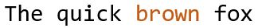

# Motivation
Text can be used in a viewport editing environment in many different ways.  For instance, documentation publishing, user interface elements, markup and comments, etc.  When using USD and Hydra for rendering in a design app it is important that the USD and Hydra framework supports text elements.

NOTE: in this design, the text primitive should be within a plane, or in general it is a 2D text. Deformable 3D text is not included in this design.

# The features of text
The text could be single-line single-style text, or multiple-line multiple-style text.

NOTE: Single-line single-style text is not a multiple-line multiple-style text whose line count and style count is 1. Because the implementation of single-line single-style text can be more optimized. 

### Single line single style text properties
The text properties are commonly called text style.

Common text styles

| property name |   example   |  comment  |
|:--------:|:---------:|:-----------|
|  typeface  || The name string of the font |
|  Bold  || Bold is the property of a font. |
|  Italic  || Italic is the property of a font. |
|  Weight  || For some font library such as GDI, you can define the weight of the stroke. But Freetype doesn't have this feature. |
|  Height  || For some font, the appearance of a character may change when height of the character changes. |
|  Width factor  || The factor will be multiplied to the width of each character, including the white space. |
|  Oblique  || Oblique is a transform of the text mesh. It is different from italic, which is not a transform, but a property of font. |
|  Character spacing  || Character spacing is the space between characters. |
|  Underline  || Underline is used for emphasis, comment or error mark. Underline could have line style. |
|  Overline  || Overline is not commonly used. |
|  Strikethrough  || Strikethrough is used when you delete some text and want to keep the history at the same time. Sometimes we use two lines for strikethrough. |
|  Color  ||  |
|  Background color  ||  |

Single line single style text can have special layout.

Common text layout

| property name |   example   |  comment  |
|:--------:|:---------:|:-----------|
|  Direction  || Some languages are written from left to right, while others are written right to left, such as Arabic. The Chinese characters can be written from left to right, from right to left and from top to bottom. |

### Multiline multi-style text properties

Common multiline text layout

| property name |   property value  |  example   |  comment  |
|:--------:|:---------:|:---------:|:-----------|
|  Markup language  |  || The markups will define the style of the subsequent string. |
|  Line space  |  || The space between two lines in the same paragraph. |
|  Lines flow direction  | Right to left || For some special language such as the Traditional Chinese script, while the baseline of the text goes from top to bottom, the flow direction of the lines can be from right to left (by default), or from left to right.  |
|  Lines flow direction  | Left to right ||  |
|  Paragraph space  |  || The space after the paragraph and before the next paragraph. |
|  Paragraph indents  | First-line indent || The space before the first character of the first line in the paragraph. |
|  Paragraph indents  | Left indent ||  |
|  Paragraph indents  | Right indent ||  |
|  Tab stops  |  || By default, the tabs all have the same pre-defined length. But you can also specify tab-stop position in the paragraph. The text after a tab will be just positioned at the tab stop. There are four tab-stop types: left, right, center and decimal. |
|  Paragraph alignment  | Left align || How the words or characters are distributed in a line in the paragraph. |
|  Paragraph alignment  | Center align ||  |
|  Paragraph alignment  | Right align ||  |
|  Paragraph alignment  | Justify align ||  |
|  Paragraph alignment  | Distributed align ||  |
|  Column  |  || Column is the rectangle blocks that the multiline text will be put in. It is common in the layout of a web page, that when the width of the page is too wide, we will split the page into several blocks so that the width of one block will not be so wide.  |
|  Column alignment |  || How the text content in the column is aligned in the vertical direction. |
|  Column margin |  |  | Column margins are the borders in the four directions. |

This is a picture which illustrates what are the column margins and paragraph indents in an office word page.

The work proposed here aims to tackle all of these properties. Those not listed can be considered in future works.

### Rendering technique
There are already many different techniques which can display the text on screen. One commonly used technique is MSDF, that generate the multi-channel signed distance field for each character, and use it to reconstruct the shape of the glyph. Another technique is to get the control points of the curves which form the outline of the characters, and then render the curves on the screen. Different techniques may have different quality and performance. 

# The single line single style text schema
A new primitive SimpleText is added, which inherits from Gprim. It inherits properties from Gprim.

We also have 2 schemas that the SimpleText primitive can bind. They are TextStyle and TextLayout. All the text schemas are in the UsdText domain. We have default value for TextLayout, so SimpleText primitive doesn't need to bind to TextLayout. But one SimpleText primitive must bind to a TextStyle.

The SimpleText primitive also must bind to a material. Please see "The Rprims and the shader for Text" part and "UsdImagingTextRenderer" part below.

### Properties inherited from Gprim
- doublesided
- extent
- orientation
- purpose
- visibility
- xformOpOrder
- primvars:displaycolor
- primvars:displayopacity

The primvars:displaycolor and the primvars:displayopacity will be the color and opacity of the SimpleText.

### Properties specialized for SimpleText
- textData. The text data is a UTF-8 string. This property must be specified for SimpleText.
- primvars:backgroundColor. The color of the background. By default there is no background color. (Currently this not supported in our implementation. Will be implemented in the future.)
- primvars:backgroundOpacity. The opacity of the background. By default there is no background opacity. (Currently this not supported in our implementation. Will be implemented in the future.)
- textMetricsUnit. The unit for text metrics, such as text height. It is a string token, which could be "pixel", "publishingPoint" or "worldUnit". By default it is "worldUnit". If textMetricsUnit is "pixel", the unit of text metrics will be the same as a pixel in the framebuffer. If textMetricsUnit is "publishingPoint", the unit will be the same as desktop publishing point, or 1/72 of an inch on a screen's physical display. If textMetricsUnit is "worldUnit", the unit will be the same as the unit of the world space. If the text primitive has billboard, the textMetricsUnit can only be "pixel" or "publishingPoint". Otherwise, the textMetricsUnit can only be "worldUnit".
- renderer. The name or id of the text renderer. It is a string. By default it is empty. Please see "UsdImagingTextRenderer" part below.

### Properties of TextStyle
The style for the text is included in a separate class named TextStyle. A SimpleText primitive must bind to a TextStyle. 

Currently the TextStyle class includes the following properties:

- typeface. The string for the font name. This property must be specified for TextStyle. There is no default value.
- fontType. This is a string token, which could be "ttf/otf", "fon", "pcf", "shx" and any other font types. Because most of the font library has the similar handling for ttf font and otf font, we use "ttf/otf" for both ttf font and otf font. By default the fontType is "ttf/otf".
- textHeight. An int value represents the height of the text. This property must be specified for TextStyle. There is no default value. The unit is textMetricsUnit. If you want to get a float text height, you need to use a scale matrix.
- bold. A boolean value. By default it is false.
- italic. A boolean value. By default it is false.
- weight. An int value for font weight. By default, it is 0, which means the weight value is ignored, and the bold property will work. If it is not 0, we will ignore the bold property. 
We use the definition of weight in GDI on Windows. That is, the weight value is from 0 to 1000 (but 0 here means ignore the weight). 400 is defined as regular font, and 700 is defined as bold font. (Currently this not supported in our implementation. Will be implemented in the future.)
- obliqueAngle. A float value for the skew angle between the character's left line and the vertical axis. The unit is degree. By default it is zero.
- textWidthFactor. A float value for the scale factor of the character width. By default it is 1.0.
- charSpacing. A float value. This is defined as the scale factor of the character width plus the character space. By default it is 1.0.
- underlineType. This is a string token, which could be "none" or "normal". "none" means there is no underline. "normal" means the underline is a normal line. You can define other type of underline. By default it is "none".
- overlineType. This is a string token, which could be "none" or "normal". "none" means there is no overline. "normal" means the overline is a normal line. You can define other type of overline. By default it is "none".
- strikethroughType. This is a string token, which could be "none", "normal" or "doubleLines". "none" means there is no strikethrough. "normal" means the strikethrough is a normal line. "doubleLines" means the strikethrough is double lines. You can define other type of strikethrough. By default it is "none".

### Properties of TextLayout
The layout of the text is defined in a separate class named TextLayout. A SimpleText primitive doesn't need to have a TextLayout. In that case, all the properties are in default value.

Currently the TextLayout class includes the following properties:

- direction. This is a string token, which could be "defaultDir", "leftToRight", "rightToLeft", "topToBottom" or "bottomToTop". By default it is "defaultDir", which means the direction is decided by the script of the text data. "leftToRight" means the text is written from left to right. "rightToLeft" means the text is written from right to left. "topToBottom" means the text is written from top to bottom. "bottomToTop" means the text is written from bottom to top. (Currently in our implementation the direction will always be "defaultDir". The other settings will not take effect, but will be implemented in the future.)

By including the SimpleText, TextStyle, and TextLayout class you can get a complete text primitive. You need to bind the text primitive to a material, then it can be rendered in HdStorm.

You can add more properties. For example, you may add "points" property, which is directly set by the user rather than generated when we generate the rprim for text. 

### New API schema
TextStyleAPI is a new API schema which is for applying TextStyle to a prim. It is a single-apply API schema.

TextLayoutAPI is a new API schema which is for applying TextLayout to a prim. It is a single-apply API schema.

One TextStyle can be applied to multiple different SimpleText primitive. The same for TextLayout.

# The multi-line multi-style text schema
A new primitive MarkupText is added, which inherits from Gprim. It inherits properties from Gprim.

We also have 2 schemas that the MarkupText primitive can bind. They are ParagraphStyle, and ColumnStyle. All the text schemas are in the UsdText domain.

The MarkupText can (but not must) bind to the TextStyle, which will be the default style for the text. The style defined in the markup will override the default text style. 

The MarkupText primitive also must bind to a material. Please see "The Rprims and the shader for Text" part and "UsdImagingTextRenderer" part below.

### Properties inherited from Gprim
- doublesided
- extent
- orientation
- purpose
- visibility
- xformOpOrder
- primvars:displaycolor
- primvars:displayopacity

The primvars:displaycolor and the primvars:displayopacity will be the default color and opacity of the MarkupText. They can be override by the color and opacity value in the markup string.

### Properties specialized for MarkupText
- markup. The text data could be interpreted as a markup string. There is no default value. This must be specified for MarkupText.
- markupLanguage. It is a string token tells how the markup tags are interpreted. Currently we support "noMarkup" which is for plain text string, and "mtext" which is for MTEXT markups. By default it is "noMarkup".
- primvars:backgroundColor. The color of the background. By default there is no background color. It can be overridden by the specified background color in the markup. (Currently this not supported in our implementation. Will be implemented in the future.)
- primvars:backgroundOpacity. The opacity of the background. By default there is no background opacity. The background is completely transparent. It can be overridden by the specified background color in the markup. (Currently this not supported in our implementation. Will be implemented in the future.)
- textMetricsUnit. The unit for text metrics, such as text height. It is a string token, which could be "pixel", "publishingPoint" or "worldUnit". By default it is "worldUnit". If textMetricsUnit is "pixel", the unit of text metrics will be the same as a pixel in the framebuffer. If textMetricsUnit is "publishingPoint", the unit will be the same as desktop publishing point, or 1/72 of an inch on a screen's physical display. If textMetricsUnit is "worldUnit", the unit will be the same as the unit of the world space. If the text primitive has billboard, the textMetricsUnit can only be "pixel" or "publishingPoint". Otherwise, the textMetricsUnit can only be "worldUnit".
- renderer. The name or id of the text renderer. It is a string. By default it is empty. Please see "UsdImagingTextRenderer" part below.

### Properties of ColumnStyle
The column style is defined in a separate class named ColumnStyle. There will be at least one column for the text, and you can specify any count of columns. Each column must be related with one ColumnStyle. The MarkupText primitive will have relationships with the ColumnStyle. From the count of ColumnStyle that is related with the MarkupText, you will know how many columns the text has.

The column style defined in the markup will override the related property in column style. The direction defined in the markup for each single-line single-style sub-string will override the related properties in column style.
- columnWidth. A float value for width. Zero means that the column doesn't have constraint in width. By default it is zero. The unit is textMetricsUnit.
- columnHeight. A float value for height. Zero means that the column doesn't have constraint in height. By default it is zero. The unit is textMetricsUnit.
- offset. Two float values for the offset from the origin of the MarkupText to the origin of this column. By default the two floats are zero. The unit is textMetricsUnit.
- margins. Four float values for the margins of the column. By default all the margins are zero. The unit is textMetricsUnit.
- blockAlignment. The blockAlignment is the vertical alignment of the text. It is a string token, which could be "top", "center" and "bottom". By default it is "top".
- direction. This is a string token, which could be "defaultDir", "leftToRight", "rightToLeft", "topToBottom" or "bottomToTop". By default it is "defaultDir", which means the direction is decided by the script of the text data. "leftToRight" means the text is written from left to right. "rightToLeft" means the text is written from right to left. "topToBottom" means the text is written from top to bottom. "bottomToTop" means the text is written from bottom to top. (Currently in our implementation the direction will always be "defaultDir". The other settings will not take effect, but will be implemented in the future.)
- lineFlowDirection. This is a string token, which could be "leftToRight", "rightToLeft", "topToBottom" or "bottomToTop". By default it is "topToBottom". "leftToRight" means the text lines are piled from left to right. "rightToLeft" means the text lines are piled from right to left. "topToBottom" means the text lines are piled from top to bottom. "bottomToTop" means the text lines are piled from bottom to top. (Currently in our implementation the flow direction will always be "topToBottom". The other settings will not take effect, but will be implemented in the future.)

"leftToRight" and "rightToLeft" direction are valid only when linesFlowDirection is "topToBottom" or "bottomToTop". "topToBottom" and "bottomToTop" direction are valid only when linesFlowDirection is "leftToRight" or "rightToLeft".

### Properties of ParagraphStyle
The paragraph style is defined in a separate class named ParagraphStyle. The text may not have markups to indicate a paragraph. In that case, the ParagraphStyle will not be applied. If the markups contain paragraphs, the MarkupText must have relationship with ParagraphStyle. The MarkupText can have relationship with more than one ParagraphStyle. The related ParagraphStyle will be applied to the paragraphs in order. If there are more paragraphs in the markup string than the related ParagraphStyles, the last ParagraphStyle will be applied to the last few paragraphs.

For example, if an MarkupText is related with two paragraph styles with the name "P1" and "P2". 
- If the string is a plain string "This is a plain string" with no markup, there will be no paragraphs, and the two paragraph styles will not take effect.
- If the string is an MText string "\PThere is one paragraph", there will be one paragraph, and the paragraph style will be "P1". The "P2" style will not take effect. 
- If the string is an MText string "\PThis is the first paragraph.\PThis is the second paragraph.", there will be two paragraphs, and the first paragraph has the style "P1" while the second 
one has the style "P2". 
- If the string is an MText string "\PThis is the first paragraph.\PThis is the second paragraph.\PThis is the third paragraph.", there will be three paragraphs, and the first paragraph has the style "P1" while the second and the third one have the style "P2". 

If the markup string not only contains paragraphs, but also contains paragraph styles, the styles will override the related paragraph styles.

ParagraphStyle has the following properties:
- firstLineIndent. It is an float value for the indent in the first line. By default it is zero. The unit is textMetricsUnit.
- leftIndent. It is an float value for the indent on the left of the paragraph. By default it is zero. The unit is textMetricsUnit.
- rightIndent. It is an float value for the indent on the right of the paragraph. By default it is zero. The unit is textMetricsUnit.
- paragraphAlignment. A string token which could be "left", "center", "right", "justify", and "distributed". By default it is "left".
- paragraphSpace. A float value for the space after the paragraph and before the next paragraph. By default it is zero. The unit is textMetricsUnit.
- tabstops. A paragraph could have several tabstops. Each tabstop has the below properties:
  - tabstopType. It is a string token which could be "leftTab", "rightTab", "centerTab", or "decimalTab". By default it is "leftTab".
  - position. It is an float value for the position of the tabstop. This must be specified for a tabstop. The unit is textMetricsUnit.
- lineSpace. A float value for the line space in this paragraph. By default it is zero. The unit is textMetricsUnit.
- lineSpaceType. This is a string token, which could be "exactly", "atLeast" or "multiple". By default it is "exactly", which means the lineSpace value is exactly the space between lines.

### New API schema
ColumnStyleAPI is a new API schema which is for applying ColumnStyle to a prim. It is a single-apply API schema.

ParagraphStyleAPI is a new API schema which is for applying ParagraphStyle to a prim. It is a single-apply API schema.

Like the TextStyle, one ColumnStyle or ParagraphStyle can be applied to multiple different SimpleText primitive.

# The Rprims and the shader for Text
HdStSimpleText and HdStMarkupText are added as the Rprim for text. The HdStMarkupText is not a composition of several HdStSimpleText. They have separate definitions. Each text Rprim will generate one draw item for the text primitive.

The underline, overline and strikethrough are specially handling. They are not included in the text draw item. For each line, we will generate a basisCurve draw item.

There is also a specified text.glslfx for the text primitive. Both HdStSimpleText and HdStMarkupText will use this shader. The shader contains a full implementation of vertex shader, but in the fragment shader, it requires a function getOpacity. The getOpacity function should return the opacity of the pixel for a character glyph. In current implementation, we hope that the getOpacity function is implemented in the material shader together with the surface shader. As a result, both the SimpleText and MarkupText primitive must bind to a material, and the material should contain an implementation of the getOpacity function. In common case, the material shader should be provided by a UsdImagingTextRenderer. See "UsdImagingTextRenderer" part below. 

# The utilities
In our implementation, three utilities are added to help display the text. They are added as plugins.

### The UsdImagingMarkupParser
The UsdImagingMarkupParser plugin class is to parse the markup string of the MarkupText Gprim. Providing the markup language, it can divide the string into substrings, and each substring will have a single style. It will also generate the paragraph style and column style if the markups contain the information.

The UsdImagingMarkupParser implementation should provide the markup language that it supports. When the user would like to get a parser, he put the markup language that the parser should support, and the UsdImagingMarkupParserRegistry will get the suitable parser.

Currently we provide a default implementation whose name is "CommonParser", which could parse a string contains MText markup. 

### The UsdImagingText
The UsdImagingText plugin class is a wrapper of a font library such as FreeType. It can get the font information and character information. It can also do multilanguage handling. With these functionality, the UsdImagingText can generate the layout: for SimpleText, it is how each character is positioned and also the extent of the whole string; and for MarkupText, it can also do line break and handle the paragraph style and column style.

The UsdImagingText can also get the control point of a character, or the rasterized image of a character using the font library. If you provide a UsdImagingTextRenderer to it, it can use the renderer to generate the final geometry, texture and also the texture coordinate for each character.

The text library also provide utility functions such as get the path of the system font folder, get the extents of a certain text string before we generate layout for it and so on.

When the user would like to get an implementation of UsdImagingText, he should provide the font folder that the class will use. Or else, we will use the default font folder in the operating system.

Currently we provide a default implementation whose name is "CommonText".

### The UsdImagingTextRenderer
The UsdImagingTextRenderer plugin class is to generate the rendering geometry, texture and texture coordinate for a character. It has an TextRendererInput, which could be the rasterized image of the character together with the dimension of the image, or the control points of the character. It will use a text rendering algorithm to generate the rendering information. 

The UsdImagingTextRenderer also should provide a surface shader, which implement the getOpacity function. The shader should be correspond to the rendering algorithm.

The name of the UsdImagingTextRenderer should be put in the text primitive, and it must correspond to the material which is bound to the text primitive. If the "renderer" property is set to empty, we will use the first UsdImagingTextRenderer in the registry.

Currently we provide a default implementation whose name is "SampleTextRenderer", which will require the control points for each character, and generate a rectangle for each character. The characters will be rendered just as rectangles. 

### Enable and disable the build of default plugins
We add two new build configurations "--textplugin" and "--no-textplugin" to USD build. By default, the configuration is "--no-textplugin". So the three default plugins "CommonParser", "CommonText" and "SampleTextRenderer" will not be built together with USD. If you want to render the text primitive, you need to provide the dlls of your own set of plugins, and put the dlls in the binary folder. If you explicitly add "--textplugin" to the build command, the three default plugins will be built.

# The imaging adapter
Currently there is the UsdImagingSimpleTextAdapter for the SimpleText primitive, and UsdImagingMarkupTextAdapter for the MarkupText primitive. They can read the properties and will use the three plugins above to generate the geometry, indices and texture for the text rprim.

# Multilanguage support
The multilanguage support is handled in UsdImagingText plugin. This plugin has an API to return the scripts that it can support. And in this plugin, it could do some complex script shaping or layout generation if it supports the script.

# Further extension
Billboard text: Billboarding is a way of adding special transformations to a geometry - anchoring to the screen, scaling to the screen instead of the world, etc. When there is extension to enable billboarding for Gprims, as SimpleText and MarkupText are type of Gprims, billboarding will be automatically enabled for them.

Text with material: currently in our implementation we use specified shader for the text, so you can not bind a material to the text primitive. In the future, we may modify the shader to add the support for material.
