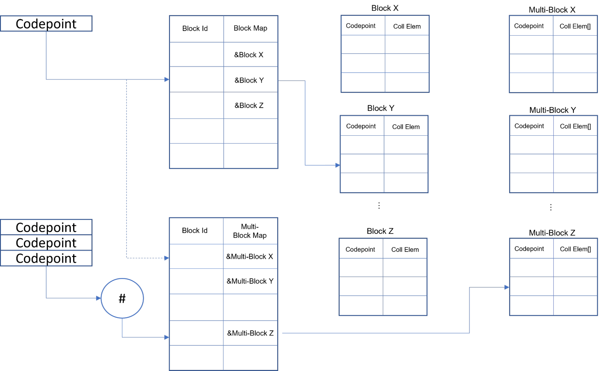

# Unicode Identifiers in USD

Copyright &copy; 2022-2023, NVIDIA Corporation, version 1.1

Edward Slavin  
Aaron Luk  
Matthew Kuruc  

# Contents
  - [Introduction](#introduction)
  - [Approximate Approaches](#approximate-approaches)
  - [An Overivew of Identifiers in USD](#an-overview-of-identifiers-in-usd)
  - [Considerations for Implementation](#considerations-for-implementation)
  - [The Proposed Implementation](#the-proposed-implementation)
    - [Core Identifier Validation](#core-identifier-validation)
    - [The Path and Text File Format Lexer / Parser](#the-path-and-text-file-format-lexer--parser)
    - [Case Mapping and other String Operations](#case-mapping-and-other-string-operations)
    - [Identifier Collation](#identifier-collation)
    - [Performance Measurements](#performance-measurements)
    - [Failing Tests](#failing-tests)
  - [Staged Rollout and Adoption](#staged-rollout-and-adoption)
  - [Conclusion](#conclusion)

# Introduction

In v21.08, USD introduced support for UTF-8 encoded content and validates it specifically for asset paths.  However, USD's current prim name and identifier syntax remains limited to ASCII characters.  More specifically, it conforms to the CPython identifier syntax prior to [PEP 3131: Supporting Non-ASCII Identifier](https://www.python.org/dev/peps/pep-3131/).

As the USD ecosytem expands, new stakeholders in industries such as Architecture, Engineering, and Construction, and Operations (AECO) and Manufacturing have requested support for Unicode identifiers in order to naitvely transport their scene hierarchies across DCCs, particularly through NVIDIA Omniverse.  UTF-8 is a widely adopted encoding for the Unicode standard, which also defines the relevant identifier syntax to be considered for USD beyond ASCII.  The scenes traveling through content creation and simulation pipelines outside of traditional VFX and animation workflows are often encoded in both non-English Latin-based text (such as German) and non-English non-Latin based text (such as Japanese), for which ASCII approximations either don't exist are are extremely lossy.

This proposal considers approaches to approximating UTF-8 identifiers with current USD paradigms, lays out some initial technical details for implementing native UTF-8 identifiers in USD, and proposes a staged rollout for native UTF-8 identifier support to be adopted into all existing USD ecosystems.

Furthermore, this proposal aims to address potential differences in solutions for all identifiers in USD vs. additional considerations that apply specifically to prim names.  Finally, it considers the performance implications of expanding USD identifier syntax beyond its current ASCII paradigms (e.g., normalization and case folding), which has been find-tuned by Pixar for optimal load time performance when opening stages with large numbers of prims, as well as many runtime code paths which require identifier comparison and sorting in containers.

The Unicode Standard, particularly [UAX #31: Unicode Identifier and Pattern Syntax](https://www.unicode.org/reports/tr31/), and its implementation in [PEP 3131](https://peps.python.org/pep-3131/), underpin many of the guiding principles of this document.  Additionally, UTF-8 was chosen as the encoding of choice through the guiding principles of [UTF-8 Everywhere](http://utf8everywhere.org/).

# Approximate Approaches

The least disruptive solution to USD core would be to encode UTF-8 names as display names on prims.  As of v23.02, this is possible due to the addition of the `displayName` metadata field on prim specs (where it was already available on property specs).  The benefit is that the resultant assets are still intelligible by DCCs such as [Maya](https://knowledge.autodesk.com/support/maya/learn-explore/caas/CloudHelp/cloudhelp/2015/ENU/Maya/files/Running-Maya-in-Japanese-Extended-ASCII-characters-htm.html) which do not currently support native UTF-8 encoding.  The downside is that, while this allows the native text to be displayed in view, alternate ASCII names would have to be generated for the prim identifiers as these have to adhere to the rules of `TfIsValidIdentifier`.  Passing the non-ASCII names through `TfMakeValidIdentifier` would convert all non-ASCII characters to `_` characters at best making most prim names illegible and at worst resulting in naming collisions where multiple non-ASCII identifiers are collapsed down to the same "valid" name.  Since these identifiers are used in layer and stage queries by scene path, having to address prims by alternate names becomes difficult.  If UTF-8 identifiers were supported, the non-ASCII text could be used as is (providing it still satisfied any adjusted rules used by `TfIsValidIdentifier`).  

When early requirements for UTF-8 identifiers in Omniverse arose from German use cases, we initially advocated for a `displayName` approach that replaced umulauts with trailing e's and ß with "ss" in prim names.  However, once Japanese use cases came to the forefront as well, we reconsidered how lossy ASCII approximations could be.  While it is possible to Romanize Japanese kanji into hiragana and / or katakana with phonetic Latin-based text, it is not an automated process, and it's still difficult to navigate the stage using `GetPrimAtPath` calls.  That is, for the target workflows in AECO and manufacturing, the UTF-8 encoded namespace hierarchy really is the ground truth of the scene originating from source assets that travel the pipeline across DCCs such as Revit and 3ds Max.  It is cumbersome and disruptive to Romanize this ground truth in pipelines that are otherwise largely non-Romanized.  Even if the UI is showing the UTF-8 encoded `displayName` metadata, the user must still use Romanized names to navigate the scene hierarchy as described above.  We posit that navigating the scene hierarchy is a fundamental operation in USD that deserves deeper consideration for non-Latin based identifiers.  A `displayName` approach would either sacrifice the performance of natively querying prims by path, or incur potentially significant memory usage for large scene hierarchies to cache `displayName` lookups in place of native queries.

Finally, other languages do not have standard Romanizations, and in general a Romanized character does not have a 1:1 correspondence with its source character.  For example, the Jyutping Romanization "sam1" maps to several unrelated Cantonese characters such as 心, 森, and 深.  This further fences off content creators the world over from leveraging and improving upon USD as the canonical mechanism for scene interchange across an ever-expanding ecosystem of tooling and pipelines in the virtual space.

# An Overview of Identifiers in USD

Identifier syntax is currently enforced in USD by several different mechanisms.  The primary mechanism is the inlined function `TfIsValidIdentifier`, which states that "an identifier is valid if it follows the C/Python identifier convention; that is, it must be at least one character long, must start with a letter or underscore, and must contain only letters, underscores, and numerals".  However, there are several other code paths that validate different flavors of identifiers, including namespaced and variant identifiers, that use similar logic to achieve validation.  In particular, this means that any change to the logic governing core identifier validation in `TfIsValidIdentifier` necessitates change in several different similar validation functions across the `Sdf` module (for example, `SdfPath::IsValidNamespacedIdentifier`).

True identifier validation in USD must at a minimum support the following general use cases:

- Validation of identifiers (and dependent constructs, such as paths) from both text and binary usd files
- Validation of identifiers via direct ask in code (e.g. `SdfPath::IsValidIdentifier`)
- Usage of (and indirectly validation of) identifiers in scene navigation such as `GetPrimAtPath`
- Generation of appropriate identifiers for schema extensions that can be appropriately compiled in code-based schemas

Furthermore, these use cases must be supported at both the C++ and Python layers.

It is also necessary to define what we mean by *identifier*.  The current implementation mixes two syntactically similar but semantically different concepts:

- **Prim names:** The name of a USD prim, differentiating one sibling prim from another and forming the hierarchical path from which a prim can be referenced
- **Identifiers:** The identifying names given to USD schema types and properties, largely with the expectation that they can be syntactically combined to be compiled into APIs

The current implementation treats these the same, and restricts both to the rules given above largely due to their use in compiling schema representations that must be compliant with C++ and Python.  However, there is little need to restrict prim names in the same way, and often the source of these names in industries such as AECO and manufacturing come from systems that are permissive in the way these names are represented (e.g. names in non-Latin based languages, spaces, all numerical names, etc.).  Below we discuss one possible approach to distinguish between the two concepts and what would need to change to support doing so.

# Considerations for Implementation

For the proposed implementation, it was decided to use the following conventions:

- Standardize on UTF-8 encoding of Unicode characters
- Implement as much as possible in USD core without relying on external libraries
- Consolidate validation routines down to the `Tf` module

Modifying these code paths to support Unicode requires standardizing on a character encoding and expanding the identifier rules to accept Unicode strings. Unicode strings can be encoded in various forms, some of the most popular being:

- code points
- UTF-8
- UTF-16 / UTF-32

In evaluating options to support, raw code points rely largely on the support of code pages and individual system locales.  UTF-x encodings are already populate for standardized interchange of Unicode text and in particular UTF-8 encoding is widespread within the community.  UTF-8 is a variable length encoding that is backward compatible with existing ASCII encodings, meaning that current usd files, code, etc. that rely on ASCII strings should work without any changes.  The reader is referred to [UTF-8 Everywhere](http://utf8everywhere.org/) as a summary of why UTF-8 was chosen as the preferred encoding over UTF-16 / UTF-32.

Building USD is already a complex endevor.  While there are existing libraries that do provide APIs for working with Unicode character sequences, like [ICU](https://icu.unicode.org/), using these libraries would necessitate the acquisition and distribution of this library with the core USD libraries.  Efforts are already underway to eliminate dependencies (e.g., Boost), so we felt that a small enough subset of Unicode string processing could be implemented in USD core without the need for external libraries.  In practice, the choice of collation algorithm is the primary driver of whether or not to use an external library, so decisions on doing so should be deferred until after understanding the collation algorithm that should be used with the addition of Unicode identifiers (see [Identifier Collation](#identifier-collation) for the different proposed options).

Finally, after an analysis of the existing code base, this proposal recommends that any implementation providing support for Unicode identifiers consolidate the validation logic to one place.  Since most of the logic already exists in the `Tf` module for identifier validation, we recommend this as the module to consolidate all validation logic into.  Currently there are several places that duplicate validation logic across `Tf` and `Sdf` (see [Core Identifier Validation](#core-identifier-validation)) which leads to slightly different implementations of what should be the same validation logic.  The proposed implementation does include this consolidation.

# The Proposed Implementation

The proposed implementation can be found in a Draft PR [here](https://github.com/PixarAnimationStudios/USD/pull/2120).  This section discusses some of the implementation details to provide context to changes that were made.

**Note:** *This section discusses the proposed implementation submitted for review that provides minimal UTF-8 encoded Unicode support.  It is not intended to be a full Unicode implementation, which are better left to widely used libraries like [ICU](https://icu.unicode.org/) or [boost.locale](https://www.boost.org/doc/libs/1_72_0/libs/locale/doc/html/index.html) (which uses ICU under the hood), or smaller implementations such as [uni-algo](https://github.com/uni-algo/uni-algo).*

Core identifier validation separately happens in two distinct places in USD:
- Via code in `TfIsValidIdentifier` and related methods in the `Tf` and `Sdf` modules
- Via a set of lexer / parser rules in flex / bison derived methods

The distinction is important because before a string can be validated via `TfIsValidIdentifier` it has to be appropriately recognized to begin with from an arbitrary test file or path string.  The rules for acceptance of the string are governed by lexing rules that are in essence duplicating the code-based logic as a state machine.  Both validation paths rely on code that has low execution overhead.  The lexer rules are preprocessed into a state machine for low run-time string processing overhead and `TfIsValidIdentifier` and related methods rely on pointer-based validation routines and inline methods to ensure these commonly called routines have minimal overhead for processing large scenes.
 
As described above, UTF-8 was chosen as the encoding format for Unicode strings.  While this encoding dictates how Unicode characters are represented, it does not dictate how those bytes should be interepreted to form higher level tokens like identifiers.  [PEP 3131](https://peps.python.org/pep-3131/) complies with [UAX31-R1: Default Identifiers](https://www.unicode.org/reports/tr31/#R1) by using Unicode's `XID_Start` and `XID_Continue` [derived core properties](https://www.unicode.org/Public/UCD/latest/ucd/DerivedCoreProperties.txt) that are defined per code unit, and by using a profile in which code point `005F` (the underscore or low line, `_`) is added to `XID_Start` as the set of code units that can begin a valid identifier.  The latest C++ standards also add support for Unicode identifiers based on `XID_Start` and `XID_Continue` (e.g., [C++ Standard Draft](https://github.com/cplusplus/draft/blob/main/source/lex.tex)), though compiler support may vary.  Specifically, g++ states conformance to the standard while msvc relies on rules that may or may not be the same as that specified in the standard through `XID_Start` / `XID_Continue` (see [Identifiers C++ | Microsoft Docs](https://docs.microsoft.com/en-us/cpp/cpp/identifiers-cpp?view=msvc-170)).

Though support may vary, both the C++ standard and PEP 3131 have common definitions for what denotes an identifier and the recommendation is to follow this convention in USD, particularly since it must conform to these rules to enable successful compilation of code-based schemas.  One downside of this approach is that strings starting with digits (or indeed, all digit strings) could not be considered valid identifiers, but this no more restrictive than it is in today's implementation, is a reasonable restriction given that USD supports code-based schemas, and still allows for Unicode characters falling in those two classes (`XID_Start` / `XID_Continue`) to be supported.

**NOTE:** Restricting prim names in this way is largerly unnecessary given they are never used by compilers generating schema code.  In fact, it is entirely possible prim names could be any valid Unicode string (e.g., parentheses, spaces, etc.).  While this proposal does not specify the possible characters that could potentially make up a valid prim name, it does suggest a way to separate out the validation of identifiers and the validation of prim names such that it could be changed in the future.  For now, this proposal uses the same rule set for what makes a valid identifier and valid prim name.  If in the future the rules for validation of prim names change, a balance must be maintained between permissiveness and context-free parsability of a string.

To realize this, many changes are required to the core `Tf` and `Sdf` modules.  Most of the core identifier logic ultimately flows through `TfIsValidIdentifier`, with auxiliary methods using this in some way to perform additional validation.  However, logic is also duplicated in a number of places, particulary when additional characters participate in the validation (e.g., `IsValidNamespacedIdentifier` and the tokenization around `:`).  The proposed implementation seeks to do two things:
- Separate out the validation logic such that prim names and identifiers could be validated with separate rules (while they remain the same rule in the current proposal)
- Attempt to centralize the logic in other parts of the code base to use `Tf` validator methods as a single point of validation, rather than duplicating the logic in various forms across different USD methods (particularly in the `Sdf` module).

## Core Identifier Validation

The core validation logic currently relies on checking each character sequentially to see if it is alphabetic, alphanumeric, or an underscore (and separately for the first character vs. subsequent ones) via advancement of a pointer along the length of the string.  Since UTF-8 is a variable length encoding, this logic must be slightly modified to accommodate characters that are 1-4 bytes in length.  Furthermore, the check for each individual character must be slightly more complicated because we are dealing with characters that are classified into a set of *character classes* with the classes defined by the Unicode standard [here](https://www.unicode.org/Public/UCD/latest/ucd/UnicodeData.txt).  To standardize this, we propose the use of a UTF-8 specific string iterator that is able to advance as many bytes as needed to read the next logical character on an increment.  This keeps with the method of advancing the pointer along the length of the string (and in fact would use a `std::string` iterator underneath so that the forward iteration model is the same).  Checking character classes does become trickey - a Unicode character class could contain thousands of characters (represented as their Unicode code points).  For many characters, character classes are specified individually.  For others, a range of code points is given for a particular character class (e.g., CJK characters).  To prevent an increase in load time needed to read this information from the Unicode database, we propose a preprocessor script that generates C++ code containing four specific sets that will be used as follows:

- `xid_start_class`: An *unordered set* of singular unicode code points that fall in the `XID_Start` character class (`Lu` | `Ll` | `Lt` | `Lm` | `Lo` | `Nl` | `_`)
- `xid_continue_class`: An *unordered set* of singular unicode code points that fall in the `XID_Continue` character class (`Nd` | `Mn` | `Mc` | `Pc`)
- `xid_start_range_class`: A vector of pairs (`low`, `high`) of code points that fall in the `XID_Start` character class
- `xid_continue_range_class`: A vector of pairs (`low`, `high`) of code points that fall in the `XID_Continue` character class

This preprocessed file would then be compiled with the rest of the code and be available for fast lookup at runtime.  Preprocessing is necessary because:

- The Unicode database is not formatted in such a way to provide fast run-time lookups of character classes in a memory efficient manner
- The Unicode database is large, and not all information is required to perform the necessary processing

Note that everything that is valid in `XID_Start` is also valid in `XID_Continue`, so the algorithm for validating if a if a character is in the e.g., `XID_Continue` class would be:

- Retrieve the code point of the UTF-8 encoded character
- Check to see if the code point exists in either of the singular sets `xid_start_class` / `xid_continue_class` (O(1) lookup time on average, O(*n*) worst case)
- If it does not exist in either of the singular sets, iterate the range based sets to see if it falls within one of the pair ranges (O(*m*) time where *m* is the length of the range based set, < 10 for all practical purposes)

In total, the validation replacese a string iteration and character range check for alph / alphanumeric to the same string iteration where each character check potentially requires a code point computation (bit manipulation), `unordered_set` lookup, and range based set sub-iteration.  We believe this adds only a minimal amount of overhead to the core validation check with the advantage of adhering to Unicode based naming rules.

Finally, in order to attempt to centralize the validation logic to the `Tf` module, we propose introducing:

- Separate methods to validate prim names and identifiers (even if prim names currently fall back to validating as identifiers)
- Extensions of these methods that take two iterators defining substrings of a given string to examine (for optimization such that substrings don't need to be formed when checking e.g., two sub-parts of a namespaced identifier)

Providing the extensions allows using the core validation logic in methods that otherwise would need to tokenize the string, with the overhead of creating a new string to pass into the core validation methods.  For example, `IsValidNamespacedIdentifier` becomes a string iteration that keeps track of sub-indices of the string between the `:` character and calls core validation logic on the sub-indices of that string via iterators without having to create a new temporary string holding the substring (rather than the validation logic being duplicated inside `IsValidNamespacedIdentifier` as it is today).

In total, the following methods need to be considered when centralizing identifier validation logic:

- `TfIsValidIdentifier`
- `TfMakeValidIdentifier`
- `SdfPath::IsValidPathString`
- `SdfPath::IsValidNamespacedIdentifier`
- `SdfPath::TokenizeIdentifier`
- `SdfSchemaBase::IsValidVariantIdentifier`

In addition, the `Sdf` child policies need to be examined to ensure they are calling the correct validation method (e.g., prim name or identifier).

Futhermore, it is necessary to consider existing logic for case-insensitive comparisons and normalization.  In particular, `TfDictionaryLessThan::_LessImpl` contains logic to perform quasi case-insensitive comparisons of tokens to enforce lexical ordering.  This is substantially more difficult when dealing with Unicode text, but section 3.13 of the [Unicode Standard, Version 14.0](https://www.unicode.org/versions/Unicode14.0.0/ch03.pdf) provides algorithms that could be adopted for this purpose.  While this has not been implemented in the prototype, we feel this method would be sufficient to cover the requirements of ordering against quasi case-insensitive strings.

## The Path and Text File Format Lexer / Parser

For lexer-based validation, a new lexer and parser are introduced to specifically capture new identifier rules for both the path lexer and the text file format lexer.  Although it is possible to change the existing lexer / parser in such a way to support UTF-8 encodings and new identifier rules, we thought it may introduce subtle errors across the ecosystem when using the modified lexer / parser under the current ASCII validation rules (e.g., the new lexer / parser accepting more strings during the lex phase that ultimately failed identifier validation logic).

The path lexer is used as the first step in validating prim path strings.  The text file format lexer is used to read and validate the content of text-based usd files (i.e., `.usda`).  Both require that a sequence of characters be recognized as a logical token (and parsed in context) before being validated.  The rules that dictate what lexer sequences are acceptable for identifiers need to be updated accordingly for Unicode based identifiers.  It is desireable that these rules conform to those updated in the code-based validation sequences.  Unfortunately, it is difficult in flex rules to specify the entire set of byte strings that would encapsulate a character in the e.g., `XID_Start` character class.  To get around this, we propose the lex rule be very permissive (basically any properly encoded UTF-8 character) and specifc validation (prim name or identifier) on the lexed string be done as part of the lexer logic to accept the token prior to parsing.  This does have the unfortunate overhead of performing some validations twice, once at tokenization using the state machine and once adding the token to the tree and checking for identifer validity.

One complication is the use of flex and bison to generate the state machines and code necessary to lex and parse these sequences.  While we would like to limit changes such that only flex is required to regenerate the code and state machine, it is necessary to also regenerate the parser generator through bison.  Unfortunately, different versions of flex and bison generate code in slightly different ways.  In particular, a few function signatures change depending on the version used.  Additionally, flex and bison are natively Linux-based tools - to support Windows, the use of winflex / winbison is required, so it is necessary to lock down a common version that is supported across both platforms.

Note that all of the above relies on the source data being UTF-8 encoded.  This should not be a problem for legacy ASCII based `usda` files or code and should maintain backward compatibility with no changes required (as long as extended character sets are not used).  Moving forward, any USD content that wants to take advantage of Unicode support must encode content in UTF-8.  This includes both files (text and binary) as well as strings in source code.  While these values can be handled correctly in USD, proper display of these strings will be application dependent.  To support testing UTF-8, several existing tests were saved such that content was UTF-8 encoded.  This applies both to USD files with Unicode content and code with string embedded for specific testing of Unicode identifier features.

**Note:** Although the implementation coupled with the proposal did not implement this, it may be prudent to consider a `usda` version bump.  This would clearly distinguish versions of files that are expected to be ASCII-only from those that are Unicode UTF-8 compliant.

Since many tools in the USD ecosystem are Python based, the translation layer between Python and C++ should also be considered.  While in most cases this works out of the box, errors can occur if strings at the Python layer are not UTF-8 encoded before being passed to the C++ layer.  Particular attention must be paid to the way current Python code reads in file content (e.g., schema generation, etc.) before passing this content to the C++ layer.  One area of note is the generated python bindings.  `boost::python` does not natively translate the character encoding between Python and UTF-8 as oposed to Pybind, which ensures UTF-8 encoded strings are passed from Python to C++.

Prim name processing does not involve any Windows-specific APIs (unlike asset paths which may trigger Windows file system calls), so we likely do not need to perform any conversions to and from wide strings in USD core.  Similarly, strings / tokens inside of Crate files can be passed directly to `Sdf`; we don't anticipate any changes to crate file and data logic.  However, code in a DCC that is e.g., C# based, and which wants to take advantage of USD with UTF-8 identifiers, need to take care to convert the native C# wide strings to UTF-8 strings before passing them along to USD.

## Case Mapping and other String Operations

*Case mapping* referes to finding a correspondence between a Unicode codepoint considered "lower case" to one that would be considered "upper case".  Only a certain subset of Unicode codepoints have case mapping rules, and all of these are identified as part of the Unicode database distributed with each Unicode standard version.  Representing these maps in code requires preprocessing the database into a form suitable for rapid consumption.  This information maps well to C++ unordered maps and thus the goal of preprocessing is to create a set of `std::unordered_map` instances that capture this information.  Like the `XID_Start` and `XID_Continue` information that was preprocessed from the database, we chose to create these maps as compile-time entities for several reasons:

- To prevent the need for an "initialization" sequence in the `Tf` module that would have to read all of this information (or at least a subset of it) from files
- To minimize the number of files that have to be additionally distributed with the USD installation as resource collateral

Unordered maps were chosen to minimize lookup latency when mapping from one codepoint to another.  This also requires additional logic to transform code points back to UTF-8 encoded characters for representation in the string.

Serveral challenges inherent to Unicode had to be addressed.  First, case mapping can inflate / deflate a string.  One example of this is the German `es-zed` character, a lowercase character that maps to two Latin `S` characters when underoing an uppercase mapping.  Second, this transformation is one way - you cannot in general recover the original Unicode string when performing one case operation followed by its inverse.  For example, one cannot determine in general if two `S` characters together came from two `s` characters or one `es-zed` character without additional context.  The case mapping algorithm implemented does not consider machine locale, but even if it did, locale alone is not necessarily sufficient to determine the full context necessary to perform symmetrical operations.

Finally, case mapping allows us to transform a Unicode string from lowercase to uppercase or vice versa, but does not allow us to perform case folding, which is the process of determining if two strings are equal, but differ only in their case.  While this could potentially be implemented using the existing case mapping functionality, it is not included in the proposed implementation.

The proposed implementation adds four compile time initialized maps that map:

- Single code point lowercase to uppercase
- Single code pointer uppercase to lowercase
- Single code point lowercase to multiple code point uppercase
- Single code point uppercase to multiple code point lowercase

All values in these maps are 32-bit integers representing the codepoint of the Unicode character in question (derived from the UTF-8 byte sequence for the character).  Appropriate modifications were made to the following `Tf` methods:
- `TfStringToLower`
- `TfStringToUpper`
- `TfStringCapitalize`

Different maps were used so that single code point maps (the most common) would have have to be stored as vectors of length = 1 (at the cost of two lookups, one to determine if the source codepoint is contained in the single codepoint map and, if not, another to determine if its in the multi-codepoint map).  If a codepoint is not present in one of the maps, there is no case mapping for that character (i.e., it maps to itself).

The proposed implementation for Unicode strings is not exhaustive.  There are a number of operations in the `Tf` library that would likely benefit from having specific Unicode implementations, but which are not provided by the proposed implementation.  An investigation of these operations yielded at least the following groups of methods:
- Capturing Unicode characters representing numeric values not in the traditional ASCII value sequence
  - `TfStringToLong`
  - `TfStringToULong`
  - `TfStringToInt64`
  - `TfStringToUInt64`
  - `TfStringToDouble`
- Tokenization methods that rely on delimiters which are assumed to fit into a single byte character (though they are mostly used to tokenize things separated by `.` or `/` characters for e.g., paths, a robust implementation would assume any multi-byte character or sequence of characters as the delimiter)
  - `TfStringTrimLeft`
  - `TfStringTrimRight`
  - `TfStringTrim`
  - `TfStringTokenize`
  - `TfQuotedStringTokenize`
  - `TfStringSplit`
  - `TfStringTokenizeToSet`
  - `TfStringJoin`
- Substring based methods that are not robust under case folding
  - `TfStringContains`
  - `TfStringStartsWith`
  - `TfStringEndsWith`
- String concatenation - Unicode normalization forms are not closed under string concatenation; specifically at least the area where the strings are joined need to be considered for composition
  - `TfStringJoin`

It may be interesting to consider the impact of C++ 20's `std::u8string` type for the methods listed above.  Overloads of these methods that take a `std::u8string` parameter would provide very clear semantics to a developer about the treatment of string content.  While the use of `std:u8string` would really only affect the compiler encoding of string literals, the burden is then placed on the developer to choose explicitly which of the methods to use.

## Identifier Sorting

Be far the most difficult operation to support in Unicode is *collation*, the process of providing an ordering to a set of strings.  This is not only due to the need to integrate additional information from Unicode tables, but also because it inherently affects the run-time performance of certain frequently invoked operations (specifically prim and property ordering).  USD core requires some notion of ordering for prims in a layer and properties on a prim for both internal consistency and to provide the opportunity for tools on top of USD to perform intelligent operations (like finding the difference between two USD files) more easily.  To continue support for some notion of ordering, we consider several options that seek to balance between "correctness" of the collated results and run-time performance of the algorithm, which is often called in tight loops that use `GetPropertiesInNamespace` kinds of queries.  To that end, this proposal enumerates three options for collating UTF-8 strings that range from least correct / most performance to most correct / least performant:

- Simple code point based sorting
- Optimistic ASCII sorting
- Unicode conformant Unicode Collation Algorithm (UCA) sorting

Note that there are other ways that a sort algorithm can provide acceptable collation (for example, using Python's built-in `locale.strcoll` at the UI level) - this proposal is not exhaustive with respect to the sorting algorithms one can use, but does make a few suggestions that are discussed in further detail below.

### Code Point Sorting

In code point sorting, UTF-8 identifiers are sorted according to the integer value of the Unicode code point representing each character.  The algorithm is very simple and performant, involving a single continuous iteration of the characters, extracting the code points one by one, and comparing them.  In practice for non-English languages, it also results an incorrect sort of most characters, since code points have no correlation to actual ordering strength of certain characters.  The result is also very different than the customized dictionary sorting algorithm currently in USD core, particularly with regard to reasoning about numeric subsequences as a unit (e.g., two numeric sequences `2000` and `4` would result in `2000` being sorted first due to code point value comparison of `2` and `4`).  That said, it provides a very definitive ordering that is stable for placing in sorted containers and differencing in files.

### Optimistic ASCII Sorting

In optimistic ASCII sorting, UTF-8 identifiers are optimistically treated as if they were ASCII identifiers and when non-ASCII characters are encountered the algorithm falls back to simple code point sorting.  There are a number of advantages for doing this:

- The existing dictionary sort in USD core has been highly tuned for this kind of content
- Sorts of existing ASCII-only content remain stable under UTF-8 enhancements
- Non-ASCII Unicode characters still have an ordering semantic, even if it's not semantically correct

Challenges with implementing an optimistic ASCII sorting algorithm lie in determining how to treat strings that contain a mix of both ASCII and non-ASCII characters.  These strings cannot directly use the existing dictionary sort algorithm, but sub-strings within these strings could with some limitations.  Furthermore, because the existing dictionary sort algorithm has unique support for digit sequences, challenges lie in how to correctly partition the sub-strings such that they can be sent to the existing dictionary sort algorithm while still resulting in the same sort order they would have if the whole string were ASCII-only and considered as one unit.  Spcifically, consider the following two numeric cases:

- `2000` and `4`
- `000001` and `001`

In the first case, `4` will sort before `2000` because the numeric value of `4` is ordered before that of `2000`.  In the second case, `001` will sort before `000001` because, even though the numeric value of the sequences are the same (`1`), `001` has less non-significant digits in front of the value.  This leads to the following assumptions when reasoning about sub-strings to send to the existing dictionary sort algorithm:

- Substrings can be formed from contiguous ASCII letters and `_` characters of the same length between the two strings
- Substrings can be formed from contiguous ASCII digits of variable length between the two strings
- Substrings can be formed from contiguous ASCII letters, `_`, and digits together if semantically the starting character of the letter sequences match between the two strings being considered
- No substrings can be formed from sequences of non-ASCII characters, and these must be compared character by character using code point sorting

Complications arise in the existing dictionary sort algorithm due to considerations of different "character classes" and weighting against those.  For example, the strings `foo00001bar0002abc` and `foo001bar002xyz` - one might expect that `foo001bar002xyz` is sorted first due to the `001` sorting before the `00001`, but the existing dictionary sort puts more emphasis on the difference of the `a` and `x` characters because it has a higher opinion weight than two otherwise equivalent strings where the only difference is in number of non-signficant digits.  Because of this, care must be taken in combining the ordering result of multiple substrings (i.e., the existing dictionary sort order is context sensitive). 

For example, let's consider a few cases of simple ASCII strings with a single Unicode character:

- `myString002ß`
- `myString0000002ß`
- `ßmyString0000002`
- `myStringxß00002`

Using optimistic ASCII, we would expect the following results:

`myString002ß` < `myString0000002ß`

The sub-strings `myString002` and `myString000002` can be parsed according to the rules above and it can be determined that the subsequences of `myString002` and `myString000002` compare with the former being less than the latter due to less signficant digits in an otherwise equal string.

`myString002ß` < `ßmyString0000002`

We cannot form any meaningful substrings here, so the algorithm must fall back to code point comparison for `m` and `ß`.  Since the code point value of the former is less than the code point value of the latter, this determines the sort order.  It could be argued that this potentially forms a new class of context not considered in the existing dictionary sort algorithm and that the `ß` character here should be considered in isolation.  Doing this dramatically increases the complexity of classes that need to be considered and adds arbitrary rules to what is already a complex context-sensitive algorithm.

`myStringxß00002` < `myString002ß`

The sub-strings `myString002` and `myString` can be formed for comparison purposes to retrieve the result.  Note that the `x` here is not included in the substring because only digits can form the varying length portion of substring extraction.  This results in `myString` < `myString002`.  The algorithm continues to compare `x` and `ß`.  Since `x` is code point less than `ß` and this is the only reasoning we can make about these two characters, The sort order determined on the first sub-string compare stands.  The length of the right-hand string has been exhausted so the algorithm ends.

For an optimistic ASCII algorithm to be used in practice, it would be required to explicit lay out the context-sensitive rules being used by the existing dictionary ordering algorithm.  These rules would then have to be adjusted to allow for what happens when non-ASCII characters "break" the context - are they ignored?  do they contribute a new context?  does the algorithm terminate at that point on the basis of a code point ordering?  The answers to these questions are not straightforward, but need to be explicitly stated such that users of USD can be assured that whatever ordering is used, it can be understood.

## Unicode Collation Algorithm

Proper ordering of Unicode strings is a complex operation.  [UTS #10: Unicode Collation Algorithm](https://unicode.org/reports/tr10/) lays out the algorithm for how strings should be sorted and depends on [UAX #15: Unicode Normalization Forms](https://www.unicode.org/reports/tr15/) to define how strings must be normalized as the first part of the ordering process.  The advantage of using the Unicode Collation Algorithm (UCA) is the standardized correctness of the sort order across all Unicode strings.  The major disadvantage of the algorithm is the processing involved to ultimately form the sort key used to provide this correct ordering.  The proposed implementation includes a (unoptimized) version of UCA for comparison purposes with the other sorting approaches mentioned above.  The remainder of this section discusses the challenges in implementing UCA.

An overview of the UCA is given below:

- Normalize each input string
- Produce an array of collation elements for each string
- Produce a sort key for each string from the arrays of collation elements
- Compare the two sort keys with a binary comparison operation - the result of this operation is the ordering for the two strings

The first step requires converting the input string to *Normalization Form D*.  This decomposes certain Unicode codepoints into one or more codepoints representing a *canonical decomposition*.  While [UAX #15: Unicode Normalization Forms](https://www.unicode.org/reports/tr15/) also defines compatibility decompositions (*Normalization Form KD*) there are not used as part of the normalization algorithm for ordering.  Normalizing to Form D requires:

- Fully decompose the string according to the decomposition mapping properties defined in the Unicode database
- Sort sub-sequences of combining marks according to their canonical combining class property defined in the Unicode database

To implement normalization, an additional two maps are needed to:

- Store the mapping between a codepoint and its decomposed set of codepoints (codepoints not in the map decompose to themselves)
- Store the mapping between a codepoint and its canonical combining class value (codepoints not in the map have a canonical combining class = `0`)

These maps were added by preprocessing the Unicode database similar to that done for character classification and case mapping.  Once decomposed, the resulting string must be searched for sub-sequences of combining marks.  Characters with a canonical combining class == `0` are referred to as *starters* and are unaffected by this step.  Characters with a canonical combining class != `0` (i.e., *non-starters*) are sorted such that their canonical combining class values are ordered lowest to highest.  One complication for implementation is the the `swap` part of a traditional sorting algorithm is not a single character swap; UTF-8 encodes characters with varying lengths depending on the code point, so care must be taken to swap these byte sequences appropriately.

After normalization, an array of collation elements needs to be put together for each normalized, sorted string.  A collation element is a 3-tuple of primary, secondary, and tertiary weight values for the codepoint, and a codepoint can have any number of these concatenated together to form their collation element array.  While the standard supports additional weight levels and variable weighting, the proposed implementation uses a straightforward UCA algorithm and only considers up to the tertiary weight element.  In certain cases, a sequence of code points has a collation element array (that is, a many-to-one(array) mapping), making the construction of the array complex.  All substrings up to a certain length must be checked if they have a collation element array defined and if not, substrings of that substring need to be checked recursively down to the case of a single character codepoint.  The maximum length of the substring that needs to be checked can only be determined by examining the information in the Unicode database.

Unfortunately, the only way to get these elements is via another map defined by the Unicode catabase.  Unlike the maps thus far, which have been relatively lightweight in terms of compile-time requirements, the collation element is very large (> 33K elements) and varies with the number of collation elements assigned to the codepoint (or sequence of codepoints).  This complicates implementation because:

- There is not one concrete set of types that can be used in defining this map without signficant overhead (e.g., storing a vector of codepoints as the key vs. single codepoints as the key, a single tuple vs. a vector of tuples vs. something else as the value, etc.)
- The maps themselves are large with complex compile-time initializers formed after preprocessing that cause problems for certain compilers in terms of either compile heap space or initializer complexity
- While most elements of the map would be single codepoint to single collation element, there is a non-negligible set that maps single codepoints to multiple collation elements, or sequences of codepoints to multiple collation elements

To tackle some of these issues and keep the generated maps compile-time, the proposed implementation uses the following structure to break up the data contained in the map.



In addition, several optimizations were made such that the type used for the maps could be uniform:

- The 3-tuple weights were consolidated into a single 64-bit unsigned integer.  This is enough to store the primary and secondary weights in 16-bits and the tertiary weights in 8-bits as suggested by [UTS #10: Unicode Collation Algorithm](https://unicode.org/reports/tr10/)
- Sequences of code points were hashed into a single 32-bit unsigned integer so that the key could be uniform across the maps generated by the preprocessor
- For cases where single or sequences of code points map to an array of collation elements, a separate map was created with the value represented by a `std::vector` of 64-bit integers rather than a single 64-bit integer.  This saves a significant amount of space (and compile time complexity for the initializers) at the cost of having to do two map lookups for every collation element check (first to the single collation element maps, second to the multiple collation element maps)

Note that if a collation element is not present in the maps, the standard dictates that one be derived.  This sequence necessitates determining if a codepoint falls within a set of known blocks of characters (which the preprocessor generates maps for) and depending on which block the codepoint is part of dictates how the collation element weights are derived.

In the final step, collation elements are concatenated in a specific order to form sort keys where each element is 16-bits.  First the non-zero primary weights are concatenated, followed by the non-zero secondary weights, then lastly the non-zero tertiary weights 9with each of the weight levels separated by a `0` element).  This final form is the one used to perform an element by element comparison to determine string order.

While the proposed implementation does make some optimizations (e.g., storing weights as a single 64-bit integer, using multi-level maps, etc.) it is a relatively straightforward implementation of the UCA.  Importantly, because the full sequence of normalization, collation element gathering, and sort key concatenation is implemented, there are likely significant performance implications in frequently used ordering operations in large scenes, *especially since this data is not cached*.  There are several optimizations that could be made to significantly improve the performance of the algorithm:

- If the string is composed of traditional ASCII characters only, a more optimal ASCII ordering path could be used (e.g., optimistic ASCII)
- Full sort key construction need not take place; incremental normalization, collation element gathering, and sort key construction could be applied instead, with trade-offs in algorithmic complexity needed to track all potential expansion and contraction mappings
- Caching of sort keys for prim / property names could be used.  These don't change once computed for a given string, so a `TfToken` like approach (even as part of `TfToken` itself) could be used to create a global table of cached sort keys.  If such a cache were implemented, it would be filled on demand and once filled for two given strings, sorting between them is a very performant byte comparison on the resulting sort key
- Use an already existing highly tuned implementation like ICU.  This would require distributing an additional library dependency with USD, discussed further in [Considerations for Implementation](#considerations-for-implementation)
- Use a very cheap ordering algorithm (e.g. code point sorting) for USD core to provide some guarantee of stable ordering and leave more complex ordering up to the applications that build on top of USD (e.g., `usdview` could use a different collation algorithm to present the ordering in the UI)

Additional tests were added to the USD suite based on the conformance tests in [UTS #10: Unicode Collation Algorithm](https://unicode.org/reports/tr10/) to ensure the proposed implementation worked as expected.

## Performance Measurements

To obtain a rough evaluation of the impact of the algorithms used for UTF-8 identifier validation and sorting, a USD layer with about a million prims each with a handful of properties and a hierarchy depth of 4 containing many relationships from child to parent was created.  At the time of proposal writing, USD v22.11 was used as the baseline comparison on which the measurements were made.  The proposal implementation was based off of `dev`, so the values with "utf8 disabled" may be slightly different than those shown for v22.11.  

The script that builds the test stage can be found [here](stage_builder_utf8.py)

Baseline timings resulted in the following (times in seconds):

```
usd open stage (22.11): 2.2784
usd open stage (utf8 disabled): 2.2222
usd open stage (utf8 enabled): 2.1726

usda open stage (22.11): 7.1722
usda open stage (utf8 disabled): 7.5554
usda open stage (utf8 enabled): 7.8752

usd ui bringup (22.11): 4.497
usd ui bringup (utf8 disabled): 4.4444
usd ui bringup (utf8 enabled): 4.29

usda ui bringup (22.11): 9.2992
usda ui bringup (utf8 disabled): 9.7514
usda ui bringup (utf8 enabled): 9.9928
```

The above test primarily measures the impact of validating the identifiers on opening of the stage.  Worst case, the additional overhead for processing the variable byte encoding, performing map lookups, etc. was roughly 5%.

When specifically testing code paths that rely on ordering in a tight loop, the picture is much different:

`print(sum(len(p.GetPropertiesInNamespace("primvars")) for p in stage.Traverse()))`

```
usd (22.11): ~20 s
usd (utf8 enabled, UCA sort): ~4 m
```

Clearly, the use of an unoptimized, uncached complex sorting algorithm (UCA) contributes a significant amount of overhead when used in a tight loop.  This is expected behavior, and some optimization suggestions for using UCA as the chosen algorithm can be found at the end of the section [Unicode Collation Algorithm](#unicode-collation-algorithm).

Using simple code point sorting instead of UCA provides a clearer picture of the overhead:

```
usd (22.11) ~16 s
usd (utf8 enabled, code point sort): ~18 s
```

This resulted in on average an overhead of roughly ~15% in processing the variable byte encoding.

At the time of this writing, implementation of optimistic ASCII is still underway because it is not clear what should happen in certain cases when mixed with the existing context-sensitive dictionary sort algorithm.

## Failing Tests

The proposed changes have been tested using the existing USD testing framework (with the addition of a few tests to specifically capture UTF-8 encoded characters).  During development, several tests were failing both with the environment setting (see [Staged Rollout and Adoption](#staged-rollout-and-adoption) below).  In particular, it was discovered that several existing tests had inherent logical errors.  That is, although the tests passed in the original code baseline, they passed because the logical errors that occurred happened to make the tests succeed.  In particular, several lf these are discussed further below.

### Environment Setting Off - ASCII Validation Rules

The test `testUsdStage` contains a prim name with a set of non-ASCII characters (`root_utf8_umlaute_ß_3`).  Under ASCII validation rules this prim name is not valid, but the test expects it to be valid and the test does pass under original ASCII validation rules.  Further investigation yielded that the prim name actually parsed is `root_utf8_umlaute_`, which is not what the expected name should be.  The tests used `SdfPath` objects built from strings in Python (and not the string itself) and as such use the underlying ASCII parser to retrieve the incorrectly parsed prim name.  Hence, the comparison is comparing the incorrect versions of the prim name, but since they match, the test is considered valid.  This test was removed from ASCII validation, but included in Unicode validation with the environment setting on.

Several tests errors in `testSdfPath` and `testSdfPath2` were investigated.  It was determined that the errors occurred because of implicit treatment of strings and `SdfPath` objects.  For example, the test:

`self.assertEqual(Sdf.Path("/prim.rel[foo].attr[1]").ReplaceTargetPath("bar"), "/prim.rel[bar].attr[1]")`

attempts to evaluate a path that is invalide under ASCII validation rules, but the test passes because both the left hand and right hand side of the `assertEqual` method evaluate to empty `SdfPath` objects (which often happens when the underlying ASCII parser attempts to lex something invalid).  Where these tests were identified they were either:

- Removed because the path is invalid under both ASCII and Unicode validation logic
- Guarded with a switch that only tested the relevant caeses under Unicode validation rules where originally invalid paths would become valid
  
### Environment Setting On - Unicode Validation Rules

Several tests fail because they compare hardcoded console output with that contained in a file distributed with the USD source.  These tests fail because the console output now includes the fact that `TF_UTF8_IDENTIFIERS` is different from its default value, hence the console output is not the same as that contained in the distributed file.  This applies to the following tests:

- `testUsdviewFileArguments4`
- `testUsdviewFileArguments5`
- `testUsdviewFileArguments6`
- `testUsdviewFileArguments7`

Additional refactoring work to the tests would be necessary to make these comparisons succeed, even in the presence of the console output warning that an environment setting is different from the default value.

### UCA Conformance Tests

To test collation that specifically used UCA (see [Identifier Collation](#identifier-collation) above), an additional set of 211,000 tests were added representing the conformance test suite for UCA from Unicode.  As of the time of this writing, 20 of the 211,000 tests are marked as non-conformances that would need to be investigated further in a scenario where the chosen collation algorithm for UTF-8 identifiers is UCA.  These non-conformances seem to be related to two main areas:

- Longest string matching for the collation element table and the interpretation of a blocked vs. non-blocked non-starter character.  These particular sequences are unique to Tibetan character sequences.
- Invalid UTF-8 byte sequences that are not 100% conformant with the standard (discussed further below)

An exception list was created such that the remaining tests will be marked as passed while documenting which tests are still non-conformant with the idea of revisiting those in the future.  Both the conformance test for UCA and the exception list have been added to `pxr/base/tf/testenv/TfStringUtils_Python`.

### Invalid UTF-8 Sequences

The UTF-8 byte parser as implemented is a "fail completely" parser in the sense that if an invalid UTF-8 byte sequence is detected, the entire n-byte sequence is replaced with the codepoint `U+FFFD` as recommended by the standard.  However, the standard also dictates that a partial sequence may be recovered if it interprets as valid UTF-8 sub-sequences.  That is, if a 3-byte sequence is invalid (typically the case for high / low surrogate pairs), it is possible that one or both of the last two bytes are interpretable as a 2-byte or single byte UTF-8 characters.  This minor non-conformance in the UTF-8 byte parser is likely resposnible for 40% of the failing UCA conformance tests, because the additional characters parsed from the sub-sequence likely change the ordering in such a way the tests become conformant.

# Staged Rollout and Adoption

Since there are potentally large code bases in the current ecosystem that rely on USD, this proposal currently lands changes behind a `TfEnvSetting` (`TF_UTF8_IDENTIFIERS`) such that Pixar and other VFX/animation stakeholders are not forced to adopt UTF-8 identifier support within their code bases right away.  This environment setting defaults to `false` such that current ASCII validation rules are used in USD core as they are today.  When this setting is `true`, access is provided to the new Unicode based validation rules.  This also allows us to measure the performance impact of different approaches to things such as normalization and collation.  This proposal seeks to phase out this environment setting over time, similar to the deprecation of Ar 1.0, to give all USD citizens time to adapt their pipelines to support UTF-8 identifiers accordingly.

Based on the analysis above, this environment setting must exist at the `Tf` module level rather than the `Sdf` module level, otherwise logic centralization becomes difficult and code duplication becomes pervasive with the potential of introducing errors in future modifications / enhancements.  Implementation will ensure that current validation logic is used with no change when the environment setting is disabled, however all `Sdf` level methods will funnel core identifier validation to string validation methods in `Tf`.  This ensures that existing modules that use `Sdf` level validation methods get appropriate validation depending on the environment settings while also ensuring these actors (e.g., `SdfLayer`) remain unaware of the underlying content encoding and avoiding duplication of identifier validation code.  Even the core path and text file parsers are separated such that the modified lex / parse rules are only used when the environment setting is turned on.

Of course, testing must also be able to support the introduction of this new `TfEnvSetting`.  Unfortunately, several tests in USD rely on comparing console output to a known set of output in a text file.  When running these tests with the environment setting on (indicating use of new Unicode identifier rules) several tests will fail because of the banner output to the console by `Tf` indicating to the user that the setting value is different than its default.  A final implementation would have to consider this by likely creating new ground truth files output files to compare against.  In some cases, certain tests are only run when the environment setting is on (because they could not execute under the current validation rules).

Autodesk is one of the primary stakeholders currently asking for UTF-8 identifiers, as Revit and 3ds max already support UTF-8 element names.  While Maya does not currently support UTF-8, we anticipate that it will eventually also be in demand, and the VFX/animation community will then be pushed to follow suit in their internal pipelines.  With the opt-in approach outlined above, this proposal aims to give VFX/animation stakeholders the necessary breathing room ahead of time to safely adopt UTF-8 sooner rather than later.

We share concern over UTF-8 identifiers leaking into pipelines that do not yet support them, and stand ready to offer guidance and support to update those use cases.  As most VFX/animation facilities source their content in-house and/or within non-UTF-8 ecosystems, we do not expect UTF-8 identifiers to appear unexpectedly in such pipelines unless intentionally ingested.  In any case, the `TfEnvSetting` provides a mechanism through which VFX/animation pipelines can safeguard against accidental UTF-8 ingestions while they migrate over a grace period at which point UTF-8 identifiers become the norm in USD.

Although the proposed implementation uses a runtime environment switch, other alternatives exist for providing similar functionality without the overhead of evaluating the environment value.  For example, the use of a specific set of `CMAKE` flags could be used to provide builds that are ASCII or Unicode only.  Over time, the ASCII-only build and code paths could be phased out by changing the value of the `CMAKE` flags and removing legacy code paths, while still providing the explicit "opt-in" functionality of the `TfEnvSetting`.

# Conclusion

Our primary goal with scene interchange is to preserve the user's intent inherent to source assets.  Prim names are integral to scene structure, and UTF-8 is the most widely adopted encoding for representing those identifiers in any human-readable language.

While it is possible to approximate UTF-8 identifiers via Romanization and UTF-8 display names, such approaches are disruptive to source assets, do not apply to all human-readable languages, and hamper the ability to quickly navigate the scene hierarchy.

Therefore we propose implementing native support for UTF-8 identifiers in USD with a `TfEnvSetting` to stage rollout over a grace period into DCCs and pipelines that do not already support UTF-8.  Prim and property name validation can be separated such that prim names are more permissive and property names adhere to Unicode standard identifier rules supported by C++ and Python.

We recognize that UTF-8 adoption may be a large undertaking for many facilities.  We ourselves are on this journey, having originally advocated for the `displayName` approach.  But the more we thought about it, the more native UTF-8 identifier support aligns with the respective visions of both Omniverse and USD, where content creators of all backgrounds may craft virtual worlds without a high level of proficiency in English as a prerequisite.